## Mutable State Inventory

Analysis of module-level mutable state across god class candidates in packages/openclaw-plugin/src/core/

### File Sizes
- nocturnal-trinity.ts: 2430 lines
- evolution-engine.ts: 612 lines
- evolution-migration.ts: 77 lines
- rule-host.ts: 248 lines
- evolution-logger.ts: 355 lines
- event-log.ts: 639 lines

## Mutable State by File

### nocturnal-trinity.ts (SPLIT-05)

| Export Name | Type | Initialized By | Mutation Pattern | SPLIT |
| ----------- | ---- | -------------- | ---------------- | ----- |
| OpenClawTrinityRuntimeAdapter (class) | Class instance | Constructor (per-invocation) | Methods mutate `lastFailureReason`, `tempDir` (filesystem writes), calls `cleanupStaleTempDirs()` which deletes files | SPLIT-05 |
| NOCTURNAL_DREAMER_PROMPT | const string | Module parse | None (immutable) | SPLIT-05 |
| NOCTURNAL_PHILOSOPHER_PROMPT | const string | Module parse | None (immutable) | SPLIT-05 |
| NOCTURNAL_SCRIBE_PROMPT | const string | Module parse | None (immutable) | SPLIT-05 |
| TrinityRuntimeContractError | Class | Module parse | None (immutable) | SPLIT-05 |
| invokeStubDreamer | function | Module parse | None (pure function) | SPLIT-05 |
| invokeStubPhilosopher | function | Module parse | None (pure function) | SPLIT-05 |
| invokeStubScribe | function | Module parse | None (pure function) | SPLIT-05 |
| runTrinity | function | Module parse | None (pure function) | SPLIT-05 |
| runTrinityAsync | function | Module parse | None (async function, no closure state) | SPLIT-05 |
| validateDraftArtifact | function | Module parse | None (pure function) | SPLIT-05 |
| draftToArtifact | function | Module parse | None (pure function) | SPLIT-05 |
| DEFAULT_TRINITY_CONFIG | const object | Module parse | None (immutable) | SPLIT-05 |

**Module-level mutable state:** None (no module-level `let`, Map, Set, or imported singletons)

**Note:** `OpenClawTrinityRuntimeAdapter` is instantiated per-call (not stored at module level). All mutable state is instance-private.

### evolution-engine.ts (no SPLIT annotation yet)

| Export Name | Type | Initialized By | Mutation Pattern | SPLIT |
| ----------- | ---- | -------------- | ---------------- | ----- |
| _instances | Map\<string, EvolutionEngine\> | Module parse (empty Map) | `getEvolutionEngine()` sets entries; `disposeEvolutionEngine()` deletes; `disposeAllEvolutionEngines()` clears | SPLIT-TBD |
| EvolutionEngine (class) | Class instance | Constructor (via getEvolutionEngine factory) | Methods mutate `scorecard`, `retryQueue`, `retryTimer`, `stats` | SPLIT-TBD |
| getEvolutionEngine | function | Module parse | Mutates `_instances` Map | SPLIT-TBD |
| disposeEvolutionEngine | function | Module parse | Mutates `_instances` Map | SPLIT-TBD |
| disposeAllEvolutionEngines | function | Module parse | Mutates `_instances` Map | SPLIT-TBD |
| recordEvolutionSuccess | function | Module parse | Calls engine methods that mutate instance state | SPLIT-TBD |
| recordEvolutionFailure | function | Module parse | Calls engine methods that mutate instance state | SPLIT-TBD |
| checkEvolutionGate | function | Module parse | Read-only (calls engine methods) | SPLIT-TBD |

**Module-level mutable state:**
- `_instances`: `Map<string, EvolutionEngine>` — singleton registry, mutated by exported factory functions

### evolution-migration.ts (SPLIT-01)

| Export Name | Type | Initialized By | Mutation Pattern | SPLIT |
| ----------- | ---- | -------------- | ---------------- | ----- |
| MigrationResult | interface | N/A | N/A (type only) | SPLIT-01 |
| migrateLegacyEvolutionData | function | Module parse | Local variables `existingHashes` (Set), `importedEvents` (number) — function-scoped, not module-scoped | SPLIT-01 |

**Module-level mutable state:** None

**Note:** No module-level `let`, Map, Set, or imported singletons. All mutation is local to the `migrateLegacyEvolutionData` function.

### rule-host.ts (SPLIT-02)

| Export Name | Type | Initialized By | Mutation Pattern | SPLIT |
| ----------- | ---- | -------------- | ---------------- | ----- |
| RuleHostLogger | interface | N/A | N/A (type only) | SPLIT-02 |
| RuleHost | Class | Constructor (caller provides stateDir) | Instance methods mutate internal state (loaded implementations cache) | SPLIT-02 |

**Module-level mutable state:** None

**Note:** No module-level mutable state. `RuleHost` instances are created by callers (typically as a singleton per workspace via the plugin lifecycle).

### evolution-logger.ts (SPLIT-03)

| Export Name | Type | Initialized By | Mutation Pattern | SPLIT |
| ----------- | ---- | -------------- | ---------------- | ----- |
| STAGE_LABELS | const Record | Module parse | None (immutable constant) | SPLIT-03 |
| STAGE_COLORS | const Record | Module parse | None (immutable constant) | SPLIT-03 |
| EvolutionLogger | Class | Constructor | Instance methods mutate `trajectory` and call `SystemLogger.log()` | SPLIT-03 |
| loggerCache | Map\<string, EvolutionLogger\> | Module parse (empty Map) | `getEvolutionLogger()` sets entries; `disposeEvolutionLogger()` deletes; `disposeAllEvolutionLoggers()` clears | SPLIT-03 |
| getEvolutionLogger | function | Module parse | Mutates `loggerCache` Map | SPLIT-03 |
| disposeEvolutionLogger | function | Module parse | Mutates `loggerCache` Map | SPLIT-03 |
| disposeAllEvolutionLoggers | function | Module parse | Mutates `loggerCache` Map | SPLIT-03 |

**Module-level mutable state:**
- `loggerCache`: `Map<string, EvolutionLogger>` — singleton cache, mutated by exported factory/disposal functions

### event-log.ts (SPLIT-03 / SPLIT-04)

| Export Name | Type | Initialized By | Mutation Pattern | SPLIT |
| ----------- | ---- | -------------- | ---------------- | ----- |
| EventLog | Class | Constructor (via EventLogService.get()) | Instance methods mutate `statsCache`, `eventBuffer`, `flushTimer`, `currentEventsFile`, `currentDate` | SPLIT-03 |
| EventLogService | Class | Static factory methods | Static `instances` Map mutated by `get()`, `disposeAll()` | SPLIT-03 |
| EventLogService.instances | Map\<string, EventLog\> | Static (class property) | `EventLogService.get()` sets entries; `disposeAll()` clears | SPLIT-03 |

**Module-level mutable state:**
- `EventLogService.instances`: `Map<string, EventLog>` — singleton registry, mutated by static factory methods

**Note:** `EventLog` instances hold significant mutable state (`statsCache` Map, `eventBuffer` array, `flushTimer`). `EventLogService` is the singleton manager for these instances.

## Import Graph

```mermaid
flowchart TD
    subgraph core
        EE[evolution-engine.ts]
        EM[evolution-migration.ts]
        RH[rule-host.ts]
        EL[evolution-logger.ts]
        EV[event-log.ts]
        NT[nocturnal-trinity.ts]
    end

    %% evolution-engine.ts imports
    EE --> ET[evolution-types.ts]
    EE --> TOOLS[constants/tools.ts]
    EE --> PATHS[paths.ts]
    EE --> IOL[utils/file-lock.ts]
    EE --> C[constants/tools.ts]

    %% evolution-migration.ts imports
    EM --> ET
    EM --> RED[evolution-reducer.ts]
    EM --> SL[system-logger.ts]

    %% rule-host.ts imports
    RH --> PTL[principle-tree-ledger.ts]
    RH --> CIS[code-implementation-storage.ts]
    RH --> RHH[rule-host-helpers.ts]
    RH --> RIR[rule-implementation-runtime.ts]

    %% evolution-logger.ts imports
    EL --> TRAJ[trajectory.ts]
    EL --> SL

    %% event-log.ts imports
    EV --> ET
    EV --> IOSTAT[utils/io.ts]
    EV --> SDK[openclaw-sdk.ts]

    %% Nocturnal Trinity — no core imports
    %% NT is a leaf node in the core dependency graph
```

## Summary of Module-Level Mutable State

| File | Mutable State | Kind | SPLIT |
|------|--------------|------|-------|
| nocturnal-trinity.ts | None | N/A | SPLIT-05 |
| evolution-engine.ts | `_instances` | Map singleton | SPLIT-TBD |
| evolution-migration.ts | None | N/A | SPLIT-01 |
| rule-host.ts | None | N/A | SPLIT-02 |
| evolution-logger.ts | `loggerCache` | Map singleton | SPLIT-03 |
| event-log.ts | `EventLogService.instances` | Map singleton | SPLIT-03 |

## Key Observations

1. **Three singleton Maps** exist at module level across the codebase:
   - `evolution-engine._instances` (Map)
   - `evolution-logger.loggerCache` (Map)
   - `event-log.EventLogService.instances` (Map)

2. **No shared mutable primitives** (no Set, no array, no primitive let variables) at module level.

3. **No cross-module imported singletons** — each file manages its own instance registry.

4. **evolution-engine.ts is the orchestrator** — it imports from evolution-types, tools constants, paths, and file-lock utilities. It does NOT import from other core files in this set.

5. **nocturnal-trinity.ts is a leaf** — it does not import any of the other 5 core files. Its imports are all from sibling modules within its own trinity subsystem (nocturnal-trajectory-extractor, nocturnal-reasoning-deriver, nocturnal-candidate-scoring, adaptive-thresholds).

6. **evolution-migration.ts, rule-host.ts, evolution-logger.ts, event-log.ts** — all pure utility files with no module-level mutable state (except the singleton Maps in evolution-logger and event-log).

7. **Mutable class instances** (EvolutionEngine, EvolutionLogger, EventLog) are created by factory functions and stored in the singleton Maps. The instances themselves are mutable but the registry is the module-level concern.
