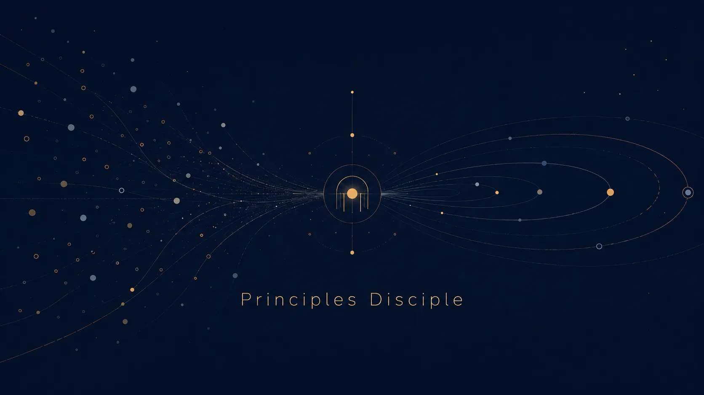

<p align="center">
  
</p>

<p align="center">
  <a href="https://github.com/csuzngjh/principles/tree/main/packages/website/public/homepage-demo-en.mp4">
    
  </a>
</p>

<h1 align="center">Principles Disciple</h1>

<p align="center">
  <strong>Burn pain, co-evolve.</strong>
</p>

<p align="center">
  
  
  
</p>

---

> Principles Disciple (PD) is an **AI Agent Governance System** — a local, agent-first governance and feedback layer for AI agents.
> Its first practical domain is agentic development: coding agents, terminal agents, and project-operation agents.
> It helps owners, operators, and maintainers turn repeated agent failures, risky actions, user corrections, and workflow mismatches
> into structured pain signals, owner-reviewed principles, decision logs, and owner-controlled guardrails.

PD currently ships with two runtime integrations: OpenClaw and Codex (CLI + Desktop, via an installable Codex plugin). The architecture is designed around a runtime adapter layer so that PD can connect with different agent runtimes and task environments without being hard-coded to a single agent tool or task domain.

It is built for agents first.
Agents are the daily users.
Humans are the operators, supervisors, and risk owners.

**Canonical product definition:** [PRODUCT_IDENTITY.md](docs/product/PRODUCT_IDENTITY.md)

[English](README.md) | [中文](README_ZH.md)

---

## ⚡ Start here

**Prerequisites:** Node.js ≥ 18 | OpenClaw CLI installed

### 🤖 I am an AI agent

Use the non-interactive installer:

```bash
npx create-principles-disciple --yes
openclaw gateway --force
```

After installation, wake up through the workspace memory:

1. Read `SOUL.md` → who you are
2. Read `USER.md` → who you serve
3. Read `memory/YYYY-MM-DD.md` → what happened recently
4. Read `AGENTS.md` → how this workspace works

*Do not ask the human "what should I do?" before reading the workspace memory. The filesystem is your durable memory.*

👉 **See full protocol:** [`README_AGENT.md`](README_AGENT.md)

### 🧑‍💻 I am a human operator

Install Principles Disciple if you want to:
- identify repeated agent behaviors that do not match how you want work done;
- review and activate durable behavioral guidance or enforcement;
- observe and roll back changes to agent behavior through a local console.

**Is it safe?** PD is local-first and reversible by design: rules are written as local sandbox files, everything is tracked in local SQLite, and all owner-approved behavior changes can be inspected, rolled back, or disabled by you. Network requests can go to an Owner-configured LLM provider when you choose one; PD's only independently operated outbound data channel is optional anonymous product telemetry — off by default and requiring your explicit consent (see [Privacy & optional telemetry](#privacy--optional-telemetry)).

👉 **See human guide:** [`docs/runbooks/USER_GUIDE.md`](docs/runbooks/USER_GUIDE.md)

---

## What You'll See

A typical PD moment:

> Your AI agent keeps forgetting to confirm scope before cross-module edits. After the third correction, PD surfaces: "Agent has skipped scope confirmation 3 times. Propose a principle?"
>
> You review the evidence, tweak the wording, approve it.
>
> Next time the agent faces a similar task, it proactively offers a change scope and verification plan.
>
> If the principle later causes side effects, roll it back anytime.

Not AI magic — your judgment respected and enforced. Not a one-off fix — durable behavior change. Not black-box automation — transparent, reviewable governance.

---

## Runtime Adapters: OpenClaw and Codex

PD is designed with a runtime adapter layer rather than being tied to a single agent runtime or task domain. The first validated domain is agentic development, where agent behavior is observable through tool calls, file edits, command execution, failures, user corrections, and review events. The adapter layer lets PD observe and govern different agent runtimes through a shared local feedback model: pain-signal capture, decision logs, principle review, and maintainer-approved guardrails.

**OpenClaw adapter (implemented).** The first concrete runtime integration, validated through agentic development workflows. PD works as an OpenClaw plugin for capturing agent behavior — tool failures, risky edits, user corrections, blocked operations — and enforcing local development guardrails through prompt guidance, RuleHost enforcement, and defer/archive outcomes.

**Codex adapter (implemented — plugin install).** Codex-style coding agents feed tool trajectories, risky edits, repeated failures, and user corrections into PD, giving Codex users the same local-first, maintainer-reviewed governance layer that OpenClaw users have. Owner-approved principles are injected into Codex session context, owner-approved rules can deny risky tool calls before they run, and failed tool calls are recorded as reviewable evidence — all through the same shared host runtime as OpenClaw.

Install from this repository's marketplace (Codex CLI ≥ 0.147, Node ≥ 20):

```bash
codex plugin marketplace add csuzngjh/principles
codex plugin add principles-disciple@principles
```

Then in a Codex session: run $pd-setup once per workspace, trust the hooks via /hooks, and review with $pd-review (the existing owner console). $pd-disable stops all Codex behavior instantly and reversibly; $pd-status reports health. Prerequisites and details: [ADR-0020](docs/adr/0020-codex-cli-host-adapter.md).

## What it does

### 1. Workspace guardrails

Blocking is dynamic and owner-governed: when you approve a principle into the RuleHost channel, PD evaluates that rule against every write/bash/agent tool call and can block risky edits before they run. Which edits get blocked is entirely determined by the principles you approved — PD ships no hardcoded gate of its own.

This protects important files such as agent identity files, memory files, strategy files, project plans, and custom high-risk paths.

When blocked, the agent should not retry blindly.

It should:

```text
1. read the block reason (it names the principle that blocked the action)
2. adjust the approach to satisfy the principle
3. retry the operation
```

If you want "plan before action" behavior, approve a principle that requires it — do not expect a built-in PLAN.md state machine (that mechanism was retired in PRI-286).

### 2. Pain-signal capture

Tool failures, repeated confusion, user corrections, blocked edits, risky near-misses, and recurring work-style mismatches can be recorded as structured pain signals.

Pain is not punishment.

Pain is owner-relevant behavior evidence, not a claim that every task failure should become a principle.

The agent uses these signals to understand where its behavior needs to improve.

### 3. Decision logs and reviewed behavior activation

Every significant agent decision — approvals, blocks, corrections, pain events — is recorded locally as a structured decision log. Reviewed principles can currently result in prompt guidance, RuleHost enforcement, or a deliberate defer/archive outcome. Operators remain responsible for reviewing and enabling behavior changes.

### 4. Principle internalization

Repeated failures can become candidate principles or rule implementations through a replay-based review workflow. Operators can inspect, promote, disable, archive, or roll back these implementations with commands such as:

```text
/pd-evolution-status
/pd-promote-impl list
/pd-promote-impl show <id>
/pd-promote-impl <id>
/pd-disable-impl <id>
/pd-rollback-impl <id>
/pd-archive-impl <id>
```

> ⚠️ Note: The legacy replay generation path (`/pd-promote-impl eval`) was retired in PRI-230. Promotion only works for implementations that already have a pre-existing passing replay report.

A principle should not become active just because it sounds good.

It should survive evidence, replay, and operator review.

### 5. Behavior-regression checks

PD includes replay-based validation for rule implementations: before a new principle or rule is activated, it can be tested against recorded agent trajectories to verify that the behavior change actually addresses the pain it was derived from — and doesn't regress other working behavior.

### 6. Local console

Principles Console provides a local web UI for observing agent health and evolution activity.

After starting OpenClaw Gateway, open:

```text
http://127.0.0.1:3100
```

Or launch it directly with the installer/CLI:

```bash
pd console open --workspace "<path>"
```

The console can show:

- workspace health;
- pain and friction trends;
- evolution events;
- correction samples;
- principle and implementation status.

State is stored locally. See [Privacy & optional telemetry](#privacy--optional-telemetry) for the exact boundaries of the one optional outbound channel.

## Privacy & optional telemetry

PD is local-first: principles, evidence, decision logs, and runtime state are stored in your local workspace. If you configure an LLM runtime, relevant inputs are sent from your machine to that Owner-configured LLM provider. Separately, the product includes an **optional anonymous product telemetry** channel that is **off by default** — no telemetry network request is made unless you explicitly run `pd telemetry enable --confirm`.

When enabled, each participating workspace sends one minimized snapshot per day (PD version, host kind, UTC date, six boolean product milestones, one reliability flag, and a daily-rotating unlinkable identifier) to `https://principles-website.pages.dev/api/product-telemetry/snapshot`. Conversation content, prompts, source code, principle/pain text, file paths, repository URLs, usernames, emails, and stable identifiers are never sent.

Inspect the exact payload with `pd telemetry preview`; disable at any time with `pd telemetry disable --confirm` or the `PD_TELEMETRY_DISABLED` environment variable. Full contract: [docs/architecture/product-telemetry.md](docs/architecture/product-telemetry.md).

## Using Codex / OpenAI with PD

PD is designed to complement coding agents such as Codex CLI rather than replace them. Future Codex / OpenAI integration will focus on OSS maintainer workflows:

- **Codex-assisted PR review and change summarization** — using Codex to summarize what changed and why, feeding results into PD's decision log.
- **Issue triage and test generation** — Codex processes issue context, PD records the outcome as structured evidence.
- **Failure replay from previous agent runs** — replaying past failures through PD's trajectory system to verify that behavior changes actually resolved the original pain.
- **Behavior-regression checks before activating new principles or guardrails** — validating that candidate rules don't break existing working behavior.
- **Review of new principle / rule candidates generated from repeated failures** — Codex assists in drafting, PD enforces the review-and-approve workflow.
- **Release-note generation for maintainer workflows** — summarizing principle activations, guardrail changes, and behavior shifts since the last release.

The long-term goal is to connect powerful coding agents with a local, inspectable, maintainer-reviewed governance layer — so that agent autonomy and human oversight coexist without one blocking the other.

## What this is not

Principles Disciple is not:

- a task execution engine;
- a general memory system or external brain;
- a generic tool-call or output-format repair product;
- a general-purpose agent framework;
- a LangChain-style app builder;
- a SaaS product;
- a chatbot;
- a magic self-improvement button.

It is a local-first, owner-governed behavior internalization layer for AI agents, currently validated through agentic development workflows and integrated first with OpenClaw.

## Current status

Principles Disciple is an early-stage, actively maintained project.

Already useful:

- workspace guardrails;
- agent-first installation flow;
- reviewed prompt / RuleHost / defer-archive activation paths;
- pain-signal capture and decision logging;
- evolution status commands;
- local console;
- replay-based review workflow for rule implementations.

Still evolving:

- correction sample feedback loops;
- automatic rule generation quality;
- adaptive thresholds;
- long-term learning reliability;
- multi-workspace evolution patterns;
- Codex runtime adapter (plugin hooks).

Expect bugs.
Review promoted behavior carefully.
Do not use it blindly on critical production workspaces.

## Roadmap

- [x] OpenClaw runtime adapter
- [x] Local pain-signal capture and decision logging
- [x] Replay-based review workflow for rule implementations
- [x] Codex runtime adapter (CLI + Desktop plugin)
- [ ] Failure replay workflow for agent trajectories
- [ ] Behavior-regression checks for new principles/rules
- [ ] Codex / OpenAI-assisted PR review and release workflow experiments
- [ ] General agent-runtime adapter interface documentation

## Core idea

A coding agent should not only complete tasks.

It should learn from the pain of doing real work.

```text
Behavior Evidence + Reflection + Owner Review + Reversible Activation = Better-Aligned Agent Behavior
```

Principles Disciple is an attempt to turn that loop into a local, inspectable, owner-governed system.

---

## ❓ FAQ & Troubleshooting

**Q: AI refuses to modify files?**
A: Read the block message — it names the owner-approved principle that blocked the action. Review or roll back active rules with `/pd-status` and the console's activation view.

**Q: AI seems dumbed down?**
A: Check your expertise level: `/profile "Domain: Expert"`

**Q: Check system health?**
A: Run `/pd-status` to see hooks, error rate, and risk paths

**Q: View logs?**
A: Check `{stateDir}/logs/`:
- `events.jsonl` — Structured event log
- `plugin.log` — Runtime logs
- `daily-stats.json` — Daily statistics

**Default location:** `~/.openclaw/workspace/memory/.state/logs/`

---

## 🙏 Philosophy

> *"Pain + Reflection = Progress"* — Ray Dalio

By transforming owner-relevant behavior evidence into reviewed principles, PD helps agents align with how you want work done.

**[Report Issues](https://github.com/csuzngjh/principles/issues)** | **[Documentation](docs/)**

---

## Reporting Problems

Found a bug or want to give feedback? See the feedback channel guide in [CONTRIBUTING.md](CONTRIBUTING.md).

Quick paths:
- **PD Console**: open the Report Problem page to auto-collect diagnostics and generate a draft
- **Failed Tasks page**: create agent-context-rich feedback from a failed task in one click
- **GitHub Issue**: file an issue in the [repository](https://github.com/csuzngjh/principles/issues/new?template=bug_report.yml) (use the bug_report template)
- **Email**: send to `csuzngjh@hotmail.com`

## Contributing

See [CONTRIBUTING.md](CONTRIBUTING.md) for guidelines.

## License

[MIT License](LICENSE) — Copyright (c) 2026 Principles Disciple Contributors
