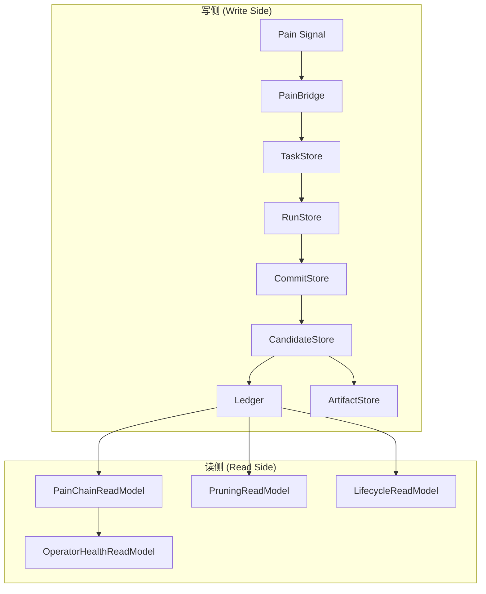

# PD 数据架构 (Data Architecture)

> **状态**: Draft
> **最后更新**: 2026-05-09
> **背景**: 定义 PD 系统的数据存储架构、读写分离策略、以及与 ADR-0001/ADR-0002 一致的迁移计划。

---

## 1. 存储组件概览

PD 系统使用多种存储机制，按用途分为以下几类：

### 1.1 按存储技术分类

| 存储类型 | 技术 | 用途 |
|---------|------|------|
| **State Store** | SQLite (per-workspace) | 痛点、任务、运行记录、轨迹 |
| **Ledger Store** | JSON 文件 | Principle Tree 账本 |
| **Artifact Store** | 文件系统 | Code Implementation 资产 |
| **Candidate Store** | SQLite | Candidate Intake 队列 |
| **History Store** | SQLite | 查询优化和历史记录 |

### 1.2 按物理位置分类

| 位置 | 内容 |
|------|------|
| `{workspace}/.pd/state/` | Per-workspace 状态 |
| `{workspace}/.pd/state/ledger/` | Ledger JSON 文件 |
| `{workspace}/.pd/state/artifacts/` | Implementation 代码资产 |
| `~/.openclaw/` | 全局配置和 OpenClaw 状态 |
| `@principles/core` 内存 | 运行时缓存和内存状态 |

---

## 2. 存储组件详细说明

### 2.1 State Store（状态存储）

State Store 是 PD 的核心写侧存储，使用 SQLite 实现。

**文件位置**: `{workspace}/.pd/state/state.db`

**核心表结构**:

| 表名 | 用途 | 关联模块 |
|------|------|---------|
| `tasks` | 诊断任务队列 | TaskStore |
| `runs` | 运行记录 | RunStore |
| `commits` | Diagnostician 提交记录 | CommitStore |
| `events` | 事件日志 | EventLog |
| `pain_signals` | Pain Signal 记录 | PainSignalBridge |

**TaskStore 结构** (`runtime-v2/store/task/`):

```
TaskStore
├── TaskStore 接口
├── MemoryTaskStore (测试用)
└── SqliteTaskStore (生产用)
    └── task-migration.ts (Schema 迁移)
```

**RunStore 结构** (`runtime-v2/store/run/`):

```
RunStore
├── RunStore 接口
├── MemoryRunStore (测试用)
└── SqliteRunStore (生产用)
```

**CommitStore 结构** (`runtime-v2/store/commit/`):

```
CommitStore
├── CommitStore 接口
├── MemoryCommitStore (测试用)
├── SqliteCommitStore (生产用)
└── DiagnosticianCommitter (提交逻辑)
```

### 2.2 Ledger Store（账本存储）

Ledger Store 存储 Principle Tree 的持久化状态。

**文件位置**: `{workspace}/.pd/state/ledger/`

**文件结构**:

```
ledger/
├── ledger.json          # Principle/Rule/Implementation 主账本
├── metadata.json        # 账本元信息（版本、更新时间）
└── backups/             # 自动备份
    └── YYYY-MM-DD.json  # 每日备份
```

**数据结构**（见 `principle-tree-ledger.ts`）:

```typescript
interface PrincipleTree {
  principles: LedgerPrinciple[];
  rules: LedgerRule[];
  implementations: LedgerImplementation[];
  version: string;
  updatedAt: number;
}
```

### 2.3 Artifact Store（资产存储）

Artifact Store 存储 Rule Implementation 的代码资产。

**文件位置**: `{workspace}/.pd/state/artifacts/`

**文件结构**:

```
artifacts/
├── {implId}/
│   ├── source.ts        # 实现源代码
│   ├── metadata.json    # 元信息（创建时间、状态）
│   └── validation.json  # 验证结果
└── index.json           # 资产索引
```

### 2.4 Candidate Store（候选存储）

Candidate Store 存储待处理的 Principle/Rule Candidate。

**文件位置**: `{workspace}/.pd/state/candidate.db`

**核心表结构**:

| 表名 | 用途 |
|------|------|
| `principle_candidates` | Principle 候选 |
| `rule_candidates` | Rule 候选 |
| `implementation_candidates` | Implementation 候选 |

**实现** (`runtime-v2/store/candidate/`):

```
CandidateStore
├── CandidateStore 接口
├── MemoryCandidateStore (测试用)
└── SqliteCandidateStore (生产用)
```

### 2.5 History Store（历史查询）

History Store 提供高效的历史查询能力。

**文件位置**: `{workspace}/.pd/state/state.db`（与 State Store 共享 SQLite 连接）

**实现** (`runtime-v2/store/history/`):

```
HistoryQuery
├── HistoryQuery 接口
├── SqliteHistoryQuery (生产用)
└── ResilientHistoryQuery (带重试的包装)
```

> **注意**: History Store 复用 State Store 的 SQLite 数据库，不使用独立的 `history.db`。查询通过 `SqliteHistoryQuery` 接口实现，具体表结构由 `task-migration.ts` 管理。

### 2.6 Context Store（上下文组装）

Context Store 提供 Pain Chain 上下文组装能力。

**实现** (`runtime-v2/store/context/`):

```
ContextAssembler
├── ContextAssembler 接口
├── SqliteContextAssembler (生产用)
└── ResilientContextAssembler (带重试的包装)
```

### 2.7 Trajectory Store（轨迹存储）

Trajectory Store 存储 Agent 行为轨迹。

**文件位置**: `{workspace}/.pd/state/trajectory.db`

**实现** (`runtime-v2/store/trajectory/`):

```
TrajectoryLocator
├── TrajectoryLocator 接口
└── SqliteTrajectoryLocator (生产用)
```

### 2.8 Lifecycle Store（生命周期管理）

Lifecycle Store 管理分布式锁和恢复机制。

**实现** (`runtime-v2/store/lifecycle/`):

```
LeaseManager      # 分布式租约管理
RecoverySweep     # 故障恢复扫描
RetryPolicy       # 重试策略
```

---

## 3. 读写分离策略

### 3.1 写侧（Write Side）

**写侧统一入口**: `PainToPrincipleService`

```
PainSignal → PainBridge → TaskStore → RunStore → CommitStore → CandidateStore → Ledger
```

**写入保证**:
- 使用 `LeaseManager` 确保分布式锁
- 使用 `IdempotentTransitions` 确保幂等性
- 使用 `DiagnosticianCommitter` 保证提交原子性

### 3.2 读侧（Read Side）

**读侧服务**:

| 读模型 | 用途 |
|--------|------|
| `PainChainReadModel` | Pain Chain 全链路追踪 |
| `PruningReadModel` | Pruning 信号生成 |
| `LifecycleReadModel` | Principle 生命周期状态 |
| `OperatorHealthReadModel` | Operator 健康状态 |

**读取原则**:
- 所有读操作都是非破坏性的
- 读模型不修改底层状态
- 使用 `Resilient*` 包装器处理临时故障

---

## 4. 数据流图



---

## 5. 迁移计划

### 5.1 已完成迁移（ADR-0001）

| 组件 | 原位置 | 新位置 | 状态 |
|------|--------|--------|------|
| PainToPrincipleService | plugin | `@principles/core` | ✅ Done |
| PainChainReadModel | pd-cli | `@principles/core` | ✅ Done |
| PruningReadModel | plugin | `@principles/core` | ✅ Done |

### 5.2 进行中迁移（ADR-0002）

| 组件 | 原位置 | 目标位置 | 状态 |
|------|--------|---------|------|
| RuleHost contracts | plugin | `@principles/core` | ⏳ PRI-42 |
| TemplateGenerator | plugin | `@principles/core` | ⏳ PRI-44 |
| LifecycleMetrics | plugin | `@principles/core` | ⏳ PRI-42 |
| RoutingPolicy | plugin | `@principles/core` | ⏳ PRI-43 |

### 5.3 待迁移

| 组件 | 原位置 | 目标位置 | 依赖 |
|------|--------|---------|------|
| Store modularization | `@principles/core` | `@principles/core/store/` | PRI-47 |
| Artifact store cleanup | plugin | `@principles/core` | Post M6 |

---

## 6. 相关文档

| 文档 | 说明 |
|------|------|
| [PD_SYSTEM_ARCHITECTURE.md](./PD_SYSTEM_ARCHITECTURE.md) | 系统架构蓝图 |
| [ADR-0001](../adr/0001-runtime-v2-service-boundaries.md) | Runtime V2 Service Boundaries |
| [ADR-0002](../adr/0002-hard-internalization-core-boundary.md) | Hard Internalization Core Boundary |
