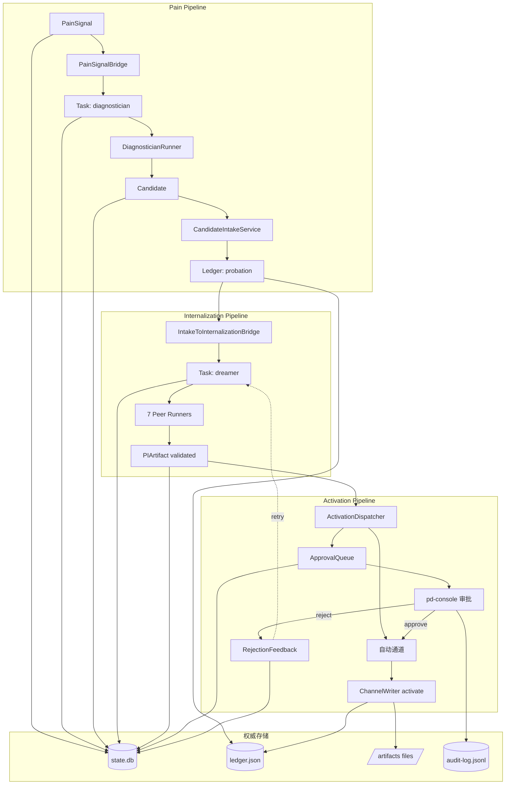

# PD 数据架构（Data Architecture）

> **状态**: Active（2026-05-15 修订版）
> **最后更新**: 2026-06-26（P1-5 实现状态标注，与 ADR-0014 MVP-First 对齐）
> **前次更新**: 2026-05-23（与 ADR-0005 / ADR-0006 / ADR-0007 / ADR-0012 对齐）

> **ADR-0012 修订**: Nocturnal 数据仅在证明存在历史读取/导出需求时保留 read-only adapter；不得为了兼容旧数据保留 Nocturnal 业务执行或 OpenClaw idle/night 调度。新的运行配置和 workspace resolution 应属于 PD-owned config/SDK boundary。
> **取代**: 2026-05-09 版（已归档）
> **关联**: `PD_ARCHITECTURE_OVERVIEW.md`, `DOMAIN_MODEL.md`, `VERSIONING_AND_COMPATIBILITY.md`

本文档定义 PD 系统的**数据存储架构、读写分离策略、并发协调、迁移路径**。

> **实现状态标注**（P1-5，PRI-473）：
> - ✅ **已实现**：当前 MVP 范围内已落地（ADR-0014）
> - ⏸️ **未实现 (post-MVP)**：文档记录但代码未落地，参见 [`post-mvp-conditional-roadmap.md`](../plans/post-mvp-conditional-roadmap.md)
> - ❌ **已废弃**：已从代码中删除或标记为 legacy_retire
>
> 权威源：`packages/principles-core/src/runtime-v2/store/sqlite-connection.ts`（state.db）和
> `packages/openclaw-plugin/src/core/schema/schema-definitions.ts`（trajectory.db / central.db）。
> 本文档如与代码冲突，以代码为准。

---

## 1. 存储原则

### 1.1 核心信条

1. **本地优先** —— 所有数据默认存本地，不依赖远程数据库
2. **单一数据库** —— 一个 workspace 一个 SQLite + 一个 Ledger 文件
3. **读写分离** —— Write Side 经过门控 Service，Read Side 通过不可变 ReadModel
4. **原子性** —— 所有跨字段写入必须事务化或 atomic file write
5. **幂等性** —— 跨进程并发场景下所有关键写入可重试

### 1.2 数据生命周期

```
┌──────────────────────────────────────────────────────┐
│  数据类型按生命周期划分：                              │
│                                                       │
│  长期数据   —— state.db: principles / implementations │
│  中期数据   —— state.db: tasks / runs / artifacts     │
│  短期数据   —— state.db: events / audit              │
│  瞬时数据   —— 缓存 / module-level state             │
└──────────────────────────────────────────────────────┘
```

---

## 2. 存储组件总览

### 2.1 Runtime V2 Canonical Storage（权威存储）

PD Runtime V2 的权威数据存储分为**两个物理事实源**：

| 物理路径 | 技术 | 存储内容 |
|---------|------|---------|
| `{workspace}/.pd/state.db` | SQLite（WAL 模式） | Task / Run / Commit / Candidate / Artifact / PIArtifact / History / Trajectory / Events / **Approvals**（新）/ **RejectionFeedbacks**（新）|
| `{workspace}/.state/principle_training_state.json` | JSON 文件（atomic write） | Principle Tree 账本（Principle / Rule / Implementation）|

### 2.2 Activation Pipeline 工件存储（新增 — ADR-0006）

激活后的工件存储在文件系统的不同位置：

| 工件类型 | 物理路径 | 用途 |
|---------|---------|------|
| Skill 文件 | `{workspace}/.principles/skills/{skillId}/SKILL.md` + `manifest.json` | `skill` 通道激活产物 |
| Code Implementation | `{workspace}/.principles/implementations/code/{implId}/entry.ts` + `manifest.json` + `tests.jsonl` + `last-eval.json` | `code_tool_hook` 通道激活产物 |
| Training Export | `{workspace}/.pd/training-exports/{batchId}/dataset.jsonl` + `metadata.json` | `model_training` 通道激活产物 |

### 2.3 审计与合规存储（新增 — `OBSERVABILITY_ARCHITECTURE.md`）

| 物理路径 | 格式 | 写入特性 |
|---------|------|---------|
| `{workspace}/.pd/audit-log.jsonl` | JSONL | append-only，**永久保留**，同步 fsync |
| `{workspace}/.state/pruning_reviews.jsonl` | JSONL | append-only |

### 2.4 Plugin / Host 辅助状态

以下辅助状态由 plugin / host 管理，**不属于** Runtime V2 authoritative store，但存在于工作区中：

| 路径 | 说明 | 管理方 |
|------|-----|-------|
| `{workspace}/.state/trajectory.db` | OpenClaw 原始轨迹数据 | openclaw-plugin |
| `{workspace}/.state/sessions/` | OpenClaw 会话记录 | openclaw-plugin |
| `{workspace}/.state/event-log.jsonl` | OpenClaw 事件日志 | openclaw-plugin |
| `{workspace}/.state/daily-stats/` | 每日统计 | openclaw-plugin |
| `{workspace}/.state/CURRENT_FOCUS` | 当前焦点 | openclaw-plugin |
| `{workspace}/.state/evolution.jsonl` | 进化事件流 | openclaw-plugin |
| `{workspace}/.state/evolution-scorecard.json` | 进化积分卡 | openclaw-plugin |

> **注**：这些辅助状态可能在未来版本被 Runtime V2 的 events 表 / Telemetry 替代。当前由 plugin 独立管理。

### 2.5 配置存储（参见 `CONFIGURATION_ARCHITECTURE.md`）

| 路径 | 格式 | 用途 |
|------|------|-----|
| `{workspace}/.pd/config/*.yaml` | YAML | 工作区级配置（详见 §9）|
| `~/.openclaw/extensions/principles-disciple/default-config.yaml` | YAML | 全局默认 |

### 2.6 Cache 与瞬时数据

| 路径 | 用途 | 清理策略 |
|------|-----|---------|
| `{workspace}/.pd/cache/` | 派生数据缓存 | 任意时刻可清空 |
| Module-level memory cache | 静态文件 TTL 缓存（如 PRINCIPLES.md）| TTL 60s + mtime 检查 |

---

## 3. SQLite Schema 详细

### 3.1 主要表清单

> 实现状态：✅ = 已实现（MVP 范围内）｜⏸️ = 未实现（post-MVP）｜❌ = 已废弃

```
state.db
├── 任务调度
│   ├── tasks                          ✅ PITaskRecord 主表
│   ├── runs                           ✅ RunRecord 主表
│   └── leases (隐式：在 tasks 中通过 leaseOwner / leaseExpiresAt 字段)  ✅
├── Diagnostician 子系统
│   ├── candidates                     ✅ PrincipleCandidate（principle_candidates 表）
│   ├── artifacts                      ✅ Diagnostician artifact
│   └── commits                        ✅ DiagnosticianCommit
├── Internalization 子系统
│   └── pi_artifacts                   ✅ PIArtifact
├── Activation 子系统（ADR-0006）
│   ├── approvals                      ✅ ApprovalRecord
│   ├── activations                    ✅ ActivationStateRecord（activation 状态追踪）
│   └── rejection_feedbacks            ⏸️ post-MVP（ADR-0006，未实现）
├── Goals 子系统（ADR-0010）
│   ├── objectives                     ⏸️ post-MVP（ADR-0010，未实现）
│   ├── key_results                    ⏸️ post-MVP（ADR-0010，未实现）
│   ├── missions                       ⏸️ post-MVP（ADR-0010，未实现）
│   └── agent_session_checkpoints      ⏸️ post-MVP（ADR-0009，未实现）
├── 历史与查询
│   ├── history (各子表)               ✅ 在 trajectory.db 中
│   └── trajectory (各子表)            ✅ 在 trajectory.db 中
├── 可观测性
│   ├── events                         ✅ TelemetryEvent（trajectory.db）
│   ├── correction_audit_events        ⏸️ post-MVP（ADR-0004，未实现）
│   └── (可选) metrics_*               ⏸️ post-MVP
├── 元数据
│   ├── schema_version                 ✅ P2-10：state.db 用精简版（core 实现）
│   └── schema_migrations              ❌ 命名已校正为 schema_version
└── 已废弃
    └── confirm_first_state            ❌ 已 DROP（PRI-473 / P3-12，SqliteConfirmFirstStateStore 已删除）

trajectory.db（由 plugin MigrationRunner 管理）
├── events                             ✅ TelemetryEvent
├── pain_signals                       ✅ PainSignal
├── pain_evidence                      ✅ PainEvidence
├── thinking_model_events              ✅ ThinkingModelEvent
└── schema_version                     ✅ 装饰性版本标记（applyTrajectorySchema 管理，不驱动迁移决策）
```

### 3.2 关键表 Schema（新增表）

#### 3.2.1 approvals（ADR-0006）

> **权威源**：`packages/principles-core/src/runtime-v2/store/sqlite-connection.ts`。本文档如与之冲突以代码为准。

```sql
CREATE TABLE approvals (
  approval_id TEXT PRIMARY KEY,
  artifact_id TEXT NOT NULL,
  channel TEXT NOT NULL,                      -- prompt / skill / code_tool_hook / defer_archive
  risk_level TEXT NOT NULL,                   -- medium / high / critical
  status TEXT NOT NULL DEFAULT 'pending',     -- pending / approved / rejected
  confidence REAL,
  requested_at TEXT NOT NULL,
  decided_at TEXT,
  decided_by TEXT,
  decision_note TEXT,
  rejection_reason TEXT,
  -- context columns (idempotent migration, added on schema upgrade)
  summary TEXT,
  trigger_reason TEXT,
  confidence_explanation TEXT,
  effect_description TEXT,
  rejection_effect TEXT,
  edited_at TEXT,
  edited_by TEXT,
  edit_reason TEXT,
  previous_artifact_id TEXT
);

CREATE INDEX idx_approvals_status ON approvals(status);
CREATE INDEX idx_approvals_channel ON approvals(channel);
```

**约束**：
- 同一个 `artifact_id` 在 `pending` 状态下只能有一条记录（应用层强制）
- `decided_at` 必须晚于 `requested_at`
- `edit` 操作原子更新 `previous_artifact_id = artifact_id, artifact_id = ?`（防 ERR-004/ERR-008 lineage drift）

**未落地的 ADR-0006 目标字段**（post-MVP）：
- `requested_by_kind` / `requested_by_id`
- `requires_second_confirmation` / `second_confirmed_at` / `second_confirmed_by`
- `cooldown_expires_at`
- `metadata_json`
- `FOREIGN KEY (artifact_id) REFERENCES pi_artifacts(artifact_id)` — 当前为应用层校验（见 P1-3 修复，PRI-473）

#### 3.2.2 rejection_feedbacks（ADR-0006） ⏸️ post-MVP

> **实现状态**: ⏸️ 未实现（post-MVP）。表 DDL 文档记录但代码未落地。参见 [`post-mvp-conditional-roadmap.md`](../plans/post-mvp-conditional-roadmap.md)。

```sql
CREATE TABLE rejection_feedbacks (
  feedback_id TEXT PRIMARY KEY,
  approval_id TEXT NOT NULL,
  artifact_id TEXT NOT NULL,
  channel TEXT NOT NULL,
  rejection_reason TEXT NOT NULL,
  rejected_by TEXT NOT NULL,
  rejected_at TEXT NOT NULL,
  feedback_action TEXT NOT NULL,              -- retry_with_correction / discard / escalate
  correction_hints_json TEXT,                 -- 用于注入到下游 Dreamer prompt
  FOREIGN KEY (approval_id) REFERENCES approvals(approval_id)
);

CREATE INDEX idx_rejection_feedbacks_artifact ON rejection_feedbacks(artifact_id);
CREATE INDEX idx_rejection_feedbacks_action ON rejection_feedbacks(feedback_action);
```

**特性**：
- **Append-only**：不允许 UPDATE / DELETE
- 用于触发 retry 任务（feedback_action = retry_with_correction）

#### 3.2.3 correction_audit_events（ADR-0004） ⏸️ post-MVP

> **实现状态**: ⏸️ 未实现（post-MVP）。表 DDL 文档记录但代码未落地。参见 [`post-mvp-conditional-roadmap.md`](../plans/post-mvp-conditional-roadmap.md)。

```sql
CREATE TABLE correction_audit_events (
  event_id TEXT PRIMARY KEY,
  timestamp TEXT NOT NULL,
  proposal_json TEXT NOT NULL,                -- 序列化的 CorrectionProposal
  original_params_json TEXT NOT NULL,
  outcome TEXT NOT NULL,                      -- applied / shadow_logged / rejected_by_hook / rejected_by_confidence
  session_id TEXT,
  tool_name TEXT NOT NULL,
  rule_id TEXT NOT NULL,
  principle_id TEXT,
  application_mode TEXT NOT NULL,             -- shadow / live
  confidence REAL
);

CREATE INDEX idx_correction_audit_rule ON correction_audit_events(rule_id);
CREATE INDEX idx_correction_audit_outcome ON correction_audit_events(outcome, timestamp);
CREATE INDEX idx_correction_audit_timestamp ON correction_audit_events(timestamp);
```

**特性**：
- 用于支撑 shadow mode 报告
- 用于排查误杀
- 永久保留（合规需要）

#### 3.2.4 Goals 子系统表（ADR-0010） ⏸️ post-MVP

> **实现状态**: ⏸️ 未实现（post-MVP）。objectives / key_results / missions / agent_session_checkpoints 表 DDL 文档记录但代码未落地。参见 [`post-mvp-conditional-roadmap.md`](../plans/post-mvp-conditional-roadmap.md)。

```sql
-- Objective（OKR 季度目标）
CREATE TABLE objectives (
  objective_id TEXT PRIMARY KEY,
  title TEXT NOT NULL,
  description TEXT,
  start_date TEXT NOT NULL,
  end_date TEXT NOT NULL,
  status TEXT NOT NULL,                       -- active / achieved / abandoned
  created_at TEXT NOT NULL,
  updated_at TEXT NOT NULL
);

-- KeyResult（可量化关键结果）
CREATE TABLE key_results (
  kr_id TEXT PRIMARY KEY,
  objective_id TEXT NOT NULL REFERENCES objectives(objective_id),
  metric TEXT NOT NULL,                       -- "完成 5 个 PR"、"通过 80% 测试"
  target REAL NOT NULL,
  current REAL NOT NULL DEFAULT 0,
  unit TEXT NOT NULL,                         -- "PRs", "%", "lines"
  measurement_source TEXT NOT NULL,           -- manual / auto_query
  query TEXT,                                 -- auto_query 时的查询表达式
  updated_at TEXT NOT NULL
);

-- Mission（长程任务）
CREATE TABLE missions (
  mission_id TEXT PRIMARY KEY,
  objective_id TEXT REFERENCES objectives(objective_id),  -- 可选关联
  title TEXT NOT NULL,
  description TEXT,
  status TEXT NOT NULL,                       -- planning / executing / review / succeeded / failed / stalled
  expected_duration_days INTEGER,
  started_at TEXT,
  completed_at TEXT,
  alignment_json TEXT NOT NULL,               -- { objectiveContribution, riskLevel, requiresDecisionHygiene }
  created_at TEXT NOT NULL,
  updated_at TEXT NOT NULL
);

CREATE INDEX idx_missions_status ON missions(status);
CREATE INDEX idx_missions_objective ON missions(objective_id);

-- tasks 表扩展（ADR-0011）
-- ALTER TABLE tasks ADD COLUMN mission_id TEXT REFERENCES missions(mission_id);
-- ALTER TABLE tasks ADD COLUMN priority INTEGER DEFAULT 50;
-- ALTER TABLE tasks ADD COLUMN depends_on TEXT;  -- JSON array of taskId
```

#### 3.2.5 agent_session_checkpoints（ADR-0009） ⏸️ post-MVP

> **实现状态**: ⏸️ 未实现（post-MVP）。表 DDL 文档记录但代码未落地。参见 [`post-mvp-conditional-roadmap.md`](../plans/post-mvp-conditional-roadmap.md)。

```sql
CREATE TABLE agent_session_checkpoints (
  checkpoint_id TEXT PRIMARY KEY,
  session_id TEXT NOT NULL,
  task_id TEXT NOT NULL,
  agent_id TEXT NOT NULL,
  state TEXT NOT NULL,                        -- LRAS 状态机状态
  step_number INTEGER NOT NULL,
  scratchpad TEXT NOT NULL,                   -- 代理工作记忆（JSON）
  partial_output TEXT,                        -- 部分输出
  tool_call_history TEXT NOT NULL,            -- 累计工具调用记录（JSON）
  created_at TEXT NOT NULL
);

CREATE INDEX idx_checkpoints_session ON agent_session_checkpoints(session_id, step_number);
CREATE INDEX idx_checkpoints_task ON agent_session_checkpoints(task_id);
```

**特性**：
- 崩溃恢复：`RecoverySweep` 启动时扫描未完成 session，读取最近 checkpoint 续跑
- 每 2 分钟（可配）自动保存

### 3.3 已有表（无变更）

详见 `@principles/core/runtime-v2/store/` 下的各 `sqlite-*.ts`。本文档不重复 schema 定义，仅总览。

**state.db 已实现表**（✅ MVP 范围内）：
- `tasks` / `runs` / `artifacts` / `commits` / `principle_candidates`（Diagnostician 子系统）
- `pi_artifacts`（Internalization 子系统）
- `approvals` / `activations`（Activation 子系统，ADR-0006）
- `schema_version`（P2-10，精简版，core 实现）
- ❌ `confirm_first_state`：已 DROP（PRI-473 / P3-12）

**trajectory.db 已实现表**（✅ 由 trajectory.ts applyTrajectorySchema 管理）：
- `events` / `pain_signals` / `pain_evidence` / `thinking_model_events`
- `schema_version`（装饰性版本标记，不驱动迁移决策）

---

## 4. Ledger（JSON）Schema 详细

### 4.1 文件结构

```json
{
  "schemaVersion": "ledger-v1",
  "trainingStore": {
    "<principleId>": { /* legacy training state */ }
  },
  "_tree": {
    "principles": {
      "<principleId>": {
        "id": "P_001",
        "version": 1,
        "text": "...",
        "triggerPattern": "...",
        "action": "...",
        "status": "active",
        "priority": "P1",
        "scope": "general",
        "evaluability": "weak_heuristic",
        "valueScore": 0.85,
        "adherenceRate": 0.92,
        "painPreventedCount": 12,
        "derivedFromPainIds": ["pain_..."],
        "ruleIds": ["R_001_a"],
        "conflictsWithPrincipleIds": [],
        "createdAt": "...",
        "updatedAt": "...",
        "activatedAt": "...",          // ADR-0006 新增
        "activatedBy": {                // ADR-0006 新增
          "kind": "system",
          "id": "rollout_reviewer"
        },
        "archivedReason": null,         // ADR-0006 新增
        "archivedAt": null              // ADR-0006 新增
      }
    },
    "rules": {
      "<ruleId>": {
        "id": "R_001_a",
        "principleId": "P_001",
        "implementationIds": ["IMPL_001_a_hook"],
        "type": "hook",
        "status": "implemented",
        "lifecycleState": "active",
        "createdAt": "...",
        "updatedAt": "..."
      }
    },
    "implementations": {
      "<implId>": {
        "id": "IMPL_001_a_hook",
        "ruleId": "R_001_a",
        "type": "code",
        "lifecycleState": "active",
        "shadowMode": false,            // ADR-0006 新增（仅 code_tool_hook）
        "shadowModeRemaining": 0,       // ADR-0006 新增
        "version": "1.0.0",
        "path": ".principles/implementations/code/IMPL_001_a_hook",
        "coversCondition": "...",
        "...": "..."
      }
    },
    "metrics": {
      "<principleId>": {
        "principleId": "P_001",
        "painPreventedCount": 12,
        "complianceRate": 0.92,
        "..." : "..."
      }
    },
    "lastUpdated": "..."
  }
}
```

### 4.2 写入规范

详见 `@principles/core/principle-tree-ledger.ts`。要点：

- 所有写入通过 `mutateLedger(stateDir, mutate)` 包装
- 实现使用 `atomicWriteFileSync`（写临时文件 + rename）
- 单进程序列化（不依赖 SQLite 的并发）
- 跨进程通过 `LeaseManager` 协调

### 4.3 适配器

`@principles/core/runtime-v2/adapter/principle-tree-ledger-adapter.ts` 提供 `LedgerAdapter` 接口给 `CandidateIntakeService` 等使用。新版本必须支持：

```typescript
interface LedgerAdapter {
  existsForCandidate(candidateId: string): LedgerPrincipleEntry | null;
  writeProbationEntry(entry: LedgerPrincipleEntry): LedgerPrincipleEntry;
  // 新增（ADR-0006）：
  activatePrinciple(principleId: string, ctx: ActivationContext): void;
  archivePrinciple(principleId: string, reason: string, ctx: ActivationContext): void;
  rollbackPrinciple(principleId: string, ctx: ActivationContext): void;
}
```

---

## 5. 五条数据流的存储路径

### 5.1 Pain Pipeline（Stage 1）

```
[PainSignal]
   │
   ├─► state.db: pain_signals（写）
   ├─► ledger.json: pain_flag（写，可选）
   └─► state.db: tasks (taskKind=diagnostician, status=pending)（写）

[DiagnosticianRunner.run]
   │
   ├─► state.db: tasks (status=leased → succeeded)（更新）
   ├─► state.db: runs (1 task: N runs)（写）
   ├─► state.db: artifacts (kind=diagnosis_report)（写）
   ├─► state.db: candidates (status=pending)（写）
   ├─► state.db: events（写 telemetry）
   └─► state.db: commits（写 commit record）

[CandidateIntakeService.intake]
   │
   ├─► ledger.json: principles[P_xxx].status=probation（写）
   └─► state.db: candidates (status=consumed)（更新）
```

### 5.2 Internalization Pipeline（Stage 2）

```
[IntakeToInternalizationBridge]（新增 — 解决断点 ①）
   │
   └─► state.db: tasks (taskKind=dreamer, channel=X, status=pending)（写）

[DreamerRunner / PhilosopherRunner / ...]
   │
   ├─► state.db: tasks (status 转换)（更新）
   ├─► state.db: runs（写）
   ├─► state.db: pi_artifacts（每个 Runner 输出）（写）
   └─► state.db: events（写 telemetry）

[RolloutReviewerRunner.succeed]
   │
   └─► ActivationDispatcher.dispatch（触发 Stage 3）
```

### 5.3 Activation Pipeline（Stage 3）（新增 — ADR-0006）

```
[ActivationDispatcher.dispatch]
   │
   ├─► 自动通道路径：
   │   └─► ChannelWriter.activate
   │       ├─► [prompt] ledger.json: principles[id].status=active
   │       ├─► [defer_archive] ledger.json: principles[id].status=archived
   │       └─► [skill 自动] file: .principles/skills/{id}/...
   │
   ├─► 审批通道路径：
   │   ├─► state.db: approvals (status=pending)（写）
   │   ├─► [pd-console 审批]
   │   ├─► state.db: approvals (status=approved/rejected)（更新）
   │   ├─► 审计：audit-log.jsonl（写）
   │   ├─► [approved] ChannelWriter.activate
   │   │   ├─► [code_tool_hook] file: .principles/implementations/code/{id}/...
   │   │   │                  + ledger.json: implementations[id].lifecycleState=active
   │   │   │                  + ledger.json: implementations[id].shadowMode=true
   │   │   └─► [model_training] file: .pd/training-exports/{batchId}/...
   │   └─► [rejected] state.db: rejection_feedbacks（写）
   │
   └─► 任何分支均：state.db: events（写 telemetry）
```

### 5.4 Operations Pipeline

```
[ReadModel 查询]
   │
   ├─► state.db: 各表（读）
   ├─► ledger.json（读）
   └─► 不修改任何状态

[人工审批]（pd-console）
   │
   ├─► state.db: approvals（更新）
   └─► audit-log.jsonl（写）

[低风险写]（pd-cli）
   │
   └─► state.db: 通过 RuntimeStateManager
```

### 5.5 Pruning Pipeline

```
[PruningReadModel.scan]
   │
   ├─► ledger.json（读）
   ├─► state.db: 各表（读）
   └─► 输出 PruningSignal[]（不持久化）

[人工 review]
   │
   └─► .state/pruning_reviews.jsonl（append）

[PruningAction]（未来 — 暂未实现）
   │
   └─► ledger.json: principles[id].status=deprecated（写）
```

---

## 6. 读写分离策略

### 6.1 写侧（Write Side）

**写侧统一入口**：

| 数据类型 | 唯一写入路径 |
|---------|------------|
| PainSignal | `PainSignalBridge.onPainDetected()` |
| Diagnostician 任务 | `PainSignalBridge.onPainDetected()` |
| Diagnostician artifact | `DiagnosticianCommitter.commit()` |
| LedgerPrincipleEntry | `CandidateIntakeService.intake()` |
| Internalization 任务 | `IntakeToInternalizationBridge.onProbationCreated()` 或 `Orchestrator.commitNextTaskProposal()` |
| PIArtifact | 各 Peer Runner（通过 `PIArtifactStore.upsertArtifact`）|
| ApprovalRecord | `ApprovalQueue.enqueue / approve / reject / secondConfirm` |
| RejectionFeedback | `RejectionFeedbackService.emit` |
| Ledger principle.status 变更 | `ChannelWriter.activate / deactivate`（仅通过 ActivationDispatcher）|
| Audit log | `AuditLogger.write`（同步 fsync）|

**写入保证**：

- **Lease**：所有 task 状态变更必须先 `acquireLease`
- **幂等性**：所有跨进程写入必须有幂等键
- **原子性**：跨字段写入用事务（SQLite）或 atomic write（JSON）
- **审计**：高风险写入必须同步写 audit log

### 6.2 读侧（Read Side）

**读模型清单**：

| ReadModel | 用途 | 副作用 |
|-----------|-----|-------|
| `PainChainReadModel` | painId 完整链 trace | 无 |
| `InternalizationQueueReadModel` | PI 任务队列健康 | 无 |
| `PruningReadModel` | 修剪信号 | 无 |
| `OperatorHealthReadModel` | 整体健康 | 无 |
| `LifecycleReadModel` | 原则生命周期 | 无 |
| `SchemaConformanceReadModel` | schema 一致性 | 无 |
| `InternalizationChainIntegrityReadModel` | 链路完整性 | 无 |
| `ApprovalQueueReadModel` (新增) | 审批队列 | 无 |
| `ActivationStatusReadModel` (新增) | 激活状态 | 无 |
| `EventLogReadModel` | 事件流（pd-console）| 无 |
| `GfiWorkspaceReadModel` | GFI 状态 | 无 |

**读取原则**：

- 所有读操作非破坏性
- 读模型不修改底层状态
- 资源临时不可用时使用 `Resilient*` 包装器自动重试

### 6.3 严格不变量

| ID | 不变量 |
|----|------|
| RW-1 | Read 路径不允许触发 Write |
| RW-2 | 同一概念只能有**一个**写入路径 |
| RW-3 | Write 必须经过 Service 层（不允许 SQL 直写）|
| RW-4 | 高风险 Write 必须经过 ActivationDispatcher / ApprovalQueue |
| RW-5 | Audit log 写入失败必须中止业务 |

---

## 7. 并发与事务

### 7.1 SQLite WAL 模式

PD 默认启用 SQLite WAL（Write-Ahead Logging）模式：

- 读不阻塞写
- 写不阻塞读
- 单写者（同一时刻只有一个 write transaction）

**强制要求**（架构守护测试覆盖）：

```typescript
// 每个 SQLite 连接建立时必须执行以下 PRAGMA
db.pragma('journal_mode = WAL');
db.pragma('busy_timeout = 5000');   // 等待 5s 而非立即失败（防止多 workspace 并发锁竞争）
db.pragma('synchronous = NORMAL'); // WAL 模式下 NORMAL 足够安全且性能更好
```

> **背景**：多个 workspace 或多个 Agent 同时进入 Idle 状态时，会同时争抢 SQLite 的 `pending` 任务锁。没有 WAL + busy_timeout，会出现 `Database is locked` 错误导致任务丢失。

### 7.2 跨进程协调

```
进程 A（plugin）              进程 B（pd-cli）              进程 C（pd-console）
       │                            │                              │
       │── acquireLease(taskId) ───▶│                              │
       │   ✓ 成功                    │                              │
       │                            │── acquireLease(taskId) ──────│
       │                            │   ✗ lease_conflict           │
       │                            │                              │
       │── markTaskSucceeded ──────▶│                              │
       │                            │── 重试 acquireLease ─────────│
       │                            │   ✗ already succeeded        │
```

机制：

1. **LeaseManager**：`acquireLease(taskId, owner, runtimeKind)` 通过 SQLite 事务实现互斥
2. **TTL**：lease 自动过期，`RecoverySweep` 定期清理
3. **原子文件写入**：JSON 文件写临时文件后 `rename`（POSIX 原子）

### 7.3 事务边界

| 操作 | 事务范围 |
|------|---------|
| acquireLease | 单 SQL UPDATE |
| markTaskSucceeded + updateRunOutput | 跨表事务 |
| DiagnosticianCommitter.commit | 跨多个 INSERT 事务 |
| ApprovalQueue.approve + ChannelWriter.activate | **不**单事务（跨 SQLite + JSON）|
| Schema migration | 单事务 |

**说明**：跨 SQLite + JSON 的复合操作不能用单事务，需要应用层补偿（详见 §7.4）。

### 7.4 跨存储的最终一致性

ApprovalQueue.approve 会同时影响：
- `state.db: approvals` (status=approved)
- `ledger.json: principles[id].status` (active)
- `audit-log.jsonl` (写记录)

由于跨存储无法事务，采用**记录中间状态 + 重试**：

```typescript
async approveAndActivate(approvalId): Promise<void> {
  // 1. 标记 approval=approved（state.db 单事务）
  await db.transaction(() => {
    updateApproval(approvalId, { status: 'approved' });
    writeAuditLog({ event: 'approval_decided', ... });
  });

  // 2. 调用 ChannelWriter
  try {
    await channelWriter.activate(...);
    // 成功：更新状态
    await db.transaction(() => {
      updateApproval(approvalId, { activatedAt: now });
    });
  } catch (err) {
    // 失败：approval 仍是 approved，下次重试
    await writeAuditLog({ event: 'activation_failed', approvalId, error: err });
    throw err;
  }
}
```

`ApprovalRecoverySweep`（待建）定期扫描 `status=approved && activatedAt=null` 的记录，重试激活。

---

## 8. 数据迁移

详见 [`VERSIONING_AND_COMPATIBILITY.md`](./VERSIONING_AND_COMPATIBILITY.md) §4-5。

### 8.1 SQLite Migration（forward-only）

> **实现状态**：state.db 当前用 `PRAGMA table_info` 做内联迁移（`sqlite-connection.ts` 的 `initSchema()` / `migrateSchema()`），P2-10 增加精简版 `schema_version` 表作为版本追踪基础设施。trajectory.db 由 `trajectory.ts` 的 `applyTrajectorySchema()` 管理（CREATE TABLE + ALTER 迁移块），`schema_version` 表为装饰性版本标记。下方列出的版本化 SQL 文件均为 post-MVP 计划。

```
@principles/core/runtime-v2/store/migrations/   ⏸️ post-MVP
├── 001-initial.sql
├── 002-add-pi-artifacts.sql
├── 003-add-approvals.sql              ⏸️ post-MVP（ADR-0006，approvals 已用内联迁移实现）
├── 004-add-rejection-feedbacks.sql    ⏸️ post-MVP（ADR-0006，未实现）
└── 005-add-correction-audit-events.sql ⏸️ post-MVP（ADR-0004，未实现）
```

- state.db 启动时由 `sqlite-connection.ts` 的 `initSchema()` + `migrateSchema()` 自动应用（PRAGMA table_info 检测 + ALTER TABLE）。
- trajectory.db 启动时由 `trajectory.ts` 的 `applyTrajectorySchema()` 自动应用（CREATE TABLE IF NOT EXISTS + ALTER TABLE 迁移块）。`schema_version` 表存在但当前为装饰性版本标记，不驱动迁移决策。
- post-MVP 计划：将 state.db 迁移也改为版本化 SQL 文件，由 core 层精简版 `schema_version` 表追踪。

### 8.2 Ledger Migration

通过 `parseLedger` 中的版本检测 + upgrade 函数实现，详见 §4.2。

### 8.3 数据迁移命令

| 命令 | 用途 |
|------|-----|
| `pd legacy-import nocturnal-artifacts` | NocturnalArtifact → PIArtifact（ADR-0005）|
| `pd legacy-cleanup --older-than 30d` | 清理过期数据 |
| `pd runtime-recovery vacuum` | SQLite VACUUM |

---

## 9. 数据流综合视图



---

## 10. 容量规划

### 10.1 单工作区数据量预估

| 时间 | state.db | ledger.json | 文件总计 |
|------|---------|------------|--------|
| 启动时 | 0.5 MB | < 10 KB | < 1 MB |
| 1 个月 | 10-30 MB | 1-3 MB | 5-15 MB |
| 6 个月 | 50-150 MB | 5-10 MB | 30-100 MB |
| 1 年（无清理）| 100-300 MB | 10-20 MB | 100-300 MB |
| 1 年（带归档清理）| 30-80 MB | 10-20 MB | 50-150 MB |

详见 [`PERFORMANCE_BUDGETS.md`](./PERFORMANCE_BUDGETS.md) §5。

### 10.2 自动归档触发

| 阈值 | 行为 |
|------|-----|
| state.db 软上限 100MB | 警告 |
| state.db 硬上限 500MB | 自动归档 events / runs（保留 30 天）|
| ledger.json 软上限 5MB | 警告（ledger 不归档，由 pruning 处理）|
| Audit log | 不归档（永久）|

---

## 11. 已迁移与待迁移

### 11.1 已完成迁移（ADR-0001 / ADR-0002）

| 组件 | 原位置 | 新位置 | 状态 |
|------|--------|--------|-----|
| PainToPrincipleService | plugin | `@principles/core` | ✅ |
| PainChainReadModel | pd-cli | `@principles/core` | ✅ |
| PruningReadModel | plugin | `@principles/core` | ✅ |
| PrincipleTreeLedger | plugin | `@principles/core` | ✅ |
| TemplateGenerator | plugin | `@principles/core` | ✅ |
| RuleHost contracts | plugin | `@principles/core` | ✅（PRI-42）|
| RoutingPolicy | plugin | `@principles/core` | ✅（PRI-43）|
| LifecycleMetrics | plugin | `@principles/core` | ✅（PRI-42）|
| Principle Schema / Rule / Implementation | plugin | `@principles/core/runtime-v2/types` | ✅ |
| Evolution Types | plugin | `@principles/core/runtime-v2/evolution` | ✅ |
| Correction Types | plugin | `@principles/core/runtime-v2/correction` | ✅ |
| Nocturnal Trinity Types | plugin | `@principles/core/runtime-v2/nocturnal` | ✅ |
| Nocturnal Candidate Scoring | plugin | `@principles/core/runtime-v2/nocturnal` | ✅ |
| Event Types | plugin | `@principles/core/runtime-v2/types` | ✅ |
| Principle Tree Data Structures | plugin | `@principles/core/runtime-v2/types` | ✅ |
| Queue / Hygiene / Runtime Summary Types | plugin | `@principles/core/runtime-v2/types` | ✅ |

### 11.2 进行中（ADR-0005 / ADR-0006）

| 组件 | 当前 | 目标 |
|------|-----|------|
| NocturnalArtifact | plugin: `nocturnal-arbiter.ts` | 替换为 PIArtifact，旧文件保留只读 |
| TrinityRuntimeAdapter | plugin: `nocturnal-trinity.ts` | 替换为 PDRuntimeAdapter |
| Approval / RejectionFeedback tables | n/a | 新建（ADR-0006）|
| ActivationDispatcher / ChannelWriter 写入路径 | n/a | 新建 |

### 11.3 未来计划

| 组件 | 计划 |
|------|-----|
| Store modularization | `@principles/core/store/` 重组（PRI-47）|
| Pruning Action 写入路径 | 独立 issue 推进 |
| Cross-workspace 同步 | 暂无基础（PRI-455 已删除 central-sync，post-MVP 重启条件见 post-mvp-conditional-roadmap.md） |

---

## 12. 不变量与守护

| ID | 不变量 | 强制方式 |
|----|------|---------|
| DAT-1 | 一个 workspace 一个 state.db | path-resolver |
| DAT-2 | 一个 workspace 一个 ledger.json | path-resolver |
| DAT-3 | Ledger 写入必须 atomic | mutateLedger 包装 |
| DAT-4 | 跨进程写入必须 lease 协调 | LeaseManager |
| DAT-5 | Audit log 必须 append-only | 文件权限 + 测试 |
| DAT-6 | 工作区路径不允许逃逸 | validateWorkspacePath |
| DAT-7 | Schema migration 不允许修改已发布版本 | hash 校验 |
| DAT-8 | 只读 ReadModel 不允许触发写 | architecture-regression test |
| **DAT-9** | **每个 SQLite 连接必须设置 `journal_mode=WAL` + `busy_timeout=5000`** | **架构守护测试** |
| **DAT-10** | **active principles count 不得超过 `l1_capacity.hard_limit`（默认 12）** | **LedgerPromptWriter 强制检查** |

---

## 13. 关联文档

- [`PD_ARCHITECTURE_OVERVIEW.md`](./PD_ARCHITECTURE_OVERVIEW.md) §6（横切约束）
- [`DOMAIN_MODEL.md`](./DOMAIN_MODEL.md) §6（代码映射）
- [`COMPONENTS.md`](./COMPONENTS.md) §2（Store / ReadModel 列表）
- [`INTERNALIZATION_PIPELINE.md`](./INTERNALIZATION_PIPELINE.md) §5（数据流）
- [`ACTIVATION_CHANNELS.md`](./ACTIVATION_CHANNELS.md) §2（Activation 表设计）
- [`OBSERVABILITY_ARCHITECTURE.md`](./OBSERVABILITY_ARCHITECTURE.md) §5（审计日志）
- [`SECURITY_ARCHITECTURE.md`](./SECURITY_ARCHITECTURE.md) §2（工作区隔离）
- [`VERSIONING_AND_COMPATIBILITY.md`](./VERSIONING_AND_COMPATIBILITY.md) §4-5（迁移）
- [`PERFORMANCE_BUDGETS.md`](./PERFORMANCE_BUDGETS.md) §5（存储预算）
- ADR-0001 / 0003 / 0004 / 0005 / 0006 / 0007
