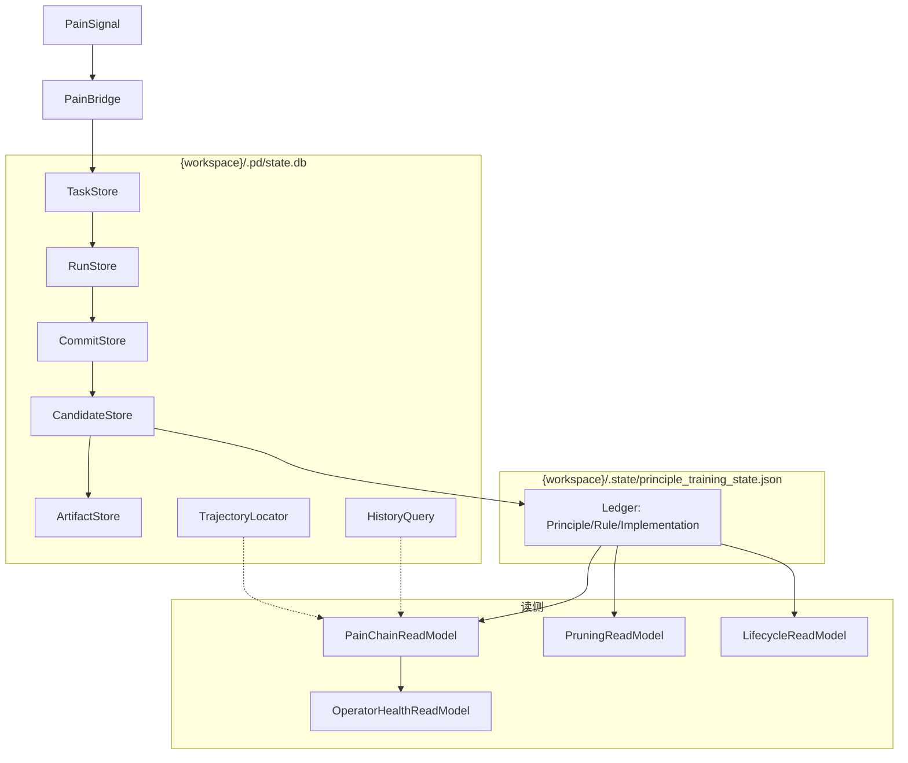

# PD 数据架构 (Data Architecture)

> **状态**: Active
> **最后更新**: 2026-05-09
> **背景**: 定义 PD 系统的数据存储架构、读写分离策略、以及与 ADR-0001/ADR-0002 一致的迁移计划。所有物理路径已通过 `rg` 验证。

---

## 1. 存储组件概览

PD 系统的持久化存储分为两个物理文件：

| 物理文件 | 技术 | 内容 |
|---------|------|------|
| `{workspace}/.pd/state.db` | SQLite | Task / Run / Commit / Candidate / Artifact / History / Trajectory（共享一条 SqliteConnection） |
| `{workspace}/.state/principle_training_state.json` | JSON 文件 | Principle Tree 账本（Principle / Rule / Implementation） |

> **关键事实**: `RuntimeStateManager` + `SqliteConnection` 创建 `{workspace}/.pd/state.db`，所有 runtime-v2 store 模块（task/run/commit/candidate/artifact/history/trajectory）复用同一条 SQLite connection。不存在独立的 `candidate.db`、`trajectory.db` 或 `history.db`。

---

## 2. 存储组件详细说明

### 2.1 State Store（SQLite 统一存储）

**物理文件**: `{workspace}/.pd/state.db`  
**创建入口**: `packages/principles-core/src/runtime-v2/store/sqlite-connection.ts`  
**管理器**: `packages/principles-core/src/runtime-v2/store/runtime-state-manager.ts`

所有 runtime-v2 store 模块共享此 SQLite 数据库：

| Store 模块 | 代码位置 | 用途 |
|-----------|---------|------|
| TaskStore | `runtime-v2/store/task/` | 诊断任务队列 |
| RunStore | `runtime-v2/store/run/` | 运行记录 |
| CommitStore | `runtime-v2/store/commit/` | Diagnostician 提交记录 |
| CandidateStore | `runtime-v2/store/candidate/` | Candidate Intake 队列 |
| ArtifactStore | `runtime-v2/store/artifact/` | Code Implementation 资产元数据 |
| HistoryQuery | `runtime-v2/store/history/` | 历史查询 |
| TrajectoryLocator | `runtime-v2/store/trajectory/` | Agent 行为轨迹 |

每个 Store 模块的结构：

```
{StoreName}/
├── {store-name}.ts          # 接口定义
├── memory-{store-name}.ts   # 内存实现（测试用）
└── sqlite-{store-name}.ts   # SQLite 实现（生产用）
```

**辅助模块**:

| 模块 | 代码位置 | 用途 |
|------|---------|------|
| LeaseManager | `runtime-v2/store/lifecycle/` | 分布式租约管理 |
| RecoverySweep | `runtime-v2/store/lifecycle/` | 故障恢复扫描 |
| RetryPolicy | `runtime-v2/store/lifecycle/` | 重试策略 |
| ContextAssembler | `runtime-v2/store/context/` | Pain Chain 上下文组装 |
| DiagnosticianCommitter | `runtime-v2/store/commit/` | 提交原子性保证 |
| IdempotentTransitions | `runtime-v2/store/` | 幂等状态转换 |
| task-migration.ts | `runtime-v2/store/` | SQLite schema 迁移 |

### 2.2 Ledger Store（JSON 账本）

**物理文件**: `{workspace}/.state/principle_training_state.json`  
**代码位置**: `packages/principles-core/src/principle-tree-ledger.ts`

Ledger Store 存储 Principle Tree 的持久化状态。

**数据结构**:

```typescript
interface PrincipleTree {
  principles: LedgerPrinciple[];
  rules: LedgerRule[];
  implementations: LedgerImplementation[];
  version: string;
  updatedAt: number;
}
```

**适配器**: `packages/principles-core/src/runtime-v2/adapter/principle-tree-ledger-adapter.ts`  
将 JSON 文件操作适配为 runtime-v2 可用的接口。

> **注意**: Ledger 的物理路径是 `.state/principle_training_state.json`（不是 `.pd/state/ledger/`）。这与 OpenClaw plugin 的历史路径约定一致。

---

## 3. 读写分离策略

### 3.1 写侧（Write Side）

**写侧统一入口**: `PainToPrincipleService`

```
PainSignal → PainBridge → TaskStore → RunStore → CommitStore → CandidateStore → Ledger
```

**写入保证**:
- 使用 `LeaseManager` 确保租约互斥
- 使用 `IdempotentTransitions` 确保幂等性
- 使用 `DiagnosticianCommitter` 保证提交原子性

### 3.2 读侧（Read Side）

**读侧服务**:

| 读模型 | 代码位置 | 用途 |
|--------|---------|------|
| `PainChainReadModel` | `runtime-v2/pain-chain-read-model.ts` | Pain Chain 全链路追踪 |
| `PruningReadModel` | `runtime-v2/pruning-read-model.ts` | Pruning 信号生成 |
| `LifecycleReadModel` | `runtime-v2/internalization/lifecycle-read-model.ts` | Principle 生命周期状态 |
| `OperatorHealthReadModel` | `runtime-v2/operator-health-read-model.ts` | Operator 健康状态 |
| `GfiReadModel` | `runtime-v2/gfi/gfi-read-model.ts` | 摩擦力指标快照 |

**读取原则**:
- 所有读操作都是非破坏性的
- 读模型不修改底层状态
- 使用 `Resilient*` 包装器处理临时故障

---

## 4. 数据流图



---

## 5. 迁移计划

### 5.1 已完成迁移（ADR-0001）

| 组件 | 原位置 | 新位置 | 状态 |
|------|--------|--------|------|
| PainToPrincipleService | plugin | `@principles/core` | ✅ Done |
| PainChainReadModel | pd-cli | `@principles/core` | ✅ Done |
| PruningReadModel | plugin | `@principles/core` | ✅ Done |
| PrincipleTreeLedger | plugin | `@principles/core` | ✅ Done |
| TemplateGenerator | plugin | `@principles/core` | ✅ Done |

### 5.2 进行中迁移（ADR-0002）

| 组件 | 原位置 | 目标位置 | 状态 |
|------|--------|---------|------|
| RuleHost contracts | plugin | `@principles/core` | ✅ Done (PRI-42) |
| RoutingPolicy | plugin | `@principles/core` | ✅ Done (PRI-43) |
| LifecycleMetrics | plugin | `@principles/core` | ✅ Done (PRI-42) |

### 5.3 待迁移

| 组件 | 原位置 | 目标位置 | 依赖 |
|------|--------|---------|------|
| Store modularization | `@principles/core` | `@principles/core/store/` | PRI-47 |
| Artifact store cleanup | plugin | `@principles/core` | Post M6 |

---

## 6. 相关文档

| 文档 | 说明 |
|------|------|
| [PD_SYSTEM_ARCHITECTURE.md](./PD_SYSTEM_ARCHITECTURE.md) | 系统架构蓝图 |
| [ADR-0001](../adr/0001-runtime-v2-service-boundaries.md) | Runtime V2 Service Boundaries |
| [ADR-0002](../adr/0002-hard-internalization-core-boundary.md) | Hard Internalization Core Boundary |
