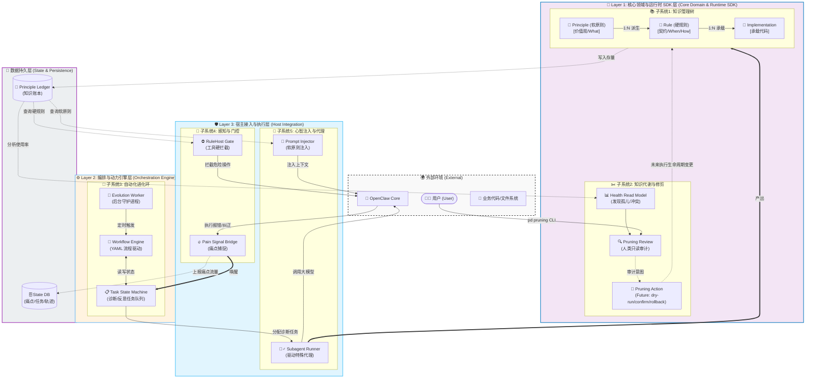

# PD 系统架构蓝图 (System Architecture Blueprint)

> **状态**: 规划中 (Draft)
> **最后更新**: 2026-05-07
> **背景**: 基于系统动力学（System Dynamics）和本体树（DOMAIN_MODEL.md）重构设计的 PD 分层架构蓝图。

本文档定义了 PD 系统的 **3 大物理层级** 和 **5 个功能子系统**。该架构彻底分离了“知识管理”、“执行编排”和“环境交互”，为后续的代码重构明确了物理边界。

---

## 1. 核心领域与运行时 SDK 层 (Core Domain & Runtime SDK Layer) —— *系统的“大脑与记忆”*

**定位**：承载 PD 的核心领域模型、运行时服务、读模型、状态机和适配器契约。它对 OpenClaw 等宿主保持解耦，但可以通过明确的 SDK 边界拥有 Runtime V2 的 store、read model、service facade 和 adapter contract。
**边界约束**：不得依赖 OpenClaw plugin hook、OpenClaw UI、宿主会话对象或宿主专属命令；可以定义并实现 core-owned runtime 组件，例如 `RuntimeStateManager`、`PainToPrincipleService`、`PainChainReadModel`、`InternalizationOrchestrator` 和 operator read models。

本层内部需要区分两类职责：

- **Pure Domain Model**：纯类型、纯决策函数、schema、本体约束和状态机规则。应尽量无 I/O。
- **Core Runtime SDK**：面向 CLI、plugin、未来 IDE/standalone host 复用的运行时服务、读模型、store adapter 和 runtime adapter contract。允许通过 adapter 访问 `.pd/state.db`、`.state` ledger 或外部 runtime，但不能反向依赖宿主实现。

### 子系统 1：领域知识管理树 (Ontology Tree Subsystem)
- **核心功能**：管理 `Principle`（原则）、`Rule`（规则）和 `Implementation`（实现）的增删改查及生命周期转换（Candidate -> Probation -> Active -> Archived）。
- **边界**：只负责验证数据合法性（例如：Rule 必须归属于 Principle）。不管这些数据怎么存、怎么被注入。

### 子系统 2：知识代谢与修剪 (Metabolism & Pruning Subsystem)
- **核心功能**：系统动力学中的“减压回路”。扫描孤儿节点，计算原则的使用率和违背率，生成 `Pruning Signal`（修剪信号）。接收操作员的 `Pruning Review`（只读的审计记录）。真正的降级或归档被称为 `Pruning Action`（Future Scope），需要干跑 (dry-run)、人类确认和回滚计划，而不是由 Review 直接执行。
- **边界**：不直接拦截请求，只提供“健康报告”和“淘汰提案”。

---

## 2. 编排与动力引擎层 (Orchestration Engine Layer) —— *系统的“心脏与泵”*

**定位**：负责将底层的知识模型与外围的请求连接起来，驱动异步工作流，管理系统状态机。
**边界约束**：依赖第 1 层，通过 Adapter（适配器模式）调用外围环境。

### 子系统 3：自动化进化环 (Automated Evolution Subsystem)
- **核心功能**：系统动力学中的“增长回路”。包含 `Evolution Worker` 和基于 `workflows.yaml` 的工作流引擎。将环境传来的 `Pain Signal`（痛点流量）转化为诊断任务，分配给专门的 `Diagnostician Agent`，并将产出摄入为新的 `Principle/Rule`（增加存量）。
- **边界**：只负责流程的流转（Task 状态机）。诊断的具体动作委托给模型执行。

---

## 3. 宿主接入与执行层 (Host Integration Layer) —— *系统的“眼耳手脚”*

**定位**：与外部环境（如 OpenClaw 框架、终端 CLI、文件系统）的硬接触点。
**边界约束**：最外层代码，负责处理输入输出、拦截、格式转换。

### 子系统 4：感知与门控 (Perception & Gating Subsystem)
- **核心功能**：包含所有的 Hooks。
  - **感知**：监听执行失败、用户纠正，提取上下文，生成并上报 `Pain Signal`。
  - **门控 (RuleHost)**：在 `before_tool_call` 时，向第 1 层查询当前活跃的 `Rule`，如果匹配则执行硬拦截（Block/RequireApproval）。
- **边界**：绝对不能包含业务逻辑（如判断这个痛点是不是新痛点）。它只负责“捕获抛出”和“拿牌照拦人”。

### 子系统 5：心智注入与代理 (Mind Injection & Agent Subsystem)
- **核心功能**：
  - **注入**：在 `before_prompt_build` 时，向第 1 层查询活跃的 `Principle`，计算上下文预算，格式化后注入给主模型的 System Prompt。
  - **路由**：提供 `AgentSpec` 规范，管理用于诊断、修复的各类专属子代理（Subagents）的调用和销毁。
- **边界**：只做格式化（Prompt 组装）和调用外部模型 API。

---

## 🗺️ 系统架构图 (Architecture Diagram)

