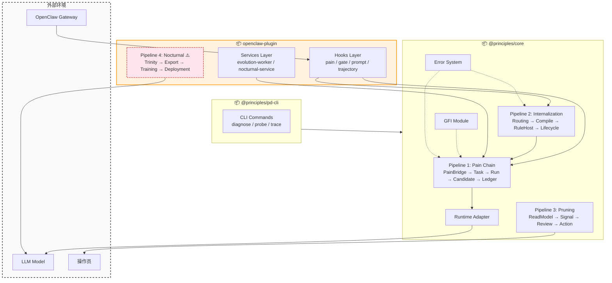

# PD 系统架构蓝图 (System Architecture Blueprint)

> **状态**: Accepted
> **最后更新**: 2026-05-09
> **背景**: 基于系统动力学（System Dynamics）和本体树（DOMAIN_MODEL.md）重构设计的 PD 分层架构蓝图。本文档与 ADR-0001、ADR-0002 保持一致。

本文档定义 PD 系统的 **3 大物理层级** 和 **4 条核心流水线**。架构以实际代码结构为锚点，每条流水线直接映射到可追踪的代码目录和文件。

---

## 0. 包边界与所有权

| 包 | 角色 | 核心目录 | 依赖方向 |
|----|------|---------|---------|
| `@principles/core` | Domain Core | `runtime-v2/` | 无外部依赖 |
| `openclaw-plugin` | Host Integration | `core/`, `hooks/`, `service/` | ← `@principles/core` |
| `@principles/pd-cli` | Operator CLI | `src/commands/` | ← `@principles/core` |

> **核心约束**: `@principles/core` 不得依赖 `openclaw-plugin` 或 `@principles/pd-cli`。

---

## 1. 三层架构

### Layer 1: Core Domain & Runtime SDK（`@principles/core`）

承载 PD 的核心领域逻辑。所有不依赖 OpenClaw API 的业务代码都属于此层。

**代码位置**: `packages/principles-core/src/runtime-v2/`

### Layer 2: Orchestration & Services（`openclaw-plugin/service/`）

驱动异步工作流、管理队列和调度。依赖 Layer 1，通过 Adapter 调用外部模型。

**代码位置**: `packages/openclaw-plugin/src/service/`

### Layer 3: Host Integration（`openclaw-plugin/hooks/`）

与 OpenClaw 框架的硬接触点。只做输入捕获和输出注入，不含业务逻辑。

**代码位置**: `packages/openclaw-plugin/src/hooks/`

---

## 2. 四条核心流水线

PD 系统的核心行为可以归纳为 4 条数据流水线。每条流水线有明确的输入、处理步骤和输出。

### Pipeline 1: Pain Chain（痛点链路）

**核心价值**: 将环境中的失败信号转化为可复用的知识。

```
[Pain Signal] → [PainBridge] → [TaskStore] → [DiagnosticianRunner] → [CandidateIntake] → [Ledger]
```

| 步骤 | 代码位置 | 说明 |
|------|---------|------|
| Pain Signal 捕获 | `hooks/pain.ts` | Hook 层捕获执行失败 |
| Pain Bridge | `core/pain-signal-bridge.ts` | 转换为标准 Task 输入 |
| Task 入队 | `store/task/` | SQLite 持久化 |
| Diagnostician 执行 | `runner/diagnostician-runner.ts` | 调用 LLM 诊断 |
| Candidate Intake | `candidate-intake-service.ts` | 摄入诊断产出 |
| Ledger 登记 | `adapter/principle-tree-ledger-adapter.ts` | 写入 Principle Tree |

**关键接口**:
- `PainSignalBridge.createAndInvoke()` — 痛点上报
- `DiagnosticianRunner.run()` — 诊断执行
- `CandidateIntakeService.process()` — 候选摄入

### Pipeline 2: Internalization（内化链路）

**核心价值**: 将 Principle 转化为可执行的 Rule/Implementation。

```
[Principle] → [RoutingPolicy] → [InternalizationOrchestrator] → [TemplateGenerator/RuleHost] → [LifecycleMetrics] → [Active Rule]
```

| 步骤 | 代码位置 | 说明 |
|------|---------|------|
| 路由决策 | `internalization/routing-policy.ts` | 决定 L1/L2 内化路线 |
| 编排执行 | `internalization/internalization-orchestrator.ts` | 协调内化任务 |
| 模板生成 | `internalization/template-generator.ts` | L2: 生成 Rule 代码模板 |
| RuleHost 评估 | `internalization/rule-host-evaluator.ts` | L2: 执行 Rule 逻辑 |
| 生命周期管理 | `internalization/lifecycle-metrics.ts` | 追踪 Rule 健康度 |

**内化路线**（详见 [DOMAIN_MODEL.md](./DOMAIN_MODEL.md) Section 3）:

| 路线 | 载体 | 状态 |
|------|------|------|
| L1: 软内化 | System Prompt 注入 | ✅ 生产可用 |
| L2: 硬内化 | RuleHost / Hook / Tool | ✅ 生产可用 |
| L3: 模型参数化 | LoRA / Fine-tuning | ⚠️ 实验性（见 Pipeline 4） |

### Pipeline 3: Pruning（修剪链路）

**核心价值**: 清理无效知识，防止知识库膨胀。

```
[Principle Tree] → [PruningReadModel] → [Pruning Signal] → [Pruning Review] → [Pruning Action]
```

| 步骤 | 代码位置 | 说明 |
|------|---------|------|
| 健康度扫描 | `pruning-read-model.ts` | 计算使用率和违背率 |
| 信号生成 | `pruning-mask.ts` | 生成 Pruning Signal |
| 审计记录 | `pruning-review-log.ts` | 只读的审计日志 |
| 执行修剪 | CLI `prune` 命令 | 操作员确认后执行 |

**关键约束**: Pruning Review 和 Pruning Action 严格分离。Review 只读，Action 需人工确认。

### Pipeline 4: Nocturnal（夜间训练链路）⚠️ 实验性

**核心价值**: 通过离线训练将知识固化到模型参数中。

```
[Session Data] → [Trinity Chain] → [Export] → [Training] → [Checkpoint] → [Promotion Gate] → [Deployment]
```

| 步骤 | 代码位置 | 说明 |
|------|---------|------|
| Trinity 反思链 | `core/nocturnal-trinity.ts` | Dreamer → Philosopher → Scribe |
| 数据导出 | `core/nocturnal-export.ts` | 生成 ORPO 训练数据 |
| 训练执行 | `core/training-program.ts` | 调用外部 Python 训练器 |
| Checkpoint 注册 | `core/model-training-registry.ts` | 训练产出登记 |
| 推广门控 | `core/promotion-gate.ts` | 评估后决定是否部署 |
| 部署注册 | `core/model-deployment-registry.ts` | 部署状态管理 |

> **⚠️ 实验性标记**: 此流水线涉及外部 Python 训练器、GPU 硬件依赖和模型评估，目前仅在 `local-reader` profile 下测试。`LOCAL_EDITOR_ENABLED = false`。不建议在生产环境依赖此流水线。

---

## 3. 辅助模块

以下模块为流水线提供支撑，但不构成独立流水线：

### GFI（Global Friction Index）

**代码位置**: `runtime-v2/gfi/`

追踪工作区的摩擦力指标，用于自适应阈值调整。

| 组件 | 说明 |
|------|------|
| `gfi-kernel.ts` | 摩擦力计算核心（applyFriction / applyDecay / applyRelief） |
| `gfi-policy.ts` | 摩擦力策略配置 |
| `gfi-read-model.ts` | 工作区摩擦力快照 |

### Runtime Adapter

**代码位置**: `runtime-v2/adapter/`

解耦 PD 逻辑与外部 LLM 运行时。

| 适配器 | 说明 |
|--------|------|
| `openclaw-cli-runtime-adapter.ts` | OpenClaw CLI 执行 |
| `pi-ai-runtime-adapter.ts` | 直接 LLM API 调用 |
| `test-double-runtime-adapter.ts` | 测试替身 |

### Error System

**代码位置**: `runtime-v2/error-categories.ts`

统一错误分类，详见 [ERROR_ARCHITECTURE.md](./ERROR_ARCHITECTURE.md)。

---

## 4. 系统架构图



---

## 5. 相关文档

| 文档 | 说明 |
|------|------|
| [DOMAIN_MODEL.md](./DOMAIN_MODEL.md) | 核心领域术语和本体定义 |
| [DATA_ARCHITECTURE.md](./DATA_ARCHITECTURE.md) | 数据存储架构 |
| [ERROR_ARCHITECTURE.md](./ERROR_ARCHITECTURE.md) | 错误处理架构 |
| [ADR-0001](../adr/0001-runtime-v2-service-boundaries.md) | Runtime V2 Service Boundaries |
| [ADR-0002](../adr/0002-hard-internalization-core-boundary.md) | Hard Internalization Core Boundary |
