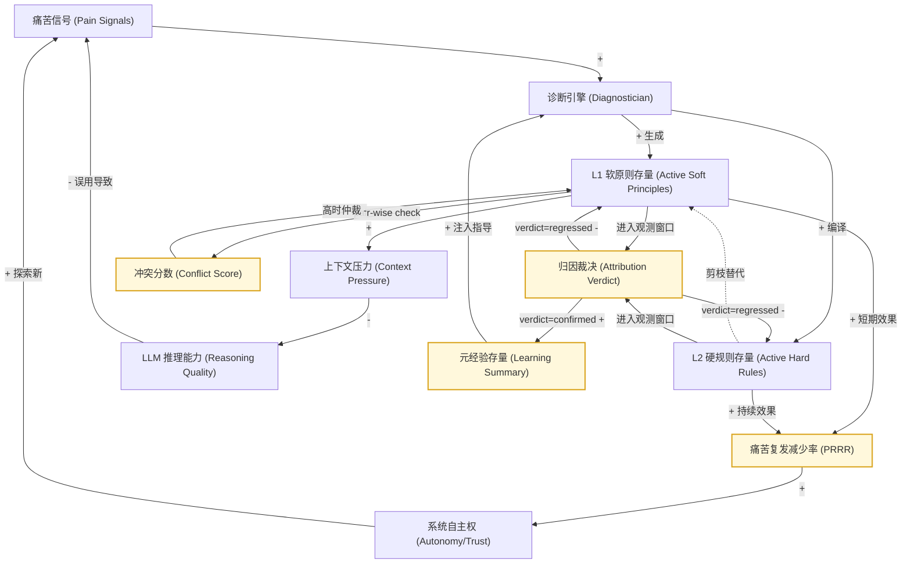
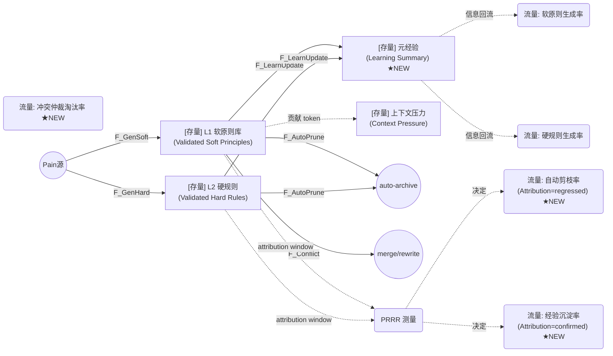

# 重构硅基生命：基于系统动力学视角的 Principles Disciple (PD) 项目解构与建模

**文档状态**: Active / 战略级思考资产（v2.0 Attribution / PRRR 概念已 deferred）
> **执行限制（ADR-0014）**: 本文中的 Attribution、WorkspaceLearningSummary、Provenance、Probation 与 PRRR 内容是条件重启后的分析模型，不是当前派工计划。PRI-232~236 已取消；当前 MVP 只验证已实现的 `prompt`、RuleHost、`defer_archive` 三个通道。执行工作请只读取 [`07-mvp-first-pivot.md`](../plans/2026-05-roadmap/07-mvp-first-pivot.md) 与 [`03-linear-sync-plan.md`](../plans/2026-05-roadmap/03-linear-sync-plan.md)。
**初版日期**: 2026-04-29
**v2.0 修订日期**: 2026-05-24（v2.0 即日 deferred — 见下）
**核心视角**: 系统动力学 (System Dynamics) & 架构工程

---

## ⚠️ v2.0 状态注记（2026-05-24）

本文 v2.0 引入的 R4 Attribution Loop / R5 Conflict Detection / PRRR 北极星指标 / 8 杠杆排序 / Anti-pattern 守护，**全部标记为 deferred concepts**：

- **不在 MVP 路径上**：见 [ADR-0014](../adr/0014-mvp-first-strategy-and-product-pivot.md) 与 [07-mvp-first-pivot.md](../plans/2026-05-roadmap/07-mvp-first-pivot.md)。
- **重启条件**：见 [post-mvp-conditional-roadmap.md §1](../plans/post-mvp-conditional-roadmap.md)（Attribution）和 §2（LearningSummary）。
- **保留理由**：v2.0 的概念分析（特别是"Decision Observability 缺失"诊断）仍然成立，是未来重启时的关键设计输入。

**当前生效的部分**：v1.0 的 R1 / B1 / R3 三回路概念蓝图，作为 PD 产品哲学叙事使用。MVP 阶段不引入 R4/R5 工程约束。

任何 AI 助手读到本文时，**不要按 v2.0 §9 的不变量实施**；MVP 阶段的真正约束在 ADR-0014 + AGENTS.md "MVP 三问"。

---


## 1. 引言：什么是 Principles Disciple (PD)？

### 1.1 从"工具"到"思考伙伴"
当前的 AI Agent 大多被设计为"无状态的执行工具"——它们在每次会话中醒来，执行指令，并在上下文重置后忘记一切。它们的错误不产生教训，它们的努力也不产生积淀。

**Principles Disciple (PD)** 的诞生正是为了打破这一局限。PD 是一个为 AI Agent 设计的**原则演化系统（Principle-Evolution System）**。它赋予了 AI "从痛苦中学习"的能力：系统通过捕获执行过程中的失败和用户的纠正（Pain Signals），进行自我反思与诊断（Diagnostician），提炼出指导未来行为的原则（Principles），将其内化为 Agent 的"本能"，**并验证内化是否真正减少了同类痛苦**。

### 1.2 为什么需要系统动力学（SD）视角？
随着 PD 项目的推进，传统的软件工程（SE）和深度学习（DL）理论逐渐暴露出局限性：
- **SE 的局限**：代码是静态的，而 PD 的"规则"是由 LLM 动态生成的，这种紧耦合、非线性的逻辑碰撞无法用传统的模块化思维解决。
- **DL 的局限**：模型微调周期长，无法满足 PD 追求的"单样本即时演化"需求。

**系统动力学（System Dynamics）** 擅长处理"非线性、多反馈、长延迟"的复杂系统。通过 SD 视角，我们将 PD 视为一个由**存量（Stocks）、流量（Flows）和反馈回路（Feedback Loops）** 组成的二阶控制系统，而 v2.0 修订强调一点：**没有 Attribution，所有正反馈回路都会失控；Attribution 是把开环系统改造成真正闭环的关键支撑**。

---

## 2. 系统建模：PD 的核心"资产"与"负债" (Stocks)

在系统动力学中，存量是系统状态的载体。PD 系统的运行，本质上是以下五大核心存量的相互博弈：

1. **🧠 有效原则库 (Validated Principle Stock) —— 【核心资产】**
   - **定义**：经过 Attribution 验证、PRRR > 0 的活跃原则集合。
   - **v2.0 关键变化**：v1.0 把"原则有效性"作为指标。v2.0 直接把"有效"作为存量定义的前置——未经验证的原则只是 *probation_active*，不计入资产。
2. **📉 上下文压力 (Context Pressure) —— 【核心负债】**
   - **定义**：active principle 注入 LLM Prompt 占用的 token 总量 / 上下文窗口。
   - **表现**：高于 0.5 时 LLM 指令遵从能力骤降。
3. **🛡️ 用户信任资本 (User Trust Capital) —— 【环境杠杆】**
   - **定义**：人类对 Agent 自主决策的信任程度。
   - **表现**：决定 Approval 通过率与 Probation 窗口长度。
4. **⚙️ 内化深度 (Internalization Depth) —— 【解压阀】**
   - **定义**：同等业务能力中已落到 L2/L3 的比例 / 仍在 L1 prompt 的比例。
5. **📚 元经验存量 (Meta-Experience Stock) —— 【新增/Phase 1D 实施】**
   - **定义**：跨会话沉淀的"PD 自己关于自己的知识"——哪些类别的原则反复无效、哪些通道实证最有效、哪些工作区特征对应哪些处方。
   - **v2.0 关键变化**：原 v1.0 完全忽视该存量。它由 `WorkspaceLearningSummary` 维护，是 R4 反哺 Diagnostician 的载体。

---

## 3. 五大核心反馈回路 (Feedback Loops)

PD 系统的生与死，由以下五个相互交织的反馈环决定。其中 R4、R5 是 v2.0 新增。

### 🔄 R1：进化增强回路 (Flywheel - 正反馈)
PD 成长的动力源泉，遵循《原则》一书的第一性原理：**Pain + Reflection = Progress**。

- **运行逻辑**：Agent 失败 `(Pain) ↑` → 诊断生成原则 `(Principle) ↑` → 行为修正 `(Performance) ↑` → 信任增加 `(Trust) ↑` → 探索更复杂任务 → 暴露更深层痛苦 `(Pain) ↑`。

### ⚠️ B1：复杂度阻尼回路 (Ceiling - 负反馈)
悬在 PD 头顶的"达摩克利斯之剑"，解释了为什么"原则越多，Agent 反而越笨"。

- **运行逻辑**：原则过多 `(Principle Count) ↑` → 上下文超载 `(Context Pressure) ↑` → 推理质量下降 `(Reasoning Quality) ↓` → 新的、无意义的错误 `(Synthetic Pain) ↑`。

### 💡 R3：知识内化减压回路 (Decoupling Loop - 破局点)
通过"内化"释放上下文压力。

- **运行逻辑**：active principle → 编译成 hard rule（L2 RuleHost 实现）→ context pressure ↓。
- **v1.0 的虚假闭合**：v1.0 假设 hard rule 一旦存在就自动取代 soft principle。实际上没有度量"hard rule 是否真的减少了同类痛苦"。如果 hard rule 无效，soft principle 不会被剪枝，反而堆积。

### 🔬 R4 [NEW]：归因验证回路 (Attribution Loop) ★ v2.0 关键新增
这是补全 R3 闭合的关键。

- **运行逻辑**：active principle → 进入观测窗口（默认 100 工具调用）→ 测量 PRRR（pain recurrence reduction rate）→ verdict
  - `verdict=confirmed` → 该 principle 留任，更新 adherence + meta-experience stock
  - `verdict=uncertain` → 延长一次窗口；连续 3 次 uncertain 升级到人工 review
  - `verdict=regressed` → 自动归档（auto-archive），不需要人工
- **作用**：让 R3 真正闭合（无效的 soft principle 会被自动剪枝），让 B1 有质量兜底（不只是数量 cap）。

### ⚔️ R5 [NEW]：冲突检测回路 (Conflict Detection Loop)
当 active principle 接近 cap 时，相互矛盾的 principle 会让 LLM 指令遵从能力崩溃。

- **运行逻辑**：每个 attribution 窗口结束 → 计算 `conflictPair` 矩阵（哪些 principle 在同一 trajectory 中被同时违反 / 触发条件重叠但 action 矛盾）→ conflict_score ↑ → 触发 PrincipleArbitration（合并 / 重写 / 取舍其中一个）。
- **作用**：B1 的二级兜底，让 cap 之内的 principle 互相正交。

### 总图：五回路结构（修订版）

```
                       ┌───────────────────────────────────────┐
                       │  R1: Flywheel (+)                     │
                       │  Pain → Principle → Performance →     │
                       │  Trust → New exploration → Pain       │
                       └───────────────────────────────────────┘
                                       │
                                       ▼
                       ┌───────────────────────────────────────┐
                       │  B1: Ceiling (−)                      │
                       │  Principles → Context → Reasoning ↓ → │
                       │  Synthetic Pain                       │
                       └───────────────────────────────────────┘
                                       ▲
                                       │ (减压)
                                       │
        ┌──────────────────────────────┴──────────────────────────────┐
        │                                                             │
        ▼                                                             │
┌────────────────────┐                  ┌────────────────────────┐    │
│  R3: Decoupling    │                  │  R4: Attribution (NEW) │    │
│  Soft → Hard 内化  │  ←── 闭合于 ───  │  Verdict → Auto Prune  │────┘
│  Context Pressure ↓│                  │  / Confirm / Re-diagnose│
└────────────────────┘                  └────────────────────────┘
                                                  │
                                                  ▼
                                       ┌────────────────────────┐
                                       │  R5: Conflict Detect.  │
                                       │  Pair-wise violation → │
                                       │  PrincipleArbitration  │
                                       └────────────────────────┘
```

---

## 4. 核心 KPI 树：PRRR 是唯一结果指标

### 4.1 Pain Recurrence Reduction Rate (PRRR)

```
PRRR(P, window) = 1 − ( count(painId ∈ derivedCategories(P), window_after) /
                        count(painId ∈ derivedCategories(P), window_before) )

其中：
  P = 某 active principle
  derivedCategories(P) = P.derivedFromPainIds 对应的 PainCategory 集合
  window_before = P 激活前的等长观测窗口
  window_after  = P 激活后的等长观测窗口
```

**所有其他指标都应该为此指标服务**，因为：

- 原则数量是过程指标，不是结果指标。
- token 节省是经济性指标，不是有效性指标。
- adherence rate 在没有 PRRR 校准时是误导性的——一个"被严格遵守但毫无效果"的原则不应被嘉奖。
- L1 容量本身没有意义——5 个有效原则远胜 12 个杂乱原则。

### 4.2 KPI 树

```
PRRR (root, lagging)
├── Pain Inflow Rate (leading, 上游)
│   ├── GAP Layer 1 rate (mission_failed / okr_drift)
│   ├── User correction rate
│   └── Tool failure recurrence rate
│
├── Internalization Depth (leading, 内部健康)
│   ├── L2 internalization ratio = count(L2 active rules) / count(L1 active principles + L2 rules)
│   └── Bundled vs Evolved ratio (避免归因被预装件污染)
│
├── Attribution Health (leading, 反馈质量)
│   ├── verdict=confirmed rate
│   ├── verdict=regressed rate (auto-archive 触发率)
│   └── verdict=uncertain → human escalation rate
│
└── Context Pressure (leading, 容量负债)
    ├── L1 prompt token / context window
    └── conflict_score (pair-wise from R5)
```

**OKR 的根**应当是：在固定 base model 下，让某一类典型 painId 的 PRRR 在 30 天内达到 ≥ 0.5。

---

## 5. 核心杠杆识别（按 ROI 排序）

| 杠杆 | 影响 | ROI | 当前状态 |
|------|------|-----|---------|
| **L1: Attribution Pipeline (R4)** | 让 R3 真正闭合，自动剪枝无效原则；让 PRRR 可计算 | 条件重启后再评估 | Deferred；PRI-232 已 canceled |
| **L2: WorkspaceLearningSummary (元经验存量)** | 跨会话记忆；避免 Diagnostician 反复发明同类原则 | 条件重启后再评估 | Deferred；PRI-233 已 canceled |
| **L3: RuleHost 通道闭环 (L2 内化主路径)** | 把 ROI 最高的内化层做透；承接绝大部分高价值原则 | ⭐⭐⭐⭐ | ⚠️ RuleHostWriter 已有；shadow replay 有；缺真实工作区高频投放与 PRRR 数据 |
| **L4: RejectionFeedback (人工拒绝闭环)** | 关闭"显式拒绝 → 重新学习"最后一公里 | ⭐⭐⭐⭐ | ❌ 未建（PRI-148 待建）|
| **L5: Bundled vs Evolved 资产分离** | 让 attribution 干净；避免预装件污染 PRRR | 条件重启后再评估 | Deferred；PRI-234 已 canceled |
| **L6: Activation Probation Window** | 让 approve 不直接成 active；attribution 决定 promote | 条件重启后再评估 | Deferred；PRI-235 已 canceled |
| **L7: Nocturnal/idle 退役（PRI-227~231）** | 删除 ~5000 行 dead code，CI 收敛 | ⭐⭐⭐ | 进行中 |
| **L8: BALM Diagnostician + Dreamer 最小骨架** | 让 Agent manifest 化；只做最小两个，避免过度抽象 | ⭐⭐ | ❌ 未建；建议推迟到 Phase 2 |

**未列入但常被讨论的**（明确推迟）：

- SkillFileWriter / TrainingExporter：通道产出价值未实证，等 L1-L4 数据稳定后再评估
- GAP Layer 1 信号生成器：需要 mission/objective 数据；强行实现会变 mock
- MissionScheduler 三层模型：当前没有 mission 数据；attribution 的工作量级与"mission" 不同步
- 完整 BALM 7 个 manifest：先做 2 个验证机制，其余按需

---

## 6. 三类内化路线 (Three Internalization Routes) — 与 v1.0 的对照

> v1.0 的描述基本正确，v2.0 仅增加"如何度量是否成功"。

### L1: 软内化 (Prompt / Skill / SOP)
- **载体**：System Prompt、Skill 文档、SOP。
- **机制**：`Diagnostician` 产出文本建议，经 PromptBuilder / Skill 文档固化。
- **特点**：**见效快，但极其昂贵**。属于系统的**短期记忆**。
- **v2.0 增量**：每个 L1 原则激活后必须经过 Activation Probation Window，attribution 决定保留 / 归档。**没有 attribution 的 L1 通道是不可持续的**——这是 PD_System_Dynamics_Model v1.0 缺失的关键约束。

### L2: 硬内化 (Code / Hook / Tool)
- **载体**：RuleHost implementation、OpenClaw Hook、Custom Tool。
- **机制**：`PrincipleCompiler` / Internalization Engine 转译为执行逻辑，由 `RuleHost` / Hook / Tool 在 `before_tool_call` 物理拦截。
- **特点**：**低耗、确定性强**。属于系统的**肌肉记忆**。
- **v2.0 增量**：L2 的 attribution 窗口比 L1 更短（默认 50 工具调用），因为命中频率更高、信号更密。AHE 论文实证 L2 (tool/middleware) 是承载收益的核心层。

### L3: 模型与参数化 (Model Parameter / LoRA)
- **载体**：LoRA、Fine-tuned Checkpoint、Preference Model。
- **机制**：累积高质量样本 → `model_training` → 固化到模型权重。
- **特点**：**隐性本能**。
- **v2.0 增量**：L3 不进入实时 attribution；它在外部训练系统中评估，并通过单独的 `model_deployment_registry` 管理 checkpoint 部署。

---

## 7. 从"脑首分离"到 Runtime v2 的全面接管

> 与 v1.0 一致。重点在 v2.0 修订：v1.0 在结尾说"通过系统动力学的推演，PD 接下来的核心优化方向应该聚焦于：增强动态剪枝 + 提升硬转化率"——这两个方向都正确，但**实现路径**已经更新：

- "动态剪枝" → 由 **Attribution-driven auto-archive (R4)** 实现，不再依赖人工 Pruning Action 排到 Phase 3 之后
- "硬转化率" → 由 **L2 (RuleHost) 通道闭环 + Attribution PRRR 数据** 共同推动；不再只优化 Diagnostician prompt

---

## 8. 系统动力学建模图表 (SD Modeling Diagrams)

### 8.1 因果回路图 (Causal Loop Diagram, CLD) — v2.0 修订版



### 8.2 存量流量图 (Stock and Flow Diagram, SFD) — v2.0 修订版



*图解说明 (v2.0)*：
1. v1.0 中"软原则" → "硬规则" 是**直接箭头**，v2.0 把这层拆开，让两者从同一 Pain 源各自演化，并各自经过 Attribution。
2. **元经验存量（S_Learn）是新增的核心节点**，它是从 verdict=confirmed 累积的浓缩观察，回流到下一轮 Diagnostician 的生成函数中。
3. **F_AutoPrune（自动剪枝）由 PRRR 测量直接决定**，不再依赖"人工启发式 review"。
4. **F_Conflict（冲突仲裁淘汰）** 是 R5 在 SFD 上的具象化——同一组互相矛盾的原则会被 Arbitration 合并/重写。

---

## 9. 不变量与守护（v2.0 新增）

为确保上述模型在工程层不被绕开，必须在架构守护测试中加入以下不变量：

| 不变量 | 含义 |
|-------|------|
| `SD-1: PRRR-driven pruning` | 任何 `active → archived (auto)` 转换必须可追溯到一条 attribution verdict=regressed |
| `SD-2: Probation-bridge` | `probation → active` 必须经过 `probation_active`，禁止跳过 |
| `SD-3: Bundled isolation` | `provenance=bundled` 的 principle 不进入 attribution 计算，避免污染 PRRR |
| `SD-4: Learning summary read-only` | `WorkspaceLearningSummary` 是只读视图；Diagnostician 只能读，不能反向写 |
| `SD-5: Conflict score visible` | 任何 active principle 集合的 pair-wise conflict 数据可被 pd-cli / pd-console 查询 |

详见 ADR-0013 §6 与 docs/plans/2026-05-roadmap/06-ahe-informed-architecture-review.md §4.4。

---

## 10. 结语

> **v1.0 把 PD 描述为"基于痛苦学习的演化系统"。v2.0 进一步指出：没有 Attribution 的演化系统不是真正闭环——它只是不断生长的开环放大器。PRRR 是 PD 唯一应该追逐的北极星指标。所有其他度量（原则数、token、信任）都是过程指标。当某条原则不能贡献 PRRR，它就应该被 Attribution Pipeline 自动归档；当某条原则与其他原则冲突，它就应该被 Conflict Detection 仲裁。系统动力学不是描述工具，是约束工具——它告诉我们，缺哪一块，整个塔就会塌。**

下一步实施路径见 `docs/plans/2026-05-roadmap/06-ahe-informed-architecture-review.md` §5。
