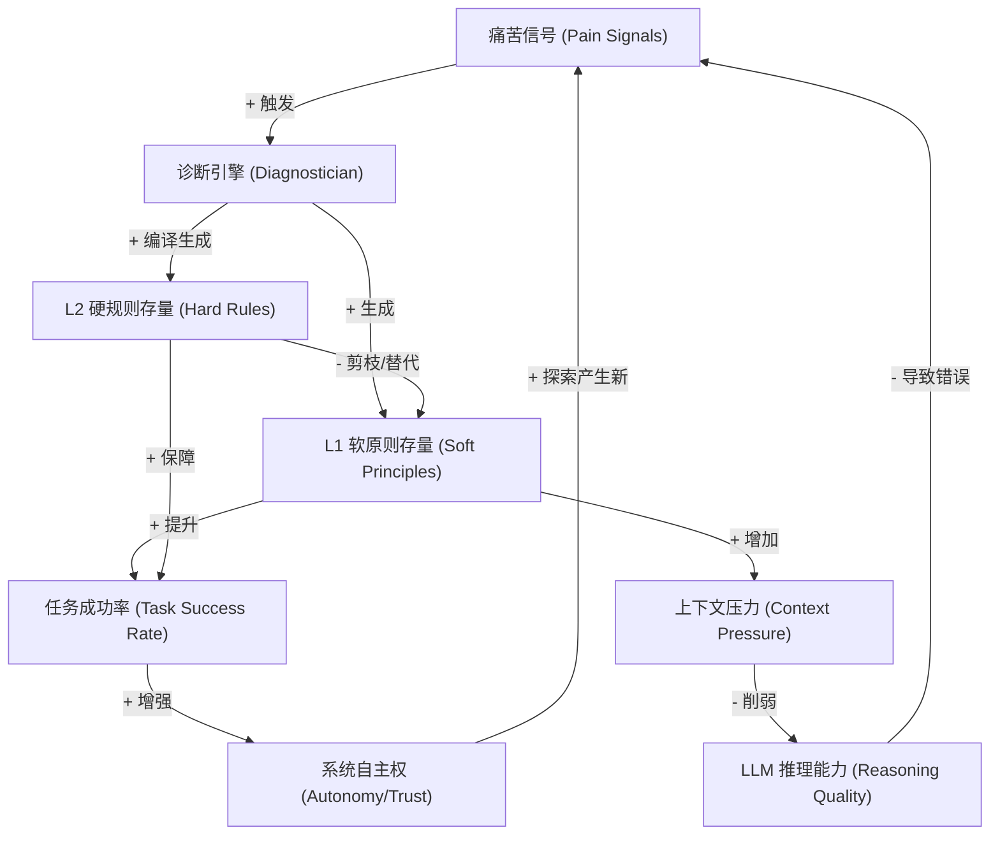
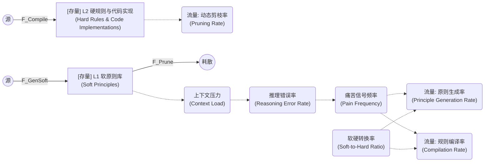

# 重构硅基生命：基于系统动力学视角的 Principles Disciple (PD) 项目解构与建模

**文档状态**: Final / 战略级指导文档
**更新日期**: 2026-04-29
**核心视角**: 系统动力学 (System Dynamics) & 架构工程

---

## 1. 引言：什么是 Principles Disciple (PD)？

### 1.1 从“工具”到“思考伙伴”
当前的 AI Agent 大多被设计为“无状态的执行工具”——它们在每次会话中醒来，执行指令，并在上下文重置后忘记一切。它们的错误不产生教训，它们的努力也不产生积淀。

**Principles Disciple (PD)** 的诞生正是为了打破这一局限。PD 是一个为 AI Agent 设计的**原则演化系统（Principle-Evolution System）**。它赋予了 AI “从痛苦中学习”的能力：系统通过捕获执行过程中的失败和用户的纠正（Pain Signals），进行自我反思与诊断（Diagnostician），提炼出指导未来行为的原则（Principles），并将其内化为 Agent 的“本能”。

### 1.2 为什么需要系统动力学（SD）视角？
随着 PD 项目的推进，传统的软件工程（SE）和深度学习（DL）理论逐渐暴露出局限性：
*   **SE 的局限**：代码是静态的，而 PD 的“规则”是由 LLM 动态生成的，这种紧耦合、非线性的逻辑碰撞无法用传统的模块化思维解决。
*   **DL 的局限**：模型微调周期长，无法满足 PD 追求的“单样本即时演化”需求。

**系统动力学（System Dynamics）**擅长处理“非线性、多反馈、长延迟”的复杂系统。通过 SD 视角，我们将不再把 PD 看作一堆零散的代码模块，而是将其视为一个由**存量（Stocks）、流量（Flows）和反馈回路（Feedback Loops）**组成的二阶控制系统。

---

## 2. 系统建模：PD 的核心“资产”与“负债” (Stocks)

在系统动力学中，存量是系统状态的载体。PD 系统的运行，本质上是以下四大核心存量的相互博弈：

1.  **🧠 原则库有效性 (Active Principle Efficacy) —— 【核心资产】**
    *   **定义**：系统中已激活的、能有效指导 Agent 避免错误的“智慧”总量。
    *   **表现**：不仅仅是原则的数量，更是其抵御失败的能力。
2.  **📉 上下文压力 (Context Pressure) —— 【核心负债】**
    *   **定义**：随着原则被注入 LLM 的 Prompt，对模型注意力窗口造成的挤占与推理负担。
    *   **表现**：原则越多，Context 越长，幻觉和指令遗忘的概率呈指数级上升。
3.  **🛡️ 用户信任资本 (User Trust Capital) —— 【环境杠杆】**
    *   **定义**：人类对 Agent 自主决策的信任程度。
    *   **表现**：决定了系统网关（Gatekeeper）的拦截严格度。信任度高，Agent 探索新路径的自由度才大。
4.  **⚙️ 内化深度 (Internalization Depth) —— 【解压阀】**
    *   **定义**：系统知识从“外部语言提示”转化为“底层工程代码或模型权重”的比例。
    *   **表现**：内化越深，系统的性能开销越小。

---

## 3. 三大核心反馈回路 (Feedback Loops)

PD 系统的生与死，由以下三个相互交织的反馈环决定：

### 🔄 回路 1：进化增强回路 (The Flywheel - 正反馈)
这是 PD 成长的动力源泉，遵循《原则》一书的第一性原理：**Pain + Reflection = Progress**。
*   **运行逻辑**：Agent 在执行任务时遭遇失败 `(Pain Signals) ↑` -> 系统启动诊断生成新原则 `(Principles) ↑` -> 行为得到修正 `(Performance) ↑` -> 任务成功率提升，用户信任增加 `(Trust) ↑` -> 被允许执行更复杂的任务，从而发现更有价值的痛点。

### ⚠️ 回路 2：复杂度阻尼回路 (The Ceiling - 负反馈)
这是悬在 PD 头顶的“达摩克利斯之剑”，解释了为什么“原则越多，Agent 反而越笨”。
*   **运行逻辑**：为了防止犯错，积累了大量原则 `(Principle Count) ↑` -> 所有原则塞入 Prompt 导致上下文超载 `(Context Load) ↑` -> LLM 注意力分散，逻辑冲突增加 `(Reasoning Failure) ↑` -> 导致了新的、无意义的错误执行 `(Synthetic Pain) ↑`。

### 💡 回路 3：知识内化减压回路 (The Decoupling Loop - 破局点)
如果不打破回路 2，系统最终会瘫痪。回路 3 是唯一的解法：通过**内化**（Internalization）释放上下文压力。
*   **运行逻辑**：活跃原则 `(Active Principle)` -> 通过系统机制将其剥离出 Prompt，转化为确定性代码或模型权重 `(Internalization) ↑` -> 对原有软原则进行剪枝丢弃 `(Pruning) ↑` -> 上下文压力骤降 `(Context Load) ↓`，恢复 LLM 的推理敏锐度。

---

## 4. 破局机制：三类内化路线 (Three Internalization Routes)

根据回路 3 的要求，PD 系统的"内化"绝不仅仅是攒数据做 LoRA 训练。我们将 PD 的减压机制解构为三个层级：

> **术语说明**：本节使用 L1/L2/L3 编号与 [DOMAIN_MODEL.md](./DOMAIN_MODEL.md) Section 3 保持一致。L1=软内化（Prompt），L2=硬内化（Code/Hook/Tool），L3=模型参数化（LoRA）。

### L1: 软内化 (Prompt / Skill / SOP)
*   **载体**：System Prompt、Skill 文档、SOP。
*   **机制**：`Diagnostician` (诊断器) 产出文本建议，经 Prompt Builder、Skill 文档或 SOP 固化为可复用的操作上下文。
*   **特点**：**见效快，但极其昂贵**。完全依赖大模型的即时推理能力，是引发“上下文压力”的罪魁祸首。属于系统的**短期记忆**。

### L2: 硬内化 (Code / Hook / Tool)
*   **载体**：RuleHost implementation、OpenClaw Hook、Custom Tool。
*   **机制**：通过 `PrincipleCompiler`（原则编译器）或 core-owned Internalization Engine，将通用原则转译为具体的执行逻辑。在 `before_tool_call` 或 CLI guard 阶段，通过 `RuleHost`、Hook 或 Tool 实施物理级别的拦截与修正。
*   **特点**：**低耗、确定性强**。大模型不需要知道“不要把临时文件写到 C 盘”，这部分逻辑被下放到了系统底层。这是系统的**肌肉记忆**。

### L3: 模型与参数化 (Model Parameter / LoRA)
*   **载体**：LoRA、Fine-tuned Checkpoint、Preference Model。
*   **机制**：通过长期积累的高质量样本进行 `model_training`，将行为模式固化到模型权重中。
*   **特点**：**隐性本能**。适合处理提示词成本过高且难以用确定性规则表达的软行为。

---

## 5. 从“脑首分离”到 Runtime v2 的全面接管 (Evolution & Resolution)

在早期的系统版本中，PD 曾遭遇过严重的 **“脑首分离 (Mind-Body Separation)”** 危机：诊断器（大脑）输出了海量的软原则，但编译器与拦截器（四肢）无法执行，导致 L1 软内化急剧膨胀，触发了“复杂度阻尼回路”。

### 5.1 Runtime v2 的破局与治愈
得益于近期大量核心代码的迭代（特别是 PD Runtime v2, M5-M9 阶段的建设），这一致命病症已得到实质性解决：

1. **结构化的脑信号 (DiagnosticianOutputV1)**：
   现在的诊断输出不再是模糊的自然语言哲学。`DiagnosticianOutputV1` 引入了明确的 `RecommendationKind`（如 `rule` 和 `implementation`）。系统从源头要求大模型输出可供编译的硬规则。

2. **强健的神经中枢 (PrincipleCompiler & RuleHost)**：
   `PrincipleCompiler` 在 plugin 侧已有实现。它能够通过 `ReflectionContextCollector` 收集痛苦模式（Pain Patterns），利用模板生成并校验代码，最终注册到账本中。目标是将其迁移到 core-owned Internalization Engine。`RuleHost` 则直接读取这些编译后的代码，在 `before_tool_call` 阶段实施低成本的物理拦截。

3. **单向闭环 (Candidate Intake)**：
   通过 `CandidateIntakeService`，从 Pain 信号到诊断输出，再到原则候选与账本登记，形成了一条完整且结构化的单向流转链路。

### 5.2 未来的战略方向
通过系统动力学的推演，PD 接下来的核心优化方向应该聚焦于：
*   **增强动态剪枝 (Dynamic Pruning)**：一旦某个原则已有稳定的 L2/L3 承载物，系统应先生成 `Pruning Signal` 并记录 `Pruning Review`；真正把自然语言原则从 Prompt 注入列表中降级或移除，必须通过独立的 `Pruning Action` 执行，并具备 dry-run、人类确认和回滚计划。
*   **提升硬转化率 (Soft-to-Hard Conversion Rate)**：持续调优 Diagnostician Prompt，使其产出更高比例的 `rule` 型建议，最大限度地利用 `PrincipleCompiler` 这个强大的解压阀。

---

## 6. 系统动力学建模图表 (SD Modeling Diagrams)

为了更直观地理解上述概念，我们使用经典系统动力学工具（因果回路图和存量流量图）对 PD 系统进行可视化建模。可以在支持 Mermaid 渲染的编辑器（如 Obsidian / GitHub / VSCode）中直接查看这些图表。

### 6.1 因果回路图 (Causal Loop Diagram, CLD)
本图揭示了系统内部各个变量之间的因果关联以及形成的闭环反馈。正号（+）代表同向变化（增强/促进），负号（-）代表反向变化（削弱/阻碍）。

### 6.2 存量流量图 (Stock and Flow Diagram, SFD)
本图展示了 PD 系统中知识的“流动”过程。方框代表随时间积累的**存量**（Stocks），箭头代表改变存量的**流量**（Flows），虚线表示信息的传递和控制。

*图解说明*：
1. **原则生成率**（由痛苦信号驱动）直接增加了 `软原则库` 存量，但随之带来了 `上下文压力`。
2. 通过提高 **软硬转换率**（依赖于 `DiagnosticianOutputV1` 产出 `rule` 级别建议的比例），系统可以加速 `规则编译率`，增加 `硬规则库` 的存量。
3. 当 `硬规则库` 足够丰富时，会激活 **动态剪枝率**，将冗余的软原则耗散（剔除出 Prompt），从而完成对 LLM 的系统减压。

---

> **结语**：Principles Disciple (PD) 不是一个简单的错误记录仪，而是一个具备自主演化能力的数字生命引擎。通过打通从“痛苦”到“软提示”，再从“软提示”编译为“硬代码”和“模型参数化”的三类内化路线，PD 正在摆脱大模型 Context 窗口的物理束缚，走向真正的无限演化。
