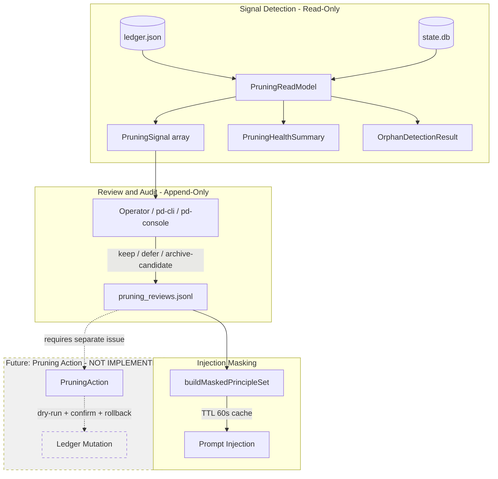

# Pruning Pipeline

> **Status**: Active
> **最后更新**: 2026-05-31
> **关联**: `PD_ARCHITECTURE_OVERVIEW.md` §4.5, `DATA_ARCHITECTURE.md` §5.5, `INTERNALIZATION_PIPELINE.md` §6, ADR-0012

本文档描述 PD 的修剪（Pruning）流水线：如何检测应被清理的原则、如何记录人工审查决策、以及未来如何执行实际修剪操作。

---

## 1. Purpose

Pruning Pipeline 的职责是**控制 Prompt 上下文压力**，确保活跃原则集合保持在合理规模。具体而言：

- 检测不再产生价值的原则（无痛苦信号、高龄、孤儿引用等）
- 提供结构化的审查与审计机制
- 控制实际修剪操作的安全性边界

**核心约束**：PD 不会自动删除或自动归档原则。所有修剪操作都是人在回路（human-in-the-loop）的。

---

## 2. Canonical Terms

### 2.1 Pruning Signal

由 `PruningReadModel` 产出的**只读信号**，描述单个原则的健康状况。每个 Signal 包含：

| 字段 | 含义 |
|------|------|
| `principleId` | 原则 ID |
| `status` | 当前状态（candidate / active / archived / deprecated / probation） |
| `createdAt` | 原则创建时间（ISO 字符串） |
| `updatedAt` | 原则最后更新时间（ISO 字符串，缺省时回退到 createdAt） |
| `derivedCandidateIds` | `derivedFromPainIds` 的完整拷贝（原始候选 ID 列表） |
| `derivedPainCount` | `derivedFromPainIds` 的长度（派生候选引用数量） |
| `matchedCandidateCount` | 在 state.db `principle_candidates` 表中匹配到的候选数量 |
| `recentCandidateCount` | 最近 30 天内创建的 consumed 候选数量 |
| `orphanCandidateCount` | 孤儿候选数量（存在于 derivedFromPainIds 但不在 state.db 中） |
| `ageDays` | 原则创建以来的天数 |
| `riskLevel` | 风险等级（none / watch / review） |
| `reasons` | 风险分级的具体原因列表 |

**风险分级规则**：

| 条件 | riskLevel |
|------|-----------|
| ageDays >= 90 且 derivedPainCount == 0 | `review` |
| ageDays >= 30 且 derivedPainCount == 0 | `watch` |
| 其他 | `none` |

**reasons 附加规则**（`buildReasons` 函数）：

除风险分级外，`reasons` 数组还包含以下附加信号：

| 条件 | reason 前缀 |
|------|------------|
| `status === 'probation'` | `status:` |
| `orphanCandidateCount > 0` | `orphan:` |
| `derivedPainCount > 0 && matchedCandidateCount === 0` | `gap:` |
| `recentCandidateCount > 0 && derivedPainCount === 0` | `stale:` |
| `status === 'deprecated' \|\| status === 'archived'` | `status:` |

### 2.2 Pruning Review

人工审查决策，记录到 append-only JSONL 审计日志。决策类型：

| 决策 | 含义 | 是否修改 Ledger |
|------|------|----------------|
| `keep` | 保留原则，不做任何操作 | 否 |
| `defer` | 推迟决策，下次再审查 | 否 |
| `archive-candidate` | 标记为候选归档，从 Prompt 注入中屏蔽 | 否 |

**重要**：`archive-candidate` 不会修改 Ledger 中的原则状态。它仅将原则 ID 加入 Pruning Mask，在 Prompt 注入时跳过该原则。这是一个**可逆的软操作**，通过 `rollback` 命令即可恢复。

### 2.3 Pruning Action

**未来能力，当前未实现。** 指实际修改 Ledger 中原则状态的操作（如 ``status -> deprecated`` 或 ``status -> archived``）。必须满足：

- 独立 issue 推进
- dry-run 先行
- 人工确认
- 回滚计划

### 2.4 Archive Candidate

当 operator 对某个原则做出 `archive-candidate` 审查决策后，该原则被称为 "Archive Candidate"。此状态**仅存在于 `pruning_reviews.jsonl`** 中，不反映在 Ledger 上。

### 2.5 Orphan Derived Candidate

原则的 `derivedFromPainIds` 中引用的候选 ID 在 `state.db` 的 `principle_candidates` 表中不存在。这通常是因为数据迁移、DB 重建或候选已被清理。当 `state.db` 不可读时，孤儿检测会标记 `dbReadable: false`，此时 `--confirm` 操作会被拒绝。

---

## 3. Pipeline Overview



**数据流说明**：

1. **Signal Detection**：`PruningReadModel` 读取 Ledger 和 state.db，产出信号。纯只读，无副作用。
2. **Review and Audit**：Operator 查看信号后做出审查决策，写入 append-only JSONL。
3. **Injection Masking**：`buildMaskedPrincipleSet` 基于审查日志构建屏蔽集合，在 Prompt 注入时跳过被标记的原则。
4. **Pruning Action**：实际修改 Ledger 的操作。**未实现**，需要独立 issue 推进。

---

## 4. Current Implementation

### 4.1 Core 模块（`@principles/core/runtime-v2/`）

| 文件 | 职责 | I/O |
|------|------|-----|
| `pruning-read-model.ts` | 信号检测、健康摘要、孤儿检测 | 只读：`.state/principle_training_state.json` + `.pd/state.db` |
| `pruning-review-log.ts` | 审查决策的 append-only JSONL 日志 | 写入：`.state/pruning_reviews.jsonl` |
| `pruning-mask.ts` | 基于审查日志构建屏蔽集合 + TTL 缓存 | 读：pruning_reviews.jsonl |
| `l1-hard-cap.ts` | L1 活跃原则数硬上限（默认 12）+ LRU 淘汰计算 | 纯计算，无 I/O |

### 4.2 CLI 命令（`@principles/pd-cli`）

| 命令 | 职责 | 修改数据 |
|------|------|---------|
| `pd runtime pruning report` | 健康报告（watch/review 信号总览） | 无 |
| `pd runtime pruning explain --principle-id <id>` | 单个原则的详细信号解释 | 无 |
| `pd runtime pruning review --principle-id <id> --decision <decision>` | 记录人工审查决策 | `pruning_reviews.jsonl` |
| `pd runtime pruning rollback --principle-id <id>` | 撤销 archive-candidate 标记 | `pruning_reviews.jsonl` |
| `pd runtime pruning orphans` | 检测并可选清理孤儿引用 | 默认 dry-run；`--confirm` 时修改 ledger.json |

### 4.3 L1 Hard Cap

`l1-hard-cap.ts` 提供容量保护机制：

- **默认上限**：12 个活跃原则（`DEFAULT_L1_HARD_CAP`）
- **最大上限**：不可超过 12（`MAX_L1_HARD_CAP`），配置只能降低不能提高
- **淘汰策略**：LRU（按 `lastTriggeredAt` 排序，淘汰最久未触发的）
- **纯计算**：`enforceL1HardCap()` 返回淘汰候选列表，不直接修改 Ledger

### 4.4 Read Model 与 Health Snapshot

`OperatorHealthReadModel` 集成了 pruning 信号，提供整体健康视图。`pd runtime health snapshot` 命令输出的摘要中包含 pruning 相关字段。

---

## 5. Non-Implemented / Future Capabilities

以下能力**当前未实现**，需要独立 issue 推进：

| 能力 | 描述 | 前置条件 |
|------|------|---------|
| PruningAction | 实际修改 Ledger 原则状态（deprecate / archive） | 需要 ADR 定义安全边界 |
| 自动修剪触发 | 定期自动扫描并建议修剪 | PruningAction 实现后 |
| pd-console Pruning UI | 可视化修剪仪表盘 | PruningAction 实现后 |
| 批量修剪操作 | 一次审查多个原则 | 需要批量确认机制 |
| 修剪历史报告 | 基于 pruning_reviews.jsonl 的趋势分析 | 需要聚合查询 |
| 与 Activation Pipeline 联动 | 修剪后自动调整活跃原则集 | PruningAction 实现后 |
| 修剪策略配置 | 可配置的 watch/review 阈值 | 当前硬编码 30/90 天 |

---

## 6. Data Model and Stores

### 6.1 Pruning Reviews JSONL

**路径**：`{workspace}/.state/pruning_reviews.jsonl`

每行一条 JSON 记录，格式：

```json
{
  "reviewId": "uuid-v4",
  "principleId": "P_001",
  "decision": "archive-candidate",
  "note": "Principle no longer relevant after auth refactor",
  "reviewer": "operator",
  "reviewedAt": "2026-05-19T10:30:00.000Z",
  "signalSnapshot": {
    "principleId": "P_001",
    "status": "active",
    "createdAt": "2026-03-01T00:00:00.000Z",
    "updatedAt": "2026-05-01T00:00:00.000Z",
    "derivedCandidateIds": ["C_001"],
    "derivedPainCount": 1,
    "matchedCandidateCount": 1,
    "recentCandidateCount": 0,
    "orphanCandidateCount": 0,
    "ageDays": 79,
    "riskLevel": "watch",
    "reasons": ["watch: principle older than 30 days with no recent derived pain signals [source: createdAt + derivedFromPainIds]"]
  }
}
```

**特性**：
- Append-only：不允许 UPDATE / DELETE
- LWW（Last Write Wins）语义：同一 `principleId` 的多条记录中，只有最新的 `decision` 生效
- `signalSnapshot` 记录审查时的信号状态，确保审计可追溯

### 6.2 Ledger（读取）

`PruningReadModel` 从 Ledger 读取原则条目（路径：`{workspace}/.state/principle_training_state.json`），关键字段：

- `status`：原则当前状态
- `derivedFromPainIds`：派生痛苦 ID 列表（用于交叉验证候选）
- `createdAt` / `updatedAt`：用于计算年龄

### 6.3 state.db（读取）

`PruningReadModel` 从 SQLite 读取 `principle_candidates` 表（路径：`{workspace}/.pd/state.db`），用于：

- 交叉验证 `derivedFromPainIds` 中的候选是否存在
- 获取候选创建时间（用于计算 recent 候选数）

### 6.4 Pruning Mask（内存缓存）

`pruning-mask.ts` 提供 `getCachedMaskedPrincipleSet()`：

- 输入：pruning_reviews.jsonl 中的所有记录
- 输出：`Set<string>` — 应从 Prompt 注入中排除的原则 ID 集合
- 缓存：TTL 60 秒，避免频繁读盘
- 语义：LWW — `archive-candidate` 的原则被屏蔽；`keep` / `defer` 的不被屏蔽

---

## 7. CLI / Operator Workflows

### 7.1 查看修剪健康状态

```bash
# 总览报告
pd runtime pruning report

# 单个原则详细解释
pd runtime pruning explain --principle-id P_001

# JSON 格式输出（供代理解析）
pd runtime pruning report --json
```

### 7.2 审查决策流程

```bash
# 第 1 步：查看 report，找到 watch/review 标记的原则
pd runtime pruning report

# 第 2 步：查看具体原因
pd runtime pruning explain --principle-id P_042

# 第 3 步：做出决策
pd runtime pruning review --principle-id P_042 --decision archive-candidate --note "Replaced by P_089"
pd runtime pruning review --principle-id P_043 --decision keep
pd runtime pruning review --principle-id P_044 --decision defer
```

### 7.3 撤销审查决策

```bash
# 如果 archive-candidate 是误判，可以恢复
pd runtime pruning rollback --principle-id P_042 --note "Restored: false positive"
```

### 7.4 孤儿引用清理

```bash
# 第 1 步：dry-run 检查（默认）
pd runtime pruning orphans

# 第 2 步：确认清理（实际修改 ledger 中的 derivedFromPainIds）
pd runtime pruning orphans --confirm
```

**注意**：orphans `--confirm` 是唯一一个直接修改 Ledger 的 pruning 命令。它仅删除 `derivedFromPainIds` 中引用不存在的候选 ID，不修改原则状态。如果 state.db 不可读，`--confirm` 会被拒绝。

### 7.5 Future 命令（未实现）

```bash
# 以下命令不存在，仅为未来设计参考
# pd runtime pruning action --principle-id P_042 --dry-run     # Future
# pd runtime pruning action --principle-id P_042 --confirm     # Future
# pd runtime pruning batch-review --file decisions.json        # Future
```

---

## 8. Safety Guardrails

### 8.1 Read-Only Guarantee

`PruningReadModel` 的代码中明确声明：

> Non-goals: No automatic pruning or demotion. No ledger writes. No state changes. No background workers.

所有信号检测方法（`getPrincipleSignals`、`getHealthSummary`、`getOrphanDerivedCandidates`）均为纯只读。

### 8.2 Append-Only Audit

`PruningReviewLog` 是 append-only 的 JSONL 文件。审查决策不会覆盖或删除历史记录。LWW 语义在读取时通过 `buildMaskedPrincipleSet` 计算，不在写入时覆盖。

### 8.3 Archive-Candidate Is Not Mutation

`archive-candidate` 决策的效果**仅限于 Prompt 注入屏蔽**：

1. `buildMaskedPrincipleSet` 将该原则 ID 加入屏蔽集合
2. Prompt 注入时跳过该原则
3. Ledger 中原则的 `status` 不变
4. 通过 `rollback` 命令可立即恢复（追加一条 `keep` 决策）

### 8.4 Orphan Cleanup Guards

`pd runtime pruning orphans --confirm` 的安全保护：

- **默认 dry-run**：不加 `--confirm` 时只显示不修改
- **DB 不可读时拒绝**：`state.db` 不可读时 `--confirm` 被拒绝，防止误删有效引用
- **不可变副本**：修改前深拷贝 Ledger（``JSON.parse(JSON.stringify(ledger))``）
- **原子写入**：通过 `saveLedger` 使用 `atomicWriteFileSync`

### 8.5 Future PruningAction Requirements

实际修改 Ledger 的 PruningAction（未实现）必须满足：

| 要求 | 描述 |
|------|------|
| dry-run 先行 | 必须先展示将要修改的内容 |
| 人工确认 | 必须通过 `--confirm` 或 pd-console 审批 |
| 回滚计划 | 必须提供回滚命令或步骤 |
| 审计追踪 | 必须记录操作者、时间、原因 |
| 无自动执行 | 不允许定时任务或后台 worker 自动触发 |

---

## 9. Relationship to Other Pipelines

### 9.1 Internalization Pipeline

Pruning 和 Internalization 是互补的：

- **Internalization** 负责从痛苦信号产生新原则（增长方向）
- **Pruning** 负责识别和清理不再有效原则（缩减方向）
- 两者通过 **Ledger** 共享数据，但操作方向相反
- Pruning 的 `PruningReadModel` 读取 Internalization 产生的 `principle_candidates` 表来计算信号

### 9.2 Principle Ledger

Pruning 依赖 Ledger 作为主要数据源：

- 读取原则的 `status`、`derivedFromPainIds`、`createdAt`
- `archive-candidate` 审查决策不修改 Ledger（仅写入 pruning_reviews.jsonl）
- Orphan cleanup 是唯一修改 Ledger 的操作（清理 `derivedFromPainIds` 中的无效引用）

### 9.3 Activation Pipeline / Approval Queue

当前 Pruning Pipeline 与 Activation Pipeline 之间无直接交互。未来 PruningAction 实现时，可能需要：

- 修剪后触发 ActivationDispatcher 重新评估活跃原则集
- 高风险修剪操作通过 ApprovalQueue 审批

### 9.4 L1 Hard Cap

`l1-hard-cap.ts` 提供容量保护，与 Pruning 协同工作：

- L1 Hard Cap 限制活跃原则数量（默认 12）
- 当活跃原则超过上限时，计算 LRU 淘汰候选
- 淘汰计算本身不修改 Ledger，由调用方决定如何处理
- Pruning 的 watch/review 信号可以帮助 operator 决定哪些原则应优先淘汰

### 9.5 GoldenTrace / L2

Pruning Pipeline 与 GoldenTrace（L2 replay 验证）目前无直接关系。未来可能利用 GoldenTrace 验证修剪后系统的行为一致性。

---

## 10. Open Questions

| # | 问题 | 状态 |
|---|------|------|
| 1 | PruningAction 是否需要独立 ADR？ | Open — 建议实现前创建 ADR |
| 2 | watch/review 阈值（30/90 天）是否应可配置？ | Open — 当前硬编码在 `PruningReadModel` 构造函数中 |
| 3 | Pruning Mask 的 TTL（60s）是否合适？ | Open — 当前为模块级缓存，可能需要按 workspace 隔离 |
| 4 | 孤儿清理是否应自动触发？ | Open — 当前需手动运行 CLI |
| 5 | PruningAction 的 Ledger mutation 是否应通过 Activation Pipeline？ | Open — 与 ADR-0006 的关系待明确 |
| 6 | 是否需要 pruning 的定期自动报告（如每日摘要）？ | Open — 当前完全按需查询 |
| 7 | MAX_L1_HARD_CAP 为何与 DEFAULT_L1_HARD_CAP 相同（12）？ | Design — 防止配置超过测试验证的上限 |
