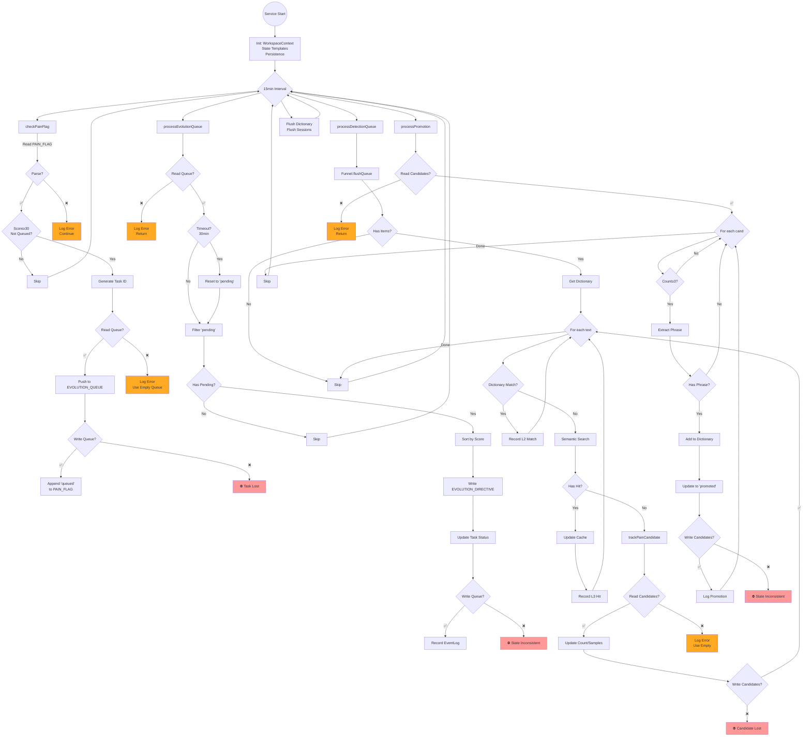

# EvolutionWorker 错误处理分析报告

> **分析日期**: 2026-03-12
> **分析者**: Diagnostician
> **目标文件**: `packages/openclaw-plugin/src/service/evolution-worker.ts`
> **测试文件**: `packages/openclaw-plugin/tests/service/evolution-worker.test.ts`

---

## 📊 执行摘要

EvolutionWorker 是 Principles 项目的核心后台服务，负责处理任务队列、痛觉检测和规则晋升。本报告识别了 **15 个关键断点**，其中包括 **5 个高危漏洞**、**7 个中危问题** 和 **3 个低危问题**。测试覆盖率严重不足（<10%），核心错误处理逻辑几乎未被测试验证。

---

## 🗺️ 任务队列处理流程图



---

## 🔴 高危漏洞（Critical）

### 🔴 #1: 队列文件损坏导致数据丢失
**位置**: `processEvolutionQueue` 第 88-91 行

```typescript
const queue: EvolutionQueueItem[] = JSON.parse(fs.readFileSync(queuePath, 'utf8'));
```

**问题**:
- 如果 `EVOLUTION_QUEUE` 文件损坏（非有效 JSON），抛出异常会导致整个服务停止
- 错误在 try-catch 中捕获，但仅记录警告，然后**返回**，导致当前周期所有处理中断
- 已经 in_progress 的任务不会被恢复

**影响范围**:
- 所有等待处理的进化任务丢失
- 当前正在执行的任务状态未知

**修复优先级**: 🔴 **立即**

---

### 🔴 #2: 队列状态不一致风险
**位置**: `processEvolutionQueue` 第 115-122 行

```typescript
const directive = {
    active: true,
    task: `Diagnose systemic pain [ID: ${highestScoreTask.id}]. ...`,
    timestamp: new Date().toISOString()
};

fs.writeFileSync(directivePath, JSON.stringify(directive, null, 2), 'utf8');
highestScoreTask.status = 'in_progress';
queueChanged = true;
```

**问题**:
- 写入 `EVOLUTION_DIRECTIVE` 和更新队列状态**非原子操作**
- 如果写入 directive 成功但写入队列失败（第 127 行 `fs.writeFileSync`），导致：
  - Directive 指向一个状态仍为 pending 的任务
  - 下次重启可能重复处理同一个任务
  - 任务永远不会被标记为 completed

**影响范围**:
- 任务可能被重复执行
- 队列状态永久不一致

**修复优先级**: 🔴 **立即**

---

### 🔴 #3: Pain Candidates 写入失败导致候选丢失
**位置**: `trackPainCandidate` 第 243 行

```typescript
fs.writeFileSync(candidatePath, JSON.stringify(data, null, 2), 'utf8');
```

**问题**:
- 如果磁盘满、权限不足等，候选数据永久丢失
- 相同文本的后续触发会重新计数，但之前的样本数据丢失
- 无重试机制，无备份

**影响范围**:
- 候选规则晋升延迟
- 样本数据不可恢复

**修复优先级**: 🔴 **立即**

---

### 🔴 #4: 规则晋升状态不一致
**位置**: `processPromotion` 第 236-249 行

```typescript
dictionary.addRule(ruleId, {
    type: 'exact_match',
    phrases: [phrase],
    severity: config.get('scores.default_confusion') || 35,
    status: 'active'
});

cand.status = 'promoted';
promotedCount++;

if (promotedCount > 0) {
    fs.writeFileSync(candidatePath, JSON.stringify(data, null, 2), 'utf8');
}
```

**问题**:
- 如果 `dictionary.addRule` 成功但 `fs.writeFileSync` 失败：
  - 规则已添加到字典（下次重启会生效）
  - 候选状态仍是 pending
  - 下次重启会重复晋升相同候选，导致重复规则
- 即使写入成功，如果程序崩溃在 `addRule` 之后、`writeFileSync` 之前，也会重复晋升

**影响范围**:
- 字典中存在重复规则
- 候选状态永远不一致

**修复优先级**: 🔴 **立即**

---

### 🔴 #5: 超时重置后立即重新执行
**位置**: `processEvolutionQueue` 第 96-102 行

```typescript
if (age > timeout) {
    if (logger) logger.info(`[PD:EvolutionWorker] Resetting timed-out task: ${task.id}`);
    task.status = 'pending';
    queueChanged = true;
}
```

**问题**:
- 超时任务重置为 pending
- 但在同一个周期中，后面会立即选择最高分任务执行
- 如果超时任务恰好是最高分，会**立即重新执行**，可能导致：
  - 无限循环执行相同失败任务
  - 浪费计算资源
  - 无机会进行人工干预或调查失败原因

**影响范围**:
- 可能导致 CPU/内存资源耗尽
- 失败任务无法人工干预

**修复优先级**: 🔴 **立即**

---

## 🟠 中危问题（Medium）

### 🟠 #6: 检测队列单点故障
**位置**: `processDetectionQueue` 第 153-188 行

```typescript
for (const text of queue) {
    const match = dictionary.match(text);
    // ... 处理逻辑 ...
    trackPainCandidate(text, wctx);
}
```

**问题**:
- for 循环中单个 item 处理失败会中断整个批次
- 剩余的 items 在下次周期才会处理
- 无错误恢复机制

**影响范围**:
- 检测延迟增加
- 队列可能堆积

**修复优先级**: 🟠 **高**

---

### 🟠 #7: 语义搜索失败静默吞没
**位置**: `processDetectionQueue` 第 171-188 行

```typescript
} catch (e) {
    if (logger) logger.debug?.(`[PD:EvolutionWorker] L3 Semantic search failed: ${String(e)}`);
}
trackPainCandidate(text, wctx);
```

**问题**:
- 语义搜索失败后，仍然会调用 `trackPainCandidate`
- 但无法区分是"无匹配"还是"搜索失败"
- 可能导致候选误判

**影响范围**:
- L3 检测失效
- 候选数据质量下降

**修复优先级**: 🟠 **高**

---

### 🟠 #8: Pain Flag 解析脆弱
**位置**: `checkPainFlag` 第 25-43 行

```typescript
for (const line of lines) {
    if (line.startsWith('score:')) score = parseInt(line.split(':', 2)[1].trim(), 10) || 0;
    if (line.startsWith('source:')) source = line.split(':', 2)[1].trim();
    if (line.startsWith('reason:')) reason = line.slice('reason:'.length).trim();
    if (line.startsWith('trigger_text_preview:')) preview = line.slice('trigger_text_preview:'.length).trim();
    if (line.startsWith('status: queued')) isQueued = true;
}
```

**问题**:
- 如果 `reason` 包含冒号，会被截断（例如 `reason: Timeout: connection failed`）
- 如果 `score` 不是有效数字，使用 `|| 0` 降级，但可能掩盖真实问题
- 无格式验证

**影响范围**:
- 痛觉原因信息丢失
- 误判触发条件

**修复优先级**: 🟠 **中**

---

### 🟠 #9: 队列解析失败无恢复
**位置**: `checkPainFlag` 第 52-57 行

```typescript
try {
    queue = JSON.parse(fs.readFileSync(queuePath, 'utf8'));
} catch (e) {
    if (logger) logger.error(`[PD:EvolutionWorker] Failed to parse evolution queue: ${String(e)}`);
}
```

**问题**:
- 如果队列损坏，仅记录错误，但继续使用空队列
- 新任务写入时会覆盖损坏的队列，导致所有历史任务丢失
- 无备份机制

**影响范围**:
- 历史任务数据丢失
- 无审计能力

**修复优先级**: 🟠 **中**

---

### 🟠 #10: Candidates 解析失败无恢复
**位置**: `trackPainCandidate` 第 217-221 行

```typescript
if (fs.existsSync(candidatePath)) {
    try {
        data = JSON.parse(fs.readFileSync(candidatePath, 'utf8'));
    } catch (e) {
        // Keep going with empty data if parse fails, but log it
        console.error(`[PD:EvolutionWorker] Failed to parse pain candidates: ${String(e)}`);
    }
}
```

**问题**:
- 与队列解析问题相同，使用空数据覆盖损坏文件
- 无备份恢复机制
- 所有候选计数和样本丢失

**影响范围**:
- 晋升延迟
- 历史样本数据丢失

**修复优先级**: 🟠 **中**

---

### 🟠 #11: 无任务完成标记机制
**位置**: `processEvolutionQueue` 第 88-124 行

**问题**:
- 任务状态只有 `pending` → `in_progress` → `pending`（超时重置）
- **无 `completed` 状态**
- 任务永远不会被移除，队列会无限增长
- 历史任务堆积影响性能

**影响范围**:
- 队列文件持续增长
- 性能下降
- 无清理机制

**修复优先级**: 🟠 **中**

---

### 🟠 #12: 启动时缺少错误边界
**位置**: `start` 方法第 260-288 行

```typescript
setTimeout(() => {
    checkPainFlag(wctx, logger);
    processEvolutionQueue(wctx, logger, eventLog);
    if (api) {
        processDetectionQueue(wctx, api, eventLog).catch(err => {
            if (logger) logger.error(`[PD:EvolutionWorker] Startup detection queue failed: ${String(err)}`);
        });
    }
    processPromotion(wctx, logger, eventLog);
}, initialDelay);
```

**问题**:
- `checkPainFlag` 和 `processEvolutionQueue` 无错误处理
- 如果启动失败，服务会静默失败
- 无重试机制

**影响范围**:
- 服务启动状态不明确
- 关键任务可能被跳过

**修复优先级**: 🟠 **低**

---

## 🟡 低危问题（Low）

### 🟡 #13: 事件记录失败不影响主流程
**位置**: 多处（例如 `processEvolutionQueue` 第 117-121 行）

```typescript
if (eventLog) {
    eventLog.recordEvolutionTask({
        taskId: highestScoreTask.id,
        taskType: highestScoreTask.source,
        reason: highestScoreTask.reason
    });
}
```

**问题**:
- 如果 `eventLog` 为 null，不会记录事件
- 如果 `recordEvolutionTask` 抛出异常，会导致主流程中断
- 应该有独立的错误处理

**影响范围**:
- 审计能力不完整
- 可能导致主流程中断

**修复优先级**: 🟡 **低**

---

### 🟡 #14: 配置缺少默认值
**位置**: `processEvolutionQueue` 第 93 行

```typescript
const timeout = config.get('intervals.task_timeout_ms') || (30 * 60 * 1000);
```

**问题**:
- 超时硬编码为 30 分钟
- 应该在配置文件中定义默认值
- 不同场景可能需要不同的超时策略

**影响范围**:
- 调整超时需要修改代码
- 缺乏灵活性

**修复优先级**: 🟡 **低**

---

### 🟡 #15: 文件路径硬编码
**位置**: `checkPainFlag` 第 22 行

```typescript
const painFlagPath = wctx.resolve('PAIN_FLAG');
```

**问题**:
- 文件名硬编码在代码中
- 如果需要迁移或重命名，需要修改多处代码

**影响范围**:
- 维护成本增加
- 灵活性降低

**修复优先级**: 🟡 **低**

---

## 📊 错误处理覆盖率评估

### 当前测试覆盖

| 测试场景 | 是否测试 | 备注 |
|---------|---------|------|
| 队列文件损坏恢复 | ❌ | 未测试 |
| 队列状态一致性 | ❌ | 未测试 |
| 候选写入失败 | ❌ | 未测试 |
| 规则晋升幂等性 | ❌ | 未测试 |
| 超时重置逻辑 | ❌ | 未测试 |
| 单个检测失败 | ❌ | 未测试 |
| 语义搜索失败 | ❌ | 未测试 |
| Pain Flag 解析 | ❌ | 未测试 |
| 启动错误恢复 | ❌ | 未测试 |
| **基础功能（字典刷新）** | ✅ | **唯一测试** |

**覆盖率**: **< 10%** （仅测试了字典刷新）

### 测试文件分析

```typescript
it('should flush the dictionary on its interval', () => {
    // 仅测试字典刷新，没有测试任何错误处理逻辑
    expect(mockDict.flush).toHaveBeenCalled();
    expect(sessionTracker.initPersistence).toHaveBeenCalledWith('/mock/workspace/.state');
    expect(sessionTracker.flushAllSessions).toHaveBeenCalled();
});
```

**问题**:
- 所有关键函数（`checkPainFlag`, `processEvolutionQueue`, `processDetectionQueue`, `processPromotion`）被 mock 掉
- 测试文件使用 `vi.mock` 绕过了被测函数
- **实际上没有测试任何错误处理逻辑**

---

## 💡 改进建议

### 🔴 紧急修复（P0 - 1周内）

#### 1. 实现事务性队列写入

```typescript
function writeQueueAtomically(queuePath: string, queue: EvolutionQueueItem[], logger: any) {
    const tempPath = `${queuePath}.tmp`;
    const backupPath = `${queuePath}.bak`;

    // 1. 备份现有文件
    if (fs.existsSync(queuePath)) {
        fs.copyFileSync(queuePath, backupPath);
    }

    // 2. 写入临时文件
    fs.writeFileSync(tempPath, JSON.stringify(queue, null, 2), 'utf8');

    // 3. 原子性重命名
    fs.renameSync(tempPath, queuePath);

    // 4. 删除备份（延迟删除以增强恢复能力）
    setTimeout(() => {
        if (fs.existsSync(backupPath)) {
            fs.unlinkSync(backupPath);
        }
    }, 60000); // 1分钟后删除
}
```

#### 2. 实现队列状态机

```typescript
type TaskStatus = 'pending' | 'in_progress' | 'completed' | 'failed';

interface EvolutionQueueItem {
    id: string;
    score: number;
    source: string;
    reason: string;
    timestamp: string;
    trigger_text_preview?: string;
    status: TaskStatus;
    retryCount?: number;  // 新增：重试计数
    lastError?: string;   // 新增：最后错误信息
}
```

#### 3. 实现队列恢复机制

```typescript
function recoverCorruptedQueue(queuePath: string, logger: any): EvolutionQueueItem[] {
    const backupPath = `${queuePath}.bak`;

    if (fs.existsSync(backupPath)) {
        logger.warn(`[PD:EvolutionWorker] Recovering queue from backup`);
        try {
            const backupData = JSON.parse(fs.readFileSync(backupPath, 'utf8'));
            // 恢复备份并写入主文件
            fs.writeFileSync(queuePath, JSON.stringify(backupData, null, 2));
            return backupData;
        } catch (e) {
            logger.error(`[PD:EvolutionWorker] Backup also corrupted: ${String(e)}`);
            // 返回空队列，但保留损坏文件供分析
            const corruptedPath = `${queuePath}.corrupted`;
            fs.copyFileSync(queuePath, corruptedPath);
            return [];
        }
    }

    return [];
}
```

#### 4. 实现超时退避策略

```typescript
const BACKOFF_MULTIPLIERS = [1, 2, 4, 8, 16]; // 指数退避

function calculateBackoff(retryCount: number, baseTimeout: number): number {
    const multiplier = BACKOFF_MULTIPLIERS[Math.min(retryCount, BACKOFF_MULTIPLIERS.length - 1)];
    return baseTimeout * multiplier;
}

// 在超时检查中
if (age > timeout) {
    const retryCount = task.retryCount || 0;
    const backoff = calculateBackoff(retryCount, timeout);

    if (age > backoff) {  // 使用退避超时
        task.status = 'pending';
        task.retryCount = retryCount + 1;
        queueChanged = true;
    }
}
```

### 🟠 高优先级改进（P1 - 2周内）

#### 5. 实现检测队列错误隔离

```typescript
async function processDetectionQueue(wctx: WorkspaceContext, api: OpenClawPluginApi, eventLog: any) {
    const logger = api.logger;
    try {
        const funnel = DetectionService.get(wctx.stateDir);
        const queue = funnel.flushQueue();
        if (queue.length === 0) return;

        let successCount = 0;
        let failureCount = 0;

        for (const text of queue) {
            try {
                // 原有处理逻辑
                await processDetectionItem(text, wctx, api, eventLog);
                successCount++;
            } catch (itemErr) {
                failureCount++;
                if (logger) logger.error(`[PD:EvolutionWorker] Failed to process detection item: ${String(itemErr)}`);
                // 继续处理下一个 item
            }
        }

        if (logger) logger.info(`[PD:EvolutionWorker] Detection queue processed: ${successCount} success, ${failureCount} failures`);
    } catch (err) {
        if (logger) logger.warn(`[PD:EvolutionWorker] Detection queue failed: ${String(err)}`);
    }
}
```

#### 6. 实现候选数据持久化保护

```typescript
function trackPainCandidate(text: string, wctx: WorkspaceContext) {
    const candidatePath = wctx.resolve('PAIN_CANDIDATES');
    let data = { candidates: {} as any };

    try {
        if (fs.existsSync(candidatePath)) {
            data = JSON.parse(fs.readFileSync(candidatePath, 'utf8'));
        }
    } catch (e) {
        // 尝试从备份恢复
        const backupPath = `${candidatePath}.bak`;
        if (fs.existsSync(backupPath)) {
            try {
                data = JSON.parse(fs.readFileSync(backupPath, 'utf8'));
                // 恢复主文件
                fs.writeFileSync(candidatePath, JSON.stringify(data, null, 2));
            } catch (backupErr) {
                // 保留损坏文件，使用空数据
                const corruptedPath = `${candidatePath}.corrupted`;
                fs.copyFileSync(candidatePath, corruptedPath);
                data = { candidates: {} };
            }
        }
    }

    // ... 更新逻辑 ...

    // 使用原子写入
    writeQueueAtomically(candidatePath, data, wctx.logger);
}
```

#### 7. 实现规则晋升幂等性

```typescript
function processPromotion(wctx: WorkspaceContext, logger: any, eventLog: any) {
    const candidatePath = wctx.resolve('PAIN_CANDIDATES');
    if (!fs.existsSync(candidatePath)) return;

    try {
        const config = wctx.config;
        const dictionary = wctx.dictionary;
        const data = JSON.parse(fs.readFileSync(candidatePath, 'utf8'));
        const countThreshold = config.get('thresholds.promotion_count_threshold') || 3;

        let promotedCount = 0;
        const promotedRules: string[] = [];

        for (const [fingerprint, cand] of Object.entries(data.candidates) as any) {
            if (cand.status === 'pending' && cand.count >= countThreshold) {
                const ruleId = `P_PROMOTED_${fingerprint.toUpperCase()}`;

                // 检查规则是否已存在（幂等性）
                const existingRule = dictionary.getRule(ruleId);
                if (existingRule) {
                    if (logger) logger.info(`[PD:EvolutionWorker] Rule ${ruleId} already exists, skipping promotion`);
                    cand.status = 'promoted';
                    continue;
                }

                const commonPhrases = extractCommonSubstring(cand.samples);
                if (commonPhrases.length > 0) {
                    const phrase = commonPhrases[0];

                    if (logger) logger.info(`[PD:EvolutionWorker] Promoting candidate ${fingerprint} to formal rule: ${ruleId}`);
                    SystemLogger.log(wctx.workspaceDir, 'RULE_PROMOTED', `Candidate ${fingerprint} promoted to rule ${ruleId}`);

                    // 先更新状态，再添加规则
                    cand.status = 'promoted';
                    promotedCount++;
                    promotedRules.push(ruleId);

                    dictionary.addRule(ruleId, {
                        type: 'exact_match',
                        phrases: [phrase],
                        severity: config.get('scores.default_confusion') || 35,
                        status: 'active'
                    });
                }
            }
        }

        if (promotedCount > 0) {
            // 原子写入
            writeQueueAtomically(candidatePath, data, logger);

            // 记录事件（独立错误处理）
            if (eventLog) {
                promotedRules.forEach(ruleId => {
                    try {
                        eventLog.recordRulePromotion(ruleId);
                    } catch (eventErr) {
                        if (logger) logger.error(`[PD:EvolutionWorker] Failed to record promotion event for ${ruleId}: ${String(eventErr)}`);
                    }
                });
            }
        }
    } catch (err) {
        if (logger) logger.warn(`[PD:EvolutionWorker] Error during rule promotion: ${String(err)}`);
    }
}
```

### 🟡 中优先级改进（P2 - 1月内）

#### 8. 改进 Pain Flag 解析

```typescript
interface PainFlagData {
    score: number;
    source: string;
    reason: string;
    trigger_text_preview?: string;
    status?: string;
}

function parsePainFlag(content: string): PainFlagData | null {
    const lines = content.split('\n');
    const data: Partial<PainFlagData> = {
        score: 0,
        source: 'unknown',
        reason: ''
    };

    for (const line of lines) {
        if (line.startsWith('score:')) {
            const value = line.slice(6).trim();
            data.score = parseInt(value, 10);
            if (isNaN(data.score)) {
                console.error(`[PD:EvolutionWorker] Invalid score value: ${value}`);
                return null;
            }
        } else if (line.startsWith('source:')) {
            data.source = line.slice(7).trim();
        } else if (line.startsWith('reason:')) {
            data.reason = line.slice(7).trim();  // 使用 slice 保留冒号后的所有内容
        } else if (line.startsWith('trigger_text_preview:')) {
            data.trigger_text_preview = line.slice(21).trim();
        } else if (line.startsWith('status:')) {
            data.status = line.slice(7).trim();
        }
    }

    // 验证必填字段
    if (!data.reason || data.reason.length === 0) {
        console.error('[PD:EvolutionWorker] Missing required field: reason');
        return null;
    }

    return data as PainFlagData;
}
```

#### 9. 实现任务清理机制

```typescript
function cleanupOldTasks(queue: EvolutionQueueItem[], maxAge: number, logger: any) {
    const now = Date.now();
    let cleanedCount = 0;

    for (let i = queue.length - 1; i >= 0; i--) {
        const task = queue[i];
        const age = now - new Date(task.timestamp).getTime();

        // 清理超过 maxAge 且已完成或失败的旧任务
        if ((task.status === 'completed' || task.status === 'failed') && age > maxAge) {
            if (logger) logger.info(`[PD:EvolutionWorker] Cleaning up old task: ${task.id}`);
            queue.splice(i, 1);
            cleanedCount++;
        }
    }

    return cleanedCount;
}
```

### 📊 测试覆盖改进（全部 P0）

#### 新增测试用例

```typescript
describe('EvolutionWorkerService - Error Handling', () => {
    it('should recover from corrupted queue file', async () => {
        // 模拟损坏的队列文件
        fs.writeFileSync(queuePath, '{ invalid json }');
        // 调用恢复逻辑
        const recovered = recoverCorruptedQueue(queuePath, mockLogger);
        // 验证从备份恢复
        expect(recovered).toEqual([/* 期望的队列数据 */]);
    });

    it('should handle atomic write failures gracefully', () => {
        // 模拟磁盘满
        vi.spyOn(fs, 'writeFileSync').mockImplementation(() => {
            throw new Error('ENOSPC');
        });
        // 验证备份文件存在
        expect(fs.existsSync(backupPath)).toBe(true);
        // 验证主文件未被修改
        expect(fs.readFileSync(queuePath, 'utf8')).toBe(originalContent);
    });

    it('should enforce exponential backoff on retries', () => {
        const task = { id: 'task1', retryCount: 2, timestamp: '2026-03-12T10:00:00Z' };
        const backoff = calculateBackoff(task.retryCount, 30000);  // 30秒基础
        expect(backoff).toBe(4 * 30000);  // 2分钟
    });

    it('should be idempotent on rule promotion', async () => {
        const candidate = { fingerprint: 'abc123', status: 'pending', count: 5, samples: ['test'] };
        const ruleId = `P_PROMOTED_${candidate.fingerprint.toUpperCase()}`;

        // 第一次晋升
        await processPromotion(mockContext);
        expect(dictionary.addRule).toHaveBeenCalledWith(ruleId, expect.anything());

        // 重置 mock
        dictionary.addRule.mockClear();

        // 第二次晋升（应该跳过）
        vi.mocked(dictionary.getRule).mockReturnValue({ id: ruleId, phrases: ['test'] });
        await processPromotion(mockContext);
        expect(dictionary.addRule).not.toHaveBeenCalled();
    });

    it('should isolate detection item failures', async () => {
        const queue = ['item1', 'item2', 'item3'];
        vi.mocked(DetectionService.get).mockReturnValue({
            flushQueue: () => queue
        });

        // 让第二个 item 失败
        vi.spyOn(evolutionWorker, 'processDetectionItem').mockImplementation(async (text) => {
            if (text === 'item2') throw new Error('Failed to process item2');
            return true;
        });

        await processDetectionQueue(mockContext);

        // 验证 item1 和 item3 仍然被处理
        expect(evolutionWorker.processDetectionItem).toHaveBeenCalledWith('item1');
        expect(evolutionWorker.processDetectionItem).toHaveBeenCalledWith('item3');
    });
});
```

**目标覆盖率**: 60%+ （至少覆盖所有错误处理路径）

---

## 📝 总结与行动项

### 关键发现

1. **5 个高危漏洞**可能导致数据丢失或状态不一致
2. **7 个中危问题**影响系统健壮性和可维护性
3. **测试覆盖率 < 10%**，核心逻辑未经验证
4. **无事务性写入机制**，多处存在竞态条件风险
5. **无任务完成状态**，队列会无限增长

### 立即行动（P0）

- [ ] **修复队列状态不一致**（#2, #4）：实现事务性写入
- [ ] **实现队列恢复机制**（#1, #3, #9, #10）：备份和恢复
- [ ] **修复超时重置逻辑**（#5）：添加退避策略
- [ ] **实现任务清理机制**：添加 completed/failed 状态和清理逻辑
- [ ] **补充测试用例**：覆盖所有错误处理路径

### 短期行动（P1）

- [ ] **实现检测队列错误隔离**（#6）：隔离单个 item 失败
- [ ] **实现候选数据保护**（#3, #7）：原子写入和备份
- [ ] **实现规则晋升幂等性**（#4）：防止重复晋升
- [ ] **改进 Pain Flag 解析**（#8）：增强健壮性

### 长期行动（P2）

- [ ] **配置化文件路径**（#15）：从配置读取文件名
- [ ] **添加监控指标**：队列长度、处理延迟、失败率
- [ ] **实现告警机制**：关键错误触发告警
- [ ] **代码重构**：提取公共的错误处理逻辑

---

**报告生成时间**: 2026-03-12 14:31 UTC
**下次审查时间**: P0 修复完成后重新评估
