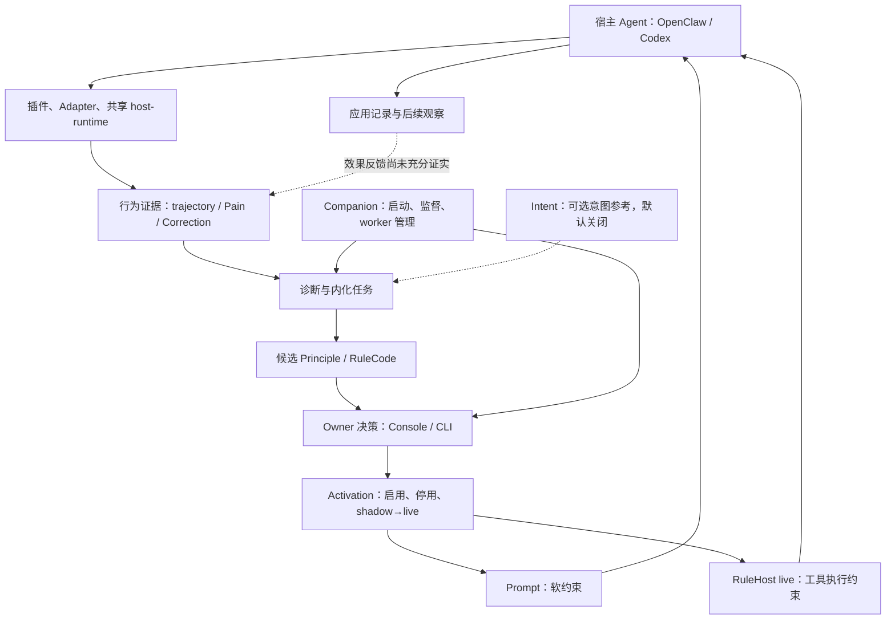

# PD 系统级架构审计报告 v2

**审计日期：** 2026-09-30
**审计基线：** `2fb6439f`
**报告集成分支起点：** `d76bc1dc`（2026-10-01 主分支）

本报告评估 Principles Disciple 是否在形成长期可演化的 AI Agent Governance System，找出最大的结构风险，并给出有限资源下一年的取舍。结论以审计基线的实现为准，区分代码事实、样本观察、推断和 UNKNOWN。

## Executive Summary

PD 正处在**治理机制已经建立、持续用户价值尚未证实**的阶段。Owner 审核、可逆激活与宿主执行有真实实现；从原则曝光到可重复行为改善的反馈仍不足。

| 判断 | 结论 |
|---|---|
| 架构方向是否成立 | 有条件成立。Owner 审核、可逆激活、跨会话治理有合理价值。 |
| 是否已经形成长期可演化系统 | 部分形成。生命周期与控制路径存在；效果反馈不够完整。 |
| 最大风险 | 把原则被生成、批准、注入或执行当作原则有效。 |
| 下一步最高杠杆 | 在少数真实重复问题上，对照 PD 与宿主原生规则的效果及总成本。 |
| 企业治理、数据壁垒 | UNKNOWN，当前证据不足。 |

如果治理机制没有减少重复纠正，Owner 只会从反复纠正 Agent，变成反复审核 Agent 生成的原则，并额外承担一套治理系统的维护成本。

## 1. Current Architecture Model

该图是跨宿主的语义模型，不表示所有宿主使用同一实现。OpenClaw 的共享运行时切换旗标默认关闭，仍保留原路径；共享抽象的存在不能证明生产实现已统一。

| 模块 | 当前职责与限制 |
|---|---|
| Console / CLI | Owner 与操作员入口，调用治理服务；界面不拥有独立决策权。 |
| Companion | 运行外壳与 worker 管理；不批准原则。 |
| Runtime / Core | 诊断、候选、审批、激活与恢复。 |
| Intent | 提供意图参考，不等同 Principle 或授权；当时默认关闭。 |
| Pain / Correction | 待判断的行为证据；不是所有工具失败都值得形成原则。 |
| Principle | 连接行为要求、证据与生命周期的治理对象。 |
| RuleCode / RuleHost | 实现并执行规则；shadow 用于观察，live 才能约束工具。 |
| Evolution Loop | 提案与部署链已存在；部署后的效果是否改善仍待验证。 |

**Stable Boundary：**宿主拥有通用执行能力，PD 拥有 Owner 相关治理事实；LLM 提建议、Owner 作决定；RuleCode 先 shadow，再由 Owner 决定是否 live；停用、隔离与紧急暂停应能独立于 Agent 配合而工作。

**Unstable Boundary：**宿主事件覆盖与语义、治理 workspace 与项目上下文的关系、原则身份和运行时选择的对应关系，以及曝光、即时执行和长期行为改善之间的联系。

审计工作区有未提交改动，正在调整 Codex 共享 workspace 与 `projectDir` 分离。这可能改善资产共享，也可能改变项目隔离语义；不能把它算作已发布保证。

## 2. Top Structural Risks

严重程度描述潜在影响，不等于已经发生事故。

| Risk | Severity | Evidence | Impact | Recommendation |
|---|---|---|---|---|
| 效果闭环不足 | 高 | 应用账本区分 presence/effect；观察材料为单 workspace、单原则，存在关键词筛选与注入策略变化限制 | 无效原则可能保留；无法可靠决定保留或撤回 | 用少数可比场景与 Owner 判断验证改善；不先建设归因平台 |
| 治理信号存在选样偏差 | 高 | 被检查的自动工具 Pain 路径侧重失败写操作并经过筛选；纠正证据贯通有未提交改动 | 学到工具失败，却遗漏 Owner 持续不满的行为模式 | 验证 Owner 纠正、重复行为与工具失败的分流质量 |
| 治理资产的项目作用域未稳定 | 高，条件性 | 当时的复用观察记载 workspace 账本相互不可见；同期实现与工作区另有复用相关改动 | 资产可能分散而重复学习；过度共享又可能错用项目规则 | 先明确身份和作用域，再决定共享方式；不先建设全局库 |
| 可用性和强制治理承诺冲突 | 企业场景高 | RuleHost 故障路径放行；Console 使用本地配置 Owner 模型 | PD 故障时宿主动作仍可执行，多人审计能力未证实 | 明确治理强度；企业强制策略由宿主安全边界承担 |
| 审核与维护成本可能超过收益 | 高，商业影响为推断 | 有多阶段提案、审批、shadow/live 与常驻 worker；用户留存及时间节省 UNKNOWN | 用户可能多出一套教育、审批、排障负担 | 按“减少的纠正时间－审核与运维时间”决定投资 |

当前证据不足以证明多个存储构成第二权威。Principle、审批、Activation 和应用记录可能分别保存不同事实；关键问题是多个写入者是否都能决定同一事实。

Node VM 的超时与执行限制不证明操作系统级安全隔离，也不证明已经存在逃逸漏洞。当前判断是安全承诺边界有限，而非确认漏洞。

## 3. Core Assumption Review

### Assumption 1：Principle 比 Memory 更有价值

作为普遍命题不成立；在特定问题上可能成立。Memory 可以存事实、偏好和行为规则，给文字命名为 Principle 本身不会增加价值。PD 的潜在增量来自治理：证据为何支持规则、由谁批准、适用范围、撤回路径与后续效果。

“该项目使用 pnpm”通常由项目指令或记忆更低成本地解决。对“多次未经核验便报告完成”这类重复行为，有证据、审核和撤回的治理方式更可能有用。

**可证伪条件：**用户用宿主指令达到相同改善且成本更低；该场景下 PD 的增量价值就不足。

### Assumption 2：长期行为数据形成壁垒

目前尚未成立，是待验证潜力。轨迹累积不是训练资产；数据量增长也会带来噪声与隐私成本。更有价值的是经过审阅的重复模式、Owner 决策、准确曝光、适用场景以及后续成功与失败结果。

已检查的观察不足以支持强因果结论：原则恢复与注入策略变化接近同时发生，曝光不均，候选筛选不是独立行为标签。训练资产是否形成：**UNKNOWN**。本次未验证数据授权、标注一致性、迁移性或训练收益。

### Assumption 3：Owner Governance 是独立类别

责任边界可以独立，市场类别与壁垒尚未证实。用户可以把执行交给宿主，同时保留长期行为要求的批准与撤回权。但采集、记忆、钩子和审批已与宿主能力重叠，不能单独视为护城河。

PD 的机会在于跨宿主、可迁移、可审计的长期治理关系。跨宿主持续使用和迁移价值：**UNKNOWN**。用户委托的是执行，行为价值判断仍须属于 Owner。若用户觉得自己还要监督一套监督 Agent 的系统，这项假设就会减弱。

当时可查阅的厂商资料已展示部分重叠：OpenAI Agents SDK 提供人工审批与恢复；Claude Code 提供 hooks 与 memory；语言反思学习也有公开原始研究。因此 PD 应证明治理组合和跨宿主连续性带来的价值，而不能主张这些单项机制独有。[OpenAI 人工审批文档](https://openai.github.io/openai-agents-python/human_in_the_loop/)、[Claude Code Hooks](https://code.claude.com/docs/en/hooks)、[Claude Code Memory](https://code.claude.com/docs/en/memory)、[Reflexion 原始论文](https://arxiv.org/abs/2303.11366)。

## 4. Things PD Should NOT Build

- 通用 Agent 框架、任务编排、工具重试或记忆平台：会重复宿主责任并扩大维护成本。
- 先建训练平台再寻找有效训练数据：GPU 不能解决错误标签与缺失结果。
- 为“完整”而扩展更多 Runner、激活通道或后台服务：现有治理链的收益尚未证实。
- 自动价值判断、自动晋级 live 或自动恢复 live：会侵蚀 Owner 权威。
- 提前建设完整归因、自动淘汰和全局共享资产平台：先验证需求与项目边界。
- 以当前本地控制路径承诺企业强制安全治理：企业身份与不可绕过执行是另一组责任。

这是资源投入建议，不要求删除现有延期代码，也不改变已批准的工程政策。

## 5. Architecture Decisions To Freeze

应冻结语义与权威合同，而非文件布局或具体实现。

| 核心 | 应稳定的合同 |
|---|---|
| Event Model | 来源、事件身份、宿主/项目范围与 lineage 一致；重复投递不得伪装成新学习样本 |
| Principle Schema | 稳定身份与版本关系；标题、产物 ID 和激活 ID 不能替代 Principle 身份 |
| Authority Model | 建议与决定分离；明确定义 Owner 身份、授权范围与紧急停止权限 |
| Activation Contract | 批准对象与生效对象一致；shadow/live、停用和恢复有明确语义 |
| Runtime Contract | 声明宿主支持的阻断、审批、参数修改能力及故障行为 |
| Observation Contract | 区分“出现过”“执行过”“自报遵守”“后来改善” |
| Migration Contract | 历史原则、决策与激活关系可解释、可迁移；投影不成为写权威 |

保护实际消费者依赖的合同。宽导出入口或固定 Runner 数量不应自动成为永久冻结的边界。

## 6. 12 Month Highest-Leverage Plan

**未来一年只验证一个命题：PD 能否以低于手工规则的总成本，减少高代价的重复行为偏差。**

| 时间 | 核心投入 | 决策证据与代价 |
|---|---|---|
| 第 1–3 月 | 选择少数真实重复问题，走完证据→审批→应用→后续场景验证 | 人工判断效果，记录曝光、纠正次数、审核和排障时间；暂停范围扩展 |
| 第 4–6 月 | 与宿主指令或记忆做同类场景对照 | 若改善相同且 PD 更费事，收缩到 PD 有明显增益的场景 |
| 第 7–9 月 | 仅修复评估揭示的连接断点 | 优先身份、作用域、事件覆盖和稳定应用；跨宿主投入须有真实需求 |
| 第 10–12 月 | 决定继续、缩小或转向 | 根据持续使用、可观察改善和净省时判断，而非原则数或流水线成功率 |

RTX4090 只用于有明确问题的离线回放与评估实验。是否需要本地模型，取决于真实成本、隐私和延迟需求；不以“有 GPU”作为训练理由。若用户不愿审核、找不到高代价重复模式、相似场景没有改善，或手工规则持续更便宜，就停止追加投入。

此方案的代价是未来一年可能只证明一个狭窄场景值得做；对一个核心工程师而言，它能回答继续投入是否值得。

## 7. Final Judgment

1. **是否值得继续沿当前方向投入？** 值得限额验证。Owner 权威、审计与可撤回值得保留；系统范围不应同步扩大。
2. **最大成功机会是什么？** 让高频使用 Agent 的人，把昂贵的重复纠正变成可解释、可验证、可撤回的长期行为要求。
3. **最大失败风险是什么？** PD 生成越来越多原则，却不能减少重复纠正，最终变成审核成本高于收益的规则维护系统。
4. **当前最应该改变的一个决策是什么？** 把下一阶段投资门槛从“治理链是否完整”改成“相对宿主原生规则是否更省心、更有效”。

## 审计证据与范围限制

### 主要实现证据

- 激活审批行为：[activation-dispatcher.ts](../../packages/principles-core/src/runtime-v2/activation/activation-dispatcher.ts)。
- Owner live 决策服务：[rule-host-owner-decision-service.ts](../../packages/principles-core/src/runtime-v2/activation/rule-host-owner-decision-service.ts)。
- 旗标默认状态：[feature-flag-contract.ts](../../packages/principles-core/src/runtime-v2/feature-flags/feature-flag-contract.ts)。
- RuleHost 生产门：[production-rulehost-gate.ts](../../packages/host-runtime/src/production-rulehost-gate.ts)。
- Pain 生产入口：[production-pain-evidence.ts](../../packages/host-runtime/src/production-pain-evidence.ts)。
- 应用记录：[principle-application-ledger.ts](../../packages/openclaw-plugin/src/core/principle-application-ledger.ts)。
- 产品边界与成功标准：[PRODUCT_IDENTITY.md](../product/PRODUCT_IDENTITY.md)。
- 单原则 W-del 观察材料：[W-del 观察](PRI-904_PHASE_D_WDEL_OBSERVATION.md)。P 窗观察的本地工作区材料未纳入本 PR；样本限制作为审计线索，不当作可独立复核的仓库证据。本次没有独立重放实验。

### 代理调查与主模型复核

六名 GPT-6 Luna 子代理分别负责 Architecture Auditor、AI Agent Research Auditor、Data Flywheel Auditor、Runtime Governance Auditor、Product Reality Auditor 与 Red Team Reviewer。主模型交叉核验审批门、旗标默认值与文档叙述冲突，并合并相反证据。红队认为，若宿主记忆/指令/钩子以更低成本实现同等改善，PD 价值会消失；最强正面证据是建议审批与 live 决策边界清楚。用户是否愿意持续审批仍 UNKNOWN。

### 基线、限制与版本边界

结论基于 2026-09-30 的 `2fb6439f`。当时工作区含大量未提交改动，尤其 Codex Adapter、host-runtime、Pain 观察路径；这些只作为待验证方向，不当作已交付能力。未检查安装运行时、未运行测试、未访谈客户，也未证明客户留存、企业级多人身份、跨宿主长期价值或因果改善；这些均为 **UNKNOWN**。

主分支随后合入 PRI-917 复用相关提交。本报告是审计日期的快照，不应被当作对 2026-10-01 新主线的完整复审。合并报告时，集成基线为 `d76bc1dc`；仅复核关键 Owner 审批逻辑及旗标默认值仍与报告一致，没有重新评估之后的全部变更。

旧治理运行图对低风险自动激活的描述已过时：当前审计代码把 rollout 建议送入审批，只有经过验证的批准记录才能激活。Receipt ledger 默认开启，自报默认关闭。旗标注册只证明配置默认，不等于所有运行时路径都经过本审计重测。

资源计数器报告累计 432,219 tokens，超过项目 30,000 tokens 的会话预算。计数口径未明确，无法区分有效内容、缓存和子代理消耗；资源控制未达标。
