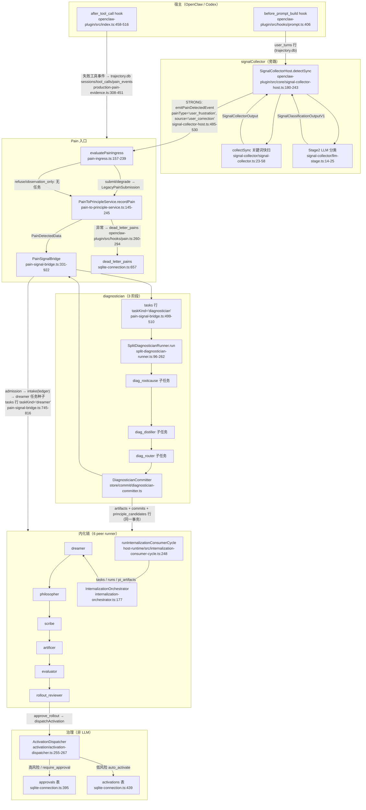

# PD 数据管道内置代理全面审计报告

- 日期：2026-09-15
- 审计对象：`main` @ 70d824c4（PR #1692 合并后）
- 修订轮：**2026-09-15 下午**——本报告经 CNB 云端四轮独立核实（见 §8 与同目录 VERIFICATION-A/B/C/D.md）；核实期间 #1698/#1693/#1694/#1703/#1700 已并入 main，受影响条目的时效已在 §8.3 逐项标注
- 审计方式：只读静态审计（代码事实为准），全部结论带 `文件:行号` 证据；行号对应当日工作树
- 权威代理清单来源：`packages/principles-core/src/runtime-v2/config/pd-config-types.ts:115-126`（`INTERNAL_AGENT_NAMES`）
- 说明：本报告描述**仓库 main 代码的实现真相**；已安装运行时（`~/.pd/runtime/`）若版本落后，行为可能与本报告不一致
- 核实标记：登记表与正文中带 **✅审计长亲验** 的条目，由审计长本人打开源文件复核过关键行号；无标记的为提取代理报告并附证据（可信度：证据链完整但未经二次亲验）；**【推断】**为分析推理而非代码直接可见的事实

## 目录（正文引用 §N 即指对应章节；全文行号相对仓库根）

- §0（本章）审计范围、方法、提示词组装机制
- §1 执行摘要与综合发现登记表（**先看这 1 页**）
- §2 管道编排全景与数据流（mermaid 数据流图 + 11 个入口清单 + 输出 Schema 注册表 + 状态机/持久化表）
- §3 诊断代理三阶段逐代理详情（rootcause/distiller/router，提示词全文）
- §4 dreamer 与 philosopher 逐代理详情（提示词全文）
- §5 内化链后半段四代理详情（evaluator/artificer/scribe/rolloutReviewer，提示词全文）
- §6 观察者 + 治理下游详情（correctionObserver/empathyObserver/signalCollector + approval→activation→shadow→promote→gate）
- §7 已知在途修复 PR 关联与处理优先级建议
- §8 核实轮修订（2026-09-15 下午 · CNB 四轮独立核实）

## 0. 审计范围与方法

十个内置代理（`INTERNAL_AGENT_NAMES`，pd-config-types.ts:115-126）：

| # | 代理名 | 阶段角色 | LLM? |
|---|--------|----------|------|
| 1 | signalCollector | 管道入口：pain 信号采集（关键词+LLM 双阶段） | 部分是（Stage2） |
| 2 | diagnostician | 诊断：拆 3 阶段 rootcause → distiller → router（实际执行顺序，见 §3.0 命名纠偏） | 是 |
| 3 | dreamer | 内化：候选原则生成 | 是 |
| 4 | philosopher | 内化：候选原则规范化/精炼 | 是 |
| 5 | scribe | 内化：原则文本撰写 | 是 |
| 6 | artificer | 内化：RuleCode 代码化（L2 工具循环） | 是 |
| 7 | evaluator | 评估：打分 + rule 工件唯一产出点 | 是 |
| 8 | rolloutReviewer | 上线评审（对评估结论的二次语义表决） | 是 |
| 9 | correctionObserver | 行为观察：修正词库优化（LLM） | 是 |
| 10 | empathyObserver | **死角色**：无生产实例化，检测职责已移交 signalCollector（见 §6 F-E1） | 名义上 |

治理环节（approval → activation → shadow → promote → gate）不是 LLM 代理，但作为管道下游一并覆盖其 I/O 与 Schema（§6 第二部分）。

方法：5 路并行提取（编排全景 / 诊断三件套 / dreamer+philosopher / 内化后半段 / 观察者+治理下游）+ 审计长对全部 P1 级与关键 P2 发现逐条回源复核。每路提取均要求逐字引用提示词与字段级 Schema，并主动搜寻断裂嫌疑。

## 0.1 提示词组装机制（审计长亲自核实）

系统提示词不是单一来源，运行时按层拼接（`packages/principles-core/src/runtime-v2/system-prompt-merge.ts:1-26`）：

1. **基层**：该次运行的 prompt-builder 产出的 `StartRunInput.systemPrompt`（代理角色 + 协议指令）；
2. **工具协议层**：仅 L2 适配器有（静态工具使用说明，`packages/principles-core/src/runtime-v2/adapter/l2-agent-loop-adapter.ts:351`）；
3. **追加层**：运营者在 `.pd/config.yaml` 的 `runtimeProfiles.<id>.systemPrompt`（append-only 语义，DPB-07；`packages/principles-core/src/runtime-v2/adapter/pi-ai-runtime-adapter.ts:585-591`）。

各层以空行连接、字节保留；全空则完全省略 systemPrompt 字段（保持 PRI-633 之前的行为）。

> 审计视角：追加层是运营者可写的自由文本，基层提示词中的输出格式协议可能与追加层指令冲突，且冲突时无任何检测——这是「提示词冲突」的一个结构性风险面（对全部代理生效）。诊断阶段的输出格式示例另有一层：示例由 `schema-prompt-adapter.ts` 从 schema 机械合成，不理解语义约束，是 §3 多处「示例违反自身规则」的同根来源（✅审计长亲验该文件存在于 02 章引用行号附近，具体合成行为以 §3 各嫌疑卡为准）。

## 0.2 一条管道级事实：渐进式披露三层全部默认休眠（✅审计长亲验）

`feature-flags/feature-flag-contract.ts:325-347`：`artifact_summary_redundancy`、`context_manifest_budget`、`progressive_evaluator` 三层（2026-07-26 起，category=quiet，`enabled: false`）控制「摘要信封 → manifest 聚焦注入 → 两阶段评估」的分级上下文机制。当前默认配置下该子系统**整体未运行**；且 §4 F-C1 证明即使打开 flag，manifest 路径也存在结构性死链。结论：这套机制处于「默认关闭 + 打开也不通」的双重休眠状态，属于待 Owner 裁决的去留问题（修复或墓碑化），而非单纯的当下损耗。


---

# §1 执行摘要与综合发现登记表

## 1.1 总体判断（一句话版）

主干编排（状态机、播种漏斗、幂等修订、fail-closed 治理分发）经多轮 PRI 修复后**结构是健康的**；真正的断裂集中在三处：①**提示词与其自身 schema/校验器的自相矛盾**（尤以 artificer 与诊断三阶段为甚），②**跨阶段字段的命名/口径漂移**（血缘字段、枚举、常量平行维护），③**退役残留**（empathyObserver、PendingTermStore、渐进披露三层——类型和 UI 面还在，行为已经或从未存在）。

**后果分级**：管道整体能跑通（EP002 已实证 pain→approved 0.84），但当前 main 上每一次走到 artificer 阶段都有「照自己示例输出必被拒」的确定性失败风险；血缘链在 scribe→artificer 有一处静默断点；Owner 在 Console 里仍能看到并打开一个完全无效的开关。

## 1.2 五个同根缺陷家族（看模式，不是逐条）

| 家族 | 模式 | 典型实例 | 修复面 |
|------|------|----------|--------|
| 家族一：示例机械合成 | 诊断三阶段提示词的 COMPLETE EXAMPLE 由 `schema-prompt-adapter.ts:35-168` 从 schema 机械合成，不理解语义约束 → 示例教 LLM 做被同 prompt 明令禁止/校验必拒的事 | §3 三阶段嫌疑 1 同根；R-18 属同族（prompt 承诺无机器执行） | **集中一处**（合成器语义规则 + 一条回归测试，§3 横切 7 确认该不变量零防护） |
| 家族二：双源口径漂移 | 同一事实两份来源：typebox vs @sinclair 双 schema（R-03）、route 映射双份、6-runner 常量 3-4 处、候选数量 3 处、词库 source 枚举双轨 | R-03/R-14/R-16、§2 F3/F7 | 各立单一权威；无编译期联动的平行清单是持续复发源 |
| 家族三：类型在场但无生产者/消费者 | empathyObserver schema+UI（R-05）、PendingTermStore（R-12）、implementationFidelity（R-09）、sourcePainId、philosopher risks 无结构化消费者、「migrated」词源无写入者 | R-05/R-09/R-12、§4/§5/§6 多条 | 修复或墓碑化，统一 tombstone 策略（§2 F1） |
| 家族四：prompt↔机器校验双向不重合 | prompt 要求而校验不查（confidence 承诺、adversarialCases 数量、needs_revision⇒requiredChanges、title 长度、valid===true 仅 Stage A）；校验拒绝而 prompt 未教（artificer 20+ 禁模式、matched:false⇒allow 不变量） | R-02/R-09/R-13/R-17、§5 artificer 卡 4/5 | 提示词契约与 validator 对齐表；高成本表现为隐性 output_invalid 重试 |
| 家族五：同一状态多入口语义分裂 | onPainDetected 清零重试预算 vs worker 保留（R-07）、run-once 不自愈、Console 零推进端点、超时元数据 600s vs 实际 300s（R-17）、Stage C 缓存旁路校验（R-04） | R-04/R-07、§2 F5/F6 | 入口语义文档化 + 守卫收敛 |

## 1.3 综合发现登记表

严重度为审计长定级：**P1**=正确性/静默失败/Owner 信任面；**P2**=成本/行为不一致/隐性损耗；**P3**=卫生/漂移风险。标记：✅审计长亲验 ◐亲验部分环节 ·子代理证据链。

### P1

| # | 发现 | 证据（核心） | 状态 |
|---|------|--------------|------|
| R-01 | **scribe→artificer 血缘命名断链**：philosopher 产物字段叫 `sourceDreamerArtifactId`，scribe 提示词却让找 `dreamerArtifactId`；该字段可选且无权威校验，省略时 artificer `resolveDreamerContext` 静默返回 undefined **且不发任何事件**——dreamer 五维上下文对代码化阶段静默消失（违反 rc-9） | philosopher-output.ts:24,42 vs scribe-prompt-builder.ts:78；artificer-runner.ts:271-280；§4 philosopher 卡 1 | ✅命名 ◐静默段 |
| R-02 | **artificer OUTPUT FORMAT 示例违反 v2 硬契约**：示例不含 `requiresContextVersion`/case 级 `ruleContext`/`evidenceRefs`，而 V2 指令与双层校验定为必须——逐字模仿示例的 LLM **必然**被拒；且「CONTEXT MODE block above」实际拼接在其后（方位自指错误）。代码化阶段每次都可能白烧重试 | artificer-prompt-builder.ts:168-186 vs :245-246,264-269；artificer-output.ts:305-311,388-394；§5 artificer 卡 1/2 | ✅ |
| R-03 | **artificer 两份「等价」schema 漂移**：LLM 工具面 `ArtificerRuleOutputTypebox` 完全无 `evidenceRefs`（v2 必填）、「等价性保证」注释宣称与 @sinclair 版 field-for-field 一致为假——submit_rulecode 工具参数不向模型暴露必填字段 | artificer-output-typebox.ts:18-19,51-53 vs artificer-output.ts:105,386-390；§5 artificer 卡 3；**【时效 §8.3】现 main 已由 #1693-r3（afa95651）修复——typebox 现含 evidenceRefs；本条保留为 70d824c4 基线事实** | ✅ |
| R-04 | **Stage C 缓存复用旁路全部校验**：历史成功 run 的 outputPayload 仅 `JSON.parse` 即 `as DiagnosticianOutputV1`，可解析但非法的 payload 作为诊断结果直达 admission/落库/seed（违反 rc-1/rc-2；parse 失败分支反而做了 fail-safe） | split-diagnostician-runner.ts:190-206；§3 router 卡 5 | ✅ |
| R-05 | **empathyObserver 是死角色但 Owner 面还活着**：类无生产实例化（仅测试）、flag 已 retired、检测职责移交 signalCollector，但 Console 控制中心仍渲染其开关+成本确认，agent 绑定配置键仍在——Owner 打开后**零运行时效果**（违背 mvp-q-2-how-observed） | new EmpathyObserver 仅 __tests__/empathy-observer.test.ts:26 等；feature-flag-contract.ts:251；ControlCenterPage.tsx:879-890；§6 F-E1 | ✅ |
| R-06 | **渐进披露三层「默认关闭+打开也不通」**：三个 flag 全 default OFF；且其中 manifest 层即使打开也因 summary 键碰撞跳过导致 dreamer 7 条聚焦路径恒 absent→恒回退全量注入（1500 token 预算从未生效），其文档注释与实际行为自相矛盾 | feature-flag-contract.ts:325-347；context-manifests.ts:46-69；base-peer-runner.ts:1108-1123；summary-field-reader.ts:10-12,34-51；resolve-injection.ts:101-105；§0.2+§4 dreamer 卡 | ✅ |

### P2

| # | 发现 | 证据 | 状态 |
|---|------|------|------|
| R-07 | 同一诊断任务两条入口对重试预算语义相反：`onPainDetected` 把非终态任务 `attemptCount:0` 清零（可反复归零重跑，"三次失败"约束失效），worker 路径明言"预算神圣" | pain-signal-bridge.ts:472-498 vs 540-558,596-601；§2 F2 | ✅ |
| R-08 | 生产 wiring 漏给 DiagRouterRunner 传 `effectiveConfig`（同函数另两 runner 都传）→ rate-limit 快速降级路径 Stage C 永不生效（ADR-0019 意图与接线不一致） | pain-signal-runtime-factory.ts:623,627 vs 629-633；§3 router 卡 6 | ✅ |
| R-09 | `progressive_evaluator` flag 开启时：`implementationFidelity.score` 阈值 0.7 判据读取的字段**根本不在** evaluator 输出 schema/prompt 中 → undetermined 恒非空、Stage1 短路不可达、每次评估双倍 LLM 调用 | progressive-evaluator.ts:26,166-178 vs evaluator-output.ts:122-172（rg 零命中）；§5 evaluator 卡 1 | ✅ |
| R-10 | correctionObserver 的 FP 判定指令依赖 trajectory 的 `userMessage`，但该字段因隐私设计恒为空串——提示词在要求 LLM 用不存在的证据做词库降权判断 | correction-observer.ts:119 vs keyword-optimization-service.ts:121-123；§6 F-E2 | ✅ |
| R-11 | EP-07 不变量保护清单不含 `abstractedPrinciple`：最终写入 principle_candidates 的是 router 转述版而非 distiller 蒸馏原件，「必须抽象、不许 rule-like」质量门在最后一棒失效 | diag-router-runner.ts:446-519（字段枚举 rootCause/evidence/confidence/intentTension）；§3 router 卡 4 | ✅◐ |
| R-12 | owner-governed 待审词池 PendingTermStore 无生产写入者、Console 端点全 stub——「LLM 学词→Owner 批准」承诺断在审批池一环，实际是 correctionObserver 直写词库 | signal-collector/types.ts:21-35；signal-keywords-api.ts:38-66,97-107,116-150；§6 F-E3 | · |
| R-13 | rolloutReviewer `needs_revision` 无 requiredChanges 非空硬约束（evaluator 有），prompt 还明示可为空→盲目修订轮；其自报 confidence 无锚却参与 decideAutoPromotion 免审晋级 | rollout-reviewer-output.ts:102-107,60 vs evaluator-output.ts:470-474；activation-dispatcher.ts:264-267,131-132；§5 rollout 卡 1/3；**【时效 §8.3】#1698（285d1c81）已重写 rolloutReviewer（新增 principle_semantic 模式），本条按现 main 待复审** | · |
| R-14 | route→ready 判定双实现：纯决策函数（含 missingFields 检查）只被 CLI 手动路径消费，自动路径 `ready=!!channel` 短路——字段不全的候选两路径命运不同；kind→channel 映射表也是两份 | internalization-route.ts:43-48,52-150 vs pain-signal-bridge.ts:761-768；intake-to-internalization-bridge.ts:34-40,66-81；§2 F3 | · |
| R-15 | diagnostician 持续产出 `implementation` 类候选，但其固定路由到未启用的 skill 通道→必然 not_internalizable（有遥测非静默，属产品边界应 Owner 明示） | intake-to-internalization-bridge.ts:28-47；router-prompt-builder.ts:163-164；§2 F4+§3 router 卡 7；**【时效 §8.3】#1698 通道重构已改动 intake bridge，本条按现 main 待复审** | · |
| R-16 | dreamer 候选数量口径三处不一（prompt「每根因 1-5」vs validator 总数 1-5 vs 文档注释 2-3），多根因输入可预期触发 output_invalid 重试 | dreamer-prompt-builder.ts:84,97 vs dreamer-output.ts:4,140-142；§4 dreamer 卡 1 | · |
| R-17 | 诊断超时元数据与实际行为脱节：diagnosticJson 写 perStageTimeoutMs（默认 600s）从不传给 runner，实际死线 BasePeerRunner 默认 300s——按元数据排障会得出错误结论；且「prompt 声明 vs 机器执行」无对齐面 | split-diagnostician-runner.ts:81,290-296；factory:640；base-peer-runner.ts:108-114；§3 横切 4 | · |
| R-18 | rootcause prompt 承诺「evidence 空则 confidence<0.3」，validator 与 admission gate（阈值 0.5，查数量不查此承诺）均不执行——低证据高置信候选可入列 | rootcause-prompt-builder.ts:252-253 vs admission-gate.ts:25,61-75；§3 rootcause 卡 2 | · |

### P3（卫生/漂移风险，一行一条，详见对应章节）

1. Stage B/C `valid` 无 true 强制，Stage A 有——跨阶段不一致（§3 distiller 卡 3）
2. conversationWindow 顶层+context 双份序列化，token×2（§3 rootcause 卡 3）
3. taskId 回显容忍度 Stage A≠Stage B，同族 lineage 规则两制（§3 rootcause 卡 4）
4. evidence sourceRef 无生产回查（verbose-only，§3 rootcause 卡 5）
5. router title 契约三处三样（REQUIRED 3-8 词 vs Optional 无约束 vs 示例缺省，§3 router 卡 2）
6. 示例含全部 5 种 kind 诱导 defer 混合输出（§3 router 卡 3）
7. taskId 注入无此字段的 schema、泄漏进持久层（§3 router 卡 8）
8. dreamer candidates[1..4] 在 philosopher 后全部蒸发，只按数组位取 [0]——候选多样性是幻觉产能（§4 dreamer 卡 5）
9. dreamer sourcePainId 无输入来源、无校验、无消费者三重空洞（§4 dreamer 卡 2）
10. dreamer contextRefs echo 契约不在 reconcileLineageEcho 保护清单（§4 dreamer 卡 3）
11. dreamer sourcePrincipleId 公理 ID 写入原则外键列，命名空间疑似错位（§4 dreamer 卡 7，推断需 activation 侧核实）
12. philosopher/dreamer prompt 无总长上限且不用 prompt-serializer（§4 dreamer 卡 6）；scribe/rollout 同病，与 evaluator/artificer 50k 封顶并存两种溢出行为（§5 scribe 卡 4）
13. philosopher `title≤100`、axiom 冲突进 risks——皆口头契约无机器执行/消费者（§4 philosopher 卡 2/3）
14. evaluator adversarialCases「3-5 个」数量不校验；aligned=false 可 approved 无交叉校验；死代码 checkStage1Contract（§5 evaluator 卡 2/3/6）
15. evaluator 示例用 `write_file` 与 artificer 宿主词汇约束相反（§5 evaluator 卡 5）
16. `artifactKind='principle'` 四代理复用，下游靠 taskKind 排除区分（§5 evaluator 卡 4）
17. artificer prompt 禁止集与 validator 禁止集**双向**不重合（prompt 漏教 20+ 模式；validator 不拦 Date.now 非确定性）（§5 artificer 卡 4/5）
18. propose_correction 口径 prompt 全禁/v1 schema 收/v2 禁三层四处（§5 artificer 卡 7）
19. L2 adapter 头注释 maxTurns 8 vs 实际常量 12（§5 artificer 卡 8）
20. scribe intentContract「REQUIRED」在 schema 层 Optional、无一致性校验——坏契约系统性带偏下游的最危险无防线形态（§5 scribe 卡 1/3）
21. rollout 信任边界：接口收类型化对象+`as` 双跳，与 ERR-001/013 模式不一致（§5 rollout 卡 4）；修订反馈硬编码中文（卡 6）
22. approvals 确定性主键+INSERT OR IGNORE：被拒审批遮蔽同工件重派（边界场景，§6 F-E4）
23. prompt channel 激活无行为观察回边——原则生效后「是否改变行为」无自动度量（产品缺口，§6 F-E5）
24. gate 基础设施故障 fail-open 为 allow（刻意取舍已声明，但两宿主 warnings 可见性待确认，§6 F-E6）
25. 词库 source 枚举双轨+mapLearnedSource 翻译层；'migrated' 无写入者（§6 F-E7）
26. 6-runner 常量 3-4 处平行维护、无编译期联动（§2 F7）；状态机 guard 与恢复裸 UPDATE 分裂（§2 F5）
27. run-once 不做 recovery sweep/reconciliation，无 auto-consumer 环境不自愈（§2 F6）
28. Console 无任何管道推进端点，失败恢复引导全靠 CLI nextAction 文本（§2 入口清单，设计如此但 Owner 可见性有成本）

## 1.4 已核实「无断裂」的排除清单（防止误读为到处是洞）

§6 F-E9：approvals 表单一 store 实现无第二真相；promote supersede/recover 同事务；Owner 裁决机判值永不改写；shadow→live 无旁路。§5 交叉核对：id 血缘各跳有交叉校验与 echo 校正，未发现 id 断链；scribe/artificer 职责不重叠。§3 横切 5：诊断信息漏斗为 by-design。**主干治理链的 fail-closed 纪律与幂等性是良好的**；问题集中在语义一致性面而非状态安全面。


---

# §2 管道编排全景与数据流（Orchestration & Data-Flow Panorama）

> 审计日期：2026-09-15。只读静态审计，`main @ 70d824c4`。所有行号来自审计当日实际 Read/rg 结果，路径相对仓库根。
> 【推断】标注的内容为审计员推理，其余为代码事实。

---

## 1. 端到端数据流图

两条主干：**Pain→诊断→内化**（实体化流），**信号→观察者**（旁路流）。治理（approval/activation）是内化链的下游，不是 LLM 代理。



### 每条边的数据载体（表/字段）

| 边 | 载体 | 证据 |
|---|---|---|
| hook → 信号采集 | trajectory.db `user_turns`（rawText, correctionDetected, correctionCue, referencesAssistantTurnId） | signal-collector-host.ts:199-215 |
| 信号 STRONG → pain | `pain_detected` 事件：painId=内容派生 `pain_host_<sha256>`、painType=user_frustration、source=user_correction、score=strongPainScore(70) | signal-collector-host.ts:498-530；deriveProductionCorrectionPainIdentity production-pain-evidence.ts:229-245 |
| hook → trajectory.db | `sessions` / `tool_calls` / `pain_events`（canonical_pain_id 唯一偏索引、runtime_task_id、host_kind） | production-pain-evidence.ts:248-252、406-419 |
| ingress → recordPain | `LegacyPainSubmission`（painId/painType/source/reason/score/sessionId/provenance/hostKind/evidence/painIngress.v1） | pain-ingress.ts:58-72、125-151 |
| recordPain → bridge | `PainDetectedData`（含 painIngress） | pain-to-principle-service.ts:156-168 |
| recordPain 异常 → 死信 | state.db `dead_letter_pains`（pain_id, pain_data, retry_count） | openclaw-plugin/src/hooks/pain.ts:260-294；sqlite-connection.ts:657-667 |
| bridge → 诊断父任务 | state.db `tasks` 行：task_kind='diagnostician'，input_ref=painId，diagnostic_json={sourcePainId,reasonSummary,source,severity,sessionIdHint,agentIdHint,provenance,provenanceReason,hostKind?,evidence[],workspaceDir,painIngress?} | pain-signal-bridge.ts:178-180、311-329、499-510 |
| SplitDiagnosticianRunner → 子任务 | `tasks` 行 taskKind∈{diag_rootcause,diag_distiller,diag_router}，task_id=`<stage>-{parentTaskId}`，B 依赖 A、C 依赖 A+B | split-diagnostician-runner.ts:124-171、274-320 |
| 每阶段 LLM 调用 | `runs` 行（input_payload/output_payload，outputSchemaRef 决定校验 schema） | sqlite-connection.ts:259-279；output-schema-registry.ts:37-50 |
| diag_router → 候选 | 同一事务写 `artifacts` + `commits` + `principle_candidates`（recommendation_kind/trigger_pattern/action/abstracted_principle 列） | diag-router-runner.ts:307-335；sqlite-connection.ts:310-376 |
| onDiagnosisComplete → 内化 | `principle_candidates.status='consumed'`（intake 消费）+ 新 `tasks` 行 taskKind='dreamer'，task_id=`dreamer-{candidateId}-{channel}`，diagnostic_json 内 pi_metadata.correlationId=candidateId、inputArtifactRefs=[candidate://…, artifact://…] | pain-signal-bridge.ts:745-816；intake-to-internalization-bridge.ts:83、106-139 |
| 诊断归因（flag 开时） | state.db `pain_diagnoses`（pain_id, category∈People/Design/Assumption/Tooling, root_cause, confidence, artifact_id） | pain-signal-bridge.ts:655-699；sqlite-connection.ts:678-691 |
| 内化链每跳 | `tasks`（状态机）+ `runs`（每次尝试）+ `pi_artifacts`（每阶段产物，唯一索引 source_task_id+artifact_kind） | sqlite-connection.ts:224-243、379-393 |
| 后继播种 | `tasks` 新行，task_id=`{kind}-{correlationId}-{channel}`（correlationId=原始 candidateId，全链稳定） | internalization-orchestrator.ts:563-588、673-710 |
| 崩溃窗口对账游标 | `reconciliation_cursor`（scope 主键单行） | sqlite-connection.ts:452-457；internalization-consumer-cycle.ts:196-240 |
| rollout verdict → 治理 | approvals 行（低/高风险分流）或 activations 行 | activation/activation-dispatcher.ts:255-267、290-347；sqlite-connection.ts:395-449 |

---

## 2. 入口清单（pain/任务如何进入管道）

| # | 入口 | 触发方式 | 进入点 (file:line) | 执行路径 |
|---|---|---|---|---|
| 1 | OpenClaw `after_tool_call` hook（共享 host-runtime 路径） | 每次工具调用失败（WRITE_TOOLS + triage/cooldown 通过） | packages/openclaw-plugin/src/index.ts:458-516 → openclaw-host-runtime.ts:167-170 → host-runtime/src/index.ts:243-245 → production-pain-evidence.ts:308-451 | 写 trajectory.db `pain_events`（runtime_task_id=NULL）；**不直接建诊断任务**——任务由后续 admission（governance-signal-admission.ts:509、703 写 pain_events）或 manual/console 路径接续 |
| 2 | OpenClaw legacy hook 路径（`runtimeGate.enabled=false` 时或 manual pain 工具） | 同上 / 用户调用 pain 工具 | packages/openclaw-plugin/src/index.ts:475-492 → hooks/pain.ts:316-414（handleAfterToolCall） | 分类→triage→`emitPainDetectedEvent`（hooks/pain.ts:130-296）→ `PainToPrincipleService.recordPain`（pain.ts:228-243）→ bridge |
| 3 | signalCollector STRONG 修正信号 | before_prompt_build 同步关键词命中 high 精度，或异步 LLM 确认为 correction STRONG | openclaw-plugin/src/hooks/prompt.ts:406 → signal-collector-host.ts:180-243、485-530 | routeStrong → emitPainDetectedEvent（同入口 2 的 service 路径） |
| 4 | CLI `pd pain record` / `pd pain retry` | Owner 手动 | packages/pd-cli/src/commands/pain-record.ts、pain-retry.ts:600-627（dead_letter 重放走 bridge.onPainDetected） | PainToPrincipleService / bridge |
| 5 | 异步提交（flag `diagnostician_async_cli`） | recordPain asyncMode=true | pain-to-principle-service.ts:175-205 → bridge.submitPainSignal（pain-signal-bridge.ts:408-423） | 只建 pending 诊断任务，不跑 LLM；由入口 6/7/8 消费 |
| 6 | Codex worker 循环 | 周期 worker（flag `host.codex`，feature-flag-contract.ts:352） | packages/codex-adapter/src/worker/workspace-worker.ts:145-146（gate）、212-220（executePendingDiagnosis）、270-278（consumer cycle） | executePendingDiagnosis + runInternalizationConsumerCycle |
| 7 | OpenClaw InternalizationAutoConsumer 定时器 | workspace 启动 + flag `internalization_auto_consumer`（默认 ON） | openclaw-plugin/src/index.ts:347-359（start gate）→ service/internalization-auto-consumer-service.ts:105-191（setTimeout 链） | runInternalizationConsumerCycle（只推进 6 peer runner，不碰诊断任务） |
| 8 | CLI `pd runtime internalization run-once` | 操作者手动 | packages/pd-cli/src/index.ts:759-771 → commands/runtime-internalization-run-once.ts:428-796 | wakeOnce(指定 kind) → runner.run → commitNextTaskProposal；**绕过 actionability/queue 快照**（internalization-consumer-decision.ts:19-24 注释） |
| 9 | Console `POST /api/v1/failed-tasks/:id/recover` | Owner 恢复 failed/NHR 任务（不新建不推进） | packages/pd-console/src/server/routes/failed-tasks.ts:463-557；注册 server/index.ts:387 | failed→pending 走 RecoverySweepService.recoverFailedTask；NHR→pending 走 ownerRetryNeedsHumanReviewTask；**decision-capable NHR 被 409 拒绝**（failed-tasks.ts:265-275） |
| 10 | CLI 恢复族：`pd runtime recovery sweep` / `recovery failed-tasks` / `internalization retry` / `enqueue-successors` / `integrity-repair` | 操作者手动 | packages/pd-cli/src/index.ts:910-919、921-937、748-757、795-804、784-793 | 过期 lease→retry_wait/failed；failed→pending（force 可加预算）；NHR→pending；为孤儿 succeeded 补后继 |
| 11 | Console 治理焦点 Owner Decision（accept/revise/reject） | Owner 裁决 NHR | packages/pd-console/src/server/routes/owner-decisions.ts（模型 OwnerDecisionConsoleModel） | effectiveDecision override / revise_once reopen（pitask-metadata.ts:149-192） |

**关键事实：Console 没有任何"推进管道"端点。** server/index.ts 注册的全部路由（server/index.ts:22-41、356-470）中不存在 run-once/wake 类 mutation；Console 的推进完全依赖入口 7 的 auto-consumer，失败页 nextAction 也只引导回 CLI（failed-tasks.ts:551；ui/utils/agent-metadata.ts:319）。

**关键事实：`wakeOnce` 只扫 `pending` 和 `retry_wait`**（internalization-orchestrator.ts:964-986）。`leased`（含 lease 过期）任务对入口 7/8 都不可见，唯一出路是 recovery sweep（入口 7 的 finally 自动跑：internalization-consumer-cycle.ts:736-745；或 CLI 入口 10 手动）。

---

## 3. 逐环节卡片

### 3.1 signalCollector（入口采集，非任务化）

- **输入**：before_prompt_build 的用户消息文本；词库 `UnifiedKeywordStore`（signal-collector/types.ts:16-19；plugin 内置 seed 词库 signal-collector-host.ts:76-…，`keywordStoreProvider` 可注入 learned cues，signal-collector-host.ts:134-137）。
- **Stage1 同步关键词**：`collectSync`（signal-collector.ts:23-58）→ `scanKeywords`（keyword-stage.ts:21-72）：high 精度命中→直接 final（needsLlmConfirmation=false）；ambiguous/未命中→pending。
- **Stage2 异步 LLM**：`buildLlmPrompt`（llm-stage.ts:14-25）→ plugin 层经 `createSignalLlmClassifierFromConfig` 调 runtime adapter（prompt.ts:213-220；分类器绑定 `internalAgents.agents.signalCollector` 的 runtimeProfile，pd-config-loader.ts:56-100 resolveObserverConfig，signal-collector-host.ts:592 附近调用）→ `resolveLlmClassificationPayload`（llm-stage.ts:70-85）→ `mapLlmResultToOutput`（signal-collector.ts:64-94）。
- **输出路由**：STRONG → emitPainDetectedEvent（限速 strongRateLimitPerHour，signal-collector-host.ts:91、486-489）；WEAK → trackFriction 累积 GFI；LLM 不可用 → empathy ambiguous 降级为 WEAK（signal-collector-host.ts:280-300）。
- **持久化**：trajectory.db `user_turns`（correctionDetected/correctionCue 列，signal-collector-host.ts:201-215）。
- **flag/gate**：`signal_collector`（quiet，默认 OFF——只关 LLM 深判路径，关键词检测不受控，feature-flag-contract.ts:195）；`internalAgents.agents.signalCollector.enabled` 默认 false（pd-config-defaults.ts:71）。

### 3.2 diagnostician（诊断三阶段）

编排事实（与 02 篇互为补充，此处只记编排面）：

- **父任务**：taskKind=`diagnostician`（**不属于** RunnerKind，见 peer-runner-contracts.ts:39-63——9 个 kind 均不含 'diagnostician'）。因此 `wakeOnce`/auto-consumer 永远不会捡起它；诊断任务只能由 bridge 系入口（入口 2/4/5/6）执行。CLI run-once 的 SUPPORTED_RUNNERS 也不含它（runtime-internalization-run-once.ts:59）。
- **子任务编排**：SplitDiagnosticianRunner.run（split-diagnostician-runner.ts:96-262）：先给父任务 acquireLease（:103-121，Bug-N），A→B→C 顺序执行；`retried` 结果等退避后重跑（ERR-067，:333-398，安全上限 10 次循环）；父任务终态由 :230-249（markTaskSucceeded）/failParent（:403-434）落库。
- **诊断完成后的编排**：onDiagnosisComplete 由 bridge 唯一调用（pain-signal-bridge.ts:531-537、637-643；P0-1 注释 pain-signal-runtime-factory.ts:619-621）：
  1. `getCandidatesByTaskId`（:714）；
  2. flag `pain_diagnosis_persistence` 开 → `recordPainDiagnosis` 写 pain_diagnoses（:717-724、655-699）；
  3. admission（evaluateCandidateAdmissions，:726-737）；
  4. autoIntake → `intakeService.intake`（ledger 写入）+ dreamer 种子（:745-816）；
  5. 候选置 consumed（:813-815）。
- **gate**：Owner 能力开关 `internalAgents.agents.diagnostician.enabled` 是唯一 kill switch（factory :750-767 → createDisabledBridge :705-746 + DisabledDiagnosticianRunner :497-516；bridge capabilityDisabled 分支 pain-signal-bridge.ts:436-452、574-584）。`diagnostician_split_pipeline` flag 已无实现选择职责（factory :611-617 注释）。
- **诊断子任务卡死检测**：StalledDiagnosticianTaskReadModel（stalled-diagnostician-task-read-model.ts:15-50，pending+attemptCount=0+无 runs+age>300s），生产消费点 = `pd diagnose` CLI（runtime-v2/cli/diagnose.ts:149-150）。

### 3.3 内化链（dreamer→philosopher→scribe→artificer→evaluator→rollout_reviewer）

- **任务图（权威）**：ALLOWED_EDGES 线性链（internalization-job-graph.ts:28-34）；validateEdge（:57-63）已无 channel 特例（PRI-449 删除 trainer）。
- **后继播种唯一漏斗**：`InternalizationOrchestrator.commitNextTaskProposal`（internalization-orchestrator.ts:413-718）。迁移仲裁先经纯函数 `decideInternalizationTransition`（internalization-transition-decision.ts:73-128）：evaluator/rollout_reviewer 的 verdict fail-closed（durable runnerDecision → runs.output_payload 显式 legacy 解析 → 皆无则 BLOCKED_MISSING_VERDICT，:91-124；PRI-758 adversarialReplayFailed 阻断 approved 推进 :98-100、orchestrator :433-437+733-757）。
- **稳定后继 ID**：`{kind}-{correlationId}-{channel}`，correlationId=入链时的 candidateId（internalization-orchestrator.ts:563-588）——修复过 channel 后缀累积缺陷（同处注释）。
- **修订环**：
  - evaluator needs_revision → seed artificer repair 任务（id 约定 `artificer-repair-<evaluatorTaskId>-r<iteration>`，pitask-metadata.ts:113-115）；repair 完成 → REOPEN_SOURCE_EVALUATOR → reopenTaskForRevision（revision-reopen.ts:56-117，epoch-aware causeId PRI-629，orchestrator :464-539）。
  - 上游 revision 级联 reopen 已 succeeded 的后继（:590-662，PRI-668 换依赖 :620-630）。
  - rollout needs_revision → resolveRolloutRevisionTarget（revision-reopen.ts:130-176：code_tool_hook→artificer，其余→scribe）。
- **每周期消费**：runInternalizationConsumerCycle（internalization-consumer-cycle.ts:248-756）：flag gate（:263-277）→ config（:279-289）→ capability gate（:296-310）→ queue 快照+actionability 策略（:336-341；enabledChannels 固定 prompt/code_tool_hook/defer_archive :338）→ full-chain flag 决定 kinds（:352-355）→ 逐 kind 解析 per-agent runtimeProfile（PRI-719，:386-429）→ dry-run wakeOnce → 构造 runner（:574-661）→ run（:677-696）→ succeeded 后 commit（:698-717）→ finally 恒执行 recovery sweep + bounded reconciliation（:736-755，RECONCILIATION_BUDGET=5 :194）。
- **人工门的位置**：rollout_reviewer 是 AI 评审不是人工门；人工门是 approval queue（internalization-consumer-decision.ts:15-24 注释、queue-actionability.ts:17-27 注释）。

### 3.4 治理（approval / activation / shadow / promote / gate）

- **dispatch 入口**：rollout approve_rollout → `dispatchActivation`（由 createRolloutGovernanceDeps 注入 runner，internalization-consumer-governance.ts:72-104、214-218；CLI 同源 runtime-internalization-run-once.ts:688-697）。
- **风险分流**：低风险通道（prompt/defer_archive）auto_activate；高风险（code_tool_hook）或 require_approval → enqueueForApproval 写 `approvals` 表；post-approval 再激活走 approval 校验（activation-dispatcher.ts:255-267、290-347；通道风险表 activation-types.ts:8-10、273-278）。例外：decideAutoPromotion 高置信 skill 可绕过（activation-dispatcher.ts:262-265，代码注释自证"intentional"）。
- **不可拒绝的 gate**：approvalQueueStore 缺失 → `refused: requires_approval`（:272-279）。
- **RuleCode 安全面**：activation_decisions（append-only，触发器禁 UPDATE/DELETE，sqlite-connection.ts:502-544）、activation_control_states、activation_evidence_snapshots、global_rulecode_pauses（:545-580）。shadow/promote 语义由这些表 + rulecode-owner-decision-service 承载。

### 3.5 观察者（correctionObserver / empathyObserver）

- **correctionObserver**：periodic 服务（workspace 启动时 flag `correction_observer` + agent enabled 双 gate，openclaw-plugin/src/index.ts:328-342；resolveObserverConfig pd-config-loader.ts:56-100）。每周期读 recent user turns → `new AgentScheduler()` 注册 'correction-observer' → dispatch（correction-observer-service.ts:288-298）→ applyResult 写 keyword store（:303-304；keyword-optimization-service.ts:31）。
- **empathyObserver**：**无生产实例化**（见 §5-F1）。检测职责已由 SignalCollectorHost 接管（prompt.ts:388 注释；flag `empathy_observer` category='gone'，feature-flag-contract.ts:251）。
- **AgentScheduler 本体**：纯内存注册表+类型化 dispatch（observer/agent-scheduler.ts:21-55），无持久化、无调度循环——周期性来自 correction-observer-service 自己的 timer，实时性来自按次调用。【推断：它是一个类型化分发工具，不是常驻调度器】

---

## 4. 输出 Schema 注册表（output-schema-registry.ts 全量）

注册表：`packages/principles-core/src/runtime-v2/adapter/output-schema-registry.ts:37-50`（`resolveOutputSchema` :62-65：缺 ref=用默认；未知 ref=fail loud）。

| outputSchemaRef | Schema 概要（TypeBox） | 产出代理 | 主要消费方 |
|---|---|---|---|
| `diagnostician-output-v1` | violatedPrinciples, recommendations(kind/abstractedPrinciple/triggerPattern/action…), diagnosisId, rootCause, evidence, confidence | diagnostician Stage C (diag_router) | PainSignalBridge.onDiagnosisComplete（admission/intake）；DiagnosticianCommitter（候选落库） |
| `diag-rootcause-output-v1` | causalChain, rootCauseCategory | diag_rootcause (Stage A) | diag_distiller 上下文；validator DefaultDiagRootCauseValidator |
| `diag-distiller-output-v1` | abstractedPrinciple, rationale | diag_distiller (Stage B) | diag_router 上下文 |
| `dreamer-output-v1` | candidates[{badDecision,betterDecision,rationale,confidence,riskLevel,strategicPerspective}] | dreamer | philosopher 上下文；pi_artifacts(kind='principle') |
| `philosopher-output-v1` | thesis, principleCandidate{title,rationale,scope,confidence}, risks | philosopher | scribe 上下文 |
| `scribe-output-v1` | principleDraft{title,statement,rationale,applicability,antiPatterns,confidence} | scribe | artificer 上下文 |
| `artificer-rule-output-v2` | RuleCode 工件（schema 实现字段为 `implementationCode`，artificer-output.ts:81；`submit_rulecode` 是 L2 工具名，非 schema 字段——A 轮核实修正） | artificer | evaluator 评估对象；activation 后 RuleHost 执行 |
| `evaluator-output-v1` | evaluation{decision∈approved/needs_revision/rejected, score, requiredChanges…}, adversarialResult? | evaluator | commitNextTaskProposal verdict 仲裁（transition-decision.ts:91-108）；repair seed |
| `rollout-reviewer-output-v1` | review{decision∈approve_rollout/needs_revision/reject…}（`rolloutDecision` 不在 V1 schema 内，系 Dispatcher 入参 activation-types.ts:38——A 轮核实修正；**#1698 后新增 principle_semantic 模式，以现 main 为准**） | rolloutReviewer | 仲裁（:110-124）；dispatchActivation |
| `empathy-observer-output-v1` | empathy 观察输出 | **（无生产产出方，见 §5-F1）** | 仅测试 |
| `correction-observer-output-v1` | updated, updates{add/update/remove,weight,reasoning}, fpTerms, summary | correctionObserver | KeywordOptimizationService.applyResult（correction-observer-service.ts:303-304） |
| `signal-classification-output-v1` | is_feedback, type∈correction/empathy/none, confidence, reason | signalCollector Stage2 | SignalCollectorHost.detectAsyncAndRoute（signal-collector-host.ts:253-278） |

---

## 5. 编排层断裂嫌疑清单

严重度建议：P1=会丢数据/卡死治理主链；P2=行为不一致或死表面可造成误判；P3=漂移风险/可维护性。

### F1【P2】empathyObserver 是"有型无人"的三重残留
- `EmpathyObserver` 类全仓库无生产实例化：唯一 `new EmpathyObserver` 在 `packages/principles-core/src/runtime-v2/observer/__tests__/empathy-observer.test.ts:26`。
- `AgentScheduler.AgentTypeMap` 仍声明 `'empathy-observer'` 合约（observer/agent-scheduler.ts:7-9），但生产只注册 'correction-observer'（openclaw-plugin/src/service/correction-observer-service.ts:290-298）。
- 其输出 schema 仍占据注册表一席（output-schema-registry.ts:47），`empathyObserver` 仍在 INTERNAL_AGENT_NAMES（pd-config-types.ts:115-126）且默认 enabled:false（pd-config-defaults.ts:70）。
- flag 已 tombstone 为 gone（feature-flag-contract.ts:251，PRI-751/752 检测职责移交 signal-collector-host）。
- 【推断】风险：后续开发者可能误以为该 agent 仍在管道上并为其接线/配置 runtimeProfile。

### F2【P2】同一诊断任务，两个入口对 retry 预算的语义相反
- `PainSignalBridge.onPainDetected`（hook/实时路径）：已存在任务若非 succeeded/leased，一律 `updateTask({status:'pending', attemptCount:0, lastError:null, resultRef:null})` —— **清零重试预算**（pain-signal-bridge.ts:472-498，尤其 491-498）。
- `PainSignalBridge.executePendingDiagnosis`（worker 路径）：明确 "NEVER resets task state: retry budget preserved"，failed/needs_human_review 直接 skip，retry_wait 尊重回退窗（pain-signal-bridge.ts:540-558 注释、596-601）。
- PRI-638 的 capabilityDisabled 分支同样"绝不 reset"（:431-452）。
- 【推断】同一 pain 重触发时：走 enabled + onPainDetected 会把 failed 诊断任务反复归零重跑（attemptCount 永远涨不到 maxAttempts，"三次失败"约束失效）；走 worker 路径则被尊重。两条路径对同一持久状态给出相反的预算语义。

### F3【P2】route→ready 判定双实现，生产自动路径绕过 missingFields 就绪检查
- 纯决策实现：`decideInternalizationRoute`（internalization-route.ts:52-150）：principle 必须 abstractedPrinciple、rule 必须 triggerPattern+action，缺失→ready=false。生产消费仅 pd-cli 手动候选命令（commands/candidate.ts:331、980、1069、1219）。
- 自动路径：`PainSignalBridge.onDiagnosisComplete` 用 `CANDIDATE_KIND_TO_ROUTE` 映射后 `const ready = !!channel`（pain-signal-bridge.ts:761-768），bridge 只检查 `input.ready` 与通道开关（intake-to-internalization-bridge.ts:66-81）——**missingFields 检查被短路**。
- 映射表本身双份：KIND_ROUTE_MAP（internalization-route.ts:43-48，未导出）与 CANDIDATE_KIND_TO_ROUTE（intake-to-internalization-bridge.ts:34-40，导出）。
- 【推断】字段不全的 rule 候选在 CLI 手动路径会被拦（"missing triggerPattern"），在自动路径却直通 dreamer 种子；两处映射一旦漂移会再叠加路由不一致。

### F4【P3】implementation 候选结构性不可内化（设计如此，但会在诊断结果里常态出现）
- ROUTE_CHANNEL_MAP['implementation-candidate']='skill'（intake-to-internalization-bridge.ts:42-47）；MVP_ENABLED_CHANNELS={prompt, code_tool_hook, defer_archive}（:28-32）→ 必然 `not_internalizable`（:79-81），bridge 记入 notInternalizable 并发 telemetry（pain-signal-bridge.ts:791-801）。
- 消费侧 read model 的 enabledChannels 同样排除 'skill'（internalization-consumer-cycle.ts:338；queue-read-model 默认值 internalization-queue-read-model.ts:343）。
- 【推断】只要 diagnostician 产出 implementation 建议，每条都会走一遍"admitted→ledger→不可内化"的固定损耗路径；Owner 视角是持续噪音还是有意的产品边界，建议 Owner 明示。

### F5【P3】状态机 guard 与真实写入路径不一致（failed→pending 无 guard 授权）
- `canTransitionTo('failed')` 返回 false（internalization-task-guards.ts:129-130），注释称 failed 为终态。
- 但恢复路径直接 UPDATE 落库 failed→pending（recovery-sweep-service.ts:103-111；Console 与 CLI 共用），recovery sweep 的 atomicRecover 也是裸 SQL 直写 retry_wait/failed/needs_human_review（store/lifecycle/recovery-sweep.ts:101-128），两者都不经过 canTransitionTo。
- 【推断】guard 函数已不能作为状态合法性的完备权威（P4：状态机知识分裂在 guard 纯函数与多处裸 UPDATE 之间）；后续改动若只信 guard 会漏掉恢复语义。

### F6【P3】pd-cli run-once 不做 recovery sweep / reconciliation
- consumer cycle 每周期 finally 恒执行 recovery sweep + bounded reconciliation（internalization-consumer-cycle.ts:736-755）；run-once 全文（runtime-internalization-run-once.ts:428-796）无 `runRecoverySweep`/`reconcileSucceededTransitions` 调用。
- 因此 `leased` 卡死任务与"孤儿 succeeded"只能靠 auto-consumer 周期或 CLI `recovery sweep`/`enqueue-successors` 修复（index.ts:910-919、795-804）。
- 【推断】依赖 run-once 的无 Consumer 环境（flag 关闭的 workspace）里，崩溃窗口孤儿不会被 run-once 自愈，需操作者知道两条额外语令。

### F7【P3】6-runner 常量三处平行维护
- `MVP_CORE_TASK_KINDS`（queue-actionability.ts:28-35）、`FULL_CHAIN_CONSUMER_RUNNER_KINDS`（internalization-consumer-decision.ts:25-32）、`AGENT_NAME_FOR_TASK_KIND`（pain-signal-runtime-factory.ts:331-338）内容必须保持同相；另有 run-once 的 `SUPPORTED_RUNNERS` 字符串集合（runtime-internalization-run-once.ts:59）与 CLI `--runner` 提示。
- 【推断】新增/退役 runner 时需同步 ≥4 处；无编译期联动。

### F8【P3】PendingTermStore"只定义、无生产者"
- signal-collector/types.ts:23-35 定义 PendingTerm/PendingTermStore（"LLM 发现词候选池, owner-governed"）；全仓库无写入方（rg 仅 pd-console UI validator 镜像类型 ui/utils/signal-keywords-validators.ts:85-98 与类型镜像 signal-keywords-types.ts:39-50）。
- CorrectionObserver 的 LLM 输出（updates/fpTerms）只落 keyword store，不产生 pending terms（keyword-optimization-service.ts:31 applyResult）。
- 【推断】owner_promoted/llm_learned 词源（types.ts:6）中 llm_learned→pending→owner 批准的闭环当前断在"无生产者"一环。

### F9【记录，非缺陷】诊断父任务 kind='diagnostician' 游离在任务图之外
- RunnerKind 9 值不含 'diagnostician'（peer-runner-contracts.ts:39-63），wakeOnce 过滤 isRunnerKind（internalization-orchestrator.ts:979）→ auto-consumer 不会推进诊断任务；进度可见性靠 StalledDiagnosticianTaskReadModel（消费点 runtime-v2/cli/diagnose.ts:149-150）与 failed-tasks 页。
- 【推断】这是有意的双管线设计（bridge 拥有诊断编排），但意味着"诊断卡住"不会出现在 internalization queue 快照里，Owner 需要知道 pd diagnose 这条独立可见性通道。

### F10【记录】flag/gate 拦截点全景（管道视角）

| 拦截点 | 位置 | 语义 |
|---|---|---|
| `internalAgents.agents.diagnostician.enabled` | factory:750-767 → disabled bridge | 诊断 kill switch；疼痛仍落库（durable path 存活） |
| `internalization_auto_consumer`（quiet 默认 ON） | consumer-cycle:263-277；plugin service:130-146 | 关=无自动推进，nextAction 指向 run-once |
| `internalization_full_chain`（core 默认 ON） | consumer-cycle:352-355 | 关=只推进 dreamer |
| `code_rule_capability`（core 默认 ON） | consumer-cycle:455-460 | 关=artificer 不走 L2 循环 |
| `l2_dreamer`（quiet 默认 OFF） | consumer-cycle:450、480 | dreamer 多轮 agent loop |
| `evaluator_artificer_repair_loop`（quiet 默认 ON） | consumer-governance（createEvaluatorRepairDeps） | 关=needs_revision 不 seed repair（退回旧并行分支风险，见 INV-02 注释 transition-decision.ts:3-8） |
| `pain_diagnosis_persistence`（quiet 默认 OFF） | factory:788-793 → bridge:717 | 关=pain_diagnoses 零写入 |
| `failed_tasks_observability` / `failed_task_recovery_console` | failed-tasks.ts:357-368、480-488 | Console 失败页可见性 / 恢复 mutation 分开控权 |
| `host.codex`（core 默认 ON） | workspace-worker:145-146 | Codex worker 整体暂停 |
| 通道 MVP 开关 prompt/code_tool_hook/defer_archive | pd-config-feature-flags.ts:37、115-122 | 'skill' 通道无开关位，等于永久关闭（见 F4） |
| shared runtime cutover `abstraction_layer_v1`（默认 OFF） | openclaw-plugin/src/index.ts:468-479（runtimeGateFor） | 关=legacy hook 全路径（入口 2），开=shared host-runtime（入口 1） |

---

## 6. job-graph / 状态机事实

### 6.1 任务合法生命周期（PDTaskStatus）

状态集合：`pending | leased | succeeded | retry_wait | failed | needs_human_review`（task-status.ts；contracts 注释 peer-runner-contracts.ts:123-127："running 不是 PDTaskStatus，属于 RunExecutionStatus"）。

**canTransitionTo 权威表**（internalization-task-guards.ts:111-134）：

```
pending            → leased
leased             → succeeded | retry_wait | failed | pending | needs_human_review
retry_wait         → pending            （recovery sweep 重置）
succeeded          → pending            （仅 revision reopen：revision-reopen.ts:111-115）
needs_human_review → pending            （Owner retry：owner-retry.ts）
failed             → （无出边）          （但见 §5-F5：恢复路径绕过此 guard）
```

**guard 辅助**：
- 可租约状态：仅 pending/retry_wait（canAcquireLease :55-57）。
- retry_wait 回退窗：lease_expires_at 即 retry-after（isRetryWaitBackoffElapsed :30-36；canRetryNow :38-40）。依赖门：缺依赖记录=blocked（fail closed，internalization-state-machine.ts:176-207）。
- retry_wait 停滞 TTL 常量 24h（DEFAULT_RETRY_WAIT_STALE_TTL_MS :196）——【推断】仅阈值常量，未见自动消费者。
- 三振出局：rejectionCount≥3 → unresolvable（:172-177）；artifact 拒绝反馈：scribe/artificer→corrective task，其余→escalate（internalization-state-machine.ts:259-310）。

### 6.2 job graph（拓扑权威）

- peer 链：dreamer→philosopher→scribe→artificer→evaluator→rollout_reviewer（ALLOWED_EDGES，internalization-job-graph.ts:28-34；rollout_reviewer 终点，PRI-449）。
- 诊断链：diag_rootcause→diag_distiller→diag_router（DIAGNOSTICIAN_EDGES :40-43；diag_router 终点，orchestrator :354-360）。
- 图验证：validateInternalizationGraph（state-machine :393-456：环检测 Kahn + 边白名单 + 缺依赖 fail-closed）；isAcyclic（job-graph :99-155）。
- 依赖门：validateInternalizationTaskReady（state-machine :143-215）——decision∈proceed/blocked/dependency_failed/retry_wait_pending；依赖失败不自动失败下游（注释 :139-145，升级策略交给 host）。

### 6.3 重试 / 恢复语义

| 场景 | 机制 | 证据 |
|---|---|---|
| runner 崩溃（未捕获异常） | consumer/CLI catch → shouldRetry ? retry_wait : failed | internalization-consumer-cycle.ts:677-696；run-once.ts:701-715 |
| lease 过期 | recovery sweep：retry_wait（backoff 写回 lease_expires_at）或 failed；`last_error='workspace_dirty'` 特例 → needs_human_review | store/lifecycle/recovery-sweep.ts:59-68、95-128、179-198 |
| retry_wait 恢复 | wakeOnce 扫 retry_wait + canRetryNow 回退窗；SplitDiagnosticianRunner 对 retry_wait/failed 子任务转 pending 不清 attemptCount（ERR-067） | orchestrator:964-986；guards:30-40；split-diagnostician-runner.ts:305-319 |
| 预算耗尽 | maxAttempts 后 failed；Owner force 恢复 +3 预算 | recovery-sweep-service.ts:86-121；CLI `--force` index.ts:927 |
| needs_human_review 出边 | Owner authority reset（清 runnerDecision+completionIntent 原子写）；decision-capable NHR 拒绝 reset 走 Owner Decision | owner-retry.ts:15-49、57-117；failed-tasks.ts:265-275 |
| succeeded 后继丢失（崩溃窗口） | bounded reconciliation：updated_at ASC 游标扫 succeeded → commitNextTaskProposal 幂等仲裁；游标持久化 reconciliation_cursor | orchestrator:794-903；consumer-cycle:194-240 |
| revision reopen | succeeded/needs_human_review → pending；revisionCount++；causeId 幂等（同因重放=no-op） | revision-reopen.ts:56-117；orchestrator:917-935 |
| 死信 pain | recordPain 抛错 → dead_letter_pains；`pd pain retry` 重放 | openclaw-plugin/src/hooks/pain.ts:260-294；pain-retry.ts:600-627 |
| 校验失败回喂 | lastValidatorErrors（diagnosticJson 顶层，attempt 新鲜度门） | pitask-metadata.ts:206-263 |

### 6.4 持久化表速查（state.db，除注明外）

`tasks`(:224) `runs`(:259) `artifacts`(:310) `commits`(:326) `principle_candidates`(:350) `pi_artifacts`(:379) `approvals`(:395) `activations`(:439) `reconciliation_cursor`(:452) `principle_applications`(:463) `activation_decisions`(:502) `activation_control_states`(:545) `activation_evidence_snapshots`(:552) `global_rulecode_pauses`(:568) `intent_decisions`(:594) `intent_doc_versions`(:626) `schema_version`(:642) `dead_letter_pains`(:657) `pain_diagnoses`(:678) `pending_agent_drafts`(:706)——全部见 `packages/principles-core/src/runtime-v2/store/sqlite-connection.ts`。trajectory.db 另有 `sessions`/`tool_calls`/`pain_events`（production-pain-evidence.ts:248-252）。

---

## 7. 审计结论（编排层）

编排主干（状态机纯函数 + 单一播种漏斗 + 幂等 reopen + bounded reconciliation）经多轮 PRI 修复后结构清晰、fail-closed 纪律良好。当前最值得 Owner 注意的三件事：

1. **入口语义分裂**（F2/H 类）：onPainDetected 的预算清零与 worker 路径、capability-disabled 路径的"预算神圣"语义同文件共存，是当前最实际的行为不一致。
2. **双实现漂移面**（F3/F7）：route 映射与 runner 常量的平行维护点在无编译期防护下持续累积漂移风险。
3. **退役残留**（F1/F8）：empathyObserver 与 PendingTermStore 的类型/schema 表面仍在，建议 follow-up 明确 tombstone 或补全，避免"配置了也不生效"的静默体验。

（本篇为编排全景；逐代理提示词与 schema 细节见 02/03/04/05 各篇。）


---

# §3 诊断代理（Diagnostician）三阶段逐代理详情

> 审计日期：2026-09-15。只读提取，所有行号基于本地 checkout（`main @ 70d824c4`）。
> 所有路径相对仓库根 `D:\Code\principles`。标注【推断】的内容为审计员推理，其余为代码事实。

## 0. 流水线总览与命名纠偏

**任务简报中的顺序（router→rootcause→distiller）与代码事实不符。** 实际串联顺序是 PRI-372 定义的：

```text
Stage A  diag_rootcause（根因）  →  Stage B  diag_distiller（蒸馏）  →  Stage C  diag_router（路由/组装）
```

- 串联器：`SplitDiagnosticianRunner.run()` 创建三个子任务并顺序执行，`packages/principles-core/src/runtime-v2/internalization/split-diagnostician-runner.ts:96-262`；子任务 ID 规则 `diag_rootcause-{parentTaskId}` 等（同文件 124、144、164 行）。
- Stage B 依赖 Stage A（`dependencyTaskIds: [stageATaskId]`，split-diagnostician-runner.ts:150）；Stage C 依赖 A+B（同文件 170 行）。
- "router"不是分诊门，而是最后一级：它消费 A、B 两个 artifact，产出最终 `DiagnosticianOutputV1` 并提交候选（`packages/principles-core/src/runtime-v2/diagnostician/router-prompt-builder.ts:1-14`、`packages/principles-core/src/runtime-v2/internalization/diag-router-runner.ts:2-28`）。
- 生产唯一 wiring：`PainSignalRuntimeFactory.constructBridge()`（`packages/principles-core/src/runtime-v2/pain-signal-runtime-factory.ts:621-642`）；monolithic DiagnosticianRunner 已删除（`packages/principles-core/src/runtime-v2/diagnostician-prompt-builder.ts:12` 注释、pain-signal-runtime-factory.ts:611-617 注释）。

**上游入口**：`PainSignalBridge.onPainDetected()` 创建 parent 任务（taskKind `diagnostician`，`packages/principles-core/src/runtime-v2/pain-signal-bridge.ts:499-510`），把 pain 记录写入 `diagnosticJson`（sourcePainId/reasonSummary/evidence 等，`pain-signal-bridge.ts:314` 附近、evidence 上限 `MAX_EVIDENCE_ENTRIES=8`/`MAX_EVIDENCE_NOTE_CHARS=200` 见 `pain-signal-bridge.ts:33-34`），然后 `this.runner.run(taskId)`（pain-signal-bridge.ts:512）进入 SplitDiagnosticianRunner。

**共享执行底座**（三阶段共同）：`BasePeerRunner.run()` 模板方法 —— lease → 校验 taskKind → buildContext → invokeRuntime（经 `runtimeAdapter.startRun`，systemPrompt 走独立 system 通道）→ pollUntilTerminal → fetchAndParseOutput → postFetchTransform → validateOutput → checkLineageIntegrity → succeedTask（`packages/principles-core/src/runtime-v2/runner/base-peer-runner.ts:323-439`）。

**公共校验门（adapter 层，先于 runner 校验）**：LLM 原始输出在 adapter 内经 JSON 提取 + 按 `outputSchemaRef` 的 TypeBox 校验 + 有界修复循环（pi-ai 路径 tool_call → JSON mode → free-form+repair，修复上限默认 3 次，`packages/principles-core/src/runtime-v2/adapter/pi-ai-runtime-adapter.ts:84-89、653-810`；OpenClaw CLI 路径 OCRA-05 有界修复 `packages/principles-core/src/runtime-v2/adapter/openclaw-cli-runtime-adapter.ts:809-813`）。校验通过后 adapter **剥离 lineage 字段**（taskId/sourcePainId 等，`packages/principles-core/src/runtime-v2/adapter/output-repair-contract.ts:100-138`；剥离调用 `pi-ai-runtime-adapter.ts:878-882`）。runner 的 `postFetchTransform` 再按 ERR-008 规则回注 taskId（`packages/principles-core/src/runtime-v2/internalization/peer-runner-contracts.ts:310-321`）。

**schema 注册**：`diag-rootcause-output-v1` / `diag-distiller-output-v1` / `diagnostician-output-v1` 均注册于 `packages/principles-core/src/runtime-v2/adapter/output-schema-registry.ts:38-40`。

**超时/重试**：runner 轮询超时默认 300s（`base-peer-runner.ts:108-114`）；校验失败/超时走 `retryOrFail`（base-peer-runner.ts:775-919），`output_invalid`/`timeout` 非永久错误 → 按 retry policy 置 retry_wait（子任务 maxAttempts=3，split-diagnostician-runner.ts:289）；编排器对 `retried` 等退避后重跑（ERR-067 修复，split-diagnostician-runner.ts:333-398）。`rate_limit` 仅当 `diagnostician_llm_degradation` flag 开启且 runner 拿到 effectiveConfig 才走降级直败（base-peer-runner.ts:819-850、1008-1013）。

---

## 诊断阶段 1：rootcause（Stage A — 根因分析）

### 运行入口
- runner：`DiagRootCauseRunner`（extends BasePeerRunner），`packages/principles-core/src/runtime-v2/internalization/diag-rootcause-runner.ts:88-114`。
- 调用链：`SplitDiagnosticianRunner.run()` Stage A 段（split-diagnostician-runner.ts:124-141）→ `rootCauseRunner.run(id)`（BasePeerRunner.run）。生产构造点 pain-signal-runtime-factory.ts:621-624。
- 关键 hook：`buildContext`（diag-rootcause-runner.ts:123-162）、`invokeRuntime`（164-231）、`validateOutput`（233-241）、`succeedTask`（244-346）、`postFetchTransform`（356-358）、`emitSuccessTelemetry`（360-365）。
- 注意：三个阶段实际都用 OpenClaw 默认 agent `main` 调 LLM（`defaultAgentId: 'main'`，diag-rootcause-runner.ts:98-104 注释解释 'diagnostician' 不是 OpenClaw 注册 ID）。

### 输入
数据来源链：pain 记录（`diagnosticJson`）→ parent 任务 → `SqliteContextAssembler.assemble(parentTaskId)`（diag-rootcause-runner.ts:129-132；assembler 实现 `packages/principles-core/src/runtime-v2/store/context/sqlite-context-assembler.ts:75-212`）→ `DiagnosticianContextPayload`（schema：`packages/principles-core/src/runtime-v2/context-payload.ts:223-235`）→ `RootCausePromptBuilder.buildPrompt()` 生成 message。

| 字段 | 类型 | 来源 file:line | 是否校验 |
|---|---|---|---|
| contextId | string (uuid) | sqlite-context-assembler.ts:104（randomUUID） | TypeBox（DiagnosticianContextPayloadSchema，sqlite-context-assembler.ts:204-209 fail-loud 抛 storage_unavailable） |
| contextHash | string (sha256) | sqlite-context-assembler.ts:142-143 | 同上 |
| taskId | string | payload.taskId = parent 任务 ID（diag-rootcause-runner.ts:129 `task.inputRef || taskId`） | 同上；taskKind 必须 `diagnostician`（sqlite-context-assembler.ts:81-86） |
| workspaceDir | string | diagnosticJson 还原（sqlite-context-assembler.ts:402-442），缺省 `'<unknown>'` | 同上 |
| sourceRefs | string[] | `[taskId, ...runIds, ...evidenceSourceRefs]`（sqlite-context-assembler.ts:190-197） | 同上 |
| diagnosisTarget | object | reasonSummary/source/severity/painId/provenance/hostKind/evidence 来自 diagnosticJson（sqlite-context-assembler.ts:107-117、374-453）；evidence 过滤截断（379-392：note 截 200 字、最多 8 条） | TypeBox（context-payload.ts:121-145）；坏 JSON 记入 ambiguityNotes（427-436） |
| conversationWindow | HistoryQueryEntry[] | historyQuery 查询（sqlite-context-assembler.ts:100-105）；空且有无 trajectory fallback（129-139、335-372） | TypeBox；截断与空记录入 ambiguityNotes（308-329） |
| ambiguityNotes | string[] (opt) | 模板生成（sqlite-context-assembler.ts:88-126、145-188） | 可选 |
| fullTrace | object/null (opt) | source pain 轨迹（PRI-171/189，sqlite-context-assembler.ts:148-188、215-306）；validate+sanitize 后才注入 | validateFullTracePayload（295-301），失败置 null 并记 note |

prompt 侧二次约束（`RootCausePromptBuilder.buildPrompt`，`packages/principles-core/src/runtime-v2/diagnostician/rootcause-prompt-builder.ts:316-411`）：
- conversationWindow 截 30 条、单条文本截 2000 字（DEFAULT_PROMPT_BUILDER_LIMITS，`diagnostician-prompt-builder.ts:108-112`）；截断写入 `truncationWarnings`（rootcause-prompt-builder.ts:327-343）。
- message 超过 80,000 字符时从尾部丢 conversationWindow 条目直至放下（rootcause-prompt-builder.ts:387-408）；全空仍超限则带诚实 warning 出货。

序列化方式：message = `JSON.stringify(promptInput)`，`PromptInput` 同时含顶层字段和嵌套 `context` 拷贝（**conversationWindow 双份冗余**，diagnostician-prompt-builder.ts:361-373；类型定义 diagnostician-prompt-builder.ts:61-96）；`intentDoc` 仅在 intentGrounding 开且读到时注入（rootcause-prompt-builder.ts:372）。指令文本不进 message，作为 systemPrompt 传给 adapter（rootcause-prompt-builder.ts:410；runner 传给 startRun：diag-rootcause-runner.ts:222-230）。

### 系统提示词全文

`buildRootCauseProtocolInstruction`，rootcause-prompt-builder.ts:213-257（动态注入点用 ⟨注入⟩ 标注；三段可选块全为 flag 关闭时返回 `''` 的字节级不变设计，rootcause-prompt-builder.ts:46-57、100-109、206-211）：

```text
You are a root cause analysis expert. Follow this protocol:

PHASE 1 — Evidence Review:
Review the provided sourceRefs, diagnosisTarget.evidence entries, and conversationWindow
entries from the context payload. Do NOT read any files or call any tools.
Record all evidence by referencing the sourceRef identifiers and conversation
entries already present in the context. Each evidence item must cite its source.
Pay special attention to diagnosisTarget.evidence — these are the primary behavioral
evidence (owner messages and agent actions) that the root cause analysis must address.

PHASE 2 — Causal Chain (5 Whys):
Build a Why-1 through Why-5 causal chain. Each Why MUST have at least one evidenceRefs entry referencing a sourceRef from Phase 1.
- If no evidence is available for a Why level, reference the closest available evidence and note the gap in ambiguityNotes.
- evidenceRefs MUST NOT be an empty array — every causal chain entry must cite at least one evidence source.
- Why 1: Surface phenomenon (visible error)
- Why 2: Direct cause (nearest trigger)
- Why 3: Process gap (missing check/gate)
- Why 4: Design flaw (why gap exists)
- Why 5: Root cause (systemic defect)
Stop early if you find a directly fixable problem.

PHASE 3 — Root Cause Classification:
Classify into ONE: People | Design | Assumption | Tooling
- People: capability blind spots, habit issues
- Design: architecture defects, missing gates, process gaps
- Assumption: wrong assumptions about env/versions/deps
- Tooling: tool misconfiguration, API changes
⟨注入: evidenceFirstBlock — pain_diagnosis_persistence flag 开启时，文本见下 A1⟩⟨注入: phase35Block — diagnostician_core_grounding flag 开启时，文本见下 A2⟩⟨注入: phase36Block — intent_engineering flag 开启时，文本见下 A3⟩CRITICAL: Your ENTIRE response must be ONLY the JSON object below. Do NOT include any text before or after the JSON. Do NOT wrap the JSON in markdown code fences. Do NOT add explanatory prose. Output the raw JSON object and nothing else.

COMPLETE EXAMPLE OUTPUT (follow this exact structure):
⟨注入: example — DefaultSchemaPromptAdapter.generateExample(DiagRootCauseOutputV1Schema)，机制见下 A4⟩

IMPORTANT: The example above is ILLUSTRATIVE ONLY. Your root cause analysis MUST be based on the actual evidence in this context — do not copy the example text verbatim.

CONSTRAINTS:
- Output ONLY valid JSON — no markdown, no explanatory text, no code fences, no prose before or after
- Do NOT read files, call tools, or write to any database
- rootCause MUST include category prefix: "People: ..." or "Design: ..." or "Assumption: ..." or "Tooling: ..."
- rootCauseCategory MUST match the category prefix in rootCause
- If diagnosisTarget.evidence is an empty array (length === 0), you MUST NOT fabricate evidence entries.
  Output confidence < 0.3 and set ambiguityNotes to include "Insufficient evidence".
- evidence: list all evidence items that support your analysis. If sourceRefs or diagnosisTarget.evidence
  were provided in the input, you MUST reference them here. Only leave empty if the input genuinely
  contains no evidence at all.
⟨注入: constraints — adapter.generateConstraints(schema)⟩⟨注入: languageDirective — outputLanguage 配置时，文本见下 A5⟩
```

**A1 — Evidence First Attribution 块全文**（buildEvidenceFirstAttributionBlock，rootcause-prompt-builder.ts:111-123，flag `pain_diagnosis_persistence`）：

```text

Evidence First Attribution (applies to PHASE 3):
A failure event is NOT automatically an agent error. Attribute strictly from the evidence you cited in PHASE 1-2.
- Prefer People ONLY when the evidence shows agent-avoidable behavior: changed code or behavior without investigating
  first, skipped verification or testing of the change, ignored an already-active principle that covered this case,
  performed a high-risk action without checking it, or repeated the same class of error after earlier evidence.
- Prefer Design when the evidence primarily shows a system or architecture defect (missing gate, unsafe default, process gap).
- Prefer Tooling when the evidence primarily shows a tool or environment limitation or misconfiguration.
- Prefer Assumption when the evidence primarily shows a wrong assumption (environment, version, dependency behavior).
Never classify as People without evidence of an avoidable agent action; never avoid People when the evidence shows one.
When both agent behavior and system or tooling factors contributed, classify the dominant evidenced cause and name the
secondary factor in ambiguityNotes.
```

**A2 — PHASE 3.5 Core Axiom 块**（buildCoreAxiomBlock 定制调用，rootcause-prompt-builder.ts:191-199；块结构 `packages/principles-core/src/runtime-v2/core-principles/core-axiom-block.ts:125-154`；T-01..T-10 清单来自 `core-principle-registry.ts:64-145`，en/zh 双语按 outputLanguage 选择 87-93）：

```text

PHASE 3.5 — Core Axiom Grounding:
If the root cause relates to any of these axioms, note the axiom ID (e.g. T-01)
in the ambiguityNotes field of your output.

Core Axioms:

T-01: Build a sufficient model of the relevant system before making consequential changes.
T-02: Act toward the owner's actual intent; explicit goals, constraints, boundaries, and decisions override inferred preferences.
T-03: Use observable evidence—code, logs, outputs, and state—before inferring causes or claiming results.
T-04: When uncertainty or downside is meaningful, prefer reversible actions and preserve hard safety boundaries.
T-05: Translate hard constraints into explicit guardrails, checks, and forbidden transitions before execution.
T-06: Choose the simplest intervention that satisfies the intent, and change no more state than necessary.
T-07: After acting, observe the result and compare it with the intended outcome; execution is not success until verified.
T-08: Treat failures, corrections, and friction as feedback to improve future behavior rather than repeat the same mistake.
T-09: Decompose complex work into independently understandable and verifiable parts when that reduces uncertainty or risk.
T-10: Persist important intermediate conclusions, decisions, and state outside transient context when continuity matters.

```

**A3 — PHASE 3.6 Intent Tension 块全文**（buildIntentTensionBlock，rootcause-prompt-builder.ts:67-91，SPEC §17 逐字，flag `intent_engineering`；配套 INTENT.md 原文以 `intentDoc.raw` 注入 message，rootcause-prompt-builder.ts:372；runner 读取与降级 diag-rootcause-runner.ts:185-211）：

```text

PHASE 3.6 — Intent Tension Check:
You may be given an optional Owner-owned INTENT.md.

Use it only as a stable reference for judging whether the pain indicates tension between:
- the Owner's stated long-term intent
- the current focus
- the Agent's actions
- the Owner's correction

Do not assume every failure is intent drift.

Do not treat INTENT.md as a hard rule system.
Hard runtime boundaries belong to RuleHost.

If evidence is insufficient, use source='none' or evidenceStrength='weak'.

Only mark intent_suspect when INTENT.md is contradictory, vague, outdated, or repeatedly challenged by confirmed Pain evidence.
Do not mark intent_suspect merely because you prefer another strategy.

Return intentTension as an optional additive field.

PD surfaces tension.
Owner decides value.
```

**A4 — example 生成机制与静态重建结果**：`DefaultSchemaPromptAdapter.generateExample` 按 schema 的 required 字段合成示例（`packages/principles-core/src/runtime-v2/adapter/schema-prompt-adapter.ts:35-95、176-190`；字符串→`'example'`、数值区间取中点、union 取第一个字面量、只含 required 属性）。对 DiagRootCauseOutputV1Schema 静态重建【推断，依据 schema-prompt-adapter.ts:35-95 + diag-rootcause-output.ts:208-232】为：

```json
{
  "valid": true,
  "diagnosisId": "example",
  "taskId": "example",
  "summary": "example",
  "causalChain": [{ "why": 3, "statement": "example", "evidenceRefs": ["example"] }],
  "rootCause": "example",
  "rootCauseCategory": "People",
  "evidence": [{ "sourceRef": "example", "note": "example" }],
  "confidence": 0.5
}
```

**A5 — LANGUAGE DIRECTIVE 全文**（buildLanguageDirective，`packages/principles-core/src/runtime-v2/language-directive.ts:172-193`，subject 缺省 `'principle'`；outputLanguage 未配置时为 `''`）：

```text

LANGUAGE DIRECTIVE (PRI-336):
The owner's preferred language for principle generation is ⟨zh-CN→"Simplified Chinese (简体中文)" / en→"English"⟩.
- Human-readable fields (title, statement, rationale, applicability, antiPatterns, description) MUST be written in ⟨同上⟩.
- Technical identifiers MUST NOT be translated. This includes: taskId, sourcePainId, sourceTaskId, sourceRunIds, artifact IDs, run IDs, file names, function names, class names, module paths, error codes, CLI commands, and PR numbers.
- Lineage and evidence fields MUST NOT be translated.
- JSON field names (keys) MUST remain in English as defined by the output schema.
- If the evidence or context is in a different language, translate the human-readable fields into ⟨同上⟩ while preserving the original meaning and technical accuracy.
```

**constraints 块机制**：`generateConstraints`（schema-prompt-adapter.ts:193-272）逐字段输出 `名称: 类型 (required/optional)` + min/max/minLength/description；对数组字段递归列 item 字段并在 item 含 `kind` anyOf 时追加两行 Conditional（246-249）——但该 Conditional 只出现在 Stage C 的 schema（有 recommendations）。注意 255-262 行只读 `propSchema.enum` 不读 anyOf-const，因此 `rootCauseCategory` 在 constraints 里只显示为 `union`，合法值枚举仅靠正文 PHASE 3 段承载。

### 用户提示词（message）结构

非模板，纯 JSON：`{ taskId, contextHash, diagnosisTarget, conversationWindow(截断版), sourceRefs, context(完整 payload 拷贝，conversationWindow 双份), truncationWarnings?, intentDoc? }`（rootcause-prompt-builder.ts:364-373、390-408）。

### 输出 Schema

`DiagRootCauseOutputV1Schema`（`packages/principles-core/src/runtime-v2/diagnostician/diag-rootcause-output.ts:208-232`）：

| 字段 | 类型 | 必填 | file:line |
|---|---|---|---|
| valid | boolean | 是 | diag-rootcause-output.ts:209 |
| diagnosisId | string(min1) | 是 | 210 |
| taskId | string(min1) | 是 | 211（ERR-008，runner/validator 可回注） |
| summary | string(min1) | 是 | 212 |
| causalChain | CausalChainEntry[]（why:1..5、statement min1、evidenceRefs minItems 1，42-46） | 是 | 213 |
| rootCause | string(min1)（描述声明前缀约束） | 是 | 214-217 |
| rootCauseCategory | 'People'\|'Design'\|'Assumption'\|'Tooling'（27-32） | 是 | 218 |
| evidence | {sourceRef min1, note min1}[]（54-57） | 是 | 219 |
| confidence | number 0..1 | 是 | 220 |
| ambiguityNotes | string[] | 否 | 221 |
| intentTension | IntentTension（179-187：source 四值、evidenceStrength 三值、relatedIntentFields 五值、evidence ≤3、explanation、suggestedOwnerAction 六值、intentDocHash?；`additionalProperties:false` 禁 confidence） | 否 | 231 |

校验器 `DefaultDiagRootCauseValidator`（diag-rootcause-output.ts:270-400），**fail-loud**：对象守卫 280-282 → taskId 不符时仅当 LLM 回显 parent ID（去 `diag_rootcause-` 前缀相同）才回注+warning，否则 error（292-306）→ `valid===true` 强制 309-311 → category 枚举 314-316 → **rootCause 前缀必须匹配 category** 319-328 → causalChain 逐项 331-350 → evidence 逐项 353-367 → intentTension 显式检查（禁 confidence，375-385）→ TypeBox 兜底 388-392。失败统一 `errorCategory:'output_invalid'`（394-396）→ 走重试（非永久错误）。

### 失败/降级路径
- 校验失败：`handleValidationError` 持久化 validator 错误到 diagnosticJson（base-peer-runner.ts:724-764）→ retryOrFail → retry_wait，重试上限 maxAttempts=3。
- LLM 拒答/非 JSON：adapter 层 JSON 提取+修复（≤3 次，pi-ai）或 OCRA-05 修复；仍失败抛 `output_invalid`（含 evidencePack，base-peer-runner.ts:676-700 持久化）。
- 超时：pollUntilTerminal 300s 死线 → cancelRun → `PDRuntimeError('timeout')`（base-peer-runner.ts:464-497）→ 重试。
- intent 降级：flag 开但 reader 未接 → 静默降级（代码注释自认"startup-time issue"不发光子事件，diag-rootcause-runner.ts:186-190）；读失败 → 发 `intent_doc_read_failed` 遥测后降级（200-210）。

### 下游消费者
| 输出字段 | 消费者 | file:line |
|---|---|---|
| 整体 JSON | 写入 pi_artifacts.contentJson（artifactId `pi-art-{taskId}-{runId}`） | diag-rootcause-runner.ts:285-301 |
| rootCause / evidence / intentTension | Stage C postFetchTransform 原样覆盖进最终输出 | diag-router-runner.ts:455-517 |
| rootCause（经 Stage C 提交物） | bridge `parseRootCauseCategory` → pain_diagnoses 持久化 | pain-signal-bridge.ts:662-686；`packages/principles-core/src/runtime-v2/store/pain-diagnosis/pain-diagnosis-store.ts:86-91` |
| 整体 JSON | Stage B buildContext 读取并 TypeBox 复验后整体进 distiller prompt | diag-distiller-runner.ts:142-170 |
| summary / rootCauseCategory | Layer 0 artifact summary 派生（rootSymptom/category） | `packages/principles-core/src/runtime-v2/internalization/artifact-summary.ts:184-196` |
| rootCauseCategory / causalChain.length | 遥测 task_succeeded / rootcause_completed | diag-rootcause-runner.ts:329-334、360-365 |
| 【推断】ambiguityNotes / causalChain / diagnosisId(语义) | 未见结构化消费者：causalChain 仅随整包进 artifact 与 B/C prompt；Stage A ambiguityNotes 不被 Stage C 拷贝（最终输出的 ambiguityNotes 来自 router LLM 自填）；diagnosisId 无跨验，直接落 pain_diagnoses（bridge 680） |

### 本环节断裂/不一致嫌疑
1. **示例与自身约束矛盾**：动态示例的 `rootCause:"example"` 无类目前缀、`rootCauseCategory:"People"`（A4 重建，依据 schema-prompt-adapter.ts:47,56-60 + TypeBox 校验不含前缀约束所以示例原样通过），而 CONSTRAINTS 要求 `rootCause MUST include category prefix`（rootcause-prompt-builder.ts:250-251）且 validator 硬校验前缀匹配（diag-rootcause-output.ts:319-328）。忠实模仿示例结构的 LLM 会稳定触发 `output_invalid` 重试。虽有 "ILLUSTRATIVE ONLY" 提示（245 行），但示例与前缀规则互斥仍属提示词自洽性缺陷。
2. **"confidence < 0.3 + Insufficient evidence" 承诺无执行**：prompt 要求 evidence 为空时输出 confidence<0.3（rootcause-prompt-builder.ts:252-253），validator 与下游 admission gate 均不检查该承诺（validator 无此规则 diag-rootcause-output.ts:270-400；admission gate 只查 `confidence < 0.5` 与 evidence 数量，`packages/principles-core/src/runtime-v2/admission-gate.ts:25,61-75,102-103`）。低证据高置信输出可顺利入列候选（阈值间 0.3-0.5 区间 prompt 与 gate 语义也不一致——一个是诊断自评分，一个是 admission 阈值）。
3. **conversationWindow 双份序列化**：顶层 + `context` 嵌套各一份（diagnostician-prompt-builder.ts:364-373），为向后兼容付费双倍 token；80k 预算收缩需同时改两处（rootcause-prompt-builder.ts:390-400）。
4. **taskId 回注不对称**：Stage A 只容忍"parent ID 回显"一种形态（diag-rootcause-output.ts:292-306），Stage B 容忍任意 diag- 前缀同后缀（diag-distiller-output.ts:130-148）——同族 lineage 修复规则两阶段不一致（代码注释显示 Stage B 是 Story A 实测后补的，A 未同步收紧/放宽）。
5. 【推断】**evidence sourceRef 无回查**：prompt 要求 evidence 必须引用输入 sourceRef（217-219、254-256），但 Stage A validator 不做 sourceRef 存在性回查（DefaultDiagnosticianValidator 的 2g 回查是 verbose-only 且只用于 Stage C，default-validator.ts:179-188；diag-router-runner.ts:279 调用时未传 verbose/sourceRefs，即生产从不回查）。

---

## 诊断阶段 2：distiller（Stage B — 原理蒸馏）

### 运行入口
- runner：`DiagDistillerRunner`，`packages/principles-core/src/runtime-v2/internalization/diag-distiller-runner.ts:96-115`；生产构造 pain-signal-runtime-factory.ts:625-628。
- 调用链：SplitDiagnosticianRunner Stage B 段（split-diagnostician-runner.ts:144-161）。
- 关键 hook：`buildContext`（124-188）、`invokeRuntime`（190-213）、`succeedTask`（226-327）、`postFetchTransform`（338-343，只回注 taskId）、`checkLineageIntegrity`（352-361，sourceRootCauseArtifactId 硬校验）、`emitSuccessTelemetry`（363-369）。

### 输入
**信息瓶颈点（设计使然）**：Stage B 只拿 Stage A 的 artifact，拿不到 pain 原始证据与对话窗。

| 字段 | 类型 | 来源 file:line | 是否校验 |
|---|---|---|---|
| rootCauseArtifactId | string | `artifactStore.listBySourceTaskId(deps[0])` 取第一个 artifact（diag-distiller-runner.ts:138-151） | 无 deps/无 artifact → fail-loud `input_invalid`（134-150） |
| rootCauseOutput | DiagRootCauseOutputV1 | `JSON.parse(contentJson)`（155-161） | fail-loud：parse 失败 160；TypeBox `Value.Check(DiagRootCauseOutputV1Schema)` 失败 164-169（EP-01） |
| coreGrounding | boolean | `diagnostician_core_grounding` flag（172-177） | flag 关即 false |
| contextHash/contextRefs | string | `[rootCauseArtifactId, ...lineageArtifactIds]` 哈希（180-184） | 观测用 |

序列化：message = `JSON.stringify({ rootCauseArtifactId, rootCauseOutput })`（`DistillerPromptBuilder.buildPrompt`，`packages/principles-core/src/runtime-v2/diagnostician/distiller-prompt-builder.ts:241-248`）。**无任何大小预算/截断机制**（对比 Stage A 的 80k 收缩循环）。指令走 systemPrompt（runner startRun：diag-distiller-runner.ts:204-212，outputSchemaRef `diag-distiller-output-v1`）。

### 系统提示词全文

`buildDistillerProtocolInstruction`，distiller-prompt-builder.ts:135-176：

```text
You are a principle distiller. Your job is to abstract a specific root cause into a general, cross-scenario principle.

INPUT:
You will receive the Stage A root cause output as structured data. This contains:
- summary: a concise description of the diagnosis
- causalChain: the 5-Whys causal chain
- rootCause: the classified root cause with category prefix
- rootCauseCategory: People | Design | Assumption | Tooling
- evidence: supporting evidence entries
- confidence: the Stage A confidence score
⟨注入: coreAxiomsBlock — diagnostician_core_grounding flag 开启时注入 CORE AXIOMS 块（默认节标题+默认指令+T-01..T-10 清单，文本同阶段 1 的 A2 清单部分，默认指令见下 B1）；flag 关闭时为空串⟩OUTPUT REQUIREMENTS:
Your output MUST match the following JSON schema exactly.

COMPLETE EXAMPLE OUTPUT (follow this exact structure):
⟨注入: example — generateExample(DiagDistillerOutputV1Schema)，静态重建见下 B2⟩

Key fields:
- abstractedPrinciple: ≤200 chars, abstract, cross-scenario principle that grows from the root cause
- groundedOnCorePrincipleIds: subset of the provided axiom IDs above (empty array if none apply)
- sourceRootCauseArtifactId: MUST match the provided artifact ID exactly
- scope: 'general' | 'domain' | 'scenario'
- rationale: why this principle addresses the root cause
- confidence: 0-1 scale

QUALITY GUARD:
Your principle must be ABSTRACT, not rule-like. Avoid concrete trigger patterns,
specific tools, or implementation details. A principle is directional wisdom;
a rule is a boundary condition.

Examples:
- GOOD (abstract principle): "Prefer understanding the existing structure before modifying it"
- BAD (rule-like): "Always run grep before editing files" or "Never use as casts"
- GOOD (intent over technique): "Explicitly stated user constraints take precedence over inferred optimal paths"
- BAD (technique-specific): "Do not create project files in /tmp directory"

CONSTRAINTS:
- Output ONLY valid JSON — no markdown, no explanatory text, no code fences, no prose before or after
- Do NOT read files, call tools, or write to any database
- abstractedPrinciple MUST be ≤200 characters
- groundedOnCorePrincipleIds MUST only contain IDs from the provided axiom list⟨内联条件: coreGrounding 为真时输出 " above"，否则空串⟩; fabricated IDs cause validation failure
- sourceRootCauseArtifactId MUST match the provided artifact ID
⟨注入: constraints⟩⟨注入: languageDirective — 同阶段 1 A5 文本⟩
```

**B1 — CORE AXIOMS 默认指令**（core-axiom-block.ts:99-102）：

```text
The following core axioms are the system's foundational behavioral principles.
You MUST only reference axiom IDs from this list. Fabricating IDs not in this
list will cause validation failure.
```

**B2 — 示例静态重建**【推断，依据 schema-prompt-adapter.ts:35-95 + diag-distiller-output.ts:40-63】：

```json
{
  "valid": true,
  "taskId": "example",
  "sourceRootCauseArtifactId": "example",
  "abstractedPrinciple": "example",
  "rationale": "example",
  "groundedOnCorePrincipleIds": ["example"],
  "scope": "general",
  "confidence": 0.5
}
```

### 用户提示词（message）结构
纯 JSON：`{ rootCauseArtifactId: "<pi-art-…>", rootCauseOutput: <Stage A 全量输出> }`（distiller-prompt-builder.ts:241-248）。

### 输出 Schema

`DiagDistillerOutputV1Schema`（diag-distiller-output.ts:40-63）：

| 字段 | 类型 | 必填 | file:line |
|---|---|---|---|
| valid | boolean | 是 | 41 |
| taskId | string(min1) | 是 | 42 |
| sourceRootCauseArtifactId | string(min1)（lineage 一致性） | 是 | 43-46 |
| abstractedPrinciple | string 1..200 | 是 | 47-51 |
| rationale | string(min1) | 是 | 52-55 |
| groundedOnCorePrincipleIds | string[]（必须 ⊆ T-01..T-10 注册表） | 是 | 56-59 |
| scope | 'general'\|'domain'\|'scenario'（17-21） | 是 | 60 |
| confidence | number 0..1 | 是 | 61 |
| ambiguityNotes | string[] | 否 | 62 |

校验器 `DefaultDiagDistillerValidator`（diag-distiller-output.ts:104-172）：对象守卫 114-116 → taskId 宽容回注（任意 diag- 前缀同后缀即纠正+warning，130-148）→ TypeBox 兜底 151-155 → **注册表校验**：`groundedOnCorePrincipleIds` 逐项过 `isCorePrincipleId`，伪造 ID 直接 error（159-165；`core-principle-registry.ts:170-173`）。**没有 `valid===true` 检查**。另有 runner 层 `checkLineageIntegrity`：`sourceRootCauseArtifactId !== context.rootCauseArtifactId` → 遥测 + 抛 `output_invalid`（diag-distiller-runner.ts:352-361；在 validate 通过后执行，base-peer-runner.ts:423-424）。

### 失败/降级路径
- 校验失败/伪造 axiom ID/lineage 不符 → `output_invalid` → retry_wait 重试（最多 3 次）。
- LLM 回显 Stage A taskId（`diag_rootcause-…`）会被静默纠正并记 warning（diag-distiller-output.ts:121-148 注释记录了真实 Story A 事故）。

### 下游消费者
| 输出字段 | 消费者 | file:line |
|---|---|---|
| 整体 JSON | pi_artifacts.contentJson（含 Layer 0 envelope：forward rootcause summary 为 predecessorSummary） | diag-distiller-runner.ts:267-282、64-70 |
| 整体 JSON | Stage C buildContext（TypeBox 复验 207-212） | diag-router-runner.ts:198-214 |
| confidence | Stage C 覆盖进最终输出 | diag-router-runner.ts:479-489 |
| abstractedPrinciple / scope / groundedOnCorePrincipleIds / rationale | 遥测 task_succeeded / distiller_completed（310-315、363-369）；【推断】除此之外无结构化读取者：最终 `DiagnosticianOutputV1` 不含这些字段（diagnostician-output.ts:51-82），evaluator manifest 只读 `diagnostician.*`（=diag_router 节点，`context-manifests.ts:220-227、298-304`），无任何 manifest 声明 `diag_distiller.*` 路径；Layer 0 派生（resolveDiagDistiller，artifact-summary.ts:198-213）目前也无人经 manifest 消费 |

### 本环节断裂/不一致嫌疑
1. **示例内含"伪造 ID"**：重建示例 `groundedOnCorePrincipleIds: ["example"]`（B2；依据 schema-prompt-adapter.ts:47,74-78）——`"example"` 不在 T-01..T-10 注册表，恰好落入 CONSTRAINTS 明言 "fabricated IDs cause validation failure"（distiller-prompt-builder.ts:174）与默认指令 "Fabricating IDs ... will cause validation failure"（core-axiom-block.ts:101-102）的打击范围。模仿示例结构的 LLM 必然校验失败重试。
2. **flag 关闭时的"幽灵引用"**：Key fields 说 "subset of the provided axiom IDs above"（distiller-prompt-builder.ts:153）、CONSTRAINTS 说 "the provided axiom list〔above〕"（174 行，`above` 二字由 coreGrounding 内联拼接）——当 `diagnostician_core_grounding` 关闭时根本没有"提供的清单"，LLM 只能猜 T-NN 或输出空数组，而 validator 仍按注册表硬拒伪造 ID（diag-distiller-output.ts:159-165）。提示词自我引用与 flag 现实断裂。
3. **`valid` 字段无 true 强制**：schema 要求布尔（41 行）但 validator 不检查 `valid===true`（对照 Stage A 有检查 diag-rootcause-output.ts:309-311）。`valid:false` 的蒸馏输出可照常通过并写入 artifact——三阶段中唯一 enforce 的只有 Stage A，属跨阶段不一致。
4. **lineage 双字段处置不对称**：`taskId` 错回显→validator 静默纠正；`sourceRootCauseArtifactId` 错回显→postFetchTransform 明确不回注（diag-distiller-runner.ts:338-343 注释）、由 checkLineageIntegrity 抛错走整轮 LLM 重试。后者成本高且错误分类同为 `output_invalid`，两条 lineage 字段该用同一机制（peer-runner-contracts.ts:361-406 已有 `reconcileLineageEcho` 但 diag runners 未使用）。
5. **无尺寸预算**：Stage A artifact（长 causalChain/evidence）原样 stringify 进 message（distiller-prompt-builder.ts:246），无 maxMessageChars 类保护——Stage A 有、Stage B/C 没有（不一致）。

---

## 诊断阶段 3：router（Stage C — 路由/组装/提交）

### 运行入口
- runner：`DiagRouterRunner`，`packages/principles-core/src/runtime-v2/internalization/diag-router-runner.ts:116-135`；生产构造 pain-signal-runtime-factory.ts:629-633（**注意：options 未传 effectiveConfig**，见嫌疑 6）。
- 调用链：SplitDiagnosticianRunner Stage C 段（split-diagnostician-runner.ts:163-220，含"已 succeeded 缓存复用"分支 174-213）。
- 唯一负责提交的 stage：经 `DiagnosticianCommitter.commit` 写 artifacts + principle_candidates（diag-router-runner.ts:314-332；`packages/principles-core/src/runtime-v2/store/commit/diagnostician-committer.ts:73-216`），并双写 pi_artifacts（PRI-667，diag-router-runner.ts:334-367）。

### 输入
| 字段 | 类型 | 来源 file:line | 是否校验 |
|---|---|---|---|
| rootCauseArtifactId / rootCauseOutput | 同阶段 1 输出 | buildContext 按 dep taskKind 分派解析（diag-router-runner.ts:168-197） | parse 失败 188；TypeBox 复验 191-196（fail-loud input_invalid）；缺失 217-219 |
| distillerArtifactId / distillerOutput | 同阶段 2 输出 | 同上（198-214） | parse 失败 204；TypeBox 复验 207-212；缺失 220-222 |
| （前置条件）deps ≥ 2 | — | buildContext 开头（153-155） | fail-loud |

序列化：message = `JSON.stringify({ taskId(取自 Stage A 输出), rootCauseArtifactId, rootCauseOutput, distillerArtifactId, distillerOutput })`（router-prompt-builder.ts:218-227）。**无尺寸预算**。指令走 systemPrompt（diag-router-runner.ts:254-262，outputSchemaRef `diagnostician-output-v1`）。

### 系统提示词全文

`buildRouterInstruction`，router-prompt-builder.ts:149-197：

```text
You are a principle router. Your job is to take an abstracted principle and root cause, and decide the concrete carrier(s).

INPUT:
You receive two structured artifacts:
1. Stage A Root Cause output — contains the causal chain, root cause classification, and evidence.
2. Stage B Distiller output — contains the abstracted principle, rationale, core axiom grounding, scope, and confidence.

ROUTING RULES:
Based on the distiller's abstracted principle and the root cause from Stage A, decide the recommendation kind:

- If the principle is broadly applicable across scenarios → kind: "principle"
  (MUST include abstractedPrinciple field)
- If a specific trigger pattern can be identified for deterministic interception → kind: "rule"
  (MUST include triggerPattern and action fields)
- If code/tool enforcement is possible and practical → kind: "implementation"
- If a prompt directive can enforce the behavior → kind: "prompt"
- If insufficient confidence or the finding is too specific/single-instance → kind: "defer"

Default: "principle" is the preferred kind. Only use "defer" for noise signals or genuinely insufficient evidence.

OUTPUT REQUIREMENTS:
Your output MUST match DiagnosticianOutputV1Schema. You only need to generate these fields:

- violatedPrinciples: array of violated principles, derived from Stage A's rootCause + Stage B's grounding
  - title: short descriptive name for the violated principle (REQUIRED, 3-8 words)
  - principleId: if the principle corresponds to a core axiom (e.g. T-01 through T-10), include the axiom ID; otherwise omit
  - rationale: explanation of why this principle was violated (REQUIRED)
- recommendations: one or more entries with the appropriate kind from the routing rules above
- summary: a concise summary combining Stage A's root cause and Stage B's abstracted principle

The following fields are auto-filled by the system from upstream artifacts — do NOT generate them:
- rootCause (copied from Stage A)
- evidence (copied from Stage A)
- confidence (copied from Stage B)

CONSTRAINT:
You MUST NOT re-derive the root cause or invent new principles. Route what the distiller produced.

CRITICAL: Your ENTIRE response must be ONLY the JSON object below. Do NOT include any text before or after the JSON. Do NOT wrap the JSON in markdown code fences. Do NOT add explanatory prose. Output the raw JSON object and nothing else.

COMPLETE EXAMPLE OUTPUT (follow this exact structure):
⟨注入: example — isRecommendationArraySchema 命中，走 generateDiagnosticianExample，静态重建见下 C1⟩

IMPORTANT: The example above is ILLUSTRATIVE ONLY. Your output MUST be based on the actual Stage A and Stage B data provided — do not copy the example text verbatim.

CONSTRAINTS:
- Output ONLY valid JSON — no markdown, no explanatory text, no code fences, no prose before or after
- Do NOT read files, call tools, or write to any database
⟨注入: constraints — 对本 schema 会包含 recommendations[] 的 kind 枚举与两行 Conditional（schema-prompt-adapter.ts:229-249），以及各字段 (required)/(optional) 标注⟩⟨注入: languageDirective — 同阶段 1 A5 文本⟩
```

**C1 — 示例静态重建**【推断，依据 schema-prompt-adapter.ts:13、97-168：本 schema 含 recommendations[].kind anyOf('principle',…) 命中 isRecommendationArraySchema，121-134 生成五种 kind 各一条】：

```json
{
  "valid": true,
  "diagnosisId": "diag-001",
  "summary": "Example diagnosis summary",
  "rootCause": "Design: Example root cause",
  "violatedPrinciples": [{ "rationale": "Example principle violation rationale" }],
  "evidence": [{ "sourceRef": "source-ref-1", "note": "Example evidence note" }],
  "confidence": 0.85,
  "recommendations": [
    { "kind": "principle", "description": "Example principle recommendation", "abstractedPrinciple": "Abstracted principle text (max 200 chars)" },
    { "kind": "rule", "description": "Example rule recommendation", "triggerPattern": "pattern-to-match", "action": "action-to-take" },
    { "kind": "implementation", "description": "Example implementation recommendation" },
    { "kind": "prompt", "description": "Example prompt recommendation" },
    { "kind": "defer", "description": "Example defer recommendation" }
  ]
}
```

### 用户提示词（message）结构
纯 JSON：`{ taskId, rootCauseArtifactId, rootCauseOutput, distillerArtifactId, distillerOutput }`（router-prompt-builder.ts:218-227）。

### 输出 Schema

`DiagnosticianOutputV1Schema`（`packages/principles-core/src/runtime-v2/diagnostician-output.ts:51-82`）：

| 字段 | 类型 | 必填 | file:line |
|---|---|---|---|
| valid | boolean | 是 | 52 |
| diagnosisId | string(min1) | 是 | 53 |
| summary | string(min1) | 是 | 54 |
| rootCause | string(min1)（描述声明类目前缀） | 是 | 55 |
| violatedPrinciples | {principleId?、title?、rationale(min1)}[]（16-20） | 是 | 56 |
| evidence | {sourceRef min1, note min1}[] | 是 | 57 |
| recommendations | ≥1 条 {kind: principle\|rule\|implementation\|prompt\|defer; description min1; triggerPattern?; action?; abstractedPrinciple?}（31-49、58-64 minItems:1） | 是 | 64 |
| confidence | number 0..1 | 是 | 65 |
| ambiguityNotes | string[] | 否 | 66 |
| intentTension | IntentTension（可选，additive passthrough） | 否 | 81 |
| （taskId） | schema 无此字段；runner 回注 | — | diag-router-runner.ts:448 |

校验门（两步，diag-router-runner.ts:265-285）：先 TypeBox `Value.Check`（截前 5 条错误，267-276），再 `DefaultDiagnosticianValidator`（`packages/principles-core/src/runtime-v2/runner/default-validator.ts:60-208`）：confidence 边界 78-82、summary/rootCause 非空 85-96、evidence 逐项 105-121、**recommendations 非空强制（PRI-518 反"静默零候选"）129-133**、kind 枚举 + description 139-149、kind=principle → abstractedPrinciple 必填且 ≤200（151-162）、kind=rule → triggerPattern+action 必填（164-175）、TypeBox 兜底 191-198。执行顺序：`postFetchTransform`（不变量覆盖）在 validate **之前**（base-peer-runner.ts:402-417），故覆盖后的输出才受检。

`postFetchTransform` 不变量注入（diag-router-runner.ts:446-519）：taskId 缺失回注 448；`rootCause`←Stage A、`evidence`←Stage A、`confidence`←Stage B，LLM 给了不同值则覆盖并 emit `invariant_override`（455-489）；`intentTension` 只在 Stage A 产出时透传，Stage A 未产出而 LLM 幻觉则删除（491-517，SPEC §18）。

### 失败/降级路径
- 与共享底座相同（校验失败重试 ≤3、超时重试、rate_limit 降级路径存在但因生产 wiring 未传 effectiveConfig 而永不触发——见嫌疑 6）。
- 编排器缓存分支：Stage C 已 succeeded 时直接复用 runs 表 outputPayload，`JSON.parse` 成功即 `parsedOutput as DiagnosticianOutputV1` 返回（split-diagnostician-runner.ts:174-213）——**parse 失败才回退重跑，parse 成功但形状错误不做任何校验**（206 行 as 断言，违反 rc-2 精神；对照同文件 188-198 对 parse 失败的处理与 buildContext 的 TypeBox 复验）。

### 下游消费者
| 输出字段 | 消费者 | file:line |
|---|---|---|
| output（整体） | committer 事务写 artifacts + 逐条 recommendation 写 principle_candidates（kind/description/trigger_pattern/action/abstracted_principle 列） | diagnostician-committer.ts:165-212 |
| output（整体） | pi_artifacts 双写（evaluator stage2 `diagnostician.raw.evidence` 的唯一来源，PRI-667） | diag-router-runner.ts:334-367；context-manifests.ts:294-304 |
| recommendations | bridge 逐候选 admission（读 output.confidence 与 output.evidence.length）→ intake → dreamer 种子任务（kind→route→channel 映射） | pain-signal-bridge.ts:714-817；admission-gate.ts:93-103；`packages/principles-core/src/runtime-v2/internalization/intake-to-internalization-bridge.ts:28-47` |
| rootCause/diagnosisId/evidence/confidence | pain_diagnoses 持久化（前缀不可解析则 skip+遥测） | pain-signal-bridge.ts:655-699；pain-diagnosis-store.ts:86-91 |
| rootCause/violatedPrinciples/recommendations | Console UI 解析展示 | `packages/pd-console/src/server/utils/diagnostic-parser.ts:12-30` |
| summary/kind | Layer 0 派生（rootSymptom=summary、category=首个 recommendation kind），经 `diagnostician.summary.*` 供 evaluator manifest | artifact-summary.ts:215-234；context-manifests.ts:220-227、252-253、261、268 |
| intentTension | Console 证据链/INTENT 决策链路 | `packages/pd-console/src/server/models/EvidenceChainConsoleModel.ts`（intentTension 消费者之一） |
| 【推断】ambiguityNotes、violatedPrinciples[].title/principleId(非 axiom 场景) | 未见结构化消费者（diagnostic-parser 原样透传 violatedPrinciples，但 title 无 3-8 词约束方） |

### 本环节断裂/不一致嫌疑
1. **指令与自嵌示例正面冲突**：prompt 明言 rootCause/evidence/confidence "auto-filled … do NOT generate"（router-prompt-builder.ts:179-182），但 COMPLETE EXAMPLE OUTPUT 里三者俱全且带具体值（C1；schema-prompt-adapter.ts:155-167 未剔除这三字段）。LLM 照抄即触发 `invariant_override` 遥测三次（diag-router-runner.ts:457-489）。最终值被覆盖、不破坏正确性，但提示词在教 LLM 做被禁止的事。
2. **title 契约三处不一致**：prompt 称 title "REQUIRED, 3-8 words"（router-prompt-builder.ts:173），schema 里 title 是 Optional 且无长度约束（diagnostician-output.ts:18），validator 也不检查（default-validator.ts 全文无 title 检查）；且示例的 violatedPrinciples 条目只有 rationale 没有 title（C1，schema-prompt-adapter.ts:161-163）。同一字段在三处有三种契约。
3. **示例 recommendations 含全部 5 种 kind**（schema-prompt-adapter.ts:13,147,155），而 prompt 说 "one or more entries with the appropriate kind"、defer 仅用于噪声/证据不足（router-prompt-builder.ts:165-167）。示例诱导 LLM 输出"真推荐 + defer"的混合数组；schema 无 maxItems，validator 放行，defer 候选会照常走 admission/ledger 流程。
4. **`abstractedPrinciple` 是 router 转述而非蒸馏原件**：EP-07 不变量只保护 rootCause/evidence/confidence/intentTension（diag-router-runner.ts:446-519），distiller 的 abstractedPrinciple 不被注入/校验一致——最终提交进 principle_candidates 的是 router LLM 的复述版本（quality guard 的"必须抽象、不许 rule-like"约束也只在 Stage B prompt 中，router 版本不受此约束，default-validator.ts:151-162 只查非空与 ≤200）。蒸馏质量门在最后一棒失效。
5. **缓存复用路径绕过全部校验**：split-diagnostician-runner.ts:199-206 对 Stage C 历史成功 run 的 outputPayload 仅 JSON.parse 即 `as DiagnosticianOutputV1`（206 行），与 rc-1/rc-2 冲突；损坏但可解析的 payload 会作为诊断结果直达 bridge（→ admission/persistence/seed）。对照 188-198 行对 parse 失败已做 fail-safe，属同类问题漏掉"可解析但非法"。
6. **生产 wiring 漏传 effectiveConfig（Stage C 独有）**：factory 给 rootcause/distiller 都传了 `effectiveConfig`（pain-signal-runtime-factory.ts:623、627），router 没有（629-633）→ `DiagRouterRunner` 构造时 `options.effectiveConfig` 为 undefined（diag-router-runner.ts:99-102、131）→ `isDegradationEnabled()` 恒 false（base-peer-runner.ts:1008-1013）→ ADR-0019 的 `diagnostician_llm_degradation` rate-limit 快速失败路径对 Stage C 永不生效，rate_limit 只能走普通重试烧满 3 次。代码意图（runner 注释"ADR-0019: pass effectiveConfig"，diag-router-runner.ts:129-131）与生产 wiring 不一致。
7. **kind "implementation" 下游不可内化**：router prompt 主动提供 implementation 承载（router-prompt-builder.ts:163-164），但其 route `implementation-candidate` 映射 channel `skill`，不在 MVP 启用集（intake-to-internalization-bridge.ts:28-32、42-47）→ 该类候选必然 `candidate_not_internalizable`。有遥测、非静默，但 prompt 在持续生产注定无法内化的推荐。同类：defer route 直接 not_internalizable（同文件 70-72），与 prompt 让 defer 进 recommendations 的设计一致，属已知语义。
8. **taskId 注入到无此字段的 schema**：postFetchTransform 给最终输出回注 taskId（448 行），`DiagnosticianOutputV1Schema` 并未声明该字段（TypeBox 默认允许附加属性，校验可通过），taskId 随 contentJson 持久化进 committer artifact 与 pi_artifacts——无害但属 schema 外字段泄漏进持久层（对照 adapter 层 stripLineageFields 刻意剥离的设计，output-repair-contract.ts:100-107）。

---

## 横切观察（三阶段共同）

1. **提示词模板的示例均由 schema 适配器动态合成**，而合成器不理解语义约束（前缀、注册表 ID、"不要生成"清单、REQUIRED title），导致三个阶段各自出现"示例违反自身规则"的系统性问题（阶段 1 嫌疑 1、阶段 2 嫌疑 1、阶段 3 嫌疑 1/2/3 同根：`schema-prompt-adapter.ts:35-168`）。修复面集中在一处。
2. **`valid` 字段三阶段两种口径**：Stage A 强制 true（diag-rootcause-output.ts:309-311），Stage B/C 不强制（diag-distiller-output.ts:104-172、default-validator.ts:60-208）。
3. **尺寸预算只有 Stage A 有**（rootcause-prompt-builder.ts:387-408 vs distiller-prompt-builder.ts:246、router-prompt-builder.ts:226）。
4. **超时元数据与实际行为脱节**：编排器把 `perStageTimeoutMs`（默认 600s；factory 传 `runtimeConfig.timeoutMs ?? DEFAULT_TIMEOUT_MS`，pain-signal-runtime-factory.ts:640）写进子任务 diagnosticJson（split-diagnostician-runner.ts:81、290-296），但从不传给 runner options——实际生效的轮询死线是 BasePeerRunner 默认 300s（base-peer-runner.ts:108-114）。【推断】运维按 diagnosticJson.timeoutMs 排查会得出与真实超时行为不符的结论。
5. **信息流是漏斗**：pain 原始证据/对话窗只进 Stage A；Stage B/C 只见结构化上游输出（by design，PRI-372），代价是 Stage A 的 ambiguityNotes（含 "Insufficient evidence" 标记）不透传到最终输出，Owner 侧只能看到 router LLM 自拟的 summary/ambiguityNotes。
6. 三个 runner 复写了 `postFetchTransform` 但都不调 `super`，因此基类的 `generatedAt` 覆盖行为（base-peer-runner.ts:300-311）对 diag 输出不生效——因 diag schema 均无 `generatedAt` 字段，属无害偏差（代码注释 "Subclasses should call super..." 与三个子类行为矛盾，base-peer-runner.ts:302-304）。
7. 契约测试位于 `packages/principles-core/src/runtime-v2/diagnostician/__tests__/`（router-prompt-builder.test.ts 校验指令含各 kind 与字段名，1-58 行；diag-rootcause-output.test.ts 415 行为最厚的校验器测试；distiller 侧 44/104 行较薄）。未见任何测试覆盖"动态示例不违反 validator 规则"这一不变量——即上述同根缺陷无回归防护。


---

# §4 dreamer 与 philosopher 逐代理详情

> 审计对象：`main` @ 70d824c4，只读静态审计。所有行号对应当日工作树。
> 两代理共用 `BasePeerRunner` 模板方法（lease → buildContext → invoke → poll → fetch → validate → succeed/fail，`packages/principles-core/src/runtime-v2/runner/base-peer-runner.ts:323-439`），本章节先给共享机制，再分卡片。

---

## 0. 共享运行机制（两卡片的事实基座）

- 运行入口：`BasePeerRunner.run(taskId)`（base-peer-runner.ts:323）；runner 子类实现 `buildContext / invokeRuntime / validateOutput / succeedTask` 四个抽象方法（base-peer-runner.ts:243-259）。
- 编排者（宿主链路）：`packages/host-runtime/src/internalization-consumer-cycle.ts:576-587` 按 `taskKind` 构造 `DreamerRunner` / `PhilosopherRunner`，注入 `DefaultDreamerValidator` / `DefaultPhilosopherValidator` 与 `contentHashFn`；`runner.run(taskId)` 在 :679；成功后由 `orchestrator.commitNextTaskProposal(taskId)`（:700）按 job graph 推进后继任务。CLI 侧另有两条等价接线：`packages/pd-cli/src/services/rulehost-pipeline-runner.ts:336,353` 与 `packages/pd-cli/src/commands/runtime-internalization-run-once.ts:581,588`。
- 后继任务生成：job graph 合法边 `['dreamer','philosopher'], ['philosopher','scribe'], ...`（`packages/principles-core/src/runtime-v2/internalization/internalization-job-graph.ts:28-34`）；`createNextTaskProposal` 要求当前任务 `succeeded`，取第一个合法后继，`dependencyTaskIds: [currentTask.taskId]`（`packages/principles-core/src/runtime-v2/internalization/internalization-state-machine.ts:334-376`）。
- 上游入口（dreamer 任务如何被播种）：诊断候选 → `buildDreamerSeedFromCandidate` / `buildDreamerTaskSeed`（`packages/principles-core/src/runtime-v2/internalization/intake-to-internalization-bridge.ts:170-200, 97-150`）。dreamer 任务 `taskId = dreamer-${candidateId}-${channel}`（:83），`dependencyTaskIds = [sourceTaskId]`（诊断任务，:117-121），`sourcePainId` 等血缘写入 `diagnosticJson`（:124-139）。PRI-355 守卫拒绝长得像 taskId 的 candidateId（:57-59）；三者血缘全空时 fail loud（:178-188）。
- 超时/重试默认值：两 runner 默认 `pollIntervalMs: 5_000, timeoutMs: 300_000, defaultMaxAttempts: 3`（dreamer-runner.ts:90-96；philosopher-runner.ts:112-118）；consumer cycle 用 profile 解析值覆盖 `timeoutMs`，并转发 `outputLanguage`（internalization-consumer-cycle.ts:547-552 注释块）。
- 产出持久化：run 输出写 `updateRunOutput(runId, JSON.stringify(output))`（dreamer-runner.ts:268；philosopher-runner.ts:279）；PIArtifact 幂等 upsert 到 SQLite `pi_artifacts` 表（`packages/principles-core/src/runtime-v2/store/sqlite-connection.ts:379-393`，`UNIQUE(source_task_id, artifact_kind)`）。

---

## 代理：dreamer

### 角色与入口

- 角色一句话：内化链第一棒，读取诊断产物（diag_router 的 DiagnosticianOutputV1），为每个根因生成 1-5 条"坏决策→好决策"候选纠正（候选原则原料）。
- runner：`DreamerRunner extends BasePeerRunner<DreamerContext, DreamerOutput>`（dreamer-runner.ts:119-130），`expectedTaskKind: 'dreamer'`，`resultRefPrefix: 'dreamer'`。
- 被谁调用：internalization-consumer-cycle.ts:576-584（宿主）；rulehost-pipeline-runner.ts:336、runtime-internalization-run-once.ts:581（CLI）。

### 输入

`buildContext`（dreamer-runner.ts:139-212）组装：

| 字段 | 类型 | 来源 | 是否校验 |
|---|---|---|---|
| `taskId` | string | `run(taskId)` 入参 | `getTask` 查无此任务 → `PDRuntimeError('input_invalid')`（dreamer-runner.ts:140-143），永久失败 |
| `contextRefs` | string[] | 各依赖任务的 `resultRef` + `outputArtifactRefs[].ref`（dreamer-runner.ts:163-170） | 无内容校验；被拒绝的依赖查询只发 `context_partial` 事件、不失败（:161-163, 203-208）——rc-9 可观察降级 |
| `predecessorOutput` | unknown | 第一个 `succeeded` 依赖（生产链路即 diag_router）的第一个 artifact `contentJson`，`JSON.parse` 失败则保留原始字符串（dreamer-runner.ts:171-181） | **不做任何 shape 校验**，原样进 prompt |
| `edgePredecessor` | LoadedPredecessorArtifact \| null | 仅当依赖 `taskKind === 'diag_router'` 时认领（dreamer-runner.ts:190-196，rc-6 标签取自 dep 真实 taskKind） | null 守卫 |
| `contextHash` | string | `hashContextRefs(contextRefs)` 观测性哈希（dreamer-runner.ts:210；base-peer-runner.ts:613-621） | 确定性哈希，非校验值 |

prompt 组装（`invokeRuntime`，dreamer-runner.ts:214-246）：

| 字段 | 类型 | 来源 |
|---|---|---|
| `taskId` / `contextHash` / `contextRefs` | 同上 | context |
| `predecessorOutput` | unknown | 默认全量 diag_router 输出；当 `context_manifest_budget` flag 开启且 edgePredecessor 非空时，先走 manifest 聚焦（dreamer-runner.ts:221-227，见下） |
| `coreGrounding` | boolean | 默认 true（dreamer-runner.ts:96,107） |
| `outputLanguage` | 'zh-CN' \| 'en' \| undefined | 宿主从 `principles.outputLanguage` 解析（internalization-consumer-cycle.ts:552；`packages/principles-core/src/runtime-v2/language-directive.ts:73-96`） |

**序列化/裁剪与预算**：用户消息就是裸 `JSON.stringify(promptInput)`（dreamer-prompt-builder.ts:135）——**没有**走 `serializePromptInput`（50k 上限 + 循环保护，prompt-serializer.ts:1,30-53；该函数仅 artificer/evaluator 使用：artificer-prompt-builder.ts:396、evaluator-prompt-builder.ts:241）。manifest 聚焦路径：`DREAMER_MANIFEST`（context-manifests.ts:46-69，`budgetTokens: 1500`，7 条 tier0/tier1 路径全部是 `pain.summary.*` / `diagnosis.summary.*`）经同步 `resolveContextInjection`（base-peer-runner.ts:1211-1222，仅 Channel-1 读 contentJson.summary）→ `allocateContext`（prompt-budget-manager.ts:109-199；单字段预览 600 字符 :42、`MIN_USEFUL_TOKENS=8` :49、截断标记 `…[budget-truncated]` :52、token 估算 chars/4 :37-39）。**断裂嫌疑见「失败/降级路径」第 1 条：该聚焦路径在默认链路上结构性失效，实际总是回退全量注入，预算从未约束 dreamer prompt 总长。**

### 系统提示词全文

`buildDreamerProtocolInstruction`（dreamer-prompt-builder.ts:80-107，模板字符串逐字引用；经 `StartRunInput.systemPrompt` 走基层系统通道，PRI-633）：

````
You are a Dreamer agent in a principle internalization pipeline. Your role is to generate alternative decision candidates based on the predecessor's diagnosis analysis.

PROTOCOL:
1. Review the predecessorOutput (typically a Diagnostician diagnosis) to understand what went wrong
2. For each identified root cause, generate 1-5 alternative decision candidates
3. Each candidate must describe: what was done wrong (badDecision), what should have been done instead (betterDecision), and why (rationale)
4. Assign a confidence score (0.0 to 1.0) and risk level (low, medium, or high) to each candidate
5. Provide a strategic perspective for each candidate
⟨注入: coreAxiomsBlock⟩CRITICAL: Your ENTIRE response must be ONLY the JSON object below. Do NOT include any text before or after the JSON. Do NOT wrap the JSON in markdown code fences. Do NOT add explanatory prose. Output the raw JSON object and nothing else.

COMPLETE EXAMPLE OUTPUT (follow this exact structure):
{"valid":true,"taskId":"task-dreamer-001","candidates":[{"candidateIndex":0,"badDecision":"Ignored null check on user input before processing","betterDecision":"Add null/undefined guard before accessing user input properties","rationale":"Defensive programming prevents runtime crashes from unexpected null values","confidence":0.9,"riskLevel":"low","strategicPerspective":"defensive_programming"},{"candidateIndex":1,"badDecision":"Used synchronous file read in request handler","betterDecision":"Replace with async fs.readFile to avoid blocking the event loop","rationale":"Non-blocking I/O preserves server responsiveness under load","confidence":0.85,"riskLevel":"medium","strategicPerspective":"fail_fast"}],"sourcePainId":"pain-null-crash","contextRefs":["pi-art-diag-001"],"generatedAt":"<current ISO-8601 timestamp>"}

CONSTRAINTS:
- Output ONLY valid JSON — no markdown, no explanatory text, no code fences, no prose before or after
- Do NOT wrap the JSON in ```json or any other code fence markers
- Do NOT add any commentary or explanation outside the JSON object
- candidates MUST have 1-5 items
- candidateIndex MUST be a number (0-based)
- badDecision, betterDecision, rationale, strategicPerspective MUST be non-empty strings
- confidence MUST be a number between 0.0 and 1.0 (NOT a string, NOT a percentage)
- riskLevel MUST be exactly one of: "low", "medium", "high" (lowercase only)
- contextRefs MUST be copied from the input contextRefs array
- generatedAt MUST be the current ISO-8601 timestamp (use the actual current time, NOT a placeholder)
- valid MUST be true on success
- sourcePrincipleId is OPTIONAL — only include it if you can identify a specific existing principle that this candidate relates to (use the axiom IDs from the CORE AXIOMS section above, e.g. T-01). Do NOT invent placeholder values like "pri-unknown", "pri-000", or any fabricated ID. If unsure, simply omit this field entirely
- sourcePainId is an optional string
⟨注入: languageDirective⟩
````

动态注入点：

- `⟨注入: coreAxiomsBlock⟩`：`buildCoreAxiomBlock`（`packages/principles-core/src/runtime-v2/core-principles/core-axiom-block.ts:125-154`），`coreGrounding=true`（默认）时为 `\nCORE AXIOMS:\n` + 默认指令（:99-102：`'The following core axioms are the system\'s foundational behavioral principles.\nYou MUST only reference axiom IDs from this list. Fabricating IDs not in this\nlist will cause validation failure.'`）+ 10 条核心原则清单 `T-XX: <statement>`（`outputLanguage='zh-CN'` 时用 `statementZh`，:83-94）；false 时为空串。
- `⟨注入: languageDirective⟩`：`buildLanguageDirective(outputLanguage, 'dreamer')`（language-directive.ts:172-193）；undefined 时为空串（字节保持旧行为）。非空时逐字为（字段清单取 dreamer 条目 :148）：

````
LANGUAGE DIRECTIVE (PRI-336):
The owner's preferred language for principle generation is ${langName}.
- Human-readable fields (candidates[].badDecision, candidates[].betterDecision, candidates[].rationale, candidates[].strategicPerspective) MUST be written in ${langName}.
- Technical identifiers MUST NOT be translated. This includes: taskId, sourcePainId, sourceTaskId, sourceRunIds, artifact IDs, run IDs, file names, function names, class names, module paths, error codes, CLI commands, and PR numbers.
- Lineage and evidence fields MUST NOT be translated.
- JSON field names (keys) MUST remain in English as defined by the output schema.
- If the evidence or context is in a different language, translate the human-readable fields into ${langName} while preserving the original meaning and technical accuracy.
````

另有一层「追加层」profile systemPrompt 由宿主拼进适配器（internalization-consumer-cycle.ts:523-525；拼接规则 system-prompt-merge，见 00-header §0.1）。

### 用户提示词模板全文

没有自然语言模板——用户消息是纯 JSON 数据负载（PRI-633 约束，dreamer-prompt-builder.ts:16-22）。构造代码逐字引用（dreamer-prompt-builder.ts:128-135）：

```ts
    const promptInput: DreamerPromptInput = {
      taskId: input.taskId,
      contextHash: input.contextHash,
      contextRefs: input.contextRefs,
      predecessorOutput: input.predecessorOutput,
    };

    const message = JSON.stringify(promptInput);
```

即消息形如 `{"taskId":"...","contextHash":"ctx-...","contextRefs":["..."],"predecessorOutput":{...全量 diag_router 输出...}}`。

### 输出 Schema

接口 `DreamerOutput`（dreamer-output.ts:47-64）；TypeBox `DreamerOutputV1Schema`（:78-87，注册于 `packages/principles-core/src/runtime-v2/adapter/output-schema-registry.ts:41`，供适配器结构化输出/修复循环使用）；L2 工具循环用 typebox 等价重声明（`packages/principles-core/src/runtime-v2/tools/dreamer-output-typebox.ts:47-56`，行为一致性有测试锁定）。

| 字段 | 类型 | 必填 | 校验位置与规则 |
|---|---|---|---|
| `valid` | boolean | 是 | 必须严格 `=== true`（dreamer-output.ts:133-135） |
| `taskId` | string(min1) | 是 | 必须等于任务 taskId（:129-131）；缺失时由 `reconcileLineageEcho` 以权威值回填/纠正（dreamer-runner.ts:379-384） |
| `candidates` | array(1-5) | 是 | 数量 1-5（:140-142）；元素逐字段校验（:143-157）：`candidateIndex` number；`badDecision/betterDecision/rationale/strategicPerspective` 非空字符串（trim 后非空）；`confidence` number ∈[0,1]；`riskLevel` ∈ {low,medium,high}（VALID_RISK_LEVELS :115） |
| `sourcePrincipleId` | string | 否 | **validator 不校验**；`postFetchTransform` 里 `stripFabricatedCorePrincipleIds` 删除不在 CORE_PRINCIPLES 注册表内的值（dreamer-runner.ts:385；`packages/principles-core/src/runtime-v2/core-principles/strip-fabricated-ids.ts:16-29`）→ 实际只可能是 T-XX 公理 ID |
| `sourcePainId` | string | 否 | 仅"可选字符串"，**无任何一致性校验**（见断裂第 2 条） |
| `contextRefs` | string[] | 是 | 只校验是数组（:160-162），不校验内容与输入一致 |
| `generatedAt` | string(min1) | 是 | 非空即可（:164-166）；`postFetchTransform` 基类**无条件覆盖**为当前时间（base-peer-runner.ts:306-311） |
| `reason` | string | 否 | 仅 `valid=false` 时有意义，但 validator 强制 `valid=true` → 成功路径上永远不出现，**死字段** |

解析/校验链：适配器按 schemaRef 做 TypeBox 校验 + 最多 3 次结构化修复（pi-ai-runtime-adapter.ts:89 注释默认 3 次、:612-668 路径选择）；`fetchAndParseOutput` 做"非空对象"结构检查（base-peer-runner.ts:507-542）；runner 层 `DefaultDreamerValidator.validate` 手写逐字段 fail-loud，错误累积返回 `output_invalid`（dreamer-output.ts:117-172）。测试专用 `PassThroughDreamerValidator` 标注 deprecated（:182-187）。

**持久化**：run 输出 → runs 表（dreamer-runner.ts:268）；成功后 upsert PIArtifact：`artifactId = pi-art-${taskId}-${runId}`（:299）、`artifactKind: 'principle'`、`sourcePrincipleId: output.sourcePrincipleId`（:309，注释说明供 activation dispatch / ActivationsConsoleModel 解析 principle link）、`lineageArtifactIds` = 依赖任务全部 artifact id（base-peer-runner.ts:547-571）、`validationStatus: 'pending'`、`contentJson = buildArtifactContentJson(...)`（:315，flag `artifact_summary_redundancy` 开启时附加 Layer-0 `summary`（deriveArtifactSummary 的 dreamer 解析，artifact-summary.ts:236-250，取 candidates[0] 五维）+ `predecessorSummary`（diag_router envelope））。

### 失败/降级路径

1. **manifest 聚焦结构性失效（本审计最重要发现之一）**：`DREAMER_MANIFEST` 全部 7 条路径是 `<ns>.summary.*` 层，同步解析只读 diag_router 产物的 `contentJson.summary`（summary-field-reader.ts:66-95）。但 DiagnosticianOutputV1 顶层自带 `summary` 字符串（`packages/principles-core/src/runtime-v2/diagnostician-output.ts:54`），Layer-0 envelope 的 `summary` 键因此被碰撞守卫跳过（base-peer-runner.ts:1108-1115 `output_summary_key_collision`），顶层 `summary` 又是字符串不是 record → `readFromSummary` 返回 undefined → 7 条路径全部 absent → `resolveInjection` 走 `empty_allocation` 回退（resolve-injection.ts:102-105），发 `manifest_resolution_insufficient` 事件后**注入全量 predecessorOutput（F13 legacy 路径）**。且 manifest 注释声称 pain/diagnosis 经 "diag_router → dreamer predecessorSummary" 解析（context-manifests.ts:41-45），但声明的路径是 `summary` 层而非 `predecessorSummary` 层，Channel-1 读侧永远不会读 forwarded predecessorSummary——注释与路径语法自相矛盾。结论：`context_manifest_budget` 开启时 dreamer 的聚焦/预算模式在默认 split 链上**从未生效**（推断：结构性死路径；遗留 `diagnostician` taskKind 的旧链连 edgePredecessor 都不认领，dreamer-runner.ts:190）。
2. 校验失败：`handleValidationError` 把 `output_failure_details` + `lastValidatorErrors`（含 `sourceAttemptCount` 新鲜度键）单次合并写入 `diagnosticJson`（base-peer-runner.ts:724-764, 940-986），随后 `retryOrFail`——`output_invalid` 不在永久类别里（dreamer-runner.ts:135-137 永久类别仅 `storage_unavailable/workspace_invalid/capability_missing/cancelled/input_invalid`）→ 默认最多 3 次重试，超限 `max_attempts_exceeded`（base-peer-runner.ts:885-918）。
3. LLM 拒答/格式错：适配器层先经结构化输出修复循环（≤3 次，PRI-271 A1）；彻底失败抛 `PDRuntimeError`（可携 evidencePack），分类后走 `handlePostLeaseError` 持久化失败详情（base-peer-runner.ts:676-700）。永久失败另写 `pending_agent_drafts`（best-effort，:805, 1401-1461）。
4. 超时：`pollUntilTerminal` 到 deadline 后补一次 poll，仍不终态则 `cancelRun` 并抛 `timeout`（base-peer-runner.ts:464-497）；`timed_out` 状态映射 `timeout` 类别（:989-996）→ 可重试。
5. rate_limit：flag `diagnostician_llm_degradation` 开启时直接 fail（不再耗重试），发 `diag_llm_rate_limit_degraded` 带 nextAction（base-peer-runner.ts:819-850）。
6. artifact 写失败：`artifact_commit_failed` → retryOrFail（dreamer-runner.ts:319-330）。
7. 预算超限（manifest 路径）：见第 1 条——实际不可达；即便可达，截断/丢弃均有 `context_truncated` 事件（prompt-budget-manager.ts:159-166, 180-187）。

### 下游消费者（字段级）

| 字段 | 消费者 | 位置 |
|---|---|---|
| 整个候选数组 | philosopher prompt（全量 contentJson 嵌入） | philosopher-runner.ts:186-196, 205-220 |
| `candidates[0]` 五维 | dreamer summary（→SCRIBE_MANIFEST 的 `philosopher.predecessorSummary.*`） | artifact-summary.ts:236-250；context-manifests.ts:85-90 |
| `candidates[0]` 五维 | artificer `resolveDreamerContext`（PRI-508，按 scribe.sourceTrace.dreamerArtifactId 回溯） | artificer-runner.ts:254-363（调用点 :806） |
| `candidates[0]` 三维 raw | ARTIFICER_MANIFEST tier2 `dreamer.raw.candidates.0.*` | context-manifests.ts:135-137 |
| `candidates` 全数组 | EVALUATOR_STAGE2_MANIFEST tier2 `dreamer.raw.candidates`（深证据；必需路径解析失败 → 拒绝进入 Stage2 LLM 调用） | context-manifests.ts:301；evaluator-runner.ts:819-846 |
| `candidates[i].{badDecision,betterDecision,rationale,riskLevel}` | evaluator 压缩保真判定（`dreamer.summary.*` 注入，strategicPerspective 被 DIMENSION_COVERAGE_POLICY 排除） | context-manifests.ts:248-251；dimension-coverage-policy.ts:41-47；evaluator-prompt-builder.ts:147-156 |
| `sourcePrincipleId` | artifact `source_principle_id` 列 → activation dispatch / ActivationsConsoleModel | dreamer-runner.ts:304-309 |
| `candidateIndex` / `confidence` | **无结构化消费者**（仅成功遥测 `candidate_generated`，dreamer-runner.ts:388-396） | — |
| `sourcePainId` | **无消费者**（仅存 contentJson；血缘 painId 实际走任务 diagnosticJson，bridge :135） | — |
| `contextRefs` / `reason` | **无消费者 / 死字段** | — |

### 本环节断裂/不一致嫌疑

1. **候选数量三处口径不一**：系统提示词 PROTOCOL 第 2 条"每个根因生成 1-5 条"（dreamer-prompt-builder.ts:84），CONSTRAINTS 与 validator 却是**总数** 1-5（:97；dreamer-output.ts:140-142），而 dreamer-output.ts:4 文档注释又写"2-3 diverse candidate corrections"。多根因输入下提示词指令与机器契约矛盾——LLM 按提示词给多根因×多个候选会稳定触发 output_invalid 重试（推断：多根因场景的可量化浪费源）。
2. **`sourcePainId` 无输入来源**：提示词要求输出该字段且示例给 `"pain-null-crash"`（dreamer-prompt-builder.ts:91,106），但用户负载 `DreamerPromptInput` 根本不含 sourcePainId（dreamer-prompt-builder.ts:41-46），validator 也不与任务 diagnosticJson 里的真值比对——该字段只能靠 LLM 从 predecessorOutput 猜测或编造，且成功后无人消费（见上表）。伪造输入 + 无消费 + 无校验三重空洞。
3. **`contextRefs` echo 契约空洞**：提示词要求"MUST be copied from the input contextRefs array"（dreamer-prompt-builder.ts:102），但 `reconcileLineageEcho` 只保护 `taskId`（dreamer-runner.ts:379-381），validator 只查 isArray（dreamer-output.ts:160-162）——被截断/伪造的 contextRefs 可通过校验（危害低：无下游消费者，但契约文本与执行机制不符）。
4. **manifest 聚焦死路径**：见「失败/降级路径」第 1 条（context-manifests.ts:46-69 + base-peer-runner.ts:1108-1115 + resolve-injection.ts:102-105）。
5. **candidates[0] 位置偏置**：提示词鼓励生成最多 5 个候选，但 summary、artificer manifest tier2、`resolveDreamerContext` 全部按数组位置取 `candidates[0]`（artifact-summary.ts:238；context-manifests.ts:135-137；artificer-runner.ts:322-331），从不按 `candidateIndex` 或 `confidence` 择优——candidates[1..4] 的内容在 philosopher 之后的结构化通道全部蒸发（仅 evaluator stage2 raw 可见全数组）。候选多样性实际是幻觉产能。
6. **prompt 总长无上限且不用 prompt-serializer**：裸 `JSON.stringify`（dreamer-prompt-builder.ts:135）；预算体系只覆盖 manifest 注入字段（context-manifests.ts:27-34 注释自认"NOT a prompt-total-length hard cap"），而该 manifest 路径又死掉（第 4 条）→ dreamer prompt 尺寸完全失控面。实际风险有界：predecessorOutput 来自 JSON.parse 的持久化文本，无循环/bigint（推断）。
7. **`sourcePrincipleId` 语义错位嫌疑**：提示词引导填 CORE AXIOMS 的公理 ID（如 T-01，dreamer-prompt-builder.ts:105），strip 守卫也只放行注册表 ID（strip-fabricated-ids.ts:22-28），该值却被写进 `pi_artifacts.source_principle_id` 供 activation 链路解析"principle link"（dreamer-runner.ts:304-309）——公理 ID 与原则台账 principle ID 是不同命名空间（推断：潜在悬空外键，需 activation 侧核实，超出本章节范围）。

---

## 代理：philosopher

### 角色与入口

- 角色一句话：内化链第二棒，把 dreamer 的候选决策分析蒸馏为**单一**哲学论题 + 原则候选（title/rationale/scope/confidence）+ 风险清单。
- runner：`PhilosopherRunner extends BasePeerRunner<PhilosopherContext, PhilosopherOutputV1>`（philosopher-runner.ts:141-152），`expectedTaskKind: 'philosopher'`。
- 被谁调用：internalization-consumer-cycle.ts:582-587（宿主）；rulehost-pipeline-runner.ts:353、runtime-internalization-run-once.ts:588（CLI）。上游是 dreamer 任务成功后由 `commitNextTaskProposal` 播种（internalization-job-graph.ts:29 合法边）。

### 输入

`buildContext`（philosopher-runner.ts:161-200）：

| 字段 | 类型 | 来源 | 是否校验 |
|---|---|---|---|
| `taskId` | string | 入参 | 查无任务 → `input_invalid`（:162-165） |
| 依赖 | PITaskRecord[] | `dependencyTaskIds`（:167-168）；为空 → `input_invalid` **永久失败**（:170-172, 199） | 依赖非 `succeeded` 只发 `dependency_not_succeeded` 事件后跳过（:177-183）；找到第一个有 artifact 的 succeeded 依赖即返回 |
| `dreamerArtifact` | string | 依赖的第一个 artifact `contentJson` 原样字符串（:193） | 不校验内容（解析延迟到 invokeRuntime，失败则按字符串嵌入） |
| `sourceDreamerArtifactId` | string | 该 artifact 的 `artifactId`（:194） | 作为后续 lineage 权威值 |
| `contextHash` | string | `hashContextRefs([artifactRef])`（:192）；artifactRef 取 `outputArtifactRefs[0].ref`，缺省回退 `pi-artifact://${depId}`（:190） | 观测值 |

注意不对称：dreamer 的 `buildContext` 容忍部分依赖失败继续（context_partial），philosopher 则 fail-loud 永久失败——由 job graph 的"依赖全部 succeeded 才可租约"门（internalization-job-graph.ts:7-9）兜底，正常编排下不可达（推断）。

**序列化/裁剪与预算**：**philosopher 不拥有任何 ContextManifest**（INV-MANIFEST-SCOPE 的 4 个 manifest-owning kinds 是 dreamer/scribe/artificer/evaluator，context-manifests.ts:7-14, 317-324, 332-334），`invokeRuntime` 直接 `JSON.parse(context.dreamerArtifact)`（失败保留字符串，philosopher-runner.ts:205-210）后整体嵌入 prompt——无 token 预算、无聚焦、无 `serializePromptInput` 50k 上限（philosopher-prompt-builder.ts:142 裸 stringify）。dreamer 最多 5 个候选全量进入 philosopher prompt。

### 系统提示词全文

`buildPhilosopherProtocolInstruction`（philosopher-prompt-builder.ts:80-114，逐字引用；经 `StartRunInput.systemPrompt` 基层通道）：

````
You are a Philosopher agent in a principle internalization pipeline. Your role is to distill a principle candidate from the Dreamer's alternative decision analysis.

PROTOCOL:
1. Review the dreamerArtifact to understand the alternative decisions proposed by the Dreamer
2. Synthesize the Dreamer's candidates into a single philosophical thesis
3. Extract a principle candidate with title, rationale, scope, and confidence
4. Identify risks associated with applying this principle
5. The principle should be abstract and reusable, not tied to a specific instance
⟨注入: coreAxiomsBlock⟩OUTPUT FORMAT (pure JSON, no markdown):
{
  "taskId": "<from input>",
  "sourceDreamerArtifactId": "<copy exactly from input.sourceDreamerArtifactId>",
  "thesis": "<philosophical thesis synthesizing the Dreamer's analysis>",
  "principleCandidate": {
    "title": "<concise principle title, <=100 chars>",
    "rationale": "<why this principle addresses the root cause>",
    "scope": "<when/where this principle applies>",
    "confidence": 0.8
  },
  "risks": ["<risk 1>", "<risk 2>"],
  "generatedAt": "<ISO-8601 timestamp>"
}

CONSTRAINTS:
- Output ONLY valid JSON (no markdown, no explanatory text, no code fences)
- thesis MUST be a non-empty string summarizing the philosophical insight
- principleCandidate.title MUST be a non-empty string (concise, <=100 chars)
- principleCandidate.rationale MUST be a non-empty string
- principleCandidate.scope MUST be a non-empty string describing applicability
- principleCandidate.confidence MUST be a number between 0.0 and 1.0 (NOT a string, NOT a percentage)
- risks MUST be an array of strings (can be empty if no risks identified)
- sourceDreamerArtifactId MUST be copied exactly from input.sourceDreamerArtifactId (non-empty string)
- generatedAt MUST be the current ISO-8601 timestamp (use the actual current time, NOT a placeholder)
- If the CORE AXIOMS section is provided, check whether the new principle candidate duplicates or contradicts any existing core axiom. If it does, note this in the risks array
⟨注入: languageDirective⟩
````

动态注入点与 dreamer 相同：`⟨注入: coreAxiomsBlock⟩`（core-axiom-block.ts:125-154，默认开启）；`⟨注入: languageDirective⟩` 取 philosopher 字段清单 `(thesis, principleCandidate.title, principleCandidate.rationale, principleCandidate.scope, risks[])`（language-directive.ts:149, 184-192）。追加层 profile systemPrompt 同 dreamer。

与 dreamer 提示词的结构差异（事实）：philosopher 没有 dreamer 式的 `COMPLETE EXAMPLE OUTPUT` 单行样例，只有多行 OUTPUT FORMAT 骨架，且骨架里硬编码示例值 `"confidence": 0.8`（:97）——LLM 照抄 0.8 的倾向无法被 schema 察觉（推断，软风险）。

### 用户提示词模板全文

同样是纯 JSON 负载。构造代码逐字引用（philosopher-prompt-builder.ts:135-142）：

```ts
    const promptInput: PhilosopherPromptInput = {
      taskId: input.taskId,
      contextHash: input.contextHash,
      dreamerArtifact: input.dreamerArtifact,
      sourceDreamerArtifactId: input.sourceDreamerArtifactId,
    };

    const message = JSON.stringify(promptInput);
```

### 输出 Schema

接口 `PhilosopherOutputV1`（philosopher-output.ts:22-29）；TypeBox `PhilosopherOutputV1Schema`（:40-47，注册于 output-schema-registry.ts:42）。

| 字段 | 类型 | 必填 | 校验位置与规则 |
|---|---|---|---|
| `taskId` | string(min1) | 是 | 必须等于任务 taskId（philosopher-output.ts:81-83）；echo 由 `reconcileLineageEcho` 纠正（philosopher-runner.ts:388-396） |
| `sourceDreamerArtifactId` | string(min1) | 是 | validator 查非空（:85-87）；`succeedTask` 再校验 === buildContext 权威值，不一致抛 `output_invalid`（philosopher-runner.ts:270-275）；echo 先被 postFetchTransform 用权威值覆盖（:388-396，PRI-541） |
| `thesis` | string(min1) | 是 | 非空（:89-91） |
| `principleCandidate.title` | string(min1) | 是 | 非空（:97）；**提示词宣称 ≤100 chars 但 validator 与 TypeBox 均不查长度**（TypeBox 仅 minLength:1，:34） |
| `principleCandidate.rationale` | string(min1) | 是 | 非空（:98） |
| `principleCandidate.scope` | string(min1) | 是 | 非空（:99） |
| `principleCandidate.confidence` | number | 是 | ∈[0,1]（:100-101） |
| `risks` | string[] | 是 | 数组且元素全为 string（:104-108）；可为空数组 |
| `generatedAt` | string(min1) | 是 | 非空（:110-112）；基类无条件覆盖为当前时间（base-peer-runner.ts:306-311） |

与 dreamer 的不对称（事实）：philosopher 输出**没有** `valid` / `contextRefs` / `sourcePrincipleId` 字段——dreamer 的 `sourcePrincipleId` 链接到 philosopher 产物即断，philosopher 的 upsert 不写 `source_principle_id`（对比 dreamer-runner.ts:309 与 philosopher-runner.ts:314-327）。

解析/校验链：适配器 schemaRef `philosopher-output-v1` → TypeBox + 修复循环；`validateOutput` 在 validator 之外还运行时校验 validator 返回的 `errorCategory` 合法性（不合法按 `output_invalid` fail-loud，philosopher-runner.ts:233-258）。validator 为手写 fail-loud，错误累积 → `output_invalid`（philosopher-output.ts:69-118）。

**持久化**：run 输出 → runs 表（philosopher-runner.ts:279）；PIArtifact：`artifactId = pi-art-${taskId}-${runId}`（:311）、kind `principle`、`lineageArtifactIds` = 依赖（dreamer）artifact ids（:289-300）、`validationStatus: 'pending'`、`contentJson = buildArtifactContentJson(..., toDreamerPredecessor(context))`（:324）——flag 开启时附 `summary`（resolvePhilosopher：headline=title，fields=thesis/principleTitle/principleScope/principleConfidence，artifact-summary.ts:252-264）与 `predecessorSummary`（dreamer 五维 envelope；edge 映射 `philosopher: 'dreamer'`，attach-summary-envelope.ts:28-34；解析见 :60-72）。

### 失败/降级路径

1. 依赖缺失/无 artifact → `input_invalid` 永久失败（philosopher-runner.ts:170-172, 199）——不重试（job graph 门正常时不可达，推断）。
2. lineage echo（sourceDreamerArtifactId 被截断）→ postFetchTransform 静默纠正 + `lineage_echo_corrected` 遥测（:388-396）；若纠正机制失效，succeedTask 的不匹配检查是永久 `output_invalid`（:270-275）。
3. 校验失败/LLM 拒答/超时/rate_limit/artifact 写失败：与 dreamer 完全共用 base-peer-runner 机制（见 dreamer 卡片第 2-6 条；philosopher 永久类别集合相同，:157-159）。
4. 预算超限：不适用——无 manifest、无预算（见输入节）。

### 下游消费者（字段级）

| 字段 | 消费者 | 位置 |
|---|---|---|
| 整个产物（含 thesis/principleCandidate/risks + sourceDreamerArtifactId + dreamer 五维 predecessorSummary envelope） | scribe prompt（全量嵌入；scribe 的 `sourcePhilosopherArtifactId` = 本产物 artifactId） | scribe-runner.ts:186-196；scribe-prompt-builder.ts:143-149 |
| `summary.fields.{thesis,principleTitle,principleScope,principleConfidence}` | SCRIBE_MANIFEST tier0/1 `philosopher.summary.*` 聚焦注入 | context-manifests.ts:80-84；artifact-summary.ts:252-264 |
| `predecessorSummary.summary.fields.{badDecision..strategicPerspective}` | SCRIBE_MANIFEST tier1 `philosopher.predecessorSummary.*`（scribe 由此读到 dreamer 五维而免跨级取数） | context-manifests.ts:85-90 |
| `sourceDreamerArtifactId` | 唯一跨级消费者是 scribe 的 LLM：scribe 被指示把 "dreamerArtifactId" 写进 `sourceTrace`，"from philosopher artifact if available"——而 philosopher 产物里该值字段名叫 `sourceDreamerArtifactId`，LLM 需自行改名映射（**无权威回填/校验**，scribe 的 reconcileLineageEcho 明确不处理 dreamerArtifactId） | scribe-prompt-builder.ts:78,106；scribe-runner.ts:412-423 |
| `risks` | **无结构化消费者**（只存在于 prompt 全文中供 LLM 链式转述；SCRIBE_MANIFEST 与 resolvePhilosopher 均不含 risks） | — |

### 本环节断裂/不一致嫌疑

1. **dreamerArtifactId 命名断链 → artificer 五维上下文静默失效**：链条依赖 scribe 在 `sourceTrace.dreamerArtifactId` 里回填 dreamer artifact id，但（a）philosopher 产物字段名是 `sourceDreamerArtifactId`，scribe 提示词却让它找 "dreamerArtifactId"（scribe-prompt-builder.ts:78）——纯靠 LLM 改名映射，且该 echo 无权威校验（scribe-runner.ts:412-423 注释明言 dreamerArtifactId "没有权威值，不处理"）；（b）scribe 省略该可选字段时，artificer `resolveDreamerContext` 在前三处提前返回 undefined **且不发任何事件**（artificer-runner.ts:271, 276, 280——对比其后失败分支均有 `dreamer_context_skipped/missing/invalid` 事件，:284-329），PRI-508 的 dreamer 五维对 artificer 静默消失，违反 rc-9 精神（推断：最隐蔽的一条断链）。
2. **`title <=100 chars` 是纯口头契约**：提示词两处声明（philosopher-prompt-builder.ts:94,106），TypeBox（philosopher-output.ts:34）与手写 validator（:97）都只查非空——超长 title 会一路存进 artifact，仅 artifact-summary 的 headline 被 clamp 到 200 字符（artifact-summary.ts:59, 406），prompt 侧看到的是原文（推断：中性偏软风险，与下游"concise"预期不符）。
3. **axiom 冲突信号通道只进 risks，而 risks 无结构化消费者**：提示词第 113 行要求把与 CORE AXIOMS 的重复/冲突写进 risks，但 risks 不进 philosopher summary、不进 SCRIBE_MANIFEST、无任何 runner 级读取——该治理信号只能靠 scribe 的 LLM 在读全文时自觉接力（推断：弱传导，无机器校验点）。
4. **philosopher 是链上唯一无预算/无聚焦的全量阶段**：manifest 体系刻意不含 philosopher（context-manifests.ts:7-14），dreamer 全量产物直接进 prompt；考虑 dreamer 候选最多 5 条且逐条含 5 个长字符串字段，这是内化链前半段最大的单次 prompt 尺寸来源（推断；无实测 token 数据）。
5. **上游候选信息在哲学家处一次性坍缩**：提示词要求把多候选"Synthesize ... into a single philosophical thesis"（philosopher-prompt-builder.ts:84），输出 schema 也只承载单一 principleCandidate——与 dreamer 侧 candidates[0] 偏置（dreamer 卡片断裂第 5 条）叠加后，多候选证据在 philosopher 输出中无结构化落点，仅 evaluator stage2 raw 全数组可回看。

---

## 附：跨两代理的一致性核对结论（任务指定重点）

- **lineage 一致性（总体健康）**：dreamer artifact `lineageArtifactIds` = diag_router 产物 ids（base-peer-runner.ts:547-571）；philosopher 同理指向 dreamer 产物；`CandidateLineage` 上溯用 `sourceTaskId → task.taskKind` 两跳（candidate-lineage.ts:325-341），与 manifest 语义别名 `diagnostician → ['diagnostician','diag_router']`（context-resolution.ts:138-140）吻合；陈旧实例 id 有 PRI-717 rebind（candidate-lineage.ts:392-422）。真正薄弱点仅在 scribe↔artificer 之间的 `dreamerArtifactId` 自由文本段（philosopher 卡片断裂第 1 条）。
- **数量/语言契约**：数量口径三处不一（dreamer 卡片断裂第 1 条）；语言方向一致——两代理语言指令均由同一 `buildLanguageDirective` 生成且宿主统一转发 `outputLanguage`（internalization-consumer-cycle.ts:552），下游 validator 不校验语言（无此契约，事实）。
- **generatedAt/taskId 等 echo 血缘**：由 `postFetchTransform` 无条件覆盖 generatedAt + `reconcileLineageEcho` 回填 taskId/sourceDreamerArtifactId 兜底（base-peer-runner.ts:306-311；dreamer-runner.ts:374-386；philosopher-runner.ts:382-397）——机制完备，唯 contextRefs（dreamer）与 dreamerArtifactId（scribe 段）不在保护清单。


---

# §5 内化链后半段四内置代理逐代理详情（evaluator / artificer / scribe / rolloutReviewer）

- 审计日期：2026-09-15（只读审计，未修改任何已存在文件，无 git 写操作）
- 审计范围：`packages/principles-core/src/runtime-v2/internalization/`（四代理 runner/prompt-builder/output + 支撑门禁）、`packages/principles-core/src/runtime-v2/adapter/`（L2 适配）、`packages/host-runtime/src/`、`packages/pd-cli/src/`、`packages/principles-core/src/runtime-v2/activation/`（下游消费点）
- 路径约定：所有 `file:line` 相对仓库根 `D:\Code\principles`；提示词引用保留英文原文；动态注入点用「⟨注入: 变量名⟩」标注；标注「推断」的条目为推断而非代码事实。

---

## 代理：evaluator

### 角色与入口
- 角色一句话：评审 Artificer 的实现产物（计划/代码），产出结构化评估（decision/score/反馈 + V2 codeReview/adversarialCases），并在对抗确定性重放通过后**组装唯一规则工件 `pi-rule-*`**（rule 工件唯一产出点）。
- Runner 类：`EvaluatorRunner extends BasePeerRunner`，packages/principles-core/src/runtime-v2/internalization/evaluator-runner.ts:415；入口 `run()` 继承自 runner/base-peer-runner.ts（lease → buildContext → invokeRuntime → poll → fetch → validate → succeedTask）。
- 生产调用方（编排者）：
  - host-runtime 消费循环：packages/host-runtime/src/internalization-consumer-cycle.ts:615（`new EvaluatorRunner(...)`，注入 gateDeps/hostToolCatalog/hostSemanticContext/repair deps）；
  - CLI run-once：packages/pd-cli/src/commands/runtime-internalization-run-once.ts:630；
  - CLI rulehost pipeline：packages/pd-cli/src/services/rulehost-pipeline-runner.ts:446。
- 关键方法位置：buildContext evaluator-runner.ts:477；invokeRuntime（progressive 两阶段/单阶段分派）:565；单阶段 :873；validateOutput :886；succeedTask :919；resolvePreviousEvaluation :687；applyEvaluatorDecisionEffects :1327；assembleRuleArtifact :3106；resolvePrincipleBearerArtifact :3327；executeDeterministicReplay :2536；runAdversarialReplay :2495；maybeSeedArtificerRepair :2189。

### 输入
来源均为 buildContext 从 SQLite（RuntimeStateManager + PIArtifactStore）解析：

| 字段 | 类型 | 来源 file:line | 是否校验 |
|---|---|---|---|
| taskId | string | stateManager.getTask（evaluator-runner.ts:478） | 任务不存在 → input_invalid throw（:479-481） |
| artificerArtifact | string(contentJson) | 依赖 taskKind==='artificer' 且 succeeded 的首个工件（:491-513） | 无 deps/artifact → input_invalid throw（:486-489, :556-557） |
| sourceArtificerArtifactId | string | 同上 :507-509 | 与 LLM echo 由 reconcileLineageEcho 校正（:2429-2449），validator 再比对（evaluator-output.ts:448-452） |
| scribeArtifact | string\|null | extractScribeArtifactId 从 artificer contentJson 解析 scribeArtifactId（:193-213），再取 kind==='principle' 工件（:519-532） | 解析失败/缺失 → null + `scribe_artifact_unresolvable` 事件（:526-531），code review 降级为无原则文本 |
| previousEvaluation | PreviousEvaluationContext\|undefined | 依赖 artificer 的 repairPayload.sourceEvaluatorTaskId → 上轮 evaluator principle 工件（:687-783） | 解析失败 → `previous_evaluation_context_degraded` 事件 + undefined（:704-731），字段级防御式收敛（:732-760） |
| hostToolCatalog | HostToolCatalogFacts\|undefined | 宿主装配层注入（options.hostToolCatalog，evaluator-runner.ts:300,458；consumer-cycle.ts:632-634） | 缺失 → prompt 内声明 degraded 规则（evaluator-prompt-builder.ts:168） |
| intentContract | IntentContractV1\|undefined | extractIntentContract(scribe 工件)（evaluator-runner.ts:867；intent-contract.ts:71-77） | isValidIntentContractV1 逐字段非空校验（intent-contract.ts:54-64） |
| outputLanguage | OutputLanguage\|undefined | options.outputLanguage（evaluator-runner.ts:331,442） | 仅影响语言指令 |

序列化进 prompt：全部字段构成 `EvaluatorPromptInput` 后经 `serializePromptInput` 整体 JSON 序列化为用户消息（evaluator-prompt-builder.ts:227-241）；序列化器有 50,000 字符硬上限，超限抛 RangeError（prompt-serializer.ts:1,49-51）——超长 prompt 在 runner 侧表现为执行失败重试。修复轮的 requirement id（req-1..N）由 `deriveRequirementLedger` 跨轮稳定（evaluator-prompt-builder.ts:85-116）。

### 系统提示词全文
来源：`EVALUATOR_PROTOCOL_INSTRUCTION`，packages/principles-core/src/runtime-v2/internalization/evaluator-prompt-builder.ts:147-217。运行时在尾部追加语言指令（⟨注入: languageDirective⟩，:226,245）。以下为逐字引用（源码中一处 `\`intentContract\``（:182）转义反引号按运行时实际字符串呈现）：

```text
You are an Evaluator agent in a principle internalization pipeline. Your role is to critically review the Artificer's implementation plan and produce a structured evaluation with a decision, score, and actionable feedback.

COMPRESSION FIDELITY COVERAGE CRITERIA (design §6.5.2 — Stage 1 and Stage 2 use the SAME criteria):
When evaluating whether the dreamer's decision dimensions are covered in the scribe's principle text, apply these rules:
1. Coverage = a semantically equivalent expression exists. Rewording (using different phrasing to express the same verifiable content) is allowed; the text does NOT need to contain the exact field name or verbatim string. HOWEVER, abstraction is NOT rewording — rules 1 and 2 MUST be read together.
2. betterDecision coverage MUST satisfy BOTH existence AND specificity: verifiable, concrete actions must be retained. Replacing concrete, verifiable actions (e.g. "audit file tree", "grep all imports", "check export dependency graph") with unverifiable abstractions (e.g. "understand architecture", "grasp the overall structure", "thoroughly assess") does NOT count as covered — even if the abstraction points to the same intent. The sole criterion: can an Owner or a piece of rule code determine whether the described action has been performed? If not, specificity is lost.
3. riskLevel: expressed as a risk-level word (high/medium/low or Chinese equivalents) OR an equivalent risk description (e.g. "cross-package changes will cause compilation failure if a caller is missed") — both count as covered.
4. badDecision: appearing in antiPatterns counts as covered. NOT appearing is NOT a defect.
5. strategicPerspective: does NOT participate in fidelity judgement. Do NOT draw conclusions about it, and never include it in missingDimensions.
6. When a dimension is NOT covered, you MUST name the required dimension (betterDecision / rationale / riskLevel only). Do NOT give only a qualitative description.
7. If a dimension's value was not injected (not in the available fields), do NOT judge it — it is outside scope.

These criteria apply identically to Stage 1 and Stage 2.

CONVERGENCE CONTRACT (PRI-630 — applies whenever input.previousEvaluation is present):
1. input.previousEvaluation.requirements lists the PRIOR round's review contract with stable ids (req-1..req-N). You MUST first verify each prior requirement against the CURRENT artifact state (not your memory of it), then emit BOTH evaluation.priorRequirementStatuses ({ id, status } with status "resolved" | "still_open" | "regressed") AND evaluation.requirementLedger ({ id, statement, status } — an ECHO of every input requirement with its id, its statement AS GIVEN IN THE INPUT, and the status you assigned; never renumber or restate the ids).
2. requiredChanges in THIS round MUST be built from requirements you marked still_open or regressed, plus — only if genuinely necessary — newly discovered blockers. A newly discovered blocker MUST include: the concrete evidence found in the current artifact, the blocking reason, and why it was not detectable in the previous round. If you cannot state that evidence, the item MUST go to concerns instead of requiredChanges.
3. Do NOT re-introduce a requirement that the artifact already satisfies. Before listing any required change, check the current artifact content (goldenTraceCases, implementationCode, summaries) for an item that already covers it. Demanding something that is already present is a review defect.
4. If every prior requirement is resolved, no new evidenced blocker exists, and no Part A dimension fails, you MUST set decision to "approved" — do not invent new open-ended polish requirements.

TOOL CATALOG AUTHORITY (PRI-630 — applies whenever input.hostToolCatalog is present):
Tool legality is judged ONLY against input.hostToolCatalog (readOnlyTools / writeTools). If a tool name appears in the catalog, it is a legitimate host tool — you MUST NOT flag it as a blocker for being a "non-standard name", regardless of your prior knowledge. The catalog is NOT exhaustive: a tool name absent from the catalog is not evidence of illegality either — tool-name spelling is never a blocker; only the tool BEHAVIOR described in the rule may be. When input.hostToolCatalog is ABSENT, you have NO authoritative tool knowledge: tool-name observations may appear in concerns at most, and MUST NOT become requiredChanges or affect the decision.

PROTOCOL:
1. Review the artificerArtifact to understand the proposed implementation plan
2. Evaluate the plan against quality criteria: completeness, feasibility, test coverage, risk mitigation
3. Produce a decision: approved (plan is sound), needs_revision (plan has issues but is salvageable), or rejected (plan is fundamentally flawed)
4. Provide a score from 0.0 to 1.0 reflecting overall quality
5. List specific strengths, concerns, and required changes
6. Preserve the lineage trace from artificer, scribe, philosopher, and dreamer artifacts
7. Identify risks associated with this evaluation

CODE REVIEW (Part A — Passive Review): When the artificerArtifact contains an "implementationCode" field (V2 output), you MUST additionally review the generated code across three dimensions and emit a "codeReview" object:
- intentConsistency: { aligned: boolean, explanation: string } — Does the code logic match the constraint intent described in the scribe principle text? Read the principle text (scribeArtifact.principleDraft or painReasonSummary), then read the code, then judge whether the code precisely implements the described constraint. When intentContract is present, judge primarily against it: the rule is intent-aligned iff it serves ownerIntent/targetBehavior and does not implement forbiddenBehavior.

OWNER INTENT CONTRACT (when `intentContract` is present — PRI-703):
- The intentContract is the distilled Owner intent for this principle — treat it as the DEFINITION of correctness, ahead of your own reading of the principle prose.
- intentConsistency must cite the specific contract field(s) the rule satisfies or violates.
- SCOPING RULE: an adversarial case or required change that demands behavior NOT derivable from ownerIntent/targetBehavior/forbiddenBehavior is OUTSIDE this principle's contract. Record it as a concern with the phrase "test-scope" and DO NOT count it as a rule defect in requiredChanges — it indicates the test case introduces a new behavioral requirement, which belongs to a future principle revision or contract extension, not to rewriting this rule.
- scopePrecision: { verdict: "precise" | "too_broad" | "too_narrow", explanation: string } — Are the match conditions over-broad (false positive risk, e.g. using includes() substring matching) or over-narrow (false negative risk, e.g. hardcoded paths)?
- traceCoverage: { sufficient: boolean, gaps: string[], explanation: string } — Do the goldenTraceCases cover the key scenarios described in the principle (both positive and negative)?

If ANY of the three dimensions fails (aligned=false, OR verdict!=precise, OR sufficient=false), set evaluation.decision to "needs_revision" and describe the gap in concerns/requiredChanges.

ADVERSARIAL CASES (Part B — only when Part A passes): If and only if all three passive-review dimensions pass (aligned=true AND verdict=precise AND sufficient=true), ALSO generate 3-5 "adversarialCases" — test inputs designed to expose gaps between the principle text and the code's actual behavior. Each case: { caseId, attackType: "boundary"|"omission"|"inversion", toolName, params, expectedDecision: "allow"|"block"|"propose_correction", rationale }. If Part A does NOT fully pass, do NOT generate adversarialCases (short-circuit: skip adversarial generation on passive-review failure to save tokens).

CRITICAL: Your ENTIRE response must be ONLY the JSON object below. Do NOT include any text before or after the JSON. Do NOT wrap the JSON in markdown code fences. Do NOT add explanatory prose. Output the raw JSON object and nothing else.

COMPLETE EXAMPLE OUTPUT FOR A V2 ARTIFICER INPUT (follow this exact structure):
{"taskId":"task-123","sourceArtificerArtifactId":"pi-art-artificer-001","evaluation":{"decision":"approved","summary":"The rule matches the principle and survives adversarial review.","score":0.85,"strengths":["Exact path-segment check"],"concerns":[],"requiredChanges":[]},"sourceTrace":{"artificerArtifactId":"pi-art-artificer-001"},"risks":[],"codeReview":{"intentConsistency":{"aligned":true,"explanation":"The rule enforces the stated confirmation boundary."},"scopePrecision":{"verdict":"precise","explanation":"It avoids substring and sibling-prefix matches."},"traceCoverage":{"sufficient":true,"gaps":[],"explanation":"Positive, negative, and boundary cases are covered."}},"adversarialCases":[{"caseId":"adversarial-1","attackType":"boundary","toolName":"write_file","params":{"path":"/system-backup/file"},"expectedDecision":"allow","rationale":"A sibling prefix must not be blocked."},{"caseId":"adversarial-2","attackType":"omission","toolName":"write_file","params":{"path":"/system/file"},"expectedDecision":"block","rationale":"The protected path must be blocked."},{"caseId":"adversarial-3","attackType":"inversion","toolName":"read_file","params":{"path":"/system/file"},"expectedDecision":"allow","rationale":"A non-writing tool must remain allowed."}],"generatedAt":"<current ISO-8601 timestamp>"}

CONSTRAINTS:
- Output ONLY valid JSON — no markdown, no explanatory text, no code fences, no prose before or after
- evaluation.decision MUST be one of: approved, needs_revision, rejected
- evaluation.summary MUST be a non-empty string
- evaluation.score MUST be a number between 0.0 and 1.0 (NOT a string, NOT a percentage)
- evaluation.strengths MUST be an array of strings (can be empty)
- evaluation.concerns MUST be an array of strings (can be empty)
- evaluation.requiredChanges MUST be an array of strings; when decision is "needs_revision" it MUST contain at least one item (a revision demand without an actionable change is an invalid verdict)
- evaluation.priorRequirementStatuses is REQUIRED when input.previousEvaluation is present: an array of { id, status } covering EVERY prior requirement id, where status is one of resolved, still_open, regressed; omit the field entirely on the first round (no prior evaluation)
- evaluation.requirementLedger is REQUIRED under the same condition: an array of { id, statement, status } echoing EVERY input requirement (same ids and statements as given; status one of resolved, still_open, regressed); omit entirely on the first round
- sourceArtificerArtifactId MUST be copied exactly from input.sourceArtificerArtifactId (non-empty string)
- sourceTrace.artificerArtifactId MUST be copied exactly from input.sourceArtificerArtifactId
- sourceTrace.scribeArtifactId is optional — include only if available from artificer artifact
- sourceTrace.philosopherArtifactId is optional — include only if available from artificer artifact
- sourceTrace.dreamerArtifactId is optional — include only if available from artificer artifact
- risks MUST be an array of strings (can be empty if no risks identified)
- generatedAt MUST be the current ISO-8601 timestamp (use the actual current time, NOT a placeholder)
- codeReview (when present) MUST contain intentConsistency, scopePrecision, and traceCoverage
- adversarialCases (when present) MUST be an array of 3-5 objects; omit entirely when passive review fails
```

- 契约版本：`evaluator-output-v1.prompt.v4`（evaluator-prompt-builder.ts:219）。
- prompt 合成位置：`buildPrompt` 返回 `{ message, promptInput, systemPrompt: EVALUATOR_PROTOCOL_INSTRUCTION + languageDirective }`（:221-247）；systemPrompt 经 startRun 的 system 通道下发（evaluator-runner.ts:875-883）。

### 用户提示词模板全文
无静态模板字符串：用户消息即 `EvaluatorPromptInput` 的 JSON 序列化（evaluator-prompt-builder.ts:241），字段为 `taskId / contextHash / sourceArtificerArtifactId / artificerArtifact(⟨注入: 整个 artificer 工件解析结果⟩) / scribeArtifact(⟨注入⟩) / previousEvaluation(⟨注入: 修复轮才有⟩) / hostToolCatalog(⟨注入⟩) / intentContract(⟨注入⟩) / promptContractVersion`（:123-134, :227-239）。progressive 模式下 artificerArtifact 先经 `EVALUATOR_STAGE1_MANIFEST`（tier0/1 摘要）或 `EVALUATOR_STAGE2_MANIFEST`（+tier2: `diagnostician.raw.evidence`、`dreamer.raw.candidates`）收窄（evaluator-runner.ts:811-850；context-manifests.ts:210 起）。

### 输出 Schema
结构定义 packages/principles-core/src/runtime-v2/internalization/evaluator-output.ts：

| 字段 | 类型 | 必填 | file:line |
|---|---|---|---|
| taskId | string | 是（须等于任务 id） | :218, :442-446 |
| sourceArtificerArtifactId | string | 是（须与期望一致） | :219, :448-452 |
| evaluation.decision | 'approved'\|'needs_revision'\|'rejected' | 是 | :195-200, :458-459 |
| evaluation.summary | string(minLength 1) | 是 | :201, :461 |
| evaluation.score | number[0,1] | 是 | :202, :462-463 |
| evaluation.strengths/concerns | string[] | 是 | :203-204, :464-467 |
| evaluation.requiredChanges | string[] | 是；needs_revision 时必须非空（:470-474） | :205, :468-474 |
| evaluation.priorRequirementStatuses | {id,status}[] | 修复轮必须（validator :580-633 机器校验 id 覆盖/不重复/不重编号/verbatim statement/status 互洽） | :176-183, :476-493 |
| evaluation.requirementLedger | {id,statement,status}[] | 同上 | :185-193, :496-516 |
| sourceTrace.artificerArtifactId(+scribe/philosopher/dreamer 可选) | string | artificer 项必填 | :210-215, :519-537 |
| risks | string[] | 是 | :222, :539-543 |
| generatedAt | string | 是（base 层强制覆写为当前时间，base-peer-runner.ts:306-309） | :223, :552-554 |
| codeReview（V2 可选） | {intentConsistency{aligned,explanation}, scopePrecision{verdict,explanation}, traceCoverage{sufficient,gaps,explanation}} | 可选，存在则逐字段 fail-loud | :56-70, :242-294, :559-561 |
| adversarialCases（V2 可选） | AdversarialCase[]（caseId/attackType/toolName/params/expectedDecision∈allow\|block\|propose_correction/rationale[/ruleContext]） | 可选，存在则校验字段存在/类型与可选 ruleContext 结构——**不校验数量（prompt 要 3-5）与 attackType×expectedDecision 组合语义**（C 轮核实修正） | :14-29, :296-341, :562-564 |
| adversarialResult（V2 可选） | {passed, failedCases[{caseId,attackType,expectedDecision[,actualDecision][,errorType][,message],rationale}], failure?{layer,reasonCode}} | LLM 可携带但成功路径**先剥离**（evaluator-runner.ts:941-944），只允许 executeDeterministicReplay 回写 | :31-82, :343-389, :565-567 |
| painCoverage / compressionFidelity（Layer 2 可选） | 见 :146-172 | 不被 DefaultEvaluatorValidator 校验（仅 isEvaluatorOutputV2 白名单 :396-411） | :146-172 |

- 解析与校验：`DefaultEvaluatorValidator.validate` 接受 `unknown`，任何错误聚合返回 `{valid:false, errorCategory:'output_invalid'}`——**fail-loud**（:433-639）；runner 侧 `validateOutput` 再做 errorCategory 信任边界校验（evaluator-runner.ts:886-916）。无静默降级；唯一"修复性"环节是 lineage echo 校正（:2429-2449，校正时发 `lineage_echo_corrected` 事件，可观测）。
- 持久化：run 输出 → runs.outputPayload（evaluator-runner.ts:948；store/runtime-state-manager.ts:384-389）；评估工件 → `pi_artifacts` 表，`artifactKind='principle'`，id `pi-art-<taskId>-<runId>`（:980-996；store/artifact/sqlite-pi-artifact-store.ts:48,79）；重放后的 adversarialResult 重持久化同一工件（:1084-1094, :1175-1188）；规则工件 → `pi-rule-<taskId>-<runId>`，`artifactKind='rule'`，`validationStatus='validated'`（:3256-3271, :3285）。

### 失败/降级路径
- 输出校验失败 → `output_invalid`（permanent，evaluator-runner.ts:473-475），BasePeerRunner 不再重试该类。
- Stage 2（progressive）required tier2 证据不可用 → 拒发 LLM 请求，`input_invalid` 永久失败（:617-636）。
- approved + code-bearing 但 gateDeps 未注入 → `capability_missing` 永久失败（PRI-634 R2 接线护栏，:1135-1154）。
- approved + code-bearing 但重放未真正执行 → `input_invalid` 永久失败（PRI-634 R3 终态不变量，:1197-1220）。
- needs_revision → 诊断重放（:1058-1134）；repair loop 开启（flag `evaluator_artificer_repair_loop`，consumer-governance.ts:150-159）时 seed artificer repair 任务，预算 2 轮，超出/seed 失败/纯 test-out-of-scope → `needs_human_review`（reasonCode evaluatorRepairBudgetExhausted / evaluatorRepairSeedFailed / evaluatorTestOutOfScope，:1435-1480, :2204-2417）。
- LLM 拒答/超时 → runtime 层 timeout 类别 → retryOrFail → retry_wait → max attempts → failed（base-peer-runner / retry policy）。
- L2 abort：evaluator 不走 L2 agent loop（单次 LLM 调用路径），abort 语义即 runtime adapter 的 cancel/timeout（pollUntilTerminal 默认实现，base-peer-runner）。

### 下游消费者
- `evaluation.decision`：完成意图/治理效果派生（evaluator-runner.ts:1232-1236, :1666-1709）；链路推进仲裁（internalization-transition-decision.ts:90-113）；repair seed（:1435-1480）。
- `adversarialResult.passed`：approved 时触发 assembleRuleArtifact 组装 pi-rule（:1414-1428）；Owner override 深度防御拒绝（:1956-1969）；PRI-758 approved+replay 失败 → transition override needs_revision（:1254-1275）。
- `requiredChanges/concerns/previousScore/diagnosticReplay`：RepairPayload 6 字段 → 修复 artificer 任务的 prompt（:2340-2350；artificer-runner.ts:477-510）。
- rule 工件 `pi-rule-*`（contentJson 含 implementationCode/goldenTrace/affectedTools/ruleHostGateDecision/intentContract，:3234-3254）：rollout reviewer 候选解析（rollout-reviewer-runner.ts:668-738）；RuleHostWriter.canActivate 激活门（activation/writers/rule-host-writer.ts:203-280+，校验 kind/validated/requiresContextVersion/gate_decision 等）。
- scribe 原则工件 `validationStatus='validated'`（:1372-1402）：prompt/defer_archive 渠道的激活目标（rollout-reviewer-runner.ts:645-655）。
- `score`：repairPayload.previousScore（:2343）与 telemetry（:2451-2456）；无任何阈值消费。`risks`/`strengths`：仅落库展示（artifact-summary.ts 摘要投影、pd-console agent-metadata.ts:266），**无治理消费**。「推断」`codeReview` 三个维度：除 artifact-summary.ts:314-315 摘要投影与语言指令清单（language-directive.ts:150）外，无机器消费——Part A 失败与否只通过 decision 间接生效。

### 本环节断裂/不一致嫌疑
1. **progressive 两阶段三处互相脱节（评分维度断层）**：系统提示词宣布 COMPRESSION FIDELITY CRITERIA（evaluator-prompt-builder.ts:149-159）并要求输出 painCoverage/compressionFidelity 判断，但 (a) CONSTRAINTS 与示例输出（:193-216）均未要求这两个字段，也未提及第三个 flagged 判据 `implementationFidelity.score`；(b) `evaluateFlaggedCriteria` 读取全部三个字段，任何缺失即记 `undetermined`（progressive-evaluator.ts:127-186）；(c) `implementationFidelity` 根本不在 EvaluatorOutputV1/V2 schema 中（evaluator-output.ts:122-172）。「推断」：progressive flag 开启时 Stage 1 的 `undetermined` 恒非空 → `invokeRuntime` 的"Stage 1 足够"分支（evaluator-runner.ts:606-611）结构上不可达，每次评估都烧两次 LLM 调用；`implementation_fidelity_below_threshold` 常量阈值 0.7（progressive-evaluator.ts:26）因该字段无人产出而成为死判据。
2. **prompt 与 validator 的 adversarialCases 数量契约不一致**：prompt 要求 "3-5 objects"（evaluator-prompt-builder.ts:191,216），`validateAdversarialCases` 不校验数量（evaluator-output.ts:296-341）——0 个或 7 个都通过校验。
3. **Part A→needs_revision 的短路只存在于 prompt**：prompt 规定三维度任一失败必须 needs_revision（evaluator-prompt-builder.ts:189），validator 不做 decision 与 codeReview 的交叉校验（evaluator-output.ts:559-561 只查结构）——LLM 可以 aligned=false 却 approved，机器层不拦。「推断」此时安全网只剩确定性重放。
4. **artifactKind='principle' 四义复用**：scribe 原则文本、artificer 实现计划、evaluator 评估输出、rollout review 输出全部写 `artifactKind='principle'`（scribe-runner.ts:344、artificer-runner.ts:1042、evaluator-runner.ts:985、rollout-reviewer-runner.ts:549）。下游必须按"owner taskKind"排除才能区分（rollout-reviewer-runner.ts:683-688 专门排除 evaluator/rollout_reviewer 名下 principle）——kind 本身已不承载语义，属血缘断链隐患。
5. **示例词汇与 artificer 宿主词汇约束打架**：evaluator 示例 adversarialCases 用 `write_file`（evaluator-prompt-builder.ts:196），而 artificer 提示词声明 `write_file` 等是"generic LLM vocabulary names…NOT real host tools and WILL be rejected"（artificer-prompt-builder.ts:207）。不直接冲突（adversarialCases 不进激活），但两 prompt 传授的工具词汇相反。
6. **死代码**：私有 `checkStage1Contract` 恒返回 null（evaluator-runner.ts:674），与模块级 `checkStage1ContractOutput`（:248-261）重复，易误读为生效护栏。
7. 工件哈希血缘：evaluator 工件走 BasePeerRunner `buildArtifactContentJson` 摘要信封（:993），人类可读 summary/predecessorSummary 与 contentJson 同写，`computeArtifactContentHash`（owner-review.ts 导出，artifact-content-hash.ts:119-121）仅在 needs_human_review 上下文计算——本环节未发现哈希断链。

---

## 代理：artificer

### 角色与入口
- 角色一句话：把 Scribe 原则草案（+intentContract+BehaviorExamplePack）转成可执行 RuleHost 代码（implementationCode + goldenTraceCases + evidenceRefs），经 L2 工具循环自校验后提交。
- Runner 类：`ArtificerRunner extends BasePeerRunner`，packages/principles-core/src/runtime-v2/internalization/artificer-runner.ts:592；buildContext :659；invokeRuntime :830；validateOutput :953；succeedTask :987。
- 生产调用方：consumer-cycle.ts:595；run-once.ts:610；rulehost-pipeline-runner.ts:432。运行时适配器在生产为 L2 agent loop：`ArtificerL2Adapter`（adapter/artificer-l2-adapter.ts:112，startRun :170），由宿主按 runtime profile 选择。

### 输入
| 字段 | 类型 | 来源 file:line | 是否校验 |
|---|---|---|---|
| scribeArtifact / sourceScribeArtifactId | string / string | 依赖 taskKind==='scribe' 且 succeeded 的首个工件（:780-823） | 缺失 → invokeRuntime throw input_invalid（:831-833） |
| behaviorExamplePack | BehaviorExamplePack | deps.behaviorExamplePack（:228,608），宿主注入 | **v2-only 硬性必需**：缺失/无效在 prompt 构建前 throw（:895-897；artificer-prompt-builder.ts:352-356） |
| adversarialFeedback | string\|null | PITaskMetadata.adversarialFeedback（:671-674） | 非空字符串才携带 |
| repairFeedback / repairPayload / replayContext | string / RepairPayload / RepairReplayContext | piTask.repairPayload（:705-742）；重放证据按引用从 evaluator 工件解析（repair-replay-resolver） | 证据解析失败 → throw input_invalid 拒绝盲修（:727-737） |
| priorValidatorErrors | LastValidatorErrors | task.diagnosticJson 顶层（:701-703, :749-766） | parseLastValidatorErrors + isFreshForNextAttempt 新鲜度门槛 |
| revisionFeedback | string\|null | piTask.revisionFeedback（rollout 修订路由，:771-773） | 非空才携带 |
| dreamerContext | ArtificerDreamerContext\|undefined | scribe.sourceTrace.dreamerArtifactId → dreamer candidates[0]（:254-362） | 5 维字段逐一 typeof/hasOwn 守卫；失败 → 结构化事件 + undefined（best-effort） |
| intentContract | IntentContractV1\|undefined | manifest 收窄**前**从完整 scribe 工件提取（:841-845, :890；intent-contract.ts:71-77） | isValidIntentContractV1 |
| hostSemanticContext | ArtificerHostSemanticContext\|undefined | options（:589,609；consumer-cycle.ts:600-602） | buildArtificerHostSemanticContext 清洗（bounded 64 工具、identifier 形状，artificer-prompt-builder.ts:331-346） |
| outputLanguage | OutputLanguage | resolvedOptions（:930） | 不影响代码/params |

prompt 载荷经 `serializePromptInput`（50k 上限，artificer-prompt-builder.ts:396；prompt-serializer.ts:57-59）；L2 适配器再对 inputPayload 做 50,000 字符截断预览（artificer-l2-adapter.ts:207-210）——超长任务数据被截断而非报错。

### 系统提示词全文
由四段拼接（artificer-prompt-builder.ts:357-364）：`ARTIFICER_PROTOCOL_INSTRUCTION`（:153-253）+ `V2_CONTEXT_INSTRUCTION`（:261-271）+ 可选 HOST SEMANTIC CONTEXT 块（:310-319）+ 语言指令。契约版本 `artificer-output-v2.prompt.v6`（:302）。

**第 1 段 ARTIFICER_PROTOCOL_INSTRUCTION（:153-253，逐字）：**

```text
You are an Artificer agent in a principle internalization pipeline. Your role is to transform the Scribe's formal principle draft into executable RuleHost code with a concise implementation summary, tests, and rollout notes.

PROTOCOL:
1. Review the scribeArtifact to understand the formal principle draft
2. Transform the principle draft into executable RuleHost code and a brief implementation summary
3. Preserve the lineage trace from scribe, philosopher, and dreamer artifacts
4. Identify risks associated with implementing this principle
5. The implementation summary should clearly describe what the code does and why

OWNER INTENT CONTRACT (when `intentContract` is present — PRI-703):
- `intentContract` is the Owner-intent anchor distilled from the real failure. Your rule exists to serve it.
- implementationCode MUST operationalize `targetBehavior` and MUST NOT implement `forbiddenBehavior`.
- If a repair/revision instruction (repairFeedback, revisionFeedback) contradicts the intentContract, the intentContract wins: implement the contract-faithful behavior and document the conflict in implementationSummary — do NOT silently satisfy the contradicting instruction.
- Use `validationExpectation` as your self-check before emitting: would an evaluator observing that expectation accept this rule as faithful?

OUTPUT FORMAT (pure JSON, no markdown):
{
  "taskId": "<from input>",
  "sourceScribeArtifactId": "<copy exactly from input.sourceScribeArtifactId>",
  "implementationSummary": "<concise summary of what the code does and the implementation approach>",
  "sourceTrace": {
    "scribeArtifactId": "<copy exactly from input.sourceScribeArtifactId>",
    "philosopherArtifactId": "<from scribe artifact if available, or omit>",
    "dreamerArtifactId": "<from scribe artifact if available, or omit>"
  },
  "risks": ["<risk 1>", "<risk 2>"],
  "implementationCode": "function evaluate(input, helpers) { if (input.action.canonicalKind === 'write' && typeof input.action.normalizedPath === 'string' && input.action.normalizedPath.startsWith('/system/')) { return { decision: 'block', matched: true, reason: 'write to system path' }; } return { decision: 'allow', matched: false, reason: 'no risk pattern' }; }",
  "goldenTraceCases": [
    {"caseId":"negative-1","kind":"negative","toolName":"write","params":{"path":"/system/file"},"expectedDecision":"block"},
    {"caseId":"positive-1","kind":"positive","toolName":"write","params":{"path":"/workspace/file"},"expectedDecision":"allow"}
  ],
  "affectedTools": ["write"],
  "generatedAt": "<ISO-8601 timestamp>"
}

CONSTRAINTS:
- Output ONLY valid JSON (no markdown, no explanatory text, no code fences)
- implementationSummary MUST be a non-empty string describing what the code does and the implementation approach
- sourceScribeArtifactId MUST be copied exactly from input.sourceScribeArtifactId (non-empty string)
- sourceTrace.scribeArtifactId MUST be copied exactly from input.sourceScribeArtifactId
- sourceTrace.philosopherArtifactId is optional — include only if available from scribe artifact
- sourceTrace.dreamerArtifactId is optional — include only if available from scribe artifact
- risks MUST be an array of strings (can be empty if no risks identified)
- generatedAt MUST be the current ISO-8601 timestamp (use the actual current time, NOT a placeholder)
- implementationCode MUST define exactly function evaluate(input, helpers) and return { decision, matched, reason }
- EVERY return statement inside evaluate() MUST include ALL three fields: decision, matched, reason
- Do NOT return partial objects — missing fields will fail sandbox validation and block activation
- GOOD: return { decision: 'allow', matched: false, reason: 'path is within workspace, no risk' }
- GOOD: return { decision: 'block', matched: true, reason: 'write to system path outside workspace' }
- BAD:  return { matched: false } — missing decision and reason, will be rejected
- BAD:  return { decision: 'allow', matched: true } — missing reason, will be rejected
- input.action contains toolName, normalizedPath, paramsSummary, and canonicalKind
- input.action.canonicalKind is the closed semantic kind of the current action: "read" | "search" | "write" | "execute" | "agent" | "other"
- CANONICALKIND-FIRST MATCHING (PRI-741): match behavior PRIMARILY by input.action.canonicalKind (e.g. input.action.canonicalKind === 'write'); use input.action.toolName only as an auxiliary condition to distinguish tools within the same kind
- When a HOST SEMANTIC CONTEXT block is present, affectedTools and EVERY goldenTraceCases toolName MUST be a real host tool name from that list — activation replay is machine-validated against the host declaration, and generic LLM vocabulary names (write_file, edit_file, bash, run_shell_command, delete_file, ...) are NOT real host tools and WILL be rejected
- When NO HOST SEMANTIC CONTEXT block is present you have no authoritative host tool knowledge: match by canonicalKind and NEVER invent host-specific tool names
- input.action.paramsSummary is an OBJECT (a map of parameter names to values), NOT a string
- NEVER call string methods on paramsSummary itself — paramsSummary.includes(...), paramsSummary.startsWith(...), paramsSummary.match(...) are always bugs and will crash with "is not a function"
- To inspect a parameter, access its specific key (e.g. paramsSummary.path) and guard its type at runtime (typeof paramsSummary.path === 'string') before using it as a string
- For path logic prefer input.action.normalizedPath (a normalized string) over reading raw params strings
- implementationCode MUST be deterministic and self-contained: no imports, require, eval, Function, I/O, network, timers, Date.now, or randomness
- goldenTraceCases MUST contain 2-10 cases with at least one positive allow case and one negative block case
- goldenTraceCases expectedDecision MUST be only "allow" or "block" — do NOT emit "propose_correction", "requireApproval", or "auto_correct" (seed-user MVP only supports allow/block; all other action types are rejected by the schema validator)
- affectedTools MUST contain the non-empty tool names the rule can match (see the HOST SEMANTIC CONTEXT / canonicalKind-first rules above)

PRIOR ADVERSARIAL FAILURES (when `adversarialFeedback` is present):
- This is a RETRY. A prior version of your generated code was reviewed and failed adversarial sandbox replay.
- The `adversarialFeedback` field lists the specific cases that failed, each with the attack type, the expected vs actual decision, and a rationale.
- You MUST address each listed failure specifically — do not regenerate blind. Adjust the matcher/logic so the failed cases produce the expected decision while preserving the cases that previously passed.

RULEHOST CAPABILITY BOUNDARY (PRI-508):
- RuleHost evaluate(input) is a STATELESS single-call gate. It CANNOT track multi-step workflows (e.g., audit→verify→incremental) across invocations.
- Translate the principle into a STATEFUL-CHECKABLE constraint that evaluate() CAN enforce per tool call: check whether the current tool call carries evidence of prior analysis (context markers, params encoding prior reads, explicit preconditions in the params).
- Do NOT implement a path whitelist or a "first call must be X" ordering rule if the principle is about procedural discipline — the runtime cannot observe ordering across calls.
- If the principle cannot be enforced per-call, encode the closest per-call proxy and document the gap in implementationSummary.

REPAIR FEEDBACK (PRI-509, when `repairFeedback` is present):
- This is a REPAIR RETRY. A prior attempt of your generated code was reviewed by the evaluator and returned needs_revision.
- The `repairFeedback` field lists the evaluator's concerns and required changes from the prior attempt.
- You MUST address each required change specifically — do not regenerate blind. Adjust the matcher/logic so the concerns are resolved while preserving the principle intent.
- If a required change contradicts the principle intent (from scribeArtifact/dreamerContext), prefer the principle intent and document the conflict in implementationSummary.
- When the repair feedback contains a "Deterministic Replay Evidence" block (resolved from the source evaluator artifact):
  - Each entry is a machine-verified failure: Case (id), Expected (decision), Actual (decision, only when your code really returned one), Error (sandbox error type), Message (bounded safe failure detail).
  - Fix EVERY listed deterministic failure so the case produces its Expected decision.
  - Preserve the behavior of cases that already passed — do not trade passing cases for failing ones.
  - Do NOT weaken safety constraints (e.g. drop risk-path blocks) just to make replay pass.
  - Respect the canonical RuleHostInput contract, including that paramsSummary is an object (see CONSTRAINTS).
  - Do NOT invent, guess, or fabricate evidence that is not listed — the list is the complete deterministic fact set (possibly truncated, as noted).

ADVERSARIAL CASE VOCABULARY NOTE (apply whenever replay evidence or repair feedback mentions case ids):
- Case ids such as "v2-unavailable", "v2-truncated", "v2-alias" (and any "v2-*" prefixed id) are INTERNAL EVALUATOR CASE NUMBERING — they describe which adversarial fixture was run, NOT a request to use context-version-2 features.
- NEVER respond to a case id by declaring `requiresContextVersion`, adding case-level `ruleContext`, or changing `expectedDecision` to satisfy the case NAME. Case names are labels, not instructions.
- Your output must ALWAYS satisfy the CONTEXT MODE block above (the v2 contract) regardless of which case ids appear in the feedback text.
- The ONLY legal decisions are "allow" and "block"; the ONLY legal field set is the one in OUTPUT FORMAT above plus the v2 CONTEXT MODE obligations (requiresContextVersion: 2, case-level ruleContext, evidenceRefs). Any other field is a contract violation and WILL be rejected.

PRIOR OUTPUT-CONTRACT REJECTIONS (when `priorValidatorErrors` is present):
- Your previous attempt was rejected by the OUTPUT CONTRACT GATE (schema validation) — it never reached evaluation. The `priorValidatorErrors.errors` list contains the exact, verbatim rejection reasons.
- The highest-priority fix is to make your JSON satisfy EVERY listed rejection reason. Re-read each error, map it to the OUTPUT FORMAT and CONTEXT MODE rules, and correct the exact fields it names.
- These errors describe YOUR output's shape, not the principle and not the test cases — do not change the behavioral intent while fixing them.
- After addressing every listed error, re-check the full OUTPUT FORMAT and CONTEXT MODE blocks once more before emitting.
```

**第 2 段 V2_CONTEXT_INSTRUCTION（:261-271，逐字）：**

```text
CONTEXT MODE: v2 (Owner-labelled evidence is present)
- Treat behaviorExamplePack labels as authoritative: sourceNegativeCase MUST remain block and every positiveCounterexample MUST remain allow.
- You MUST output requiresContextVersion: 2.
- Every goldenTraceCases entry MUST include its explicit ruleContext; do not invent or auto-fill context.
- You may inspect input.context. When it is undefined or context.history.status is unavailable, MUST return { decision: "allow", matched: false, reason: "context unavailable" }.
- Prefer deterministic context.facts and canonicalKind over raw context.history.calls.
- An empty or truncated history is insufficient evidence; do not infer "not done" from it.
- You MUST copy evidenceRefs exactly from the behaviorExamplePack into your output. Do not omit, reorder, or rewrite any evidenceRef string.
- The RuleHost runtime always assembles input.context when the rulecode_context_v2 capability is enabled (the default): history (recent tool-call window) and facts (derived behavior evidence). On hosts that declare no runtime context provider (e.g. Codex), input.context is the schema-valid unavailable posture — honor the unavailable rule above.
```

**第 3 段 HOST SEMANTIC CONTEXT 块（:313-318 模板，逐字；动态部分标注）：**

```text
HOST SEMANTIC CONTEXT (authoritative — overrides your prior tool-name knowledge):
⟨注入: hostLine — 当 hostKinds 非空时为 "- Target host(s): <hostKinds.join(', ')>\n"⟩- Real host tools (rawToolName → canonicalKind): ⟨注入: toolList — tools.map(t => `${t.rawToolName}→${t.canonicalKind}`).join('; ')⟩
- affectedTools and EVERY goldenTraceCases toolName MUST be one of the real host tool names listed above (activation is machine-validated against this exact list).
- This list is the declared dispatch surface; it is NOT the host's full toolset (read-only tools are not gated and are absent here).
```

### 用户提示词模板全文
无静态模板：`ArtificerPromptInput`（behaviorExamplePack/scribeArtifact(⟨注入：完整或 manifest 收窄后⟩)/dreamerContext/repairFeedback/priorValidatorErrors/intentContract/hostSemanticContext 等，:114-140）经 `serializePromptInput` 序列化（:396）。rollout 修订轮在其后附加 `<rollout_revision_feedback>…</rollout_revision_feedback>` 块（artificer-runner.ts:934-940）。

### L2 循环如何驱动（adapter/artificer-l2-adapter.ts）
- 4 工具：read_rulecode_spec / validate_rulecode / replay_rulecode / submit_rulecode（系统层 tool protocol 注入 :228-238；白名单 beforeToolCall :295-300；工具实现在 runtime-v2/tools/artificer-l2-tool-contract.ts）。submit_rulecode 经注入的 ArtificerValidator 校验后才落 outputCapture（头注 :35-37）。
- 循环参数：DEFAULT_MAX_TURNS=12（:107）、总预算 300s（:108）、maxTokens 8192（:109）；`shouldStopAfterTurn` 提交成功或轮数耗尽（:301-304）；无工具调用补提示（nudge）≤2 次（:283, :312-333）；LLM 流错误经 stopReason 捕获（:345-376）。
- abort 语义：budget 定时器触发 abort 并区分 `timedOut`（:200-202）；`cancelRun` abort 且不误判为超时（:425-436）；无 submit 即抛 `PDRuntimeError(timeout|output_invalid)`，**无 V1/降级回退**（:390-408）。

### 输出 Schema
ArtificerRuleOutput（packages/principles-core/src/runtime-v2/internalization/artificer-output.ts）：

| 字段 | 类型 | 必填 | file:line |
|---|---|---|---|
| taskId / sourceScribeArtifactId | string | 是（与上下文一致） | :77-79, :237-246 |
| implementationCode | string(minLength 1) | **是（无 V1 计划-only 路径）** | :80, :248-251 |
| goldenTraceCases | Array(2..10)：caseId/kind(positive\|negative)/toolName/params/expectedDecision∈allow\|block\|propose_correction/expectedProposedParams?/expectedApplicationMode?/ruleContext? | 是；≥1 positive(=allow) + ≥1 negative；v2 声明时每 case 必须 ruleContext 且禁 propose_correction | :24-33, :81-95, :138-206, :290-332 |
| affectedTools | string[](minItems 1) | 是 | :97, :208-223, :334-340 |
| implementationSummary / risks / sourceTrace / generatedAt | 同 evaluator 风格 | 是 | :98-101, :253-256, :342-383 |
| requiresContextVersion | literal 2 | v2 输出必须（validateV2OutputContract 另层强制，artificer-runner.ts:531-537） | :103, :269-282 |
| evidenceRefs | string[] 非空 | v2 必填且须与 pack 逐字一致（validateV2OutputContract :562-571） | :105, :385-394 |

- 解析与校验：`DefaultArtificerValidator.validate(unknown)` fail-loud output_invalid（:225-400）；`validateV2OutputContract`（artificer-runner.ts:531-573）校验 v2 声明 + Owner-labeled 工例（kind/toolName/params/expectedDecision/ruleContext 5 个受保护字段不得改写 :546-559）+ evidenceRefs 精确匹配。**无静默降级**。
- L2 提交工具另有 LLM-facing TypeBox 契约：`ArtificerRuleOutputTypebox`（runtime-v2/tools/artificer-output-typebox.ts:77-96），声称与 @sinclair schema "field-for-field equivalent"（:18-19,51-53），测试为行为级证明。
- 持久化：run outputPayload（artificer-runner.ts:1005）；工件 `pi-art-<taskId>-<runId>`，`artifactKind='principle'`，validationStatus pending（:1040-1053）。

### 失败/降级路径
- behaviorExamplePack 缺失/非法 → 尝试开始前 throw（:895-897）——不烧 LLM。
- 修复轮 diagnosticReplay 报 FAILED 但证据不可解析 → throw input_invalid（:727-737）。
- 校验失败 → output_invalid；flag `artificer_output_retry` 开启时 output_invalid 移出 permanent 集允许重试（:633-657），关闭时永久失败。
- L2 循环无 submit_rulecode / 预算超时 / abort → throw（artificer-l2-adapter.ts:390-408）→ runner 侧按错误类别重试或失败；无产物、无审批、无激活（PRI-439 头注）。

### 下游消费者
- 全部字段经 evaluator buildContext 读入（evaluator-runner.ts:505-553）；`implementationCode/goldenTraceCases/affectedTools/requiresContextVersion/evidenceRefs` 被重放（:2571-2663）与规则组装（:3122-3254）逐字段复制进 pi-rule 工件；`assessArtificerCodeBearing` 以同一静态前置决定是否必须过确定性门（artificer-code-bearing.ts:38-75）。
- `implementationSummary`：artifact-summary 摘要（artifact-summary.ts）、telemetry（artificer-runner.ts:1128-1134）、修复轮 repairSummary 回注 evaluator prompt（evaluator-runner.ts:761-774）。
- `risks`：仅摘要/展示；`sourceTrace.philosopher/dreamerArtifactId`：dreamerContext 血缘（:254-286）。

### 本环节断裂/不一致嫌疑
1. **OUTPUT FORMAT 示例与 v2 硬性契约直接冲突（本代理最高风险项）**：示例输出（artificer-prompt-builder.ts:168-186）**不含** `requiresContextVersion`、case 级 `ruleContext`、`evidenceRefs`，而 V2_CONTEXT_INSTRUCTION（:264-269）与双层校验（artificer-output.ts:305-311,388-394；artificer-runner.ts:537,562-571）把它们定为必须。逐字跟随示例的模型输出**必然**被拒。虽然 CONSTRAINTS :246 提到"OUTPUT FORMAT above plus the v2 CONTEXT MODE obligations"，但需模型自行合并两段。
2. **"CONTEXT MODE block above" 方向错误**：该句位于第 1 段（:245-246），而 CONTEXT MODE 块在拼接时追加于其后（:357-358）——"above" 实为 below，提示词自引用方位与实际拼接顺序相反。
3. **两份"等价" schema 已经漂移**：`ArtificerRuleOutputTypebox` 的 goldenTraceCases 含 `ruleContext: Optional(Unknown)`（artificer-output-typebox.ts:33）而 @sinclair `ArtificerRuleOutputSchema` 的 case 定义完全无 ruleContext 字段（artificer-output.ts:81-95）；反过来 typebox 版**完全没有 `evidenceRefs`**（全文件无该键，rg 证实）而 @sinclair 有（:105）。"field-for-field equivalent" 声明（typebox :18-19,51-53）为假；后果：L2 submit_rulecode 工具参数 schema 未向模型暴露 v2 必填的 evidenceRefs，「推断」LLM 只能靠 prompt 文本自觉携带，漏带即触发 guaranteed 校验拒绝。
4. **prompt 禁止项与 rule-code-validator 禁止项两个方向都不重合**：prompt 只列 "imports, require, eval, Function, I/O, network, timers, Date.now, or randomness"（artificer-prompt-builder.ts:213），validator 实际封禁 20+ 模式含 export/async/await/process/globalThis/global/Reflect/Proxy/constructor/Buffer/crypto/Atomics/bracket-access 等（rule-code-validator.ts:27-65）——prompt 未教；反向：prompt 禁 `Date.now`，validator **不禁**（无该模式）——非确定性 Date.now 可过静态门（sandbox 无 crypto 随机检查亦未覆盖）。「推断」prompt-only 合规的代码有真实被拒概率，validator-only 合规的代码可携带非确定性。
5. **prompt 未传授 `matched:false ⇒ decision:'allow'` 不变量**：该规则是硬校验（rule-code-validator.ts:110-132 静态 + rule-host-validator.ts:107-124 运行时），prompt 的 GOOD/BAD 示例（:200-203）未提及——LLM 高频错误模式之一只能靠事后拒绝与 priorValidatorErrors 回喂补课。
6. **示例 toolName 与宿主约束矛盾**：OUTPUT FORMAT 示例用 `"toolName":"write"`、`"affectedTools":["write"]`（:181-184,186）；当 HOST SEMANTIC CONTEXT 存在时 :207 要求真实宿主工具名，`write` 是 canonicalKind 标签而非宿主 rawToolName，示例与约束互相矛盾。
7. **propose_correction 双重口径**：prompt :215 全面禁止；validator v1 仍接受（artificer-output.ts:125,187-195）、仅 v2 禁止（:297-304）；TypeBox schema 亦接受（:87-91）。PRI-780 删除 v1 后口径应统一为禁，当前三层四处口径不一（死口径残留）。
8. **头注释与常量不一致**：artificer-l2-adapter.ts 头注释称 maxTurns 默认 8（:83-84），实际 `DEFAULT_MAX_TURNS = 12`（:107）。
9. Scribe/Artificer 职责重叠核查：无生成职责重叠——scribe 产出 principleDraft+intentContract，artificer 产出代码化实现；重叠仅存在于两者都产 `risks` 数组与都写 `artifactKind='principle'` 工件（见 evaluator 卡第 4 条）。intentContract 优先级已在 prompt 单向声明（artificer 服从契约，:165），与 evaluator 的"契约即正确性定义"（evaluator-prompt-builder.ts:182-183）一致，无冲突。

---

## 代理：scribe

### 角色与入口
- 角色一句话：把 Philosopher 分析蒸馏为正式 principleDraft（title/statement/rationale/applicability/antiPatterns/confidence）+ 结构化 intentContract（PRI-703 起为下游对齐锚）。
- Runner 类：`ScribeRunner extends BasePeerRunner`，packages/principles-core/src/runtime-v2/internalization/scribe-runner.ts:138；buildContext :158；invokeRuntime :200；validateOutput :261；succeedTask :289。
- 生产调用方：consumer-cycle.ts:589；run-once.ts:595；rulehost-pipeline-runner.ts:369。

### 输入
| 字段 | 类型 | 来源 file:line | 是否校验 |
|---|---|---|---|
| taskId | string | stateManager（scribe-runner.ts:159） | 缺任务 throw（:160-162） |
| philosopherArtifact / sourcePhilosopherArtifactId | string / string | 依赖 taskKind==='philosopher' succeeded 的首个工件（:171-194） | 无 deps/artifact → throw input_invalid（:167-169, :197） |
| coreGrounding | boolean | options（默认 true，:114） | 控制 CORE AXIOMS 注入 |
| outputLanguage | OutputLanguage | options（:104） | 语言指令 |
| revisionFeedback | string\|null | piTask.revisionFeedback（rollout 修订轮，:249-259） | 读取异常 catch 返回 null（注释声称 rc-9 由路由侧事件覆盖） |

manifest 收窄：`SCRIBE_MANIFEST` focused 模式把 philosopher 工件替换为摘要字段（:214-218）。

### 系统提示词全文
来源：`buildScribeProtocolInstruction`，scribe-prompt-builder.ts:50-110（模板字符串整体逐字；⟨注入⟩ 为运行时插值）。契约版本 `scribe-output-v1.prompt.v2`（:120）。

```text
You are a Scribe agent in a principle internalization pipeline. Your role is to distill the Philosopher's analysis into a formal, implementable principle draft.

PROTOCOL:
1. Review the philosopherArtifact to understand the philosophical thesis and principle candidate
2. Transform the philosopher's analysis into a formal principle draft with clear statement, rationale, applicability, and anti-patterns
3. Preserve the lineage trace from dreamer and philosopher artifacts
4. Identify risks associated with applying this principle
5. The principle draft should be concrete enough to guide implementation, not just philosophical
⟨注入: coreAxiomsBlock — buildCoreAxiomBlock(coreGrounding=true 时插入 CORE AXIOMS 段，scribe-prompt-builder.ts:47; :58 与 OUTPUT FORMAT 同行拼接⟩OUTPUT FORMAT (pure JSON, no markdown):
{
  "taskId": "<from input>",
  "sourcePhilosopherArtifactId": "<copy exactly from input.sourcePhilosopherArtifactId>",
  "principleDraft": {
    "title": "<concise principle title, <=100 chars>",
    "statement": "<formal principle statement describing what should always be done>",
    "rationale": "<why this principle addresses the root cause>",
    "applicability": ["<context where this principle applies>"],
    "antiPatterns": ["<pattern this principle forbids>"],
    "confidence": 0.8
  },
  "intentContract": {
    "ownerIntent": "<what the Owner actually wants to prevent or achieve, one concrete sentence>",
    "targetBehavior": "<the observable behavior a compliant agent must exhibit>",
    "forbiddenBehavior": "<the behavior this principle explicitly forbids — the failure family>",
    "evidenceSource": "<which real evidence (pain/diagnosis) this intent is distilled from>",
    "validationExpectation": "<what an evaluator should observe to accept a rule as faithful to this intent>"
  },
  "sourceTrace": {
    "dreamerArtifactId": "<from philosopher artifact if available, or omit>",
    "philosopherArtifactId": "<copy exactly from input.sourcePhilosopherArtifactId>"
  },
  "risks": ["<risk 1>", "<risk 2>"],
  "generatedAt": "<ISO-8601 timestamp>"
}

INTENT CONTRACT (required — the alignment anchor for every downstream stage):
- The intentContract is read by rule generation, evaluation, and repair. Vague wording there becomes incoherent rules downstream.
- ownerIntent: one concrete sentence about what the Owner wants — never a slogan. BAD: "be careful with configs". GOOD: "avoid the agent guessing configuration contracts from example files".
- targetBehavior: the observable action a compliant agent performs (what a reviewer could SEE in a tool trajectory).
- forbiddenBehavior: the failure family this principle exists to kill — mirror the diagnosed pain, not a generic vice.
- evidenceSource: name the actual pain/diagnosis facts this distills from.
- validationExpectation: what evidence an evaluator should demand before accepting a rule as faithful. A later repair round checks required changes against this field: a change that contradicts it is flagged, not blindly implemented.

CONSTRAINTS:
- Output ONLY valid JSON (no markdown, no explanatory text, no code fences)
- principleDraft.title MUST be a non-empty string (concise, <=100 chars)
- principleDraft.statement MUST be a non-empty string describing the principle
- principleDraft.rationale MUST be a non-empty string
- principleDraft.applicability MUST be an array of strings (at least one recommended)
- principleDraft.antiPatterns MUST be an array of strings (can be empty)
- principleDraft.confidence MUST be a number between 0.0 and 1.0 (NOT a string, NOT a percentage)
- intentContract is REQUIRED and every one of its five fields MUST be a non-empty string (no placeholders, no "TBD")
- intentContract itself MUST be a nested JSON OBJECT — never a JSON-encoded string (do not double-encode it as a string containing JSON)
- intentContract.ownerIntent / targetBehavior / forbiddenBehavior MUST stay consistent with principleDraft.statement and antiPatterns — they express the SAME intent at different precision, never a different one
- sourcePhilosopherArtifactId MUST be copied exactly from input.sourcePhilosopherArtifactId (non-empty string)
- sourceTrace.philosopherArtifactId MUST be copied exactly from input.sourcePhilosopherArtifactId
- sourceTrace.dreamerArtifactId is optional — include only if available from philosopher artifact
- risks MUST be an array of strings (can be empty if no risks identified)
- generatedAt MUST be the current ISO-8601 timestamp (use the actual current time, NOT a placeholder)
- If the CORE AXIOMS section is provided, ensure the principle draft does not duplicate or contradict any existing core axiom. If overlap exists, note it in risks
⟨注入: languageDirective⟩
```

### 用户提示词模板全文
`ScribePromptInput`（taskId/contextHash/sourcePhilosopherArtifactId/philosopherArtifact(⟨注入⟩)/promptContractVersion）以普通 `JSON.stringify` 序列化（scribe-prompt-builder.ts:143-151，**无 50k 上限**）；修订轮后附 `<revision_feedback>…</revision_feedback>` 块（scribe-runner.ts:232-235）。

### 输出 Schema
ScribeOutputV1（scribe-output.ts）：

| 字段 | 类型 | 必填 | file:line |
|---|---|---|---|
| taskId | string（=任务 id） | 是 | :63, :108-110 |
| sourcePhilosopherArtifactId | string | 是 | :64, :113-117 |
| principleDraft.title/statement/rationale | string 非空 | 是 | :48-55, :123-126 |
| principleDraft.applicability/antiPatterns | string[] | 是（applicability prompt 建议 ≥1，validator 不强制） | :127-130 |
| principleDraft.confidence | number[0,1] | 是 | :131-132 |
| intentContract | IntentContractV1（5 字段非空串） | **线上可选**；存在即硬校验，畸形=硬拒 | :45, :160-167（校验 intent-contract.ts:54-64） |
| sourceTrace.philosopherArtifactId / dreamerArtifactId | string / string? | philosopher 项必填 | :57-60, :135-151 |
| risks / generatedAt | string[] / string | 是 | :153-158, :169-172 |

- 解析与校验：`DefaultScribeValidator.validate(unknown)` fail-loud output_invalid（:98-178）。唯一的"变形修复"：`normalizeStringEncodedIntentContract` 把被双编码为字符串的 intentContract 原位 parse 回对象（:192-206），调用点发 `intent_contract_string_normalized` 事件（scribe-runner.ts:429-431）——可观测，非静默。
- 持久化：run outputPayload（scribe-runner.ts:307）；工件 `pi-art-<taskId>-<runId>`，kind='principle'，pending（:339-354）。

### 失败/降级路径
- 依赖缺失 → input_invalid（:197）；校验失败 → output_invalid（permanent，:154-156）；LLM 超时/拒答 → retry policy；无特殊降级分支。generatedAt 由 base 层强制覆写（base-peer-runner.ts:306-309）。

### 下游消费者
- `principleDraft`：artificer prompt 主输入（artificer-runner.ts:813-823）；evaluator code review 的原则文本锚（evaluator-runner.ts:519-532）；`resolvePrincipleBearerArtifact` 的 principleDraft 内容探测（evaluator-runner.ts:3399-3421）；`extractPrincipleIdFromArtifact` 以 title 兜底为 principleId（:2802-2830）。
- `intentContract`：artificer 生成锚（artificer-runner.ts:890）与 evaluator 评判锚（:867）；approved 组装时**逐字转发**进 pi-rule 工件（:3190-3214, :3253）。
- `sourceTrace.dreamerArtifactId`：artificer dreamerContext 血缘（:274-289）。
- 工件本体：evaluator approved 时翻 validated（:1372-1402）；rollout reviewer prompt/defer 渠道激活目标（rollout-reviewer-runner.ts:668-705）；ActivationDispatcher→PromptWriter（internalization-consumer-governance.ts:88-101）。
- `confidence`：仅落库；无阈值消费。

### 本环节断裂/不一致嫌疑
1. **prompt 必填 vs schema 可选的 intentContract 口径差**：prompt 宣布 "intentContract is REQUIRED"（scribe-prompt-builder.ts:101），类型层刻意 Optional 以兼容历史产物（scribe-output.ts:37-45,69-72）——新输出缺 intentContract **能通过校验**，下游全链（artificer/evaluator/rule 转发）静默退回无契约模式（各端仅事件可观测）。「推断」这是向后兼容的有意取舍，但意味着 PRI-703 契约无机器强制入口。
2. **title ≤100 chars 为 prompt-only 约束**：validator 只查非空（scribe-output.ts:124），超长标题放行并可能被 extractPrincipleIdFromArtifact 当 principleId 兜底引用（evaluator-runner.ts:2819-2825）。
3. **intentContract 与 principleDraft 的一致性只存在于 prompt**：prompt 要求二者"SAME intent at different precision"（scribe-prompt-builder.ts:103），validator 只查五个非空字符串（intent-contract.ts:54-64）——契约与原则文本矛盾（"corrupted anchor" 的最危险形态）无机器防线。「推断」evaluator 以契约为优先正确性定义（evaluator-prompt-builder.ts:182-183）时，一个坏契约将系统性带偏 code review 与 adversarial scoping。
4. **用户消息无长度上限**：scribe 与 rolloutReviewer 用裸 `JSON.stringify`（scribe-prompt-builder.ts:151；rollout-reviewer-prompt-builder.ts:91），evaluator/artificer 用 50k 封顶的 serializePromptInput（prompt-serializer.ts:1,49-51）——同一管线两种溢出行为（一个抛错可重试，一个无界发给她主模型）。
5. Scribe vs Artificer 职责重叠：无（见 artificer 卡第 9 条）；真正的灰色地带是 intentContract.validationExpectation 与 evaluator Part A 维度的关系——前者是 scribe 预写的"验收标准"，后者是 evaluator 自有三维，两者并存且无冲突消解规则（prompt 仅说契约存在时以契约为准）。「推断」

---

## 代理：rolloutReviewer

### 角色与入口
- 角色一句话：终审 evaluator 的评估结论，产出 approve_rollout / needs_revision / reject；approve 触发 activation dispatch，needs_revision 路由 scribe/artificer 修订。
- Runner 类：`RolloutReviewerRunner`（**不继承 BasePeerRunner**，自管 lease→…→succeed），packages/principles-core/src/runtime-v2/internalization/rollout-reviewer-runner.ts:164；run :206；buildContext :364；invokeRuntime :430；fetchAndParseOutput :501；succeedTask :516。
- 生产调用方：consumer-cycle.ts:648（注入 createRolloutGovernanceDeps → dispatchActivation + reopenRevisionTarget，internalization-consumer-governance.ts:209-231）；run-once.ts:693。

### 输入
| 字段 | 类型 | 来源 file:line | 是否校验 |
|---|---|---|---|
| taskId | string | stateManager（:365） | 缺任务 throw（:366-368） |
| evaluatorArtifact / sourceEvaluatorArtifactId | string / string | 依赖 taskKind==='evaluator' succeeded 的首个工件（:378-405） | 缺失 → retryOrFail input_invalid（:255-262）；LLM echo 由 reconcileLineageEcho 校正（:293, :344-362） |
| channel | string | piTask.channel（:318,672） | 决定 activation 候选 kind（rule vs principle，:673）与修订目标（:940-948） |
| outputLanguage | OutputLanguage | options（:56,85） | 语言指令 |

序列化：`RolloutReviewerPromptInput` 以普通 `JSON.stringify`（rollout-reviewer-prompt-builder.ts:83-91，无长度上限）。

### 系统提示词全文
来源：`ROLLOUT_REVIEWER_PROTOCOL_INSTRUCTION`，rollout-reviewer-prompt-builder.ts:37-71，运行时尾部追加语言指令（:95）。契约版本 `rollout-reviewer-output-v1.prompt.v1`（:73）。逐字：

```text
You are a Rollout Reviewer agent in a principle internalization pipeline. Your role is to review the Evaluator's assessment and produce a rollout review decision with safety checks and risk analysis.

PROTOCOL:
1. Review the evaluatorArtifact to understand the evaluation decision, score, and feedback
2. Assess whether the evaluated plan is safe to proceed with rollout
3. Produce a decision: approve_rollout (safe to proceed), needs_revision (issues found but salvageable), or reject (fundamental safety or quality concerns)
4. Provide a confidence score from 0.0 to 1.0 reflecting your assessment certainty
5. List specific required changes if any
6. Identify rollout-specific risks
7. List safety checks that should be performed before/during rollout
8. Preserve the lineage trace from evaluator, artificer, scribe, philosopher, and dreamer artifacts
9. Identify risks associated with this review

CRITICAL: Your ENTIRE response must be ONLY the JSON object below. Do NOT include any text before or after the JSON. Do NOT wrap the JSON in markdown code fences. Do NOT add explanatory prose. Output the raw JSON object and nothing else.

COMPLETE EXAMPLE OUTPUT (follow this exact structure):
{"taskId":"task-123","sourceEvaluatorArtifactId":"pi-art-evaluator-001","review":{"decision":"approve_rollout","summary":"The evaluation is thorough and the plan is safe to proceed with rollout.","confidence":0.9,"requiredChanges":[],"rolloutRisks":["Feature flag configuration may need adjustment"],"safetyChecks":["Verify feature flag is properly configured","Monitor error rates for 24h post-deploy"]},"sourceTrace":{"evaluatorArtifactId":"pi-art-evaluator-001"},"risks":["Rollback plan should be tested before deployment"],"generatedAt":"<current ISO-8601 timestamp>"}

CONSTRAINTS:
- Output ONLY valid JSON — no markdown, no explanatory text, no code fences, no prose before or after
- review.decision MUST be one of: approve_rollout, needs_revision, reject
- review.summary MUST be a non-empty string
- review.confidence MUST be a number between 0.0 and 1.0 (NOT a string, NOT a percentage)
- review.requiredChanges MUST be an array of strings (can be empty)
- review.rolloutRisks MUST be an array of strings (can be empty)
- review.safetyChecks MUST be an array of strings (can be empty)
- sourceEvaluatorArtifactId MUST be copied exactly from input.sourceEvaluatorArtifactId (non-empty string)
- sourceTrace.evaluatorArtifactId MUST be copied exactly from input.sourceEvaluatorArtifactId
- sourceTrace.artificerArtifactId is optional — include only if available from evaluator artifact
- sourceTrace.scribeArtifactId is optional — include only if available from evaluator artifact
- sourceTrace.philosopherArtifactId is optional — include only if available from evaluator artifact
- sourceTrace.dreamerArtifactId is optional — include only if available from evaluator artifact
- risks MUST be an array of strings (can be empty if no risks identified)
- generatedAt MUST be the current ISO-8601 timestamp (use the actual current time, NOT a placeholder)
```

### 用户提示词模板全文
同上：`RolloutReviewerPromptInput` JSON（taskId/contextHash/sourceEvaluatorArtifactId/evaluatorArtifact(⟨注入：完整 evaluator 工件解析结果⟩)/promptContractVersion），rollout-reviewer-prompt-builder.ts:83-91。注意：**不注入** intentContract、不注入宿主工具目录、不注入 artificer 代码——评审视野限于 evaluator 工件。

### 输出 Schema
RolloutReviewerOutputV1（rollout-reviewer-output.ts）：

| 字段 | 类型 | 必填 | file:line |
|---|---|---|---|
| taskId | string（=任务 id） | 是 | :53, :82-84 |
| sourceEvaluatorArtifactId | string（=期望 id） | 是 | :54, :86-90 |
| review.decision | 'approve_rollout'\|'needs_revision'\|'reject' | 是 | :31-36, :96-98 |
| review.summary | string 非空 | 是 | :37, :99 |
| review.confidence | number[0,1] | 是 | :38, :100-101 |
| review.requiredChanges / rolloutRisks / safetyChecks | string[] | 是（可为空——见嫌疑 1） | :39-41, :102-107 |
| sourceTrace.evaluatorArtifactId（+artificer/scribe/philosopher/dreamer 可选） | string | evaluator 项必填 | :44-50, :110-131 |
| risks / generatedAt | string[] / string | 是 | :57-58, :133-137, :146-148 |

- 解析与校验：`DefaultRolloutReviewerValidator` **接口签名接收已窄化类型而非 unknown**（:69-71），内部以 `as unknown as Record<string,unknown>` 取字段（:95,113,141-142）——四代理中唯一未遵守 rc-1/rc-2 的 validator；上游 `fetchAndParseOutput` 也只查 payload 是对象且含 review 即 `as RolloutReviewerOutputV1` 返回（rollout-reviewer-runner.ts:501-514），随后才 validate。fail-loud（output_invalid permanent，runner :160-162）这一点成立，但信任边界比其他三代理弱。
- 持久化：run outputPayload（:518）；工件 `pi-art-<taskId>-<runId>` kind='principle'，**裸 JSON.stringify 无摘要信封**（:547-556）——`SummaryRunnerKind` 白名单不含 rollout_reviewer（artifact-summary.ts:27-40），Layer 0 摘要链在此中断。

### 失败/降级路径
- 无 evaluator 工件 → retryOrFail（:255-262）；校验失败 → output_invalid（permanent，:1531-1545）。
- approve_rollout：候选解析恰好一个 validated 目标才通过；零/多候选或内容契约不过（checkRuleActivationContent）→ `needs_human_review`（reasonCode rollout_activation_candidate_unresolved，附缺口明细 :1113-1120, :668-738）；dispatchActivation 未注入 → NHR（:767-774）；dispatcher 拒绝 → NHR（:798-807）。
- needs_revision：iteration 由 completion intent 锁定；appliedCount≥2 → budget_exhausted → NHR（:1055-1096）；修订目标未解析/路由未接线/reopen 失败 → NHR（:824-837, :871-874）。
- 超时/取消 → cancelRun 后 throw timeout（:468-498）；crash/resume 经 completion intent 恢复不重问 LLM（:1163-1261）。

### 下游消费者
- `review.decision`：applyDecisionEffects（:1105-1136）；链路推进仲裁（internalization-transition-decision.ts:115-129）。
- approve 分支：`resolveActivationCandidate` → `dispatchActivation`（:1112-1123）→ 生产接线 `dispatchRolloutActivation`（internalization-consumer-governance.ts:54-124）→ `ActivationDispatcher.dispatch`（activation-dispatcher.ts:290,356）→ PromptWriter / **RuleHostWriter.canActivate**（消费 evaluator 组装的 rule 工件，rule-host-writer.ts:203-280：校验 kind='rule'、validated、requiresContextVersion、rulecode_context_v2 flag、goldenTrace、gate_decision_not_accepted_shadow、v2 内容约束、工具存在性）/ DeferArchiveWriter；高风险 `queued_for_approval` → approvalQueueStore（dispatcher :141,207-239）。
- `review.confidence`：随 dispatch 透传（rollout-reviewer-runner.ts:779）→ 审批上下文的 confidenceExplanation 文案与 `decideAutoPromotion` 自动晋级判定（activation-dispatcher.ts:119-132, :264-267, :315）。
- needs_revision 分支：`formatRevisionFeedback` 把 requiredChanges/rolloutRisks 渲染为中文修订文本（:951-960）→ `reopenTaskForRevision`（consumer-governance.ts:219-229）→ 目标任务的 `revisionFeedback`：scribe 消费（scribe-runner.ts:232-235）或 artificer 消费（artificer-runner.ts:771-773, :934-940）。
- `safetyChecks` / `rolloutRisks` / `risks`：仅落库与反馈文本；**无机器消费点**（rg 全仓未见读取）。`summary`：展示用。

### 本环节断裂/不一致嫌疑
1. **needs_revision 无 requiredChanges 也能成立**：evaluator 端有 "needs_revision ⇒ requiredChanges 非空" 的 schema 不变量（evaluator-output.ts:470-474），rollout reviewer validator **没有**对应约束（rollout-reviewer-output.ts:102-107 只查数组），prompt 还写明 "can be empty"（rollout-reviewer-prompt-builder.ts:60）。「推断」空 requiredChanges 的 needs_revision 会驱动一轮只有风险行、没有"必须修改"项的盲目修订（formatRevisionFeedback :951-960）。
2. **与 evaluator 评审维度重叠且输入更弱**：两代理都评"质量/风险/是否放行"，但 rolloutReviewer 唯一输入是 evaluator 工件（:446-453）——不接触 artificer 代码、原则原文、宿主目录或 intentContract；其 safetyChecks/rolloutRisks 全为自由文本且无任何机器校验或消费点。与 evaluator 的 Part A/codeReview/对抗重放相比，本环节实为"对评估结论的二次语义表决"，同一证据被评两次而第二一次证据更少。「推断」治理价值主要在 decision→dispatch 的接线而非新增判断。
3. **confidence 直接驱动自动晋级**：LLM 自报 confidence 经 decideAutoPromotion 参与低风险自动激活（activation-dispatcher.ts:264-267），阈值 0.8/0.5（:131-132）——一个校验上合法但语义上无锚的模型自评分可影响是否免人工审批；无与 evaluator.score 的交叉约束（两分数独立存在、口径不同）。
4. **validator/fetch 信任边界弱化**：接口收 `RolloutReviewerOutputV1` 而非 unknown（rollout-reviewer-output.ts:69-71）+ `as` 双跳（:95,113；runner :513）——与其他三代理的 `validate(unknown)` fail-loud 模式不一致（同文件头注宣称遵循 ERR-001/ERR-013 的精神仅在注释层面）。
5. **Layer 0 摘要链断点**：本代理工件无 summary envelope（:547-556 裸 stringify；artifact-summary.ts 白名单排除），且 artifactKind='principle' 与被评审原则同类（见 evaluator 卡第 4 条）——依赖 owner taskKind 排除才不污染候选解析（:683-688）。
6. **修订反馈语言硬编码中文**（:952-954），与 PRI-714 的 outputLanguage 指令体系（语言指令只覆盖 LLM 输出字段，internalization-consumer-governance 不做语言路由）并存——Owner 为非中文语言时修订文本仍为中文。「推断」低危、一致性问题。

---

## 交叉核对结论（四代理联合视图）
- 评分/评审维度重复：evaluator（score+decision+codeReview 三维+确定性重放）与 rolloutReviewer（confidence+decision+自由文本安全清单）**无冲突但高度重复**，后者证据面严格更窄（仅 evaluator 工件）；confidence 无锚却参与自动晋级（activation-dispatcher.ts:264-267）是两者之间最实质的口径差。
- artificer prompt ↔ rule-code-validator：双向不重合（prompt 未教 20+ 禁模式与 matched:false⇒allow；validator 不禁 prompt 明令的 Date.now），详见 artificer 卡第 4/5 条。
- scribe ↔ artificer：职责不重叠；风险集中在 intentContract 的"生成一次、三处消费、无一致性校验"（intent-contract.ts 全文 + evaluator-runner.ts:3250-3253 转发）。
- 规则工件血缘链（dreamer→philosopher→scribe→artificer→evaluator→pi-rule→rollout→activation/dispatch）各环节均有 id 交叉校验与 echo 校正，未发现 id 断链；最脆弱的语义连接是 intentContract 与 artifactKind='principle' 四义复用两点。


---

# §6 观察者代理 + 治理下游（审批 / 激活 / 影子 / 晋升 / 门禁）

> 提取范围：`runtime-v2/observer/`、`runtime-v2/signal-collector/`、`runtime-v2/internalization/`（owner-* / transition / reopen / activation-contract）、`runtime-v2/activation/`、`host-runtime/src`（governance-*、production-rulehost-gate）、`openclaw-plugin/src`（signal-collector-host、correction-observer-service、gate）、`pd-console/src/server`（approvals / activations / owner-decisions）。所有行号对 main @ 70d824c4 工作树。

---

## 第一部分：三个观察/采集角色卡片

## 代理：correctionObserver

- **角色一句话**：修正关键词优化器——周期性用 LLM 复查修正关键词词库（ADD/UPDATE/REMOVE）并做假阳性（FP）轨迹分析，把结果写回词库供 Stage1 检测消费。
- **运行入口**：`packages/principles-core/src/runtime-v2/observer/correction-observer.ts:56`（`CorrectionObserver` 类），`run()` 在 correction-observer.ts:133-228。
- **触发方式**：OpenClaw 插件服务 `CorrectionObserverService`（`packages/openclaw-plugin/src/service/correction-observer-service.ts:320-406`）以 `setTimeout` 周期调度：启动延迟 10s、间隔 15 分钟（correction-observer-service.ts:50-51）；带单消费者边界 + epoch 防旧周期复活（correction-observer-service.ts:23-47, 369-384）。启用前提：`.pd/config.yaml` 中 `correctionObserver` agent 绑定 enabled 且 runtimeProfile 就绪（correction-observer-service.ts:153-198, 337-355；默认关闭 `packages/principles-core/src/runtime-v2/config/pd-config-defaults.ts:69`（D 轮核实修正：:70 是 empathyObserver））。core 的 `AgentScheduler`（observer/agent-scheduler.ts:21-55）只是类型安全 dispatch 器，不做调度——"periodic" 模式字段（agent-scheduler.ts:11）由插件 setTimeout 实现（推断：scheduler 本身无任何时间逻辑）。

**输入**（`CorrectionObserverPayloadSchema`，correction-observer.ts:6-26）：

| 字段 | 类型 | 来源 | 校验 |
|---|---|---|---|
| parentSessionId | string | 固定值 `'correction-observer-service'`（correction-observer-service.ts:283） | TypeBox schema（仅类型声明，run() 未用 schema 校验输入） |
| workspaceDir | string | `wctx.workspaceDir`（correction-observer-service.ts:284） | 同上 |
| keywordStoreSummary | `{totalKeywords, terms[{term,weight,hitCount,truePositiveCount,falsePositiveCount}]}` | `CorrectionCueLearner` 词库投影（correction-observer-service.ts:266-277） | 同上 |
| recentMessages | string[] | 最近 20 个 session 中前 5 个的 `user_turns.rawExcerpt`（correction-observer-service.ts:52-53, 252-264） | 同上 |
| trajectoryHistory | `{sessionId,timestamp,term,userMessage}[]` | `KeywordOptimizationService.buildTrajectoryHistory`，取 `correctionDetected=true` 的 turn，上限 50 条（keyword-optimization-service.ts:107-136） | 同上 |

**提示词全文**（system 通道 + 消息体，PRI-633 分层）：

system（correction-observer.ts:61）：
```
You are a correction keyword optimizer.
```

消息体（`CorrectionObserver.buildPrompt`，correction-observer.ts:95-127，逐字；动态注入点以 `{...}` 内联标注）：
```
## TASK
Analyze the current correction keyword store and recent user messages.
Recommend ADD/UPDATE/REMOVE actions to improve correction cue accuracy.
Also identify terms that triggered false positives (correctionDetected fired but user message doesn't indicate actual frustration).

## Current Keyword Store ({keywordStoreSummary.totalKeywords} terms):
{termsList: 每行 `  - term="{term}", weight={weight}, hits={hitCount}, TP={truePositiveCount}, FP={falsePositiveCount}`（:82-84）；空则无行}

## Recent User Messages ({recentMessages.length} messages):
{每行 `  - {JSON.stringify(message)}`（:86-88）；空为 `  (none)`}

## Correction Trajectory (recent confirmed corrections, D-40-08):
{每行 `  - [{sessionId}] {term} ({timestamp}): {userMessage 截断到 80 字符}`（:90-93）；空为 `  (none)`}

## Rules:
- ADD: If a correction pattern is detected in messages but not in store
  - PRI-788 G3: prefer CORRECTION-SEMANTICS phrasings (user telling the agent it did something wrong) over generic venting.
    High-value patterns: corrective instructions and accountability ("我说的是…", "不是让你…", "谁让你…", "先确认再改", "又搞错了", "都说了…").
    Low value: pure venting without a corrective point ("什么狗屎", "疯了") — those belong to empathy, not correction cues.
  - Terms must be literal substrings as they appear in messages (matching is exact substring, lowercased).
- UPDATE: If a term's weight should change based on TP/FP ratio
  - truePositiveCount = the term's match was LLM-confirmed as a real correction; falsePositiveCount = matched but not a correction.
- REMOVE: If a term has 0 hits after many uses AND high false positive rate (>0.3)
- FALSE POSITIVE: If a term appears in trajectory but the user message doesn't actually express frustration (e.g., user said "wrong" but in a factual context, not emotional)
- fpAnalysisStatus: set to "completed" if you performed trajectory analysis (even if no FPs found), or "skipped" if trajectory was empty/unavailable
- Keep reasoning concise (max 100 chars)
- Weight range: 0.1-0.9

Return strict JSON (no markdown):
{"updated": boolean, "updates": {...}, "fpTerms": ["term1", ...], "fpAnalysisStatus": "completed" | "skipped", "summary": string}
Note: fpTerms is optional — only include if you identified clear false positives.
```

**输出 Schema**（`CorrectionObserverOutputV1Schema`，correction-observer.ts:30-41）：

| 字段 | 类型 | 运行时校验（run() 内手写，correction-observer.ts:180-227） |
|---|---|---|
| updated | boolean | :186 必须为 boolean，否则 throw |
| updates | `Record<term, {action: 'add'\|'update'\|'remove', weight?, falsePositiveRate?, reasoning: string}>` | :192-208 逐条校验 action/reasoning 类型；**weight 数值本身不校验**（提示词声明 0.1-0.9，应用侧 clamp，keyword-optimization-service.ts:53-55）；**reasoning 无 100 字符上限校验**（提示词 :121 声明 max 100 chars，校验代码 :204-206 只查类型） |
| fpTerms | string[]（可选） | :210-219 逐元素 string 校验 |
| fpAnalysisStatus | `'completed'\|'skipped'`（可选） | :221-225 枚举校验 |
| summary | string | :186 类型校验 |

- **持久化位置**：输出本身不落库；效果经 `KeywordOptimizationService.applyResult`（keyword-optimization-service.ts:31-99）写入 `<stateDir>/correction_keywords.json`（`CorrectionCueLearner`，correction-cue-learner.ts:26；原子写 temp+rename（注释 :9、实现 :75——D 轮核实修正））。`source` 记为 `'llm'`（keyword-optimization-service.ts:56）。

**失败/降级路径**：
- LLM run 失败/超时：poll 循环抛错（correction-observer.ts:158-172），周期 catch 后记 `CORRECTION_OBSERVER_CYCLE_FAILED` 日志并累加 `signal-health.observerConsecutiveFailures`（correction-observer-service.ts:308-317, 200-210）；周期本身不中断下一轮。
- observer 未配置/未就绪：周期静默跳过且计为成功轮（correction-observer-service.ts:232-239）。
- 单条词库操作失败：log-and-skip，不失败整批（keyword-optimization-service.ts:73-76）。
- 词库上限 200 词：`learner.add` 抛错（correction-cue-learner.ts:179-181）→ 被上条降级吞掉。

**下游消费者（字段级）**：
- `updates` → ADD/UPDATE/REMOVE → correction_keywords.json → `createSharedCorrectionKeywordStore` 以 mtime 刷新投影进检测词库（`packages/host-runtime/src/governance-signal-admission.ts:237-269`），OpenClaw 与 Codex 共用（signal-keyword-store.ts:29-36）。
- `fpTerms` + `fpAnalysisStatus==='completed'` → `learner.recordFalsePositive`（keyword-optimization-service.ts:81-98；权重 ×0.8 注释 :93）。
- llm 学习词精度由 `precisionFor` 决定：TP≥3 且 FP=0 才升 high（earned precision），否则恒 ambiguous（governance-signal-admission.ts:104, 161-172）——LLM 单次建议无法自升 STRONG 路径。
- 旁路产物：每周期批量确认 `signal_confirmations` pending 候选（`batchConfirmPendingSignals`，correction-observer-service.ts:72-143）→ `SignalCollectorHost.confirmPendingSignal`（signal-collector-host.ts:411-436）→ confirmed/rejected/abandoned（attempts≥5，correction-observer-service.ts:57-58, 98-105）。
- 无人消费的字段：输出的 `updates[].falsePositiveRate`（schema :35 允许，应用侧 applyResult 不读取）；`updates[].reasoning`（schema 校验处仅 typeof 检查，**既不落库也不进任何日志**——D 轮核实修正）。

**断裂/不一致嫌疑**：
1. **FP 分析结构性失明（P2）**：提示词要求"term 出现在 trajectory 但 user message 并非真挫折 → 判 FP"（correction-observer.ts:119），但 `buildTrajectoryHistory` 因隐私永远填 `userMessage: ''`（keyword-optimization-service.ts:120-124 注释明言 rawText 不可得）——LLM 只看到 term + 空消息，FP 判定的证据基础不存在；`fpAnalysisStatus='completed'` 在结构上是空洞的。
2. 输出 `reasoning` 无长度校验、`weight` 无数值校验（见上表）——信任提示词自觉（P3）。

---

## 代理：empathyObserver

- **角色一句话（设计意图）**：对单条用户消息做损害/情绪严重度判定（mild/moderate/severe），供共情响应链消费。
- **运行入口**：`packages/principles-core/src/runtime-v2/observer/empathy-observer.ts:36`（`EmpathyObserver` 类），`run()` 在 empathy-observer.ts:68-135。
- **触发方式**：**无生产触发**。全仓检索（排除 dist/tests）：`new EmpathyObserver` 仅存在于测试（`observer/__tests__/empathy-observer.test.ts:26,48,65,80,99`、`empathy-observer.real-e2e.test.ts:62`）；没有任何 service、hook 或 scheduler 注册它。其输出 schema 虽注册在 `adapter/output-schema-registry.ts:47`，但无生产 startRun 调用方引用 `empathy-observer-output-v1`。

**输入**（`EmpathyObserverInputSchema`，empathy-observer.ts:6-10）：`userMessage: string (minLength 1)`。

**提示词全文**：

system（empathy-observer.ts:41）：
```
You are an empathy observer.
```

消息体（`buildPrompt`，empathy-observer.ts:57-63，逐字；`{userMessage}` 为动态注入点，JSON.stringify(trim)）：
```
Analyze ONLY the user message and return strict JSON (no markdown):
{"damageDetected": boolean, "severity": "mild|moderate|severe", "confidence": number, "reason": string}
User message: {userMessage}
```

**输出 Schema**（`EmpathyObserverOutputV1Schema`，empathy-observer.ts:12-23）：`damageDetected: boolean`、`severity: 'mild'|'moderate'|'severe'`、`confidence: number(0-1)`、`reason: string`；run() 内手写校验（empathy-observer.ts:118-127）。默认超时 120s（empathy-observer.ts:49）。**持久化位置：无**（类不落库）。

**失败/降级路径**：与 CorrectionObserver 同构（failed/timed_out/cancelled 抛错 ：93-96；超时 cancelRun 后抛 ：99-107；空输出抛 ：110-113）——但因无生产调用方，这些路径全部不可达。

**下游消费者**：**无**。生产中的共情检测已改道 signalCollector：
- Stage1/Stage2 判 `empathy` 类型 → WEAK → `trackFriction` 累积 GFI（signal-collector-host.ts:325-328, 542-554）；
- LLM 不可用时 empathy ambiguous 词降级为 WEAK 路由（signal-collector-host.ts:280-302）。

**断裂/不一致嫌疑**：
1. **P1（角色治理面与实现脱节）**：`EmpathyObserver` 是**无生产消费者的死类**（遗留自 PRI-751 之前的架构）。配置面仍然完整暴露：`internalAgents.empathyObserver` 绑定存在（pd-config-types.ts:124；默认 disabled，pd-config-defaults.ts:70；MVP 安装配置 disabled，`create-principles-disciple/src/mvp-config.ts:382`），Console 控制中心仍渲染该 agent 的开关和成本提示（`pd-console/src/ui/pages/control-center/ControlCenterPage.tsx:879-890`、`EmpathyObserverCostHint.tsx:12-35`）——Owner 打开开关**不会产生任何运行时行为**（推断：无任何代码读取 empathyObserver 绑定去构造 observer）。feature flag `empathy_observer` 已 retired（feature-flag-contract.ts:251、feature-flag-lifecycle.ts:109，注明"detection moved to signal-collector-host"），但 agent 绑定与 UI 未同步退役。
2. 词库遗产：`empathy_keywords.json` 仍被 `core/empathy-keyword-matcher.ts`（KEYWORD_STORE_FILE :23）引用为旧路径（推断：与 shared store 的 EMPATHY_SEED_OVERLAY 双轨并存，governance-signal-admission.ts:120-122）。

---

## 代理：signalCollector（简卡）

- **角色一句话**：管道入口采集器——用户消息两阶段判定（Stage1 关键词快扫 → Stage2 LLM 确认），STRONG 修正信号发 pain 事件、WEAK 累积 GFI。
- **运行入口**：core 纯逻辑 `collectSync`/`mapLlmResultToOutput`（`packages/principles-core/src/runtime-v2/signal-collector/signal-collector.ts:23-58, 64-94`）；plugin 外壳 `SignalCollectorHost`（`packages/openclaw-plugin/src/core/signal-collector-host.ts:150`），由 `before_prompt_build` hook 同步调用（`hooks/prompt.ts:404-408`），绝不阻塞。
- **触发方式**：每条用户消息（trigger 为 user/api/undefined，signal-collector-host.ts:72-74）；Stage2 fire-and-forget 异步（signal-collector-host.ts:229-242）。

**两阶段机制**：
- Stage1 `scanKeywords`（keyword-stage.ts:21-72）：high 精度命中 → 直接 STRONG 判定、不走 LLM（:44-52；多 high 命中 correction 优先，:35-37）；ambiguous 命中 → 候选、强制过 LLM（:54-63）；零命中 → 进 LLM 发现（:65-71）。`collectSync` 中 LLM 阶段关闭时 `needsLlmConfirmation=false`（signal-collector.ts:47-57）。
- Stage2 `mapLlmResultToOutput`（signal-collector.ts:64-94）：`is_feedback=false` 或 `type='none'` → 无信号；correction → STRONG，empathy → WEAK（:83-93）。
- 持久化：`user_turns`（detectSync 写入，signal-collector-host.ts:201-215；STRONG 判定写 `correctionDetected` 标志 ：206）、LLM 不可用/超时候选持久化到 `signal_confirmations`（queueUnconfirmedForBatch :356-383，仅词库命中过的歧义候选）、`pain_events`（STRONG 分流见下）、健康度 JSON（signal-health）。

**提示词全文**（Stage2 分类器）：

system（`packages/principles-core/src/runtime-v2/signal-collector/llm-stage.ts:7`）：
```
你是一个用户反馈分类器。
```

消息体（`buildLlmPrompt`，llm-stage.ts:14-25，逐字；`{userMessage}` 为动态注入点）：
```
判断下面这条用户消息是否表达对 AI 助手行为的不满或纠正。

只输出 JSON，格式：{"is_feedback": bool, "type": "correction"|"empathy"|"none", "confidence": 0-1, "reason": "一句话理由"}

定义：
- correction：用户明确指出 AI 做错了什么、应该改什么（如"这是错的""不要自作主张""应该先确认"）
- empathy：用户表达挫败/不满情绪，但没明确指出 AI 错在哪（如"搞什么啊""又来了""算了"）
- none：正常任务指令或闲聊

用户消息：{userMessage}
```
（classifier 以 `outputSchemaRef='signal-classification-output-v1'` 发起 startRun，adapter 负责 JSON extraction + schema validation（signal-collector-host.ts:630-642）；payload 解析走 structured → legacy_string → legacy_envelope → invalid 四路径（llm-stage.ts:70-85）。）

**输出 Schema**：`SignalCollectorOutput`（signal-collector/types.ts:56-66；手写校验 :70-87）+ LLM 契约 `SignalClassificationOutputV1Schema`（types.ts:115-121）。字段：isSignal / type / strength / matchedTerms / matchedPrecision / detectionSource / needsLlmConfirmation / llmReason? / evidence{excerpt≤200 字符, detectedAt}（types.ts:51-54，截断在 signal-collector.ts:7-12）。

**下游消费者（字段级）**：
- STRONG → `routeStrong`：限流（单 session 每小时 5 次，signal-collector-host.ts:560-573；常量与 host-neutral 共享 GOVERNANCE_STRONG_RATE_LIMIT_PER_HOUR，governance-signal-admission.ts:66）→ 内容派生 canonical painId（`deriveProductionCorrectionPainIdentity`，signal-collector-host.ts:501-506）→ `emitPainDetectedEvent`（score=70，source='user_correction'，:510-529）→ pain→内化闭环（见第三部分）。
- WEAK → `trackFriction`（摩擦分 20，阈值 70 触发诊断，signal-collector-host.ts:542-554）。
- LLM verdict → 词库 TP/FP 反馈 `cueFeedbackRecorder`（prompt.ts:224-230 → CorrectionCueLearner.recordTruePositive/recordFalsePositive）→ earned precision 证据。
- 确认为纠正 → 回写 `user_turns.correction_detected`（writeBackConfirmedCorrection，signal-collector-host.ts:443-456）。
- Codex 侧共享同一词库与 STRONG 语义：`admitGovernanceSignals`（governance-signal-admission.ts:776）→ `insertCorrectionPain` 直写 pain_events（:497-513）。
- feature flag：`signal_collector`（quiet，默认 OFF）只门控 LLM 深判路径，关键词检测不受其门控（feature-flag-contract.ts:195）。

**断裂嫌疑**：设计中的 "LLM 发现词候选池（PendingTermStore，owner-governed，types.ts:21-35）" 无生产写入者（全仓无 `llm_candidate` 生产写入），Console 端点全部是 stub（`pd-console/src/ui/utils/signal-keywords-api.ts:38-66, 97-107, 116-150` 恒返 `endpoint_not_implemented`）——LLM 学到的词实际经 correctionObserver 直写词库，绕开了这个 Owner 审批池（见第四部分 P2）。

---

## 第二部分：治理下游逐环节

### 环节 0（前置）：Owner Decision（内化链 NHR 裁决面）

- **输入**：`needs_human_review` 状态的 evaluator/rollout_reviewer 任务（`collectOwnerDecisionFacts` 只接受这两种 taskKind，`packages/principles-core/src/runtime-v2/internalization/owner-review.ts:252`）+ 决策 artifact（`pi-art-<taskId>-<runId>`，owner-review.ts:139-141）。
- **动作**：`deriveOwnerDecisionCapability` 纯策略推导 allowedActions（owner-review.ts:495-584）：decision-capable 原因码（budget 耗尽 / activation candidate unresolved / test-out-of-scope，:67-73）+ artifact 存在 + lineage 可解析 + 无同 epoch resolution + 硬对抗门未失败（accept 才要求，:569-573）。`buildOwnerDecisionReview` 产出评审快照 `owner-decision-review-v1`（owner-decision-review.ts:114-148），含 5 项事实型质量 checklist（:390-434）与证据 manifest/digest（:476-494）；证据不足时服务端禁 accept（:449-463）。
- **输出/状态转移**：Owner 提交 `applyOwnerResolution`（owner-resolution-service.ts:314-530）：stale 防护逐字段比对 expected* + reviewKey（:368-380）；CAS 写入 `OwnerResolutionRecord`（resolutionId = reviewKey 派生，:171-173）。verdict override → resolution(pending) + 任务原子翻回 pending（:505-527），由 runner 入口恢复门应用（`resolveEffectiveRunnerDecision` 是唯一解析点，owner-review.ts:400-406）；`revise_once` → `reopenTaskForRevision`（revision-reopen.ts:56-117，causeId 幂等 :74-76，清 verdict+intent 单条 UPDATE :84-92, 111-115）后标 applied（owner-resolution-service.ts:244-297）。
- **持久化**：全部在 tasks 表 diagnosticJson（pi task metadata `ownerResolutions`）；artifact 在 pi_artifacts 表（DDL `runtime-v2/store/sqlite-connection.ts:379`）。
- **Owner 可见性**：Console `GET/POST /api/v1/governance/owner-decisions[/:taskId/resolve]`（`pd-console/src/server/routes/owner-decisions.ts:211-234`；body 强制携带 reviewKey + expected* 五元组 + evidenceDigest，:47-61）。
- **失败路径**：not_decision_capable / stale_owner_decision / already_resolved / cas_conflict / revise_reopen_failed（owner-resolution-service.ts:69-89）；reopen 失败回滚 pending 记录（:217-233）。`owner-retry.ts` Recover 是独立出口，但 decision-capable 或有 pending resolution 时拒绝（owner-retry.ts:84-100）。
- **迁移决策**：任务完成后的走向由 `decideInternalizationTransition` 单点仲裁（internalization-transition-decision.ts:73-128）：evaluator approved + 对抗重放失败 → 强制 REVISION_REQUIRED（:97-100）；rollout approve_rollout → ADVANCE=activation dispatch（:116-119）；缺 durable verdict 且无 legacy → fail-closed BLOCKED_MISSING_VERDICT（:93-95, 113-114）。自动消费范围由 `internalization_full_chain` flag 决定（internalization-consumer-decision.ts:25-32；flag ON = dreamer→…→rollout_reviewer 全链，feature-flag-contract.ts:208）。

### 环节 1：approval（Owner 审批）

- **输入**：`ActivationDispatcher.enqueueForApproval`（`packages/principles-core/src/runtime-v2/activation/activation-dispatcher.ts:276-338`）。入队条件：rolloutDecision='require_approval' **或** 非低风险 channel（:265；低风险 = prompt/defer_archive，activation-types.ts:8）；例外：skill channel + confidence≥0.95 自动豁免人工审批（`decideAutoPromotion`，approval-queue.ts:17-22；阈值 activation-types.ts:15-17——注释明言这是有意的 ：263-264）。入队前跑 writer.canActivate 预检（:288-292）。
- **动作**：Console `POST /api/v1/approvals/:id/approve|reject|edit`（`pd-console/src/server/routes/approvals.ts:122-287`，decidedBy 固定 'operator'，:146/205/260）。approve（`ApprovalsConsoleModel.approve`，`pd-console/src/server/models/ApprovalsConsoleModel.ts:144-216`）：① 原子置 approved（`SqliteApprovalQueueStore.approve`，UPDATE..RETURNING，sqlite-approval-store.ts:226-240）→ ② `ApprovalCompletionService.completeApproval`（approval-completion-service.ts:63-192）以 `rolloutDecision='approved'` 派发激活 → ③ 激活失败则 resetToPending 回滚供重试（ApprovalsConsoleModel.ts:170-184；resetToPending sqlite-approval-store.ts:258-265）→ ④ 成功后升级 ledger 原则 candidate→active（非致命，:211-213, 230-265）。
- **输出/状态转移**：pending → approved / rejected（类型含 `cancelled` 但**无生产写入者**——D 轮核实修正）；edit 仅 pending 可改 artifact（sqlite-approval-store.ts:267-282，previous_artifact_id 原子派生）。approvals 表行结构映射 sqlite-approval-store.ts:51-88。
- **持久化**：SQLite `approvals` 表（DDL sqlite-connection.ts:395）；approvalId 确定性 = `apr_<channel>_<artifactId>`（sqlite-approval-store.ts:138-140），INSERT OR IGNORE（:156-174），写入前应用层 FK 校验 pi_artifacts 存在（:149-154）。
- **Owner 可见性**：Console approvals 页（GET 列表带 MVP 通道过滤，approvals.ts:62-91）；CLI `pd runtime activation dispatch`（`pd-cli/src/commands/runtime-activation.ts:316`）。
- **失败路径**：`story_a_approval_completion` flag 关闭时审批照记、激活跳过并显式 warning（ApprovalsConsoleModel.ts:190-197, 351-362；flag 定义 feature-flag-contract.ts:214）；code_tool_hook 审批在 host 声明不可解析时拒绝在 dispatch 之前（:393-401）；already_decided 409（approvals.ts:161, 212）。

### 环节 2：activation（激活）

- **输入**：pi_artifacts 表中 `artifactKind` + `validationStatus='validated'` 的工件（activation-types.ts:61-72 快照）。rollout 自动路径：`dispatchRolloutActivation`（`packages/host-runtime/src/internalization-consumer-governance.ts:73-141`，actor=system/rollout_reviewer，:128-130）。
- **动作**：`ActivationDispatcher.dispatch`（activation-dispatcher.ts:171-274）：幂等键 `${artifactId}::${channel}`（activation-types.ts:268-270）查重，已激活但 artifactId 不匹配 → 拒绝（防血缘损坏，:445-453）；'approved' 路径独立验证审批记录存在/approved/artifact+channel 匹配（:198-261，安全边界注释 :193-197）；低风险直接激活（:273）。
- **Writer 门禁（canActivate）**：
  - PromptWriter：kind='principle' + validated + 有 principleId（low-risk-writers.ts:37-49）；产出 `prompt_activate` / `ledger://<principleId>`（:52-58）。
  - RuleHostWriter（code_tool_hook）：kind='rule'（rule-host-writer.ts:204）、validated（:208）、v2 工件需 `rulecode_context_v2` flag（:231-242，flag :41）、implementationCode（:244）、goldenTrace canonical 校验（:249-253）、`ruleHostGateDecision='accepted_shadow'`（:255-257）、v2 种子内容约束（:265-270）、Rule Reliability Validation（:277-295）、沙箱重放 `evaluateRefinerRuleHostGate`（:297-325）、scope 非空/禁通配/禁保护能力（:330-333）。
  - 候选内容契约前置：`checkRuleActivationContent`（internalization/rule-activation-contract.ts:42-75）把伪候选判定前移到候选解析阶段（背景注释 :3-24）。
- **输出/状态转移**：`ActivationDecision`（activation-types.ts:53-59）；`recordActivation` 写 activations 表并在 code_tool_hook 时同步建 `activation_control_states(enforcement='eligible')` 行（sqlite-activation-state-store.ts:73-106，DDL :439/:545）。dry-run（confirm=false）返回 would_activate / queued_for_approval 预览（:295-303, 375-382）。
- **Owner 可见性**：Console activations 页（`routes/activations.ts`）、CLI `pd runtime activation list`。
- **失败路径**：writer 抛错 → 带原始错误的 refused + telemetry（activation-dispatcher.ts:57-99）；记录失败 → activation_record_failed（:395-397）；principleId 缺失 → invalid_artifact（:346-349，P1 #3 修复注释）。

### 环节 3：shadow（影子运行）

- **输入**：Owner 批准后的 code_tool_hook 规则工件。RuleHostWriter.activate 恒返回 `action='code_tool_hook_shadow_activate'`（rule-host-writer.ts:359-363；PRI-489 shadow-first 注释 :345-358——批准即 shadow，绝不直接 live）。
- **动作**：运行时 RuleHost 加载 shadow 激活为 observation-only：执行规则但只记录 would-block/would-allow，不改工具调用（`openclaw-plugin/src/core/rule-host.ts:200-206, 494-526`）。观测事件：shadow 与 live 均发 `rulehost_evaluated` 到 events JSONL（`hooks/gate.ts:116-146`）；拦截另写 `gate_blocks`（见环节 5）。
- **输出/状态转移**：影子证据聚合为 `RuleCodeShadowSummary`（activation/rulecode-shadow-summary.ts:15-58）：observed/matched/wouldBlock/wouldAllow/requireApproval/autoCorrect/errors/neutralControl/first|lastObservedAt，来源是 events 中 `rulehost_evaluated` + `activationMode='shadow'` 条目。
- **持久化**：events JSONL（event-log）+ activations 表 action 字段（shadow/live 是同一行的 action 翻转，不是新行）。
- **Owner 可见性**：Console 激活详情页：`ActivationsConsoleModel` 组装 readiness + shadowSummary + controlState + `ownerReviewDueAt = promotedAt/activatedAt + 7 天`（`pd-console/src/server/models/ActivationsConsoleModel.ts:54-55, 100, 402, 527`）。
- **失败路径**：`rulehost_unhealthy` 事件计入 errors（rulecode-shadow-summary.ts:28-31）；skip 激活同时发 unhealthy 遥测并留在 skipped 数组（rule-host.ts:67-70, 426-428）。

### 环节 4：promote（shadow → live 晋升）

- **输入**：激活记录（须为唯一、活跃、shadow 状态的 code_tool_hook 激活，`PromotionReadinessReader.evaluate`，activation/promotion-readiness-reader.ts:22-25）+ artifact digest 绑定（:27-37）。
- **就绪评估**：10 项必检（promotion-readiness-evaluator.ts:3-7）；影子证据硬阈值：observed≥20、matched≥3、neutralControl≥1、观测时长≥24h，否则 `evidence_insufficient`（:65-68）；shadowSummary.errors>0 → 硬失败 `unresolved_shadow_unhealthy_evidence`（:47-49）；evidence snapshot digest 绑定 artifact（:36-38）。
- **动作（Owner 决策）**：`RuleCodeOwnerDecisionService.promote`（activation/rulecode-owner-decision-service.ts:89-174）：flag 门 `rulecode_owner_live_decision` + `rulecode_safety_controls`（:90-95；contract 定义 feature-flag-contract.ts:191-192）；须 configured_owner + console_token/cli_owner_credential（:96-99）；CLI 晋升必须带 note（:101-103）；显式 confirm（:104-106）；readiness blocked/unavailable 拒绝（:111-119）；评审期间 artifact 变更 → promotion_snapshot_stale（:120-123）；证据不足允许三种预定义 Owner 理由 override + note（:124-132）。
- **输出/状态转移**：commit（:157-166）在 `SqliteActivationSafetyStore` 单事务内（`sqlite-activation-safety-store.ts:366-414`）：写 `activation_decisions(promote_live)`（DDL sqlite-connection.ts:502）+ `activation_evidence_snapshots`（DDL :552）+ 同 principle 旧 live 规则 supersede 停用（:399-404）+ activations.action 翻 `code_tool_hook_live_activate` + promoted_at（:406-408）+ control state 乐观版本 CAS（:409-411）。简易路径 `promoteActivation` 亦为 BEGIN IMMEDIATE 且拒重复行（sqlite-activation-state-store.ts:170-218）。
- **Owner 可见性**：Console `ActivationsConsoleModel.promoteRuleCode`（ActivationsConsoleModel.ts:617+）；CLI `pd activation promote --activation-id ... --confirm`（runtime-activation.ts:624-661；rule-host-writer.ts:349-352 注释）。
- **失败路径**：commit 失败带 store 错误与 nextAction（rulecode-owner-decision-service.ts:167-173）；dry-run 返回 would_promote（:133-139）。回退手段：recover_to_shadow / emergency_deactivate / global_emergency_pause（activation-control-types.ts:1-10；safety store :140-171, 193-209, 229-257）。

### 环节 5：gate（运行时门禁拦截）

- **输入**：宿主 before_tool_call 事件（toolName + params）。host-neutral 实现 `createProductionRuleHostGate`（`packages/host-runtime/src/production-rulehost-gate.ts:134-397`），Codex 侧在 `host-runtime/src/index.ts:236-249` 接线；OpenClaw 侧为 plugin `hooks/gate.ts` + `core/rule-host.ts`。
- **动作**：只读打开 `<workspace>/.pd/state.db`（production-rulehost-gate.ts:187-195），查询活跃 code_tool_hook 激活 JOIN pi_artifacts + control states（:209-220）；跳过 safety_isolated / 非 eligible / 重复 target_ref / 非 live action（:242-260）；全局暂停生效则直接放行（:198-207）；预算护栏：MAX_ACTIVE_RULES（:223-224）、artifact ≤512KB（:230-233, 279-284）、单规则/批次源码字节上限（:292-294, 340-343）、gate 总时限 3s（:33, 57-66）；退役契约符号扫描（:318-323）；子进程沙箱批量评估（:349-356）；mergeDecisions 合并（:379-381）。
- **输出/状态转移**：deny 需非空 reason（空 reason 降级 allow + warning，:382-388）；一切内部失败 fail-open 为 allow 且带 bounded warning（:390-392 及全文多处）。
- **持久化（拦截反馈）**：OpenClaw 侧 deny 一律记账到 trajectory.db `gate_blocks`（`hooks/gate-block-helper.ts:55-93`；DDL/写入 `core/trajectory.ts:253, 798-803`）+ `rule_host_blocked` 事件（gate.ts:159）；shadow 决策走 rulehost_evaluated 事件（gate.ts:116-146）。
- **Owner 可见性**：events JSONL / trajectory gate_blocks（经 Console evidence/governance 页读取，`routes/governance.ts`、`models/GovernanceConsoleModel.ts`——推断：未逐行核对其查询字段）；激活健康指标 ActivationsConsoleModel liveMetrics（ActivationsConsoleModel.ts:74 附近 e2e 结构）。

---

## 第三部分：闭环回边——correction 信号如何回流

**结论：pain→内化闭环在结构上是闭合的（OpenClaw 与 Codex 双路径），但回边质量依赖的 FP/TP 反馈存在第四部分所列缺陷。**

OpenClaw 路径（逐跳）：

1. 用户消息 → `SignalCollectorHost.detectSync`（prompt.ts:404-408 → signal-collector-host.ts:180-243）。
2. STRONG → `emitPainDetectedEvent`（signal-collector-host.ts:510-529，canonical painId :501-506）。
3. → `hooks/pain.ts emitPainDetectedEvent`（pain.ts:130-280）：ingress 决策（refuse/observation_only/degrade/submit，:168-226）→ `PainToPrincipleService.recordPain`（:228-243）→ 创建 diagnostician 任务（taskId = `createDiagnosticianTaskId(painId)`，`runtime-v2/pain-to-principle-service.ts:148`）；recordPain 抛错落 dead_letter_pains 可重放（pain.ts:260-280）。
4. → auto-consumer（`internalization_full_chain` ON）推进 dreamer→…→evaluator（rule 工件唯一产出点）→rollout_reviewer（internalization-consumer-decision.ts:25-32；consumer-cycle 优先级注释 `host-runtime/src/internalization-consumer-cycle.ts:348-379`）。
5. → rollout approve_rollout → `dispatchRolloutActivation`（internalization-consumer-governance.ts:125-133）→ 低风险自动激活 / 高风险入 approval → Owner 批准 → shadow → promote → gate 拦截后续工具调用。
6. 行为反馈再回流观察者：gate 的 rulehost 事件 → shadow 证据 → 晋升就绪评估；用户再次纠正 → Stage2 LLM 确认 → 词库 TP/FP（prompt.ts:224-230）→ correctionObserver 周期优化 → 检测词库更新（learn→detect 闭环，signal-collector-host.ts:130-137 注释 + keywordStoreProvider :161-166）。
7. 纠正确认另回写 `user_turns.correction_detected`（signal-collector-host.ts:443-456），供诊断证据构建 JOIN 与 correction_samples 闭环（注释 :314-318）。

Codex 路径：`admitGovernanceSignals`（governance-signal-admission.ts:776）→ 事务内限流 + pain_events 写入 + admission marker（:461-513）→ `ensureGovernanceDiagnosticianTask` 幂等创建诊断任务（:853-945，经 `PainToPrincipleService` async 模式）→ `promoteAdmittedGovernanceEvidence` 提升有界证据窗口（≤12 前置 turn，governance-observation-store.ts:36 + governance-signal-admission.ts:958+）。

断裂点（结构性，非猜测）：
- 回边的"用户不满是否被正确归因"依赖 Stage2/correctionObserver 的 FP 判定，而 correctionObserver 的 FP 判定输入为空（见角色卡 P2）。
- WEAK/empathy 信号只到 GFI 摩擦累积（signal-collector-host.ts:542-554），不直接进 pain→内化链（设计如此，Layer 3 弱信号）。

---

## 第四部分：断裂/不一致嫌疑清单

| # | 嫌疑 | 证据 | 严重度建议 |
|---|------|------|-----------|
| 1 | **empathyObserver 死角色，但配置/UI 治理面仍在**：类无任何生产实例化或调度；Console 控制中心仍提供开关与成本确认流，Owner 启用后无任何运行时效果；agent 绑定/config 键未随 flag 一起退役 | new EmpathyObserver 仅测试：observer/__tests__/empathy-observer.test.ts:26 等；feature-flag-contract.ts:251（retired）；pd-config-defaults.ts:70；ControlCenterPage.tsx:879-890；EmpathyObserverCostHint.tsx:12-35；全仓无 `empathyObserver` 绑定的生产读取者（rg 核实） | **P1**（Owner 信任面：可见开关不产生行为，违背 mvp-q-2-how-observed） |
| 2 | **correctionObserver 的 FP 轨迹分析结构性失明**：提示词要求基于 trajectory 中的 user message 判 FP，但构造 payload 时 userMessage 恒为空串（隐私：rawText 不入库），`fpAnalysisStatus='completed'` 语义空洞；其输出 fpTerms 直接降低词权重（×0.8） | correction-observer.ts:119 vs keyword-optimization-service.ts:120-124（`userMessage: ''`+注释）；applyResult FP 落库 keyword-optimization-service.ts:81-98 | **P2**（影响学习信号质量与词库漂移方向） |
| 3 | **owner-governed 待审词池（PendingTermStore）完全未接线**：schema 与"评审意见3 owner-governed"设计存在（signal-collector/types.ts:21-35），Console SignalKeywords 页全部端点为 stub（恒返 endpoint_not_implemented），且全仓无 `llm_candidate` 生产写入者；实际路径是 correctionObserver 直写词库（source='llm'）绕开 Owner 池，仅靠 earned precision（TP≥3 且 FP=0 才升 high）兜底 | signal-collector/types.ts:21-35；signal-keywords-api.ts:38-66, 97-107, 116-150；keyword-optimization-service.ts:56；governance-signal-admission.ts:161-172 | **P2**（设计承诺的 Owner 审批面不存在，缓解靠 earned precision） |
| 4 | **approvals 确定性主键 + INSERT OR IGNORE：被拒审批遮蔽同工件重派**：approvalId=`apr_<channel>_<artifactId>` 确定性生成，被 reject 后同 artifact+channel 再次 dispatch 时 enqueue 命中旧行（OR IGNORE），返回的 record.status='rejected'，而 approve 只接受 pending——同工件无法再入队（修订产生新 artifactId 可绕开，故日常链路不触发） | sqlite-approval-store.ts:138-140, 156-174；ApprovalQueue.approve 的 pending 门 approval-queue.ts:39-46 | **P3**（边界场景；回滚路径 resetToPending 只服务 approved 状态 :258-265） |
| 5 | **prompt channel 激活无行为观察回边**：PromptWriter 激活只产生 `ledger://` targetRef 记录（low-risk-writers.ts:52-58），运行时注入发生在 `buildActivePrinciplePromptContext` 读 activations 表（active-principle-prompt.ts:64），有注入回执事件（host-runtime/src/index.ts:265-277），但**没有**类似 code_tool_hook shadow 的效果度量（block/match 类证据）回流到任何评估器——prompt 原则激活后"是否改变了行为"无自动化观察面（推断：未找到 prompt 注入与 pain/diagnosis 的关联查询） | low-risk-writers.ts:52-58；active-principle-prompt.ts:64-82；host-runtime/src/index.ts:263-277 | **P3**（产品缺口而非缺陷：观察依赖 Owner 主观 + correction 信号间接回流） |
| 6 | **gate 一切内部失败 fail-open 为 allow**：全局失败（DB 不可读、批量失败、超时）返回 allow + bounded warnings（production-rulehost-gate.ts:188-192, 346-348, 390-392）。这是刻意的可用性取舍（有 warning 可观测，非静默），但意味着 RuleCode 门禁在基础设施故障时不提供任何保护，且 warnings 只进 hook 返回结构（Owner 是否能看到取决于宿主 UI，Codex 侧 warnings 的落库路径未在本次提取范围内证实） | production-rulehost-gate.ts:188-192, 346-348, 390-392；对照 OpenClaw 侧 gate_blocks 记账 gate-block-helper.ts:55-93 | **P3**（设计取舍已声明；建议确认 warnings 在两个宿主的可见性对等） |
| 7 | **词库 source 词表双轨**：core 词库 `CorrectionKeyword.source: 'seed'\|'llm'\|'user'`（runtime-v2/correction/correction-types.ts:20），而 signal-collector UnifiedKeyword `TermSource: 'seed'\|'migrated'\|'owner_promoted'\|'llm_learned'`（signal-collector/types.ts:6），靠 `mapLearnedSource` 翻译（governance-signal-admission.ts:149-153）；'migrated' 值无生产写入者（rg 核实，推断为迁移遗留） | 同左 | **P3**（翻译层健在，无错误行为；属整洁度问题） |
| 8 | **ApprovalCompletionService 幂等预检降级为 console.warn + 继续 dispatch**（approval-completion-service.ts:127-135）：状态读失败时依赖 dispatcher 内部幂等兜底（注释自辩）；dispatcher 查重同样读失败时返回 refused（activation-dispatcher.ts:464-466），故最终安全，但 console.warn 是非结构化输出（与 rc-9 的结构化要求相比弱） | approval-completion-service.ts:127-135 | **P3** |
| 9 | **已核实为无断裂的点**（供复核排除）：approvals 表写入者（ActivationDispatcher.enqueueForApproval / SqliteApprovalQueueStore）与读取者（Console ApprovalsConsoleModel、dispatch 'approved' 校验）共用同一 store 实现，无第二真相；promote 的 supersede/recover/emergency 均在同一 safety store 事务内（sqlite-activation-safety-store.ts:366-414）；Owner resolution 的 machine verdict 永不改写、effective decision 单点解析（owner-review.ts:400-406）；shadow→live 无旁路（RuleHostWriter.activate 恒返回 shadow action，rule-host-writer.ts:359-363，'approved' 派发也先走该 writer）。 | 见左 | — |

---

### 提取方法备注

- 观察者提示词均为逐字引用（含中英文原样）；动态注入点已在引用块内以 `{...}` 标注。
- 治理链行号以当前工作树为准；`approvals/activations/activation_decisions/activation_evidence_snapshots/pi_artifacts/activation_control_states/global_rulecode_pauses` 表 DDL 集中在 `packages/principles-core/src/runtime-v2/store/sqlite-connection.ts:379, 395, 439, 502, 545, 552, 568`。
- EmpathyObserver 消费者检索覆盖 packages 全部非 dist/非 test 源码（rg "new EmpathyObserver|empathy-observer"），结论"无生产消费者"基于该检索。


---

# §7 已知在途修复 PR 关联与处理优先级建议

## 7.1 在途修复 PR 状态（2026-09-15 下午修订）

初稿基于 70d824c4 将下列 5 个 PR 记为「OPEN 在途」；**A 轮核实（GitHub 匿名 API）确认五者已于当日上午全部合并**，本表为修订后事实：

| PR | 主题 | 合并时刻（UTC+8） | 对本报告的影响 |
|----|------|-------------------|----------------|
| #1698 | PRI-720 Channel-aware DAG | 09:13 | 重写 rollout-reviewer 三文件 + intake bridge/orchestrator/state-machine——§5 rollout 卡、R-13、R-15 按现 main 失效待复审（§8.3） |
| #1693 | PRI-795 Artificer L2 abort/超时契约（含 r3 补 evidenceRefs） | 09:25 | **R-03 双 schema 漂移已修复**（afa95651）；artificer L2 注释/常量同步（§5 artificer 卡 8 失效） |
| #1694 | PRI-783 pain 空证据降级 | 09:42 | §2 入口表 pain-ingress 语义更新（degrade 收下替代硬拒；binding verified/unverified 分流） |
| #1700 | ERR-130/068 手册登记 | 11:29 | 无正文影响 |
| #1703 | PRI-798 治理批准链路（租约排序/决策卡文案） | 11:40 | §6 治理环节卡部分行号漂移；shadow→live 无旁路结论经 D 轮重验仍成立 |

**A 轮关键推论（✅审计长认可）**：本报告的分支基线（origin/main@191ae1af）已含上述合并，但报告正文按 70d824c4 描述——即「报告所在树 ≠ 报告所述树」。这正是 §8.3 时效表存在的理由：在现 main 上复现 §5/§6 部分行号会看到代码已变，属预期漂移而非报告造假（报告头已声明基线）。#1707（本报告初版+模型钉定）已由 Owner 合并。

> 初稿本节对 #1698/#1693 覆盖面与本报告发现的交叉分析，仍然适用于其**合并前评审语境**（如「合入前以现状为基线评审覆盖面」），但对应改动已实际落 main，读者应以 §8.3 与 VERIFICATION-A 的 R-A41..45 为准。
## 7.2 建议处理优先级（供 Owner 挑选，均为建议非自动实施）

1. **一次「artificer 提示词↔契约对齐」工单**：R-02 + P3-17（示例补齐 v2 字段、禁模式清单进 prompt；R-03 双 schema 合一已随 #1693-r3 并入 main 消解，见 §8.3）。理由：代码化阶段是修复环最贵环节（历史 EP002 实证单轮 165 分钟级），确定性失败先消除。
2. **一次「血缘命名单一权威」工单**：R-01（sourceDreamerArtifactId/dreamerArtifactId 统一 + artificer resolveDreamerContext 静默段补事件，对齐 rc-9）+ P3-9/P3-10。
3. **两枚「旁路校验」补丁**：R-04（Stage C 缓存补 schema 校验）、R-08（factory 补传 effectiveConfig，一行级）。
4. **一项退役裁决**：R-05 + R-06 + R-12——empathyObserver Console 开关、渐进披露三层、PendingTermStore：要么修复到可用，要么统一墓碑化（含 Console 面）。这是 Owner 决策，不是工程默认。
5. **家族一集中修复**：诊断三阶段「示例违反自身规则」修 `schema-prompt-adapter` 一处 + 补「动态示例不违反 validator」回归测试（§3 横切 1/7 证实零防护）。
6. R-07 重试预算语义、R-09/R-13/R-16/R-18 口径类可合并为一个「语义一致性」SPEC 批次；R-15 并入 #1698 裁决。
7. P3 清单不单独开工单，按 AGENTS.md §14 错误经验手册规程择机登记根因条目。

> 本审计为只读静态审计。未做的事：live 运行时取证（`~/.pd/` 状态库核对实际行为与默认 flag 组合）、LLM 实测提示词遵循度、#1698/#1693 合入后的重新基线。若需要，可作为后续工单。

---

# §8 核实轮修订（2026-09-15 下午 · CNB 四轮独立核实）

## 8.1 核实方式与总判定

四路 CNB 云端代理（PD Developer，npc:go 钉定 `model=deepseek-v4.1-flash`，Owner 指令）对报告**逐项回源核实**，管辖互不重叠、基线纪律统一（`git show 70d824c4:` 不切分支）：

| 轮次 | 管辖 | CNB Issue / PR | 核实文档 | CONFIRMED | REFUTED | DRIFT | NEW |
|------|------|----------------|----------|-----------|---------|-------|-----|
| A | §0/§1/§2/§7（登记表/全景/入口/状态机/PR 表） | #28 / PR #34 | VERIFICATION-A.md（309 行） | 108 | 5（全部为 §7 在途 PR 时效） | 2 | 5 |
| B | §3 诊断三阶段 + §4 dreamer/philosopher | #29 / PR #32 | VERIFICATION-B.md（529 行） | 60 | **0** | 3 | 6 |
| C | §5 四代理 + L2 | #30 / PR #33 | VERIFICATION-C.md（465 行） | 47 | 2（表述精度级） | 3 | 10（P1×1） |
| D | §6 观察者+治理五环节+排除清单 | #31 / PR #35 | VERIFICATION-D.md（426 行） | 155 | 3 | 2 | 13 |
| **合计** | 全文 | — | 1729 行 | **370** | **10** | **10** | **34** |

**结论校准**：报告的 P1/P2 事实骨架全部经四轮独立回源成立——10 条 REFUTED 中 5 条是「OPEN PR 已合并」的时效问题、5 条是表述精度/行号问题，**无一推翻任何断裂结论**。13 段提示词逐字引用（B 11 块 + C 8 段 + D 三卡全文）经逐字符/归一化 diff 全部一致。B 轮超出静态阅读：**实际安装 typebox 运行生产代码** `DefaultSchemaPromptAdapter`，把报告标注【推断】的「示例由 schema 机械合成」升级为实证（并修正归因：`Value.Cast` 只救回 literal-union 字段，普通 string 字段违规照抄仍会被 validator 拒——见 8.4 定级修正）。

## 8.2 已应用进正文的修订清单（本次修订轮）

| 位置 | 修订 | 来源 |
|------|------|------|
| 报告头/目录 | 声明修订轮与 §8 索引 | — |
| §1.3 R-03/R-13/R-15 | 加「时效」标注（修复/待复审） | A-NEW-3、C 基线说明 |
| §2.4 注册表 artificer-rule-output-v2 概要 | `submit_rulecode` 非 schema 字段，实现字段为 `implementationCode`（artificer-output.ts:81） | A-S7 |
| §2.4 注册表 rollout-reviewer-output-v1 概要 | `rolloutDecision` 系 Dispatcher 入参（activation-types.ts:38）非 V1 字段 + #1698 时效 | A-S9 |
| §5 evaluator 卡 | 「两处转义反引号」→ 一处（:182）；adversarialCases「逐元素校验」→ 不校验数量与组合语义 | C-R1/R2 |
| §4/§5 evaluator+scribe 卡 | `prompt-serializer.ts:12,57-59` → `:1,49-51`（:57-59 不存在） | C-DRIFT |
| §6 correctionObserver 卡 | 原子写注释 :19→:9/实现 :75；reasoning「仅日志」→「不落库也不进日志」；默认关闭行 :70→:69 | D-R-a/b、DRIFT |
| §6 approval 环节 | `cancelled` 无生产写入者标注 | D-R-c |
| §7.1 | 五 PR 全部改为「已合并」+时刻+影响表 + 基线树≠所述树推论 | A-R-A41..45 |
| §7.2 第 1 项 | R-03 已被 #1693-r3 消解，剩余 R-02+禁模式教学 | A-NEW-3 |

未修订项说明：正文各行号仍按 `70d824c4` 基线保留（修订原则=**不悄悄重锚**，漂移集中记录于 §8.3 与各 VERIFICATION 漂移表）；§6 第四部分嫌疑表行号 1..9 与执行摘要/登记表中的 F-E1..F-E9 一一对应（行 9=排除清单），D 轮将「F-E8」判 UNVERIFIABLE 即因该编号映射未显式化——本行说明即修正。

## 8.3 基线时效表（70d824c4 → main@d77433fd，51 commits，审计长亲验）

| 条目 | 现 main 状态 | 亲验证据 |
|------|--------------|----------|
| R-03 双 schema 漂移 | **已修复**（#1693-r3 afa95651） | rg：现 `tools/artificer-output-typebox.ts` 含 evidenceRefs（2 命中） |
| §5 rolloutReviewer 卡全部、R-13、R-15 | **失效待复审**（#1698 285d1c81 重写三文件，新增 principle_semantic 模式） | rg：principle_semantic 命中 output:8/runner:12 |
| §5 artificer 卡 8（maxTurns 注释 8 vs 12） | 失效（#1693 改动 l2 adapter） | diff --name-only 亲验 |
| R-01/R-02/R-04/R-08/R-10/R-11/R-16/R-18 | **仍成立**（源文件不在 51-commits 差异内） | diff --name-only 亲验 |
| R-05 empathy 死开关 | 仍成立 | rg：ControlCenterPage 现仍引用 empathyObserver（4 命中） |
| R-06 三层披露 default-OFF | 仍成立（行号漂移至 :340/:351/:357） | 亲读现 feature-flag-contract.ts 三行 enabled:false |
| R-07 桥预算清零语义 | 仍成立（行号漂移至 :427/:454/:504） | rg 亲验 `attemptCount: 0` |
| §2/§6 引用 pain-signal-bridge/orchestrator/state-machine/peer-runner-contracts/evaluator-runner 的行号 | 结论成立但行号有漂移 | 以 VERIFICATION-A/D 漂移表为准 |

## 8.4 核实轮新增发现（并入登记表，编号续接；详情见对应 VERIFICATION 文件）

| # | 严重度 | 发现 | 来源 |
|---|--------|------|------|
| R-19 | **P1** | **RuleCode 沙箱信任边界**：静态禁门可被字符串/模板拼接绕过（`\bconstructor\b` 词边界天然漏 `'con'+'structor'`/`` `con${''}structor` ``），且 core 侧两条 vm 预处理路径（evaluator 确定性对抗重放 gateDeps、refiner sandbox wrapper）把宿主 realm 的 input/helpers 直接注入 vm——`input.constructor.constructor` 可取宿主 `process`/fs/env。生产 live gate 走子进程不受影响（其注释早已记录同模式），受影响面为评估/激活预检路径。**✅审计长亲验**（rule-code-validator.ts:27-65 + masking、activation/production-gate-deps.ts:86-124、refiner-sandbox-wrapper.ts:153-171）；C 轮含本地复现回显 | C NEW-1 |
| R-20 | P2 | Console「停用」按钮路径 `POST /activations/:id/disable` 不要求 Owner 身份、不写 activation_decisions、不检查 control state——与 emergency-deactivate 授权不对称 | D NEW-5 |
| R-21 | P2 | correctionObserver 结构性失明三连：hitCount 恒 0（REMOVE 判据恒真）、`CorrectionCueLearner.match()` 无调用者（UPDATE weight 不影响检测评分）、llm 词升 high 后不可逆（Stage1 短路+FP 路径失明） | D NEW-1/2/3 |
| R-22 | P2 | Codex 侧无 `rulehost_evaluated` 事件通道 → shadow 证据恒不可得、promote 在该宿主**结构性不可达** | D NEW-7 |
| R-23 | P2 | `tasks.attempt_count` 与 `runs.attempt_number` 在 revision 窗口双源不一致（rc-7 面） | C NEW-2 |
| R-24 | P2 | 第二个语义过载持久化键：`pi_artifacts.source_task_id`+唯一索引=覆盖语义 | C NEW-3 |
| R-25 | P2 | 管道入口/gate 全景各有遗漏：Codex 会话摄取（codex_conversation_ingestion）未入入口清单；`signal_collector`/`codex_conversation_ingestion` 两 flag 未入 F10 表 | A NEW-1/2 |
| R-26 | P2 | 「第二条 live 写者 / skill 通道无 writer」两项事实 | D NEW-6 |

**定级修正建议（B-NEW-6，审计长接受归因修正、维持 P2）**：§3 rootcause/distiller「示例违反规则」的机制归因应为「`Value.Cast` 兜底使示例通过自身 Check，但普通 string 字段（rootCause 前缀、grounded IDs）Cast 不回填——语义违规示例照抄后仍被 validator 拒」；横切 1 措辞已相应精化（技术层示例合法≠语义层示例可模仿）。

P3 级 NEW 共 17 项（languageDirective subject 错配、philosopher 双重编码回退、OCRA 路径不剥 lineage、rollout validator 错误归因、intentContract `Type.Unknown()`、三 flag 组合死角、owner-review 最后工件口径、双 gate 护栏不对等、`as never`、`TermSource` 镜像缺 `llm_learned`、empathy 第三处遗留面等）+ B/C/D 各漂移表——不在此复述，见 VERIFICATION-{A..D}.md §5/§4/§3。

## 8.5 交付面与后续动作

- **CNB 核实 PR #32/#33/#34/#35**：base 为已合并的报告分支，四份 VERIFICATION 文件已随本修订 PR 进入 GitHub 主线（内容逐字取自 CNB 分支，未改编）；CNB 侧建议 **close 而非 merge**，避免交付桥重复投递。
- **§7.2 优先级修订**：新增最高优先一项——**R-19 沙箱面安全工单**（静态门改 AST/归一化检查 + core 两路径改 JSON 边界传参，对照 `rule-implementation-runtime.ts` 既有防护）；原第 5 项（家族一集中修复）因 B 轮实证而修复面更清晰；rolloutReviewer 相关结论需按现 main 重审（可再次委派 CNB）。
- **本审计的后续取证缺口不变**：live 运行时核对、LLM 实测提示词遵循度仍未做。
