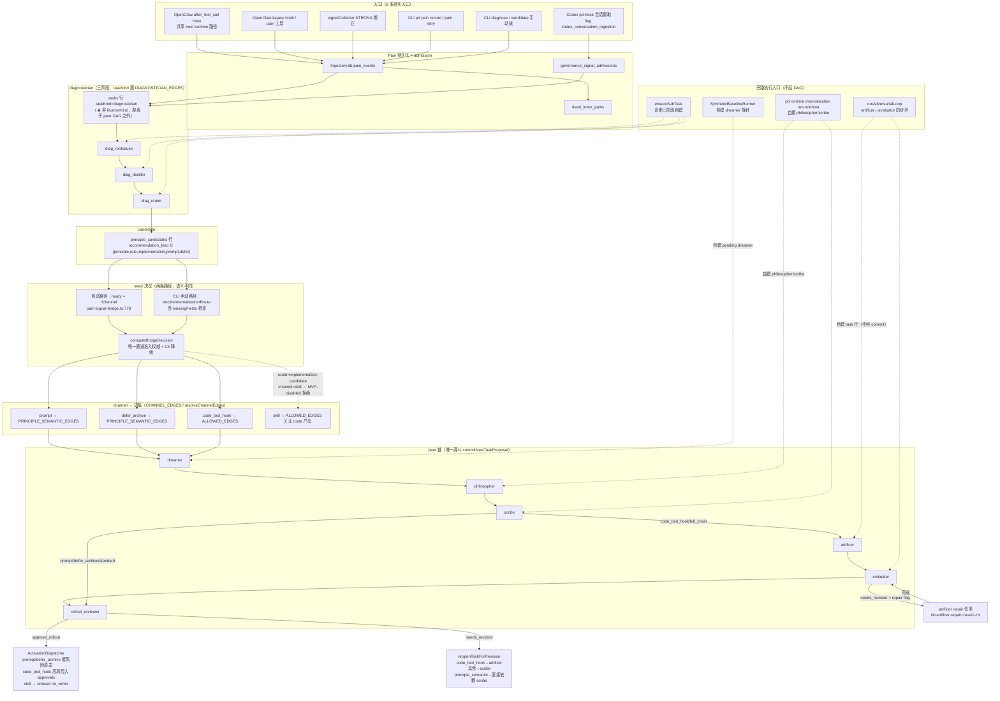

# PRI-807 Phase 0 — Worker A：Topology / Channel DAG 审计

- 审计对象：`csuzngjh/principles` @ `cdec05d4bc4252151c7f9f118bdad90f25067594`
- 审计类型：**只读**静态审计（生产代码为最终证据源）
- 审计人：PD Developer（CNB Issue #47 / 云端 Worker A）
- 交付分支：`ai/cnb-dev/issue-47`
- 判定词表：`CONFIRMED` / `FIXED` / `DRIFTED` / `PARTIAL` / `NEW` / `UNVERIFIABLE`
- 证据优先级：生产代码 > runtime contract / schema / DDL > 生产测试 > 文档 > 注释 > 推断
- 本文所有行号均对应上列 checkout SHA（审计当天工作树），并附稳定 grep anchor 便于漂移定位

---

## 1. Scope

### 1.1 查了什么

本 Worker 回答一个问题：

> **当前 main 上，核心管道到底有哪些合法路径？每条边由谁决定？有没有「代码里一套 DAG、runner 里又私自跳」的情况？**

具体覆盖：

1. **拓扑权威定位**：`ALLOWED_EDGES` / `PRINCIPLE_SEMANTIC_EDGES` / `CHANNEL_EDGES` / `resolveChannelEdges` / `DIAGNOSTICIAN_EDGES` 的当前定义、导出面与全部生产消费方；
2. **A1 拓扑图**：Signal/Pain → diagnostician → candidate → channel 各环节的真实去向（含 prompt / defer_archive / code_tool_hook / skill 四条通道）；
3. **A2 边权威表**：每条边一行，列出 authority symbol / producer / consumer / runtime guard / test coverage；
4. **A3 bypass search**：手工 successor 指定、switch/case 自造后继、recovery/reopen 绕过 `CHANNEL_EDGES`、缺 `pipelineMode` 的解释路径、seed/resume 造出 DAG 外任务；
5. **A4 必答**：`CHANNEL_EDGES` 是否真的是 SSOT（YES / NO / PARTIAL + 证据链）；
6. **Carry-forward 复核**：R-14 / R-15 / R-25 的 current-main 状态，以及 `docs/audit/agent-pipeline-audit-2026-09-15/REPORT.md` §2 关键结论的 current-main 裁决。

### 1.2 不查什么

- 不改任何生产代码 / 配置 / Linear；不修 bug；不建新 subsystem；
- 不重做 #1707（全量报告）与 #1710（四轮独立核实）——只做「拓扑权威」这一契约面的 current-main 回源；
- 不做提示词质量、schema 字段完整性、治理授权强度评估（分属其他 Worker / 其他 Phase）；
- 不评估 `docs/adr/`、`docs/product/` 的意图正确性（只读引用）；
- 不产出修复方案（§8 只写 invariant）。

---

## 2. Baseline

```
$ git rev-parse HEAD
cdec05d4bc4252151c7f9f118bdad90f25067594
```

**BASELINE: SYNCED** — 与任务书指定基线 `cdec05d4bc4252151c7f9f118bdad90f25067594` 完全一致，工作树干净（`git status` = `nothing to commit, working tree clean`），分支 `audit/pri-807-phase0-base` 与 `origin/audit/pri-807-phase0-base` 同步。无 Drift Warning。

补充事实：`docs/audit/agent-pipeline-audit-2026-09-15/REPORT.md` **存在**（含 VERIFICATION-A..D）。其 §2 可作历史事实种子，但本报告所有判定均回源 current main（上列 SHA）后给出；与 §2 冲突处按代码为准并在 §5 显式标注 DRIFTED。

### 2.1 基线树 vs 更早基线的可观测差异（仅列与本审计相关者）

历史报告锚定 `70d824c4`；current main 已并入 #1698（PRI-720 channel-aware DAG）、#1710（核实轮）。本审计观察到、且直接影响拓扑结论的差异：

| 事实 | 70d824c4 说法 | current main 实测 |
|---|---|---|
| `validateEdge` 是否 channel 特例 | REPORT §6.2 称「ALLOWED_EDGES 线性链；validateEdge 已无 channel 特例」 | **channel-aware**：`validateEdge(from,to,scope?)` → `resolveChannelEdges(scope?.channel, scope?.pipelineMode)`（`internalization-job-graph.ts:130-136`）|
| `CHANNEL_EDGES` 是否存在 | REPORT §6.2 未登记 | 存在（`internalization-job-graph.ts:63`），但**不在任何 barrel 导出面**（见 A4）|
| `pipelineMode` 是否存在 | REPORT §6.2 未登记 | 存在（`peer-runner-contracts.ts:46`），seed 显式写入（`intake-to-internalization-bridge.ts:235-240`）|
| rollout_reviewer 是否有 principle_semantic 模式 | REPORT §5 rollout 卡按 v1 描述 | 存在（`rollout-reviewer-runner.ts:168-179`）|

上述差异即「#1698 通道重构」的落地面，构成本次审计的主要 NEW 面。

---

## 3. Current Authorities（当前代码 SSOT 清单）

### 3.1 权威符号总表

| # | Authority symbol | 位置（file:line @ cdec05d4b） | 拥有的语义 | barrel 导出 |
|---|---|---|---|---|
| 1 | `ALLOWED_EDGES` | `packages/principles-core/src/runtime-v2/internalization/internalization-job-graph.ts:35` | 5 条 legacy 线性边（v1 全链） | ✅ `packages/principles-core/src/runtime-v2/index.ts:828`、`packages/principles-core/src/runtime-v2/internalization/index.ts:135` |
| 2 | `PRINCIPLE_SEMANTIC_EDGES` | 同上 `:52`（模块私有，未导出） | 3 条 principle 语义边 | ❌（仅经 `CHANNEL_EDGES` 间接可达）|
| 3 | `CHANNEL_EDGES` | 同上 `:63` | channel → 边集 的映射表 | ❌ **不在任何 barrel**（实测：`runtime-v2-barrel-surface.json` 与 `core-barrel-surface.json` 双向零命中）|
| 4 | `resolveChannelEdges(channel?, pipelineMode?)` | 同上 `:84-95` | 唯一的「channel + mode → 边集」决议函数 | ❌ **不在任何 barrel** |
| 5 | `DIAGNOSTICIAN_EDGES` | 同上 `:101` | 2 条诊断阶段边 | ✅ `packages/principles-core/src/runtime-v2/index.ts:829`、`packages/principles-core/src/runtime-v2/internalization/index.ts:136` |
| 6 | `validateEdge(from,to,scope?)` | 同上 `:130-136` | 边合法性判定（channel-aware） | ✅ `:830` / `:137` |
| 7 | `getAllowedSuccessors(from, channel?, pipelineMode?)` | 同上 `:244-251` | 后继集合查询（channel-aware） | ✅ `:834` / `:141` |
| 8 | `getAllowedPredecessors(to, channel?, pipelineMode?)` | 同上 `:264-271` | 前驱集合查询（channel-aware） | ✅ `:835` / `:142` |
| 9 | `getDiagSuccessors(from)` | 同上 `:151-155` | 诊断链后继 | ✅ `:832` / `:139` |
| 10 | `createNextTaskProposal(currentTask, _artifacts, channel?)` | `packages/principles-core/src/runtime-v2/internalization/internalization-state-machine.ts:338-385` | peer 链后继提案（唯一 proposal 生产者） | ✅ `:870` / `:174` |
| 11 | `validateInternalizationGraph(tasks)` | 同上 `:398-461` | 全图结构校验（环 / 白名单边 / 缺依赖） | ✅ `:871` / `:175` |
| 12 | `InternalizationOrchestrator.proposeNextTask(taskId)` | `internalization-orchestrator.ts:339-390` | 后继提案入口（含诊断链分支） | 经 `InternalizationOrchestrator` 类导出 |
| 13 | `InternalizationOrchestrator.commitNextTaskProposal(taskId)` | 同上 `:413-719` | **后继播种唯一漏斗**（含迁移仲裁、ID 生成、幂等） | 同上 |
| 14 | `decideInternalizationTransition(input)` | `internalization-transition-decision.ts:73-128` | verdict → 迁移判定（ADVANCE / REVISION_REQUIRED / …） | ✅（经 orchestration 面）|
| 15 | `ROUTE_CHANNEL_MAP` | `internalization/intake-to-internalization-bridge.ts:122-127` | route → channel | ✅ `packages/principles-core/src/runtime-v2/index.ts:1230` 附近的 intake 面 |
| 16 | `CANDIDATE_KIND_TO_ROUTE` | 同上 `:114-120` | recommendation kind → route | ✅ `:1229` |
| 17 | `MVP_ENABLED_CHANNELS` | 同上 `:108-112` | MVP 可用通道集合 | ✅ `:1230` |
| 18 | `KIND_ROUTE_MAP` | `internalization-route.ts:43-48`（模块私有） | kind → route（route 层第二份） | ❌ 私有，仅经 `decideInternalizationRoute` |
| 19 | `decideInternalizationRoute(recommendation)` | 同上 `:52-150` | route + ready + missingFields 纯决策 | ✅ `:674` |
| 20 | `MVP_CHANNEL_IDS` | `config/pd-config-feature-flags.ts:37` | 「MVP 通道」flag id 清单（第 3 份字面量） | ✅ `:1837` |
| 21 | `MVP_CHANNELS` | `create-principles-disciple/src/mvp-config.ts:7` | 安装器侧 MVP 通道（第 4 份字面量） | 安装器包内导出 |
| 22 | `STORY_A_CHANNELS` / `MVP_CHANNELS`（runtime-v2） | `story-a-demo.ts:14`、`proven-channel-baseline.ts:23` | demo/baseline 通道（第 5、6 份字面量） | ✅ demo 面 |
| 23 | `MVP_CORE_TASK_KINDS` | `internalization/queue-actionability.ts:28-35` | 6 runner kind 清单（第 1 份） | ✅ `:...` queue 面 |
| 24 | `FULL_CHAIN_CONSUMER_RUNNER_KINDS` | `internalization/internalization-consumer-decision.ts:25-32` | 同上（第 2 份） | ✅ |
| 25 | `AGENT_NAME_FOR_TASK_KIND` | `pain-signal-runtime-factory.ts:331-338` | kind → internalAgentName（第 3 份） | ✅ |
| 26 | `SUPPORTED_RUNNERS`（run-once 内联 Set） | `pd-cli/src/commands/runtime-internalization-run-once.ts:59` | 同上（第 4 份） | ❌ 模块私有 |
| 27 | `GOVERNANCE_TASK_KINDS`（Console 两处 + SQL 一处） | `packages/pd-console/src/server/models/GovernanceProjectionCollector.ts:29`、`OwnerDecisionConsoleModel.ts:62`、`GovernanceConsoleModel.ts:282` | 同上（第 5、6、7 份） | ❌ 各自私有 |
| 28 | `LOW_RISK_CHANNELS` / `AUTO_PROMOTABLE_CHANNELS` | `activation/activation-types.ts:8`、`:17` | 治理风险分层 | ✅ activation 面 |
| 29 | `resolveRolloutReviewMode(channel, pipelineMode, deps)` | `rollout-reviewer-runner.ts:168-179` | rollout 评审契约模式（结构性判定） | ❌ 模块内导出 |
| 30 | `resolveRolloutRevisionTarget(getTask, taskId, channel)` | `revision-reopen.ts:131-188` | rollout needs_revision 修订目标 | ✅ `packages/principles-core/src/runtime-v2/index.ts:1343` |

### 3.2 直接观测到的多权威（同一事实 >1 处定义）

以下均为**生产代码**中的平行定义（非测试、非文档），是 §7 Protection Gaps 的主要输入：

| 事实 | 定义处数 | 位置 |
|---|---|---|
| 「MVP 三通道」字面量 | **6** | `pd-config-feature-flags.ts:37`、`create-principles-disciple/src/mvp-config.ts:7`、`story-a-demo.ts:14`、`proven-channel-baseline.ts:23`、`packages/host-runtime/src/internalization-consumer-cycle.ts:338`、`internalization-queue-read-model.ts:343`；另 Console 侧 2 处（`GovernanceProjectionCollector.ts:55,530`、`pd-console/src/ui/utils/validators.ts:88`）、CLI 侧 2 处（`demo-story-a.ts:110`、`runtime-internalization-run-rulehost.ts:63`）|
| 6-peer-runner kind 清单 | **≥7** | 见 §3.1 #23–27（含 Console SQL 字面量与 UI validator）|
| kind → route 映射 | **2** | `internalization-route.ts:43-48`（私有）、`intake-to-internalization-bridge.ts:114-120`（导出）|
| route → channel 映射 | **1**（已收敛） | `intake-to-internalization-bridge.ts:122-127`（#1698 后无第二份；`ROUTE_CHANNEL_MAP` 是唯一来源）|
| rollout 修订目标解析 | **2** | `revision-reopen.ts:131-188`（canonical，供 Owner revise_once 用）与 `rollout-reviewer-runner.ts:1033-1091`（runner 私有副本）|
| 「实现类候选不可内化」判定 | **3** | `intake-to-internalization-bridge.ts:125,151-153`（route→skill→MVP-disabled）、`internalization-chain-integrity-read-model.ts:199`（`NON_INTERNALIZABLE_KINDS`）、`pd-cli/src/commands/diagnose.ts:604`（`kind === 'implementation'` 直接 continue）|

---

## 4. Contract Map

### 4.1 A1 — Current topology map（只画代码可证的边）

图例：`──▶` = 有生产代码写入 + 有生产代码消费的边；`┈┈▶` = 声明存在但无运行时强制；`╳` = 声明可达但运行时被结构性拒绝。



**四条通道的当前真实去向（逐通道）**

| channel | 由谁产出（task 行） | 边集（standard） | 终结点 | 运行时实际可达性 |
|---|---|---|---|---|
| `prompt` | `ROUTE_CHANNEL_MAP['principle-ledger']`、`['prompt-injection-candidate']`（`intake-to-internalization-bridge.ts:122-127`）；C6 降级目标 | `dreamer→philosopher→scribe→rollout_reviewer` | `rollout_reviewer`（principle_semantic 模式） | **可达**。c2 链测试实测 4 段（`c2-live-runner-chain.test.ts:286-301`）|
| `defer_archive` | **无 route 产出**：`ROUTE_CHANNEL_MAP` 无值指向它（`:122-127`）；`defer` kind → `deferred` route → `not_internalizable` | 同 prompt（`internalization-job-graph.ts:67`） | 理论同 prompt | **不可达**。c2 测试显式断言「no route maps to defer_archive — no dreamer task seeded」（`:363-388`）|
| `code_tool_hook` | `ROUTE_CHANNEL_MAP['rule-candidate']` | `ALLOWED_EDGES` 全 5 边 | `rollout_reviewer`（code_chain 模式） | **可达**，且受 C6 机械证据门约束（无 `triggerPattern`+`action` 则降级 prompt）|
| `skill` | `ROUTE_CHANNEL_MAP['implementation-candidate']`（`:125`）| `ALLOWED_EDGES` | — | **结构性不可达**：`MVP_ENABLED_CHANNELS` 不含 `skill`（`:108-112`）→ `computeBridgeDecision` 恒返回 `not_internalizable`（`:151-153`）。CLI diagnose 侧另有独立短路（`diagnose.ts:604` 直接 `continue`）|

**`pipelineMode` 语义（三条互斥解释路径，全部在 `resolveChannelEdges` 内裁定）**

```
pipelineMode === 'standard'                → CHANNEL_EDGES[channel]      （channel-aware 短路径）
pipelineMode === 'full_chain'              → ALLOWED_EDGES               （Owner 覆盖）
pipelineMode === undefined（字段 ABSENT）  → ALLOWED_EDGES               （pre-PRI-720 遗留记录，AC12 不中途重解释）
```

判定点在 `internalization-job-graph.ts:88-95`（`if (pipelineMode !== 'standard') return ALLOWED_EDGES;`）——即 **ABSENT 与 `full_chain` 在运行期不可区分**。seed 侧保证「新 seed 必写字面量」（`intake-to-internalization-bridge.ts:235`：`input.pipelineMode === 'full_chain' ? 'full_chain' : 'standard'`），故 ABSENT 只能来自 pre-PRI-720 记录 **或** 不经该 seed 函数的其它 producer。

### 4.1.1 A4 必答 — **Is `CHANNEL_EDGES` really the SSOT?**

**答案：PARTIAL。**

它**是**（且仅是）「channel → 边集」这一事实的唯一权威；但它**不是**「当前合法拓扑」的完整 SSOT，因为有三类判定在使用它之外的信息：

**证据链（YES 部分）**

1. `CHANNEL_EDGES`（`internalization-job-graph.ts:63-70`）是该事实的唯一常量定义，`PRINCIPLE_SEMANTIC_EDGES` 只经它暴露（该常量本身未导出，`:52`）；
2. 所有「后继/前驱/边合法性」查询都归口到一个函数：`getAllowedSuccessors`（`:249`）、`getAllowedPredecessors`（`:269`）、`validateEdge`（`:135`）三处均调 `resolveChannelEdges`；
3. `resolveChannelEdges` 是 channel 与 `pipelineMode` 的**唯一**联合判定点（`:84-95`），没有任何其它模块自行判 channel→边；
4. 生产调用链可证：`createNextTaskProposal`（`internalization-state-machine.ts:365`）→ `getAllowedSuccessors` → `resolveChannelEdges`；`validateInternalizationGraph`（`:440`）→ `validateEdge` → `resolveChannelEdges`。两者的入参都来自任务记录字段（`channel`、`pipelineMode`），无旁路推导。

**证据链（PARTIAL 部分 —— 三类越权）**

| # | 越权点 | 位置 | 为何构成越权 |
|---|---|---|---|
| 1 | **producer 硬编码边，不经权威** | `adversarial-loop.ts:96`（artificer ← scribe）、`:225`（evaluator ← artificer）；`rulehost-pipeline-runner.ts:352,368`；`split-diagnostician-runner.ts:150,170` | 这些写入**从未调用** `getAllowedSuccessors` / `validateEdge`，因此 `CHANNEL_EDGES` 对它们零约束（实测 `rulehost-pipeline-runner.ts` 内 `commitNextTaskProposal`/`getAllowedSuccessors`/`createNextTaskProposal` 命中数 = 0）|
| 2 | **判定点内嵌 channel 特例，不走边集** | `rollout-reviewer-runner.ts:173-178`（`resolveRolloutReviewMode`）；`revision-reopen.ts:167-186`（`resolveRolloutRevisionTarget` 的 `channel === 'code_tool_hook'` 分支）| 二者按 channel 名直接分支选择行为（评审契约 / 修订目标），与 `CHANNEL_EDGES` 表达同一分叉事实，却各自硬编码 |
| 3 | **旁路 DAG 的合法入口未经登记** | `synthetic-baseline-runner.ts:308`、`adversarial-loop.ts:89`、`rulehost-pipeline-runner.ts:620` | 这些是「合法但非 DAG」的 task 生产者；`CHANNEL_EDGES` 未表达、也未禁止它们 |

**结论表述**

> `CHANNEL_EDGES` 是「channel → 边集」的 SSOT（YES）；但不是「核心管道当前合法路径集合」的 SSOT（NO）。真正的完整答案是 **`CHANNEL_EDGES` ∪ 旁路 producer 集合 ∪ 内嵌 channel 特例**——而目前只有第一项有一个具名权威符号。

**为何不是 NO**：因为所有**经 DAG 的**边（即 `commitNextTaskProposal` 创建的每条 successor）确实 100% 由 `CHANNEL_EDGES` 裁定——这一半的完整性已被 c2 链测试逐 channel 实证（`c2-live-runner-chain.test.ts:286-361`）。

**为何不是 YES**：因为 §4.2.4 的四类旁路 producer 完全绕开它，且 `resolveRolloutReviewMode` / `resolveRolloutRevisionTarget` 把它表达的分叉事实重写了一遍。判「YES」会让 `check:pipeline-contract` 无法发现这些越权点。

### 4.2 A2 — Topology authorities（每条边一行）

`runtime guard` 列指「该边在运行时是否真的被强制」，`test coverage` 列给出保护的测试文件。

#### 4.2.1 诊断链（DIAGNOSTICIAN_EDGES）

| edge | authority symbol | producer | consumer | runtime guard | test coverage |
|---|---|---|---|---|---|
| `diagnostician（父） → diag_rootcause` | **无**（不在任何 edges 常量内）| `split-diagnostician-runner.ts:126-132`（`ensureSubTask`）| 同一 runner 顺序调用 | 无（`DIAGNOSTICIAN_EDGES` 不以父任务为源）| `diag-chain-e2e.test.ts:769-774` |
| `diag_rootcause → diag_distiller` | `DIAGNOSTICIAN_EDGES[0]`（`internalization-job-graph.ts:101-104`）| `split-diagnostician-runner.ts:146-150`（硬编码 `dependencyTaskIds: [stageATaskId]`）| `ensureSubTask` + `validateInternalizationTaskReady` | **否**（见下）| `runnerkind-seam.test.ts:81-110`（常量值）；`diag-chain-e2e.test.ts:777-778`（依赖字面量断言）|
| `diag_distiller → diag_router` | `DIAGNOSTICIAN_EDGES[1]` | `split-diagnostician-runner.ts:166-170`（`[stageATaskId, stageBTaskId]`）| 同上 | **否** | `diag-chain-e2e.test.ts:781-783` |
| `diag_router → （终结点）` | 隐式（无出边）| — | — | `getDiagSuccessors` 返回 `[]`，`proposeNextTask` 返回 null（`internalization-orchestrator.ts:356-361`）| `runnerkind-seam.test.ts:105-106` |

**关键实测（A3 证据）**：producer 侧完全**不消费** `DIAGNOSTICIAN_EDGES`。`split-diagnostician-runner.ts` 的 `ensureSubTask`（`:274-319`）接收调用方硬编码的 `dependencyTaskIds`；三处调用（`:126`、`:146`、`:166`）分别写 `[]`、`[A]`、`[A,B]`。`DIAGNOSTICIAN_EDGES` 的**唯一生产消费者**是 `internalization-orchestrator.ts:356` 的 `getDiagSuccessors`，而该死代码路径的前提是「`diag_*` 子任务以 `succeeded` 状态被 `wakeOnce` 捡起」——但 `wakeOnce` 只被 run-once / consumer-cycle 以 peer kind 调用（见 4.2.2 前注），且 `commitNextTaskProposal` 的 reconciliation（`internalization-orchestrator.ts:865`）显式 `if (!isPeerRunnerKind(task.taskKind)) continue;` 跳过诊断 kind。故该分支在当前 main 上**不可达**（`UNVERIFIABLE` 于生产，`NEW` 为死路径登记）。

#### 4.2.2 peer 链（边缘按 channel 分叉）

前置事实：**唯一后继播种漏斗**是 `commitNextTaskProposal`（`internalization-orchestrator.ts:413`），其内部链路为

```
commitNextTaskProposal :413
  → decideInternalizationTransition（verdict 仲裁）        :433-450
  → proposeNextTask                                        :546
      → isDiagnosticianStageKind? → getDiagSuccessors      :355-375（peer 链的另一条极短分支）
      → createNextTaskProposal                             :383（→ state-machine.ts:338）
          → getAllowedSuccessors(taskKind, channel, mode)  :365
              → resolveChannelEdges                        （job-graph.ts:84）
  → findExistingSuccessor（幂等）                          :553
  → createTask（唯一写入点）                                :687
```

| edge | authority symbol | producer | consumer | runtime guard | test coverage |
|---|---|---|---|---|---|
| `dreamer → philosopher` | `[dreamer,philosopher]` ∈ 两个边集共有 | `createNextTaskProposal` → `commitNextTaskProposal:687` | `wakeOnce` → runner dispatch | **是**（`getAllowedSuccessors` 过滤；越界则 `no_successor`）| `c2-live-runner-chain.test.ts`（三条 channel 链）；`internalization-state-machine.test.ts:361-465` |
| `philosopher → scribe` | 同上 | 同上 | 同上 | 是 | 同上 |
| `scribe → artificer` | 仅 `ALLOWED_EDGES`（`code_tool_hook`/`full_chain`）| 同上 | 同上 | **是**（`prompt`+standard 下 `getAllowedSuccessors(scribe,'prompt','standard')` 返回 `['rollout_reviewer']`）| `c2-live-runner-chain.test.ts:344-361`（正向）、`:286-301`（反向不可达）|
| `artificer → evaluator` | 仅 `ALLOWED_EDGES` | 同上 | 同上 | 是 | 同上 |
| `evaluator → rollout_reviewer` | 仅 `ALLOWED_EDGES` | 同上 | 同上 | 是 | 同上 |
| `scribe → rollout_reviewer` | 仅 `PRINCIPLE_SEMANTIC_EDGES`（`prompt`/`defer_archive`+standard）| 同上 | 同上 | 是 | `c2-live-runner-chain.test.ts:286-301` |
| `rollout_reviewer → （terminal）` | 隐式 | — | `createNextTaskProposal:367-369` 返回 null | 是（无出边）| `internalization-state-machine.test.ts:411-424` |

#### 4.2.3 非 DAG 边（旁路写入 / 修订 / 治理）

| edge | authority symbol | producer | consumer | runtime guard | test coverage |
|---|---|---|---|---|---|
| `evaluator(needs_revision) → artificer repair` | 无 edges 常量；由 `decideInternalizationTransition` 语义决定（`internalization-transition-decision.ts:104-106` → `REVISION_REQUIRED`），实际 seed 在 runner 内 | `evaluator-runner.ts:1437-1441` → `createEvaluatorRunnerDeps().seedArtificerRepairTask`（`rulehost-pipeline-runner.ts:709`）或 host-runtime 版（`internalization-consumer-governance.ts:162`）| repair runner = artificer | 部分（`isRepairLoopEnabled` flag 门 + 幂等 id）；**不经 `commitNextTaskProposal`** | `evaluator-repair-loop.test.ts`、`evaluator-runner-deps.test.ts:236+` |
| `artificer repair 完成 → reopen evaluator` | `decideInternalizationTransition:86-88`（`REOPEN_SOURCE_EVALUATOR`）| `commitNextTaskProposal:448-...` | `reopenTaskForRevision`（`revision-reopen.ts:56`）| 是（causeId 幂等）| `external-review-p0-regressions.test.ts:119` |
| `rollout(needs_revision) → scribe/artificer` | `resolveRolloutRevisionTarget`（`revision-reopen.ts:131-188`）**与** runner 私有 `resolveRevisionTarget`（`rollout-reviewer-runner.ts:1033-1091`）| runner 内（`:991` 注入回调 → `orchestrator.reopenTaskForRevision`）| 目标任务 | 是（但不经 `CHANNEL_EDGES`——见 A4）| `owner-decision.test.ts:1169-1182`、`rollout-reviewer-principle-semantic.test.ts:355-367` |
| `rollout(approve_rollout) → ActivationDispatcher` | `activation-dispatcher.ts:265`（`needsApproval = rolloutDecision==='require_approval' \|\| !isLowRiskChannel(channel)`）| runner `dispatchOrRouteFailure`（`rollout-reviewer-runner.ts:894-935`）| `approvals` / `activations` 表 | 是（高风险必入 approval；skill 无 writer 则 refused）| `activation-dispatcher.test.ts`（多例）|
| `上游 revision → 级联 reopen 下游` | `commitNextTaskProposal:590-662`（causeId 幂等）| 同上 | 同上 | 是 | `a-liveness-reconciliation.test.ts`、`verdict-drift-regressions.test.ts` |
| `Owner revise_once → reopen` | `resolveReviseTarget`（`owner-resolution-service.ts:192-211` → `resolveRolloutRevisionTarget`）| Console owner-decisions 路由 | 目标任务 | 是 | `owner-decision.test.ts` |

#### 4.2.4 旁路执行入口（**A3 核心**：不经 DAG 建立 task 行）

| 入口 | 位置 | 建什么任务 | 依赖谁指定 | 是否经 `commitNextTaskProposal` |
|---|---|---|---|---|
| `runAdversarialLoop` | `principles-core/src/runtime-v2/adversarial-loop.ts:72`；建 artificer `:87-103`、evaluator `:129-132`/`:212-232` | 每轮 fresh `artificer` + `evaluator` | **硬编码**：artificer ← `input.scribeTaskId`（`:96`）；evaluator ← 当轮 artificer（`:225`）| **否** |
| `pd runtime internalization run-rulehost` | `pd-cli/src/services/rulehost-pipeline-runner.ts:257`（命令注册 `runtime-internalization-run-rulehost.ts:664`）| `philosopher`（`:352`）、`scribe`（`:368`），再交 `runAdversarialLoop` | **硬编码顺序**：`createInternalizationTask(stateManager, id, kind, [上游 id], channel, timeoutMs)`（`:612-630`）| **否** |
| `SyntheticBaselineRunner` | `pd-cli/src/services/synthetic-baseline-runner.ts:305-317` | `dreamer`（`synth-dreamer-<ts>`）| 无依赖 | **否**（探测用）|
| `ensureSubTask`（诊断） | `split-diagnostician-runner.ts:274-319` | 3 个 `diag_*` 子任务 | 硬编码（见 4.2.1）| **否** |

---

## 5. Confirmed / Fixed / Drifted

### 5.1 Carry-forward 项

#### R-14（P2）route→ready 判定双实现 → **CONFIRMED**（且比原描述更强）

原描述：纯决策函数（含 missingFields 检查）只被 CLI 手动路径消费；自动路径 `ready = !!channel` 短路；kind→channel 映射表两份。

current-main 回源：

- **双 ready 实现，实为三条**（原报告只登记两条）：
  1. `decideInternalizationRoute`（`internalization-route.ts:52-150`）——检查 `abstractedPrinciple` / `triggerPattern` / `action`；生产消费者仅 CLI：`candidate.ts:336,988,1079,1229`、`candidate route`（`:1229` 同处）。
  2. `pain-signal-bridge.ts:778`：`const ready = !!channel;`（**自动路径**，字段检查被短路）。
  3. `pd-cli/src/commands/diagnose.ts:611`：`const ready = !!channel && MVP_ENABLED_CHANNELS.has(channel);`（**第三条语义**：既不查字段，也查通道——与 1、2 都不同）。
- **kind→route 映射表确为两份**：`KIND_ROUTE_MAP`（`internalization-route.ts:43-48`，私有）与 `CANDIDATE_KIND_TO_ROUTE`（`intake-to-internalization-bridge.ts:114-120`，导出）。内容当前一致（principle/rule/implementation/prompt/defer → 同值），但无编译期联动。
- **route→channel 映射已收敛为一份**：`ROUTE_CHANNEL_MAP`（`:122-127`）。#1698 后未见第二份。
- **缓解事实（NEW，原报告未登记）**：三条 `ready` 的语义分裂已被 `computeBridgeDecision` 的 **C6 降级前置**部分吸收——`intake-to-internalization-bridge.ts:167-174` 先做 rule 证据检查并降级，再判 `!input.ready`。即「字段不全的 rule 候选」在三条路径上都收敛到 `prompt` 通道。**但该吸收只覆盖 `rule-candidate` 一条 route**：`principle` 缺 `abstractedPrinciple` 时，CLI 手动路径 `ready=false` → `not_internalizable`，自动路径 `ready=true` → 仍 seed 到 `prompt`。**语义分裂对 principle 通道依然成立**（P2 维持）。

#### R-15（P3，待复审）implementation 候选 → skill 通道必然 not_internalizable → **CONFIRMED**（P2 维持，且路径更多样）

current-main 回源：

- `ROUTE_CHANNEL_MAP['implementation-candidate'] = 'skill'`（`intake-to-internalization-bridge.ts:125`）；
- `MVP_ENABLED_CHANNELS = {prompt, code_tool_hook, defer_archive}`（`:108-112`）→ `computeBridgeDecision` 在 `:151-153` 返回 `not_internalizable`；
- router 提示词仍主动鼓励 `implementation`（`diagnostician/router-prompt-builder.ts:163`），schema 仍含该枚举（`diagnostician-output.ts:34`）；
- **NEW（原报告未登记）**：`pd diagnose` 在 seed 循环前有独立短路 `if (kind === 'defer' || kind === 'implementation') continue;`（`diagnose.ts:604`）——即在 CLI diagnose 路径上 `implementation` 候选**连 bridge 都不进**，与 pain-bridge 路径（会进 bridge、产生 `not_internalizable` + telemetry `candidate_not_internalizable`，`pain-signal-bridge.ts:824-832`）行为不一致；
- **NEW**：`candidate.ts` 的 seed 循环**没有**同等短路（`grep -c implementation candidate.ts` = 0）→ `pd candidate internalize` 会走 bridge 并得到 `not_internalizable`；
- 第三处平行判定：`internalization-chain-integrity-read-model.ts:199` 的 `NON_INTERNALIZABLE_KINDS = {defer, implementation}`。

结论：**三条路径对同一 `implementation` 候选给出三种可观测行为**（直接跳过 / bridge 拒绝+遥测 / bridge 拒绝无遥测）。原报告把它归为「单一 P3 产品边界」，current main 实为**语义不一致的 P2 面**——判定 `CONFIRMED` + 定级上调。

#### R-25（P2）入口/gate 全景遗漏 → **CONFIRMED**

- **Codex 会话摄取入口**：`codex-adapter/src/pd-hook.ts:156` 读 `codex_conversation_ingestion`，`:166-167`（turn_complete）与 `:178-179`（其它 kind）调 `runConversationIngestion` → `runGovernanceAdmission`（`ingestion/admission.ts:130`）→ `ensureGovernanceContinuation`（`governance-signal-admission.ts:997`）→ `ensureGovernanceDiagnosticianTask`（`:853`）→ `recordPain({asyncMode: true})`（`:901-905`）。REPORT §2 入口清单（11 行）**确实无此入口**（grep `codex_conversation_ingestion` 在 REPORT 正文仅出现在 R-25 自身的修订行）。判定 CONFIRMED。
- **两个 flag 未入 F10 表**：`signal_collector`（`feature-flag-contract.ts:195`，quiet/`enabled:true` — **Final-main 状态**，PRI-797 2026-09-15 由 OFF 翻为 ON，见 BASELINE.md §Final-main Delta Sync）实际 gate 的是 Stage2 LLM 分类器 —— `openclaw-plugin/src/core/signal-collector-host.ts:599-601`（`if (!cfg.enabled)` → `return null`）。`codex_conversation_ingestion`（`:427`，quiet/`enabled:false`）gate 整个 Codex 摄取。判定 CONFIRMED。

### 5.2 REPORT §2 关键结论的 current-main 裁决

| REPORT §2 结论 | 判定 | 依据 |
|---|---|---|
| 「后继播种唯一漏斗 = `commitNextTaskProposal`」 | **CONFIRMED（有例外）** | 对 peer 链成立（§4.2.2）；但 §4.2.4 的 4 个旁路入口**不经**漏斗即建 task 行 |
| 「`wakeOnce` 只扫 pending + retry_wait」 | **CONFIRMED** | `internalization-orchestrator.ts:977-978`（`listTasks({status:'pending', orderBy:'updated_at_asc'})` + `retry_wait`）|
| 「`ALLOWED_EDGES` 线性链，validateEdge 无 channel 特例」 | **DRIFTED** | `validateEdge` 现为 channel-aware（`internalization-job-graph.ts:130-136`）；`ALLOWED_EDGES` 已非唯一权威（`CHANNEL_EDGES` 与之并列）|
| 「稳定后继 ID = `{kind}-{correlationId}-{channel}`」 | **CONFIRMED** | `internalization-orchestrator.ts:579-588`；注意 `enqueue-successors` 的 dry-run 用**不同公式**（`{kind}-{taskId}-{channel}`，`runtime-internalization-enqueue-successors.ts:426`）**且绕过 verdict 仲裁** → 见 §6 NEW-A3 |
| 「Console 无推进管道端点」 | **CONFIRMED** | `pd-console/src/server/routes/` 全量路由清单中无 run-once/wake/commit 类 mutation；`failed-tasks.ts:551` 的 nextAction 仍引导回 CLI |
| 「诊断父任务 kind='diagnostician' 游离于任务图之外」 | **CONFIRMED** | `peer-runner-contracts.ts:244-246`（`isRunnerKind` 只含 peer + diag stage）；`internalization-orchestrator.ts:865` 显式跳过非 peer kind |
| 「`internalization_full_chain` 关 = 只推进 dreamer」 | **CONFIRMED** | `internalization-consumer-cycle.ts:352-355` → `FULL_CHAIN_CONSUMER_RUNNER_KINDS` / `DEFAULT_CONSUMER_RUNNER_KINDS`（`internalization-consumer-decision.ts:10,25-32`）|
| 「`skill` 通道无开关位 = 永久关闭」（F4）| **PARTIAL** | 更准确：`skill` 通道**无任何 task 生产者**（`ROUTE_CHANNEL_MAP` 的 `skill` 映射恒被 `MVP_ENABLED_CHANNELS` 拒绝），且治理侧**无 `SkillWriter`**（见 §6 NEW-A5）|
| F7「6-runner 常量 3-4 处」 | **DRIFTED（恶化）** | current main 实测 **≥7 处**（§3.2），含 Console 两处私有 Set + 一条 SQL 字面量 |

---

## 6. NEW Findings

严重度口径：P1 = 核心 pipeline 可能被静默绕过 / Owner gate 或 security boundary 被绕过 / canonical data corruption / 生产路径断裂无 recovery；P2 = 核心闭环特定 path 不可达 / 语义明显不一致 / 可能导致错误治理结论；P3 = 非主路径漂移 / latent debt。

### NEW-A1（P1 候选，本审计判定 P2 + 显式不升 P1 的理由）`pipelineMode` 在两条生产 producer 上缺失，导致 `prompt` 链被按 legacy 全链解释

- **Claim**：`pipelineMode` 是 channel-aware 拓扑的**唯一开关**，但并非所有生产 task 生产者都写入它；缺字段时 `resolveChannelEdges` 把该链解释为 `full_chain`（`internalization-job-graph.ts:88-90`），于是 `prompt` 通道会创建 `artificer`/`evaluator`——即 PRI-720 想要消除的 RuleCode 子链在「无 `pipelineMode` 的 prompt 链」上仍然出现。
- **Evidence**（producer 侧逐点）：
  - `internalization-job-graph.ts:88` — `if (pipelineMode !== 'standard') return ALLOWED_EDGES;`（ABSENT ≡ `full_chain`）
  - `internalization-state-machine.ts:364` — `const effectivePipelineMode = currentTask.pipelineMode;`（从任务记录继承，无 channel 推导兜底）
  - **有写**：`intake-to-internalization-bridge.ts:235-240`（seed 必写）、`pain-signal-bridge.ts:786`（显式传 `full_chain`/`undefined`→seed 内归一为 `standard`）、`pd-cli` 三处命令（`candidate.ts:361,998,1089`、`diagnose.ts:617`）经 `resolvePromptFullPipelineSeedMode`（`pd-cli/src/services/pd-config-loader.ts:258`）
  - **无写**：`adversarial-loop.ts:95-102`（artificer）与 `:224-230`（evaluator）——`grep -c pipelineMode` = **0**；`rulehost-pipeline-runner.ts:612-630`（自建 philosopher/scribe）——**0**；`split-diagnostician-runner.ts`（`channel: 'prompt'` 硬编码于 `:292`）——**0**；`synthetic-baseline-runner.ts:308-316`（`channel: 'prompt'`）——**0**
  - **继承但会被丢**：`evaluator-runner.ts:2376` 读取 `piArtificer.pipelineMode` 并交给 seeder（`:2401`），host-runtime 版 seeder 写入（`internalization-consumer-governance.ts:196`），但 **pd-cli 版 seeder 不写**（`rulehost-pipeline-runner.ts:742-754` 无该字段）→ 同一 core 契约在两个 host 注入实现上产出不同持久化形状
- **可达后果（本审计实证的最短路径）**：
  1. 操作者执行 `pd runtime internalization run-rulehost --pain-id <p> --channel prompt` → `rulehost-pipeline-runner.ts:368` 自建 `scribe` 任务，`channel='prompt'`、**无 `pipelineMode`**（`createInternalizationTask`，`:612-633`，实测 `pipelineMode` 命中 0）；
  2. rulehost 自身不调 `commitNextTaskProposal`（实测该文件零命中），故 scribe 任务停留在 `succeeded` 无后继；
  3. workspace 的 auto-consumer 周期执行 `reconcileSucceededTransitions`（`internalization-consumer-cycle.ts:207`），其扫描条件仅为 `isPeerRunnerKind`（`internalization-orchestrator.ts:865`）；
  4. 该 scribe 被 `commitNextTaskProposal` → `createNextTaskProposal:364`（`pipelineMode` = `undefined`）→ `getAllowedSuccessors('scribe','prompt',undefined)` → `ALLOWED_EDGES` → **创建 `artificer` 后继**。
  结果：`prompt` 通道上出现 RuleCode 子链——正是 PRI-720 AC11 明令禁止的形态；且该创建由**自动** reconciliation 触发，不依赖操作者第二次确认。
- **Why it matters**：`prompt` 通道的语义契约是「principle semantic 短路径，永不创建 RuleCode 子链」。ABSENT 的兜底把该契约反向执行，且**无任何日志/遥测标记**该链是以 legacy 解释运行的 → Owner/审计者从 task 行看不出「这条 prompt 链本该 4 段却跑了 6 段」。
- **Affected stage**：seed（`prompt` 链进入点）→ 全链拓扑判定；reconciliation（把缺字段转化为实际拓扑违规）；修复环（pd-cli seeder 丢 `pipelineMode`，`rulehost-pipeline-runner.ts:742-754` 无该字段，而 host-runtime 版 `internalization-consumer-governance.ts:196` 有）
- **Current protection**：**无**。`c2-live-runner-chain.test.ts:305-337` 断言 `full_chain` 覆盖的**正例**；`test(`assert pipelineMode 必写`)` 不存在。`rulehost-pipeline-runner.test.ts`、`adversarial-loop.test.ts`、`diag-chain-e2e.test.ts` 中 `pipelineMode` 零命中（实测 grep -c = 0）。唯一「全 producer 必须写」的守卫是对 `prompt_full_pipeline` flag 的注释承诺（`intake-to-internalization-bridge.ts:44-47`）——**注释不能当实现事实**。
- **为何不判 P1**：旁路入口（rulehost / adversarial-loop / synthetic）都是**操作者显式触发**的非自动路径，不构成「自动 pipeline 被静默绕过」；自动路径（bridge / CLI candidate / diagnose）均写入字段。故按 P2 记录，但 §8 列入 invariant 候选（`pipelineMode` 写入是 producer 义务）。

### NEW-A2（P2）`rollout_reviewer` 的 review mode 是**结构性推断**，不是声明读取；判定依赖运行时依赖图而非 `pipelineMode`

- **Claim**：`resolveRolloutReviewMode` 不用 `pipelineMode` 决定评审契约；它用「deps 里有 scribe 且没有 evaluator」推断 `principle_semantic`。
- **Evidence**：`rollout-reviewer-runner.ts:173-178`——
  ```
  if (pipelineMode === 'full_chain') return 'code_chain';
  if (channel !== 'prompt' && channel !== 'defer_archive') return 'code_chain';
  const hasEvaluatorDep = kinds.includes('evaluator');
  const hasScribeDep = kinds.includes('scribe');
  return !hasEvaluatorDep && hasScribeDep ? 'principle_semantic' : 'code_chain';
  ```
  消费点：`:447`（`const wantedDepKind = reviewMode === 'principle_semantic' ? 'scribe' : 'evaluator';`）、`:483`、`:1322`（`resolveReviewModeForTask` resume/owner-override 路径）
- **Why it matters**：该函数把 `pipelineMode: 'standard'` 的 prompt 链与 legacy prompt 链区分开，靠的是**依赖图副作用**而非权威字段。若目标（NEW-A1）修复为「所有 producer 都写 `pipelineMode`」，该函数应能直接读字段——目前是隐藏的第二拓扑判定点（§3.2 未列，因其语义与 edges 表重叠）。另一个后果：`rollout_reviewer` 的**修订目标**也依赖同一推断（`rollout-reviewer-runner.ts:1059-1078`），故 A2 与 A1 的缺字段问题会链式影响修订路由。
- **Affected stage**：rollout 评审契约选择 + rollout needs_revision 路由
- **Current protection**：`rollout-reviewer-principle-semantic.test.ts`（正例）+ `owner-decision.test.ts:1169-1182`（路由正例）；**无** 覆盖「hasScribeDep && hasEvaluatorDep 同时为真」这类脏数据/混合链的负例

### NEW-A3（P2）`enqueue-successors` 的 dry-run 预演绕过了 verdict 仲裁，预演结论与真实 commit 结论在 decision-capable 任务上**系统性相反**

- **Claim**：CLI `pd runtime internalization enqueue-successors` 的 dry-run 分支调用 `orchestrator.proposeNextTask`（`runtime-internalization-enqueue-successors.ts:399`），而该函数**不含** `decideInternalizationTransition` 的 verdict 仲裁；confirm 分支调用 `commitNextTaskProposal`（`:478`），该函数**首先**做 verdict 仲裁。因此对 `evaluator` / `rollout_reviewer` 这类 decision-capable 任务，dry-run 会预告 `would_create_successor`，confirm 实际返回 `blocked_by_revision` / `blocked_by_rejection` / `blocked_missing_verdict`。
- **Evidence**：
  - dry-run 路径：`runtime-internalization-enqueue-successors.ts:398-476`（仅 `proposeNextTask` + `findSuccessorInIndex`，无 verdict 概念）
  - `proposeNextTask` 无仲裁：`internalization-orchestrator.ts:339-392`——唯一门是 `:350`（`status !== 'succeeded'` → null）与 `:383`（`createNextTaskProposal`），**全程不读 `runnerDecision`**
  - confirm 路径有仲裁：`commitNextTaskProposal` 在 `:433-450` 调 `decideInternalizationTransition`，其 decision-capable 语义在 `internalization-transition-decision.ts:91-124`（evaluator/rollout verdict → ADVANCE / REVISION_REQUIRED / TERMINAL_REJECT / BLOCKED_MISSING_VERDICT）；映射函数把 `blocked_by_revision` 记为 `skipped`（`runtime-internalization-enqueue-successors.ts:107-113`）
  - **同一命令的两种模式对同一任务给出相反预言**：dry-run = `would_create_successor`；confirm = `skipped`（`blocked_by_revision`）
  - 次要偏差：dry-run 的 id 预报器公式为 `{kind}-{taskId}-{channel}`（`:426`），与漏斗的 `{kind}-{correlationId}-{channel}`（`internalization-orchestrator.ts:579-587`）不同。因 `correlationId` 恒为 candidateId（`intake-to-internalization-bridge.ts:245`）而 taskId 形如 `dreamer-<candidateId>-<channel>`，两者在生产数据上不相等，故该分支退化为 `findSuccessorInIndex` 的 parent+kind+channel 兜底扫描（`:267-271`）。**扫描窗口亦不一致**：dry-run 的索引覆盖全部 6 个状态（`PD_TASK_STATUSES`，`:240-244`），而漏斗的幂等检查只扫 `pending` + `retry_wait`（`internalization-orchestrator.ts:947-948`），额外的 id 直查仅在 `piTask.revisionCount > 0` 时才发生（`:596-598`）→ 对未经历 revision 的链，dry-run 可能把「漏斗幂等检查不会命中的 succeeded 老后继」算作 `successor_exists`，从而把实际会 `successor_created` 的场景预告为「已存在」
  - 测试固化：`runtime-internalization-enqueue-successors.test.ts:174-186`（`correlationId: 'corr-001'` 却断言 `would_create_successor`）、`:198/:220/:255`（断言含 taskId 形式的 id）
- **Why it matters**：dry-run 是 Owner 判断「会不会重复播种 / 会不会推进」的唯一预演手段（`cli-4` 语义）。当前实现在**最需要预演的类别**（evaluator/rollout verdict 相关的分叉）上系统性给出相反结论；Owner 若依预演结论判断「管道会推进」，实际会看到 `skipped`。这是「错误治理结论」的直接来源，故定 P2。
- **Affected stage**：CLI 恢复族（`enqueue-successors`）的 pre-flight 语义；对 `reconcileSucceededTransitions` 的运维心智模型（后者走的是同一 `commitNextTaskProposal`，结论正确）
- **Current protection**：`runtime-internalization-enqueue-successors.test.ts`（覆盖决策分支映射，但**无** `evaluator + needs_revision` 这类「dry-run 与 confirm 分叉」的对照用例；且断言的是不同 id 公式的产物 → 测试锁定了偏差）

### NEW-A4（P3）`CHANNEL_EDGES` 与 `resolveChannelEdges` 未进入任何 barrel 导出面，与 `ALLOWED_EDGES` 的可见性不对称

- **Claim**：`ALLOWED_EDGES` / `DIAGNOSTICIAN_EDGES` / `validateEdge` / `getAllowedSuccessors` / `getAllowedPredecessors` 都在 `runtime-v2/index.ts` 与 `internalization/index.ts` 导出；而**新加入的 channel 权威** `CHANNEL_EDGES` / `resolveChannelEdges` **不在任何 barrel**，也不在 `runtime-v2-barrel-surface.json` / `core-barrel-surface.json` 冻结面内（实测双向零命中）。
- **Evidence**：
  - 导出面：`packages/principles-core/src/runtime-v2/index.ts:828-835`（含 `ALLOWED_EDGES`、`DIAGNOSTICIAN_EDGES`、`validateEdge`、`getAllowedSuccessors`、`getAllowedPredecessors`）——**无** `CHANNEL_EDGES` / `resolveChannelEdges`
  - 冻结面：`node -e` 探针（§3.1 #3/#4）确认两个 surface fixture 均不含
  - 由此产生的后果：`PRINCIPLE_SEMANTIC_EDGES` 与 `CHANNEL_EDGES` 目前**只能被 core 内部消费**；跨包消费者必须通过 `getAllowedSuccessors` / `validateEdge` 间接使用（当前确实如此，见 §3.1 #1#[6-8]，核心包外零直接 import）
- **Why it matters**：contract 文档（`docs/architecture/PD_CORE_VALUE_PIPELINE_CONTRACT.md` 的目标读者）与 `check:pipeline-contract` guard 需要**可引用的稳定符号**。当前 `CHANNEL_EDGES` 是「事实权威但不可引用的私有符号」，而 `ALLOWED_EDGES` 是「可引用但已非全量权威的公共符号」——这正是 A4 判 `PARTIAL` 的机械原因，也是未来接入新 host / 新工具时最容易出现「照 `ALLOWED_EDGES` 实现了另一套拓扑」的位置（`adversarial-loop.ts` 已是实例：它硬编码 artificer↔evaluator，既不看 `ALLOWED_EDGES` 也不看 `CHANNEL_EDGES`）。
- **Affected stage**：契约面 / guard 设计（不影响当前运行行为）
- **Current protection**：`c2-live-runner-chain.test.ts:439-501` 用**字符串字面量重复**断言两张表（`resolveChannelEdges('prompt','standard')` 等），即以测试复制拓扑 → 表变化时需同步改 3 处（表 + 2 处断言组）

### NEW-A5（P2）`skill` 通道的治理侧闭环完全缺失，但 `AUTO_PROMOTABLE_CHANNELS`／`decideAutoPromotion` 的豁免分支仍在

- **Claim**：`skill` 通道**有** route 映射（`ROUTE_CHANNEL_MAP['implementation-candidate'] = 'skill'`）但该映射被 `MVP_ENABLED_CHANNELS` 拒绝，故无任何 task 行产出；同时它也**无 `ChannelWriter` 实现**。于是 `ActivationDispatcher` 的 skill 豁免路径（`decideAutoPromotion`）即使被走到，也在 dispatch 时以 `refused: no_writer_for_channel_skill` 收束。
- **Evidence**：
  - 无 writer：`activation/writers/` 目录仅 `rule-host-writer.ts`；全仓 `SkillWriter` 零命中（grep）；生产 writer 注册仅 3 个 —— `internalization-consumer-governance.ts:108-120`（`PromptWriter` + `RuleHostWriter`(`channel='code_tool_hook'`, `rule-host-writer.ts:189`) + `DeferArchiveWriter`）
  - 豁免分支仍在：`activation-types.ts:17`（`AUTO_PROMOTABLE_CHANNELS = ['skill']`）、`activation-dispatcher.ts:265-269`（`needsApproval` 判定 + `decideAutoPromotion` 早返 `activateArtifact`）、`approval-queue.ts:17-22`（阈值 0.95 判定）
  - 收束点：`activation-dispatcher.ts:351-354`（`if (!writer) return { decision:'refused', reason:'no_writer_for_channel_' + input.channel }`）
  - 风险分层仍把 skill 当真实通道：`activation-types.ts:12`（`HIGH_RISK_CHANNEL_MAP.skill = 'medium'`）
- **Why it matters**：与 VERIFICATION-D NEW-6 一致（本审计独立回源确认）。治理面上 `skill` 是「已声明、可配置、可豁免、永远 refused」的四重残影。若后续 Phase 依 `AUTO_PROMOTABLE_CHANNELS` 设计 skill 上线流程，会得出与实际 dispatch 相反的结论。
- **Affected stage**：治理（activation dispatch）/ 通道契约
- **Current protection**：`activation-dispatcher.test.ts` 有 `skill → refused` 正例（`:178-186`），但**无** 断言「`AUTO_PROMOTABLE_CHANNELS` 与 writer 注册集合同步」的一致性守卫 → 两张表可以继续漂移

### NEW-A6（P2）`defer_archive` 通道「声明完备、生产者为零」：边集/写入器/低风险分层全在，无 route 指向它

- **Claim**：`defer_archive` 拥有完整的第一类公民声明（`CHANNEL_EDGES` 键、`DeferArchiveWriter`、`LOW_RISK_CHANNELS` 成员、queue read-model 默认 enabled 集合成员），但**没有任何 route 会产出该 channel 的 task**，因此 DAG 上的 defer_archive 分支在自动路径恒空。
- **Evidence**：
  - 声明侧：`internalization-job-graph.ts:67`（`defer_archive: PRINCIPLE_SEMANTIC_EDGES`）、`low-risk-writers.ts:61-85`（`DeferArchiveWriter`，`readonly channel = 'defer_archive'`）、`activation-types.ts:8`（低风险成员）、`internalization-queue-read-model.ts:343` 与会话 cycle `internalization-consumer-cycle.ts:338`（默认 enabledChannels 含它）
  - 生产者为零：`ROUTE_CHANNEL_MAP`（`intake-to-internalization-bridge.ts:122-127`）四值中无 `defer_archive`；`defer` kind → `deferred` route → `not_internalizable`（`:176-178`）
  - 唯一的生产 src 命中 `channel: 'defer_archive'` 在 `pd-cli/src/services/demo-story-a-runner.ts:460`（demo 叙事文本，非 task 行）
  - 测试把这个事实固化为契约：`c2-live-runner-chain.test.ts:363-388`「defer_archive channel: no route maps to defer_archive — no dreamer task seeded」
- **Why it matters**：与 NEW-A5 同类，是「通道四方不对称」的一半（skill 有 route 无 writer；defer_archive 有 writer 无 route）。契约文档若按 `CHANNEL_EDGES` 的 4 键声明写「PD 有四条内化通道」，会与「实际只有两条可达（prompt / code_tool_hook）」冲突。`mvp-q-2-how-observed` 意义上：Owner 无法从任何生产路径观察到 defer_archive 链的运行。
- **Affected stage**：通道契约 / 产品边界陈述
- **Current protection**：c2 测试的 P3 级断言（存在，但只断言「不 seed」，未断言「无 route」这一结构性原因会持续成立）

### NEW-A7（P2）`rollout_reviewer` 的修订目标解析存在**内容重复的第二实现**，两者必须手工保持同步

- **Claim**：`revision-reopen.ts:131-188`（canonical，供 Owner revise_once / OwnerDecisionConsole 用）与 `rollout-reviewer-runner.ts:1033-1091`（runner 私有）是逐行等价的第二实现；差异仅在两处 `getTask` 的调用形态（参数 vs `this.stateManager`）与尾部多一个私有静态方法。
- **Evidence**：逐行规范化 diff（去注释/空白后）显示 **0 处实质差异**，仅有 `const dep = await getTask(depId)` vs `await this.stateManager.getTask(depId)` 三种变体；且 `rollout-reviewer-runner.ts` **不 import** `revision-reopen.js`（grep `revision-reopen` 在该文件仅命中一条注释）。
  - canonical：`revision-reopen.ts:131-188`，消费者 `owner-resolution-service.ts:205`、`packages/principles-core/src/runtime-v2/index.ts:1343`（导出）
  - 副本：`rollout-reviewer-runner.ts:1033-1091`，消费者 `:953`（`handleRevisionRouting`）
- **Why it matters**：P4「一个事实一个权威」的直接违反；且这**不是** `ALLOWED_EDGES` vs `CHANNEL_EDGES` 那种「表 vs 表」的显式并列，而是同一算法的静默复制——增量修改（例如为 `hasScribeDep` 分支加 condition）极易只改一处。A2 已显示 rollout 修订路由同时依赖该函数与 review mode 推断，两处漂移会叠加。
- **Affected stage**：rollout needs_revision 路由（code_tool_hook → artificer，其余 → scribe，principle_semantic → scribe）
- **Current protection**：两个测试文件各覆盖一份（`owner-decision.test.ts:1169-1182` 覆盖 canonical；`rollout-reviewer-principle-semantic.test.ts:355-367` 覆盖 canonical）→ **runner 内那份没有独立测试**（它只在 rollout 端到端测试中间接执行）

### NEW-A8（P3）三处 `channel: 'prompt'` 硬编码使 `split-diagnostician-runner` 与 synthetic 探针以「prompt 通道」身份进入 DAG

- **Claim**：诊断子任务不是 peer runner，但它们的 `pi_metadata.channel` 被硬编码为 `'prompt'`；若将来这些任务被 `validateEdge` / `getAllowedSuccessors` 处理（当前不会，见 §4.2.1），会以 `prompt` 的 standard 语义被解释。
- **Evidence**：`split-diagnostician-runner.ts:292`（子任务 seed，`channel: 'prompt'`，**且无 `pipelineMode`**）；`synthetic-baseline-runner.ts:311`（`channel: 'prompt'`）；`adversarial-loop.ts:216`（默认参数 `channel = 'prompt'`）+ `rulehost-pipeline-runner.ts:258`（默认 `'code_tool_hook'`）——**同族默认值语义相反**。
- **Why it matters**：latent debt。当前 `isPeerRunnerKind` 门把诊断 kind 挡在 edge 校验之外，所以无实际后果；但 `channel` 是 `isValidPITaskRecord` 的必填校验项（`peer-runner-contracts.ts:317-320`），故「诊断任务的 channel 是什么」已成为**必须回答但无正确回答**的字段。
- **Affected stage**：诊断链元数据；未来若统一 channel 语义必踩
- **Current protection**：无（无测试断言诊断子任务的 channel 值）

---

## 7. Protection Gaps（现有 test/guard 是否保护这些拓扑事实）

| 拓扑事实 | 保护形式 | 缺口 |
|---|---|---|
| `CHANNEL_EDGES` 的**表内容** | `c2-live-runner-chain.test.ts:488-501` 以字面量 `toEqual` 断言两张表 | ✅ 内容受保护；❌ 表变化需手改测试（表不是可引用符号，见 NEW-A4）|
| `prompt` standard 链 = 4 段（无 artificer/evaluator）| `c2-live-runner-chain.test.ts:286-301`（`wrapFullChain` 通过真实 `commitNextTaskProposal` 走链）| ✅ **最强的拓扑保护**（走真实漏斗 + 真实 store）|
| `code_tool_hook` standard 链 = 6 段 | 同上 `:344-361` | ✅ |
| `full_chain` 覆盖恢复全 5 边 | 同上 `:305-337`（并断言 scribe/artificer 的 `pipelineMode` 持久值）| ✅ |
| **ABSENT → legacy 全链**（AC12）| 同上 `:474-480`（`validateEdge('scribe','artificer',{channel})` === true）| ⚠️ 只覆盖 `validateEdge` **纯函数**；**无** 测试覆盖「无 `pipelineMode` 的 prompt task 经 `commitNextTaskProposal` 会实际创建 artificer」——即 NEW-A1 的端到端后果无锁 |
| `DIAGNOSTICIAN_EDGES` 表内容 | `runnerkind-seam.test.ts:81-110` | ✅ 常量值受保护；❌ **`split-diagnostician-runner` 的生产顺序不消费该常量**（§4.2.1），测试锁的是常量而非生产路径 → 常量改了生产顺序不会失败 |
| 诊断 A→B→C 顺序 | `diag-chain-e2e.test.ts:659-786`（断言 taskKind 与 dependencyTaskIds 字面量）| ✅ 顺序受保护；⚠️ 保护的是硬编码字面量，与 `DIAGNOSTICIAN_EDGES` 无联动 |
| 「后继播种唯一漏斗」 | 无专门测试；由架构回归的 `CORE_NO_DIRECT_CHAINING` 家族间接保护（断言 6 个 peer runner 文件不含 `createTask`/`enqueueTask`，实测均为 0 命中）| ❌ **只保护 core 的 6 个 runner 文件**；`adversarial-loop.ts`、`rulehost-pipeline-runner.ts`、`synthetic-baseline-runner.ts`、`split-diagnostician-runner.ts` 都直接 `stateManager.createTask` 且不受该守卫约束（§4.2.4）→ NEW-A1/A3 的机械根因 |
| `pipelineMode` 必写 | 无 | ❌ 零保护（NEW-A1）。唯一「守卫」是 `rulehost-pipeline-runner.test.ts` / `adversarial-loop.test.ts` 中 `pipelineMode` 零命中的**缺席** |
| `pipelineMode` 值域 | `pitask-metadata.ts:757-762`（parse 时拒绝非法值）+ `peer-runner-contracts.ts:317-320`（`isValidPITaskRecord`）| ✅ 读侧 fail-loud |
| `route → channel` 单权威 | 无专门守卫 | ⚠️ 已收敛（§5.1），但无「禁止第二份映射」的机制 |
| `kind → route` 两份一致 | 无 | ❌ 无编译期或测试联动（`KIND_ROUTE_MAP` 私有，测试无法直接比对）|
| `MVP 三通道` 六份一致 | 无 | ❌ 无联动守卫 |
| 6-runner kind 清单 ≥7 份一致 | 无 | ❌ 无联动守卫（REPORT F7 的 P3 在 current main 恶化为 ≥7 处）|
| `MVP_CORE_TASK_KINDS` 含 rollout_reviewer | `c2-live-runner-chain.test.ts:506-550`（三组常量断言）| ✅ 部分保护（该测试断言了 3 处中的 2 处）|
| `AUTO_PROMOTABLE_CHANNELS` 与 writer 注册同步 | 无 | ❌ NEW-A5 无人守 |
| rollout 修订目标双实现一致 | 无 | ❌ NEW-A7 无人守（两份各被不同测试间接覆盖）|
| `skill` / `defer_archive` 可达性 | c2 `:363-388`（defer_archive 不 seed）| ⚠️ 只覆盖 defer_archive 的「不 seed」，未覆盖 `skill`；且未记录「无 route」这一结构原因 |
| Console 无推进端点 | 无守卫 | ⚠️ 靠「新增路由需人工 review」；`check:*` 无相关断言 |

**架构回归守卫的实测缺口（可复现）**

```
$ grep -c "createTask" packages/principles-core/src/runtime-v2/internalization/{dreamer,philosopher,scribe,artificer,evaluator,rollout-reviewer}-runner.ts
0 0 0 0 0 0      # 6 个 peer runner 干净 → 架构守卫位置正确
$ grep -c "createTask\|engine" packages/principles-core/src/runtime-v2/adversarial-loop.ts
1                 # 但 loop helper 直接 createTask（:89, :218）且不受该守卫检查
```

即：守卫覆盖「runner 不自建后继」，但**未覆盖「非 runner 的执行编排者不得自建后继」**。这恰好是 NEW-A1 与 NEW-A3 的共同结构成因。

---

## 8. Suggested Contract Invariants

只写 invariant（可被 `check:pipeline-contract` 或等价 guard 机械/半机械验证者），**不写修复方案**。每条给出：invariant 陈述 + 可观察证据面 + 当前是否成立。

### INV-T1（拓扑权威唯一性）

> 任何「kind A → kind B 是否合法」的判定，必须由 `internalization-job-graph.ts` 导出的边权威裁定；生产代码不得以「硬编码 dependency 数组 + 直接 `createTask`」绕过该判定。

- 证据面：对 `packages/**/src/**` 中每次 `stateManager.createTask({ taskKind: <peer runner> })` 调用点，检查其 `dependencyTaskIds` 是否可由边权威推出（或显式标注为「非 DAG 入口」并登记）。
- 当前状态：**不成立**（§4.2.4 四处旁路；`adversarial-loop.ts` 为典型）。
- 建议载体：`check:pipeline-contract` 的静态清单 + 每处旁路的 allowlist 注释（含 reason 与 owner）。

### INV-T2（`pipelineMode` 写入义务）

> 创建任何 `channel ∈ {prompt, defer_archive}` 的 `dreamer` 任务时，`pi_metadata.pipelineMode` 必须显式写入 `'standard'` 或 `'full_chain'`；`undefined` 只允许出现在**读**已有记录的路径上，不得由新 producer 产出。

- 证据面：seed 调用点（`buildDreamerTaskSeed` / `buildDreamerSeedFromCandidate` / 任何直接 `createPITaskDiagnosticJson` 的 dreamer 生产者）的入参是否携带该字段。
- 当前状态：**对自动路径（bridge/CLI）成立；对 rulehost / adversarial-loop / synthetic / 诊断子任务不成立**（NEW-A1）。
- 说明：该 invariant 是 A2 中 `resolveRolloutReviewMode` 能简化为读字段的前提。

### INV-T3（通道可达性对称）

> 对 `INTERNALIZATION_CHANNELS` 的每个取值，若它出现在 `CHANNEL_EDGES`，则必须满足：(a) 至少一条 route 映射到它**且该映射不被 MVP 通道门拒绝**，(b) 一个已注册的 `ChannelWriter`；否则该 channel 不应出现在 `CHANNEL_EDGES`（即不应表现为「可用拓扑」）。

- 证据面：`ROUTE_CHANNEL_MAP` 值域 ∩ `MVP_ENABLED_CHANNELS` ∩ writer 注册集合 对 `CHANNEL_EDGES` 键集的覆盖对称性。
- 当前状态：**不成立**——`skill`：有 route 映射但被 MVP 门拒绝 (a)，且无 writer (b)；`defer_archive`：有 writer (b)，无任何 route 映射到它 (a)（NEW-A5 / NEW-A6）。可达通道只有 `prompt` 与 `code_tool_hook`。
- 附带事实：`LOW_RISK_CHANNELS = {prompt, defer_archive}` 与 `HIGH_RISK_CHANNEL_MAP = {skill: medium, code_tool_hook: high}` 均为 `CHANNEL_EDGES` 全集的分层——若该 invariant 成立，分层表的域需随之收敛。

### INV-T4（拓扑取值的可引用性）

> 「当前合法拓扑」必须有一个**可从 barrel 引用**的符号；引用面（`ALLOWED_EDGES` 等）不得与事实权威（`CHANNEL_EDGES` / `resolveChannelEdges`）分离。

- 证据面：barrel surface fixture 是否包含事实权威符号；`grep` 是否存在跨包直接 import 边表。
- 当前状态：**不成立**（NEW-A4：`CHANNEL_EDGES` / `resolveChannelEdges` 零导出）。`ALLOWED_EDGES` 被导出但其语义已被 channel 化削弱。
- 注意：`docs/architecture/PD_CORE_VALUE_PIPELINE_CONTRACT.md` 与 `check:pipeline-contract` 需要一个**单一入口符号**；只导出 `ALLOWED_EDGES` 会诱导读者写出第二套拓扑。

### INV-T5（同一算法的单实现）

> 同一路径解析算法（如「从 rollout 任务回溯修订目标」）在生产代码中只允许一份实现；多 host 需要不同注入方式时，注入点必须在实现**之上**。

- 证据面：`revision-reopen.ts:131-188` 与 `rollout-reviewer-runner.ts:1033-1091` 的等价性。
- 当前状态：**不成立**（NEW-A7，逐行等价的两份）。
- 关联：`route→ready` 三实现（R-14）、`kind→route` 两份、6-runner 清单 ≥7 份同族。

### INV-T6（判定依据与声明一致）

> 拓扑行为的判定依据必须是**声明的持久字段**，不得由运行时依赖图结构**推断**得出。

- 证据面：`resolveRolloutReviewMode` 的入参（`pipelineMode` 是否被真正使用 vs 仅作 early-return guard）。
- 当前状态：**部分不成立**（NEW-A2：`principle_semantic` 由「deps 有 scribe 无 evaluator」推出）。
- 说明：该 invariant 与 INV-T2 互补——T2 保证字段存在，T6 保证字段被用。

### INV-T7（前置预演与真实漏斗同源）

> 任何用于 Owner 预演「将要发生什么」的计算，必须经与真正执行路径**同一的 authority 链**（含审计门与仲裁），不得只复用链路的一个子函数。

- 证据面：`enqueue-successors` dry-run 调 `proposeNextTask` 而 confirm 调 `commitNextTaskProposal`；两者的差异必须仅为「是否落库」，不含判定差异。
- 当前状态：**不成立**（NEW-A3：dry-run 缺 verdict 仲裁，且后继 id 公式与扫描窗口不一致）。

---

## 9. Out of Scope（明确不做）

1. **不修任何代码**：以上全部 NEW / GAP 均只登记，不含 patch；`adversarial-loop.ts` / `rulehost-pipeline-runner.ts` / `revision-reopen.ts` 等的重复实现不合并。
2. **不做架构设计决策**：INV-T1..T7 只陈述 invariant，不含「应新建哪个 guard / 哪个包 / 哪个抽象」的方案选型——按章程 D9，选项交 Owner。
3. **不改 `docs/architecture/PD_CORE_VALUE_PIPELINE_CONTRACT.md` 或 `check:pipeline-contract`**（本 Worker 产出为输入素材，落地属后续 Phase）。
4. **不评估提示词质量、schema 字段完整性、校验器与提示词一致性**（#1707 家族一/四，属其它 Worker / 其它 Phase）。
5. **不评估治理授权强度**（如 VERIFICATION-D NEW-5 的 disable 端点授权不对称）——本文只在拓扑边层面登记 `ActivationDispatcher` 的分流条件。
6. **不重跑 #1707 / #1710 的既有判定**：R-01..R-13、R-16..R-24、R-26 与本文无关者一律不复述；R-14 / R-15 / R-25 因在任务书 carry-forward 内才做回源。
7. **不做运行时验证**：本审计为静态审计，未执行任何 pipeline、未写任何 workspace 状态。所有「不可达 / 恒空」判定均基于代码路径与既有测试断言，未做动态复现。
8. **不触碰** `packages/**`、`src/**`、`.github/**`、`AGENTS.md`、`docs/adr/`、`docs/product/`、Linear、任何密钥。
9. **不评估已安装运行时**（`~/.pd/runtime/`）：结论仅对本文 §2 的 checkout SHA 负责；已安装 runtime 若版本落后，行为可能不同。
10. **不做 severity 之外的建议排序**：§6 的 P1/P2/P3 为登记定级，不含「先修哪个」的 roadmap 建议。

---

## 附录 A：判定计数与置信度

| 判定 | 数量 | 条目 |
|---|---|---|
| CONFIRMED | 9 | §5.1 三条（R-14 含 3 实现修正、R-15 定级上调 P2、R-25）+ §5.2 表内 6 条（唯一漏斗、wakeOnce 扫描面、稳定后继 ID、Console 无推进端点、诊断父任务游离、`internalization_full_chain` 语义）|
| FIXED | 0 | — |
| DRIFTED | 2 | §5.2：「validateEdge 无 channel 特例」（实为 channel-aware）、F7「6-runner 常量 3-4 处」（实为 ≥7 处）|
| PARTIAL | 2 | §5.2 REPORT F4「skill 无开关位 = 永久关闭」的准确表述；§4.1.1 A4 结论（`CHANNEL_EDGES` 是 channel→边集 SSOT，但非完整拓扑 SSOT）|
| NEW | 8 | NEW-A1..A8 |
| UNVERIFIABLE | 1 | `getDiagSuccessors` 在 `proposeNextTask` 的诊断分支于生产是否可达（静态不可证：无生产调用者可达该分支，但也不存在「永不调用」的机械守卫）|

## 附录 B：复现命令（全部只读）

```bash
# 基线
git rev-parse HEAD

# 权威符号与导出面
rg -n "ALLOWED_EDGES|CHANNEL_EDGES|resolveChannelEdges|DIAGNOSTICIAN_EDGES" \
  packages/principles-core/src/runtime-v2/internalization/internalization-job-graph.ts
node -e "const a=require('./packages/principles-core/src/runtime-v2/__tests__/fixtures/core-barrel-surface.json');console.log(a.names.includes('CHANNEL_EDGES'))"

# A3：旁路建 task 的枚举
rg -n "createTask\(" packages/*/src --glob '!**/__tests__/**' | rg -v "state-machine|orchestrator.ts|intake-to-internalization"

# NEW-A1：pipelineMode 的生产者
rg -c "pipelineMode" packages/principles-core/src/runtime-v2/adversarial-loop.ts \
  packages/pd-cli/src/services/rulehost-pipeline-runner.ts \
  packages/principles-core/src/runtime-v2/internalization/split-diagnostician-runner.ts

# 6-runner 清单平行度
rg -n "MVP_CORE_TASK_KINDS|FULL_CHAIN_CONSUMER_RUNNER_KINDS|AGENT_NAME_FOR_TASK_KIND|SUPPORTED_RUNNERS|GOVERNANCE_TASK_KINDS" \
  packages --glob '!**/node_modules/**' --glob '!**/__tests__/**'

# MVP 三通道字面量平行度
rg -n "'prompt', 'code_tool_hook', 'defer_archive'" packages --glob '!**/node_modules/**' --glob '!**/*.test.ts'
```

---

**报告结束。** 本文为只读审计产物，未修改任何生产代码；结论仅对 §2 所列 checkout SHA 负责。落地与否由 Owner Review 裁决。
