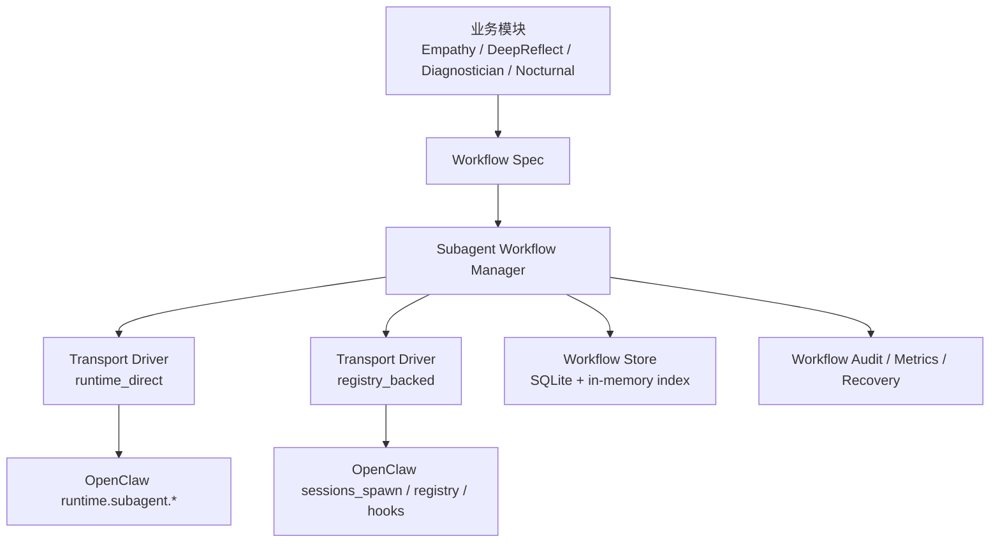

# Subagent Workflow Helper 设计方案

**日期**: 2026-03-31  
**状态**: Proposed  
**适用范围**: `packages/openclaw-plugin`  
**目标读者**: PD 核心维护者、OpenClaw 插件开发者、AI 编码助手

## 1. 背景

Principles Disciple 在多个核心能力上大量依赖子代理，包括但不限于：

- 共情观察器（Empathy Observer）
- 深度反思（Deep Reflect）
- 诊断与演化恢复（Diagnostician / Evolution）
- 夜间演化 / 睡眠模式相关 worker
- 路由观察与影子分析类子任务

这些能力都不是“边缘附属功能”，而是 PD 的核心智能化能力。一旦子代理生命周期处理不稳定，PD 会出现：

- 误判完成、提前清理
- 重复回收、重复写入
- 子代理 session 泄漏
- 结果丢失、假阴性
- 依赖 hook 的链路在 OpenClaw 升级后悄悄失效
- 难以定位的业务断裂点

OpenClaw 已经提供了子代理 API，但这些 API 提供的是运行时能力，不是业务工作流保障。PD 当前缺少的是“把子代理当成业务工作流来安全管理”的中间层。

---

## 2. 问题定义

### 2.1 核心判断

`subagent workflow helper` **不是**为了替代 OpenClaw 的子代理 API。  
它要解决的是：

> OpenClaw 提供的是“启动和观察子代理的能力”，但 PD 缺的是“把子代理稳定地跑成业务工作流”的那一层。

OpenClaw 负责：

- 启动子代理
- 返回 `runId`
- 提供 session 消息读取
- 提供 session 删除
- 在特定路径下发出生命周期 hook

但 OpenClaw **不会替 PD 决定**：

- 这个子代理属于什么业务角色
- 它的成功条件是什么
- timeout 是继续等待、失败、重试，还是进入 fallback
- 什么时候允许落库
- cleanup 失败时是否仍算完成
- 如何避免双重 finalize
- 如何稳定保存 `parentSessionId / childSessionKey / runId / workflowId`
- 多种 transport 并存时怎么统一恢复语义

### 2.2 当前项目的真实现状

经过对 PD 和 OpenClaw 源码的重新核对，当前至少存在 **两套不同的子代理 transport**：

#### A. `runtime.subagent.*` 直连路径

典型位置：

- [deep-reflect.ts](/D:/Code/principles/packages/openclaw-plugin/src/tools/deep-reflect.ts)
- 共情观察器的修复链路（PR #134）

特点：

- 由插件直接调用 `run / waitForRun / getSessionMessages / deleteSession`
- PD 自己承担生命周期管理责任
- 如果不额外治理，最容易出现 timeout 误判、cleanup 过早、幂等缺失等问题

#### B. `sessions_spawn` / registry 托管路径

典型位置：

- [prompt.ts](/D:/Code/principles/packages/openclaw-plugin/src/hooks/prompt.ts)
- [subagent.ts](/D:/Code/principles/packages/openclaw-plugin/src/hooks/subagent.ts)
- [evolution-worker.ts](/D:/Code/principles/packages/openclaw-plugin/src/service/evolution-worker.ts)

特点：

- 走 OpenClaw 正式 subagent registry
- `subagent_ended` 有官方生命周期语义
- 更适合任务型 worker，但仍然缺少 PD 业务层的统一归因、幂等、cleanup 约束

### 2.3 OpenClaw 侧确认到的关键事实

#### 事实 1：插件 runtime `subagent.run()` 并不等于“进入 subagent registry”

在 [server-plugins.ts](/D:/Code/openclaw/src/gateway/server-plugins.ts) 中，插件 runtime 的 `subagent.run()` 实际只是把调用转发到 gateway `agent` 方法，并返回 `runId`。

这意味着：

- 它可以启动 child run
- 但它不天然等于 `sessions_spawn`
- 也不天然保证 `subagent_ended` 一定来自 registry completion

#### 事实 2：正式 registry 生命周期来自 `sessions_spawn`

在 [subagent-spawn.ts](/D:/Code/openclaw/src/agents/subagent-spawn.ts) 中：

- child session key 在这里生成
- `registerSubagentRun(...)` 在这里写 registry

在 [subagent-registry-completion.ts](/D:/Code/openclaw/src/agents/subagent-registry-completion.ts) 中：

- `subagent_ended` 是由 registry completion 发出的

这说明：

> PD 不能把所有子代理链路都假定为同一套生命周期模型。

---

## 3. 当前痛点

PD 当前在“主代理派生子代理”的场景下面临 6 类系统性问题。

### 3.1 运行时能力和业务语义断层

OpenClaw 只知道“run 了一个 agent”，但 PD 需要区分：

- empathy observer
- deep reflect
- diagnostician
- nocturnal worker
- routing shadow observer

这些类型的成功条件、超时策略、落库语义都不同。

### 3.2 生命周期不一致

当前项目中，有的链路靠：

- `subagent_ended`
- `waitForRun`
- 直接 `getSessionMessages`
- marker file / queue placeholder

结果是：

- 有的链路依赖了实际不会触发的 hook
- 有的链路把 timeout 当完成
- 有的链路过早 `deleteSession`
- 有的链路没有真正 cleanup

### 3.3 身份归因脆弱

当前常见问题：

- 从 `sessionKey` 反解 `parentSessionId`
- 用字符串前缀判断 workflow 类型
- 把 `sessionKey` 当 `runId`
- 用 prompt 内容猜 child 身份

这些都属于隐式协议，会随着 OpenClaw 或实现细节变化而失效。

### 3.4 结果收敛逻辑分散

每个模块都在自己决定：

- 什么时候读结果
- 读哪条 assistant 文本
- 什么算可收割结果
- 什么情况下可以落业务状态

这会导致同类 bug 在多个模块重复出现。

### 3.5 幂等和恢复能力弱

子代理工作流天然会遇到：

- timeout 但实际上还在跑
- run 已结束但消息还未立即可见
- polling 和 hook 同时命中
- cleanup 部分成功部分失败

没有统一工作流层时，每个模块都会只处理一部分边界。

### 3.6 缺少项目级可观测性

当前很难直接回答：

- 现在有多少活跃 workflow
- 哪些 workflow 卡住了
- 哪些 timeout 后没有收敛
- 哪些 session 没删
- 哪些结果被重复写入

这使得很多问题只能在事故发生后倒查。

---

## 4. 设计目标

### 4.1 主要目标

`subagent workflow helper` 需要成为 PD 的 **业务可靠性编排层**，统一解决：

1. 统一身份模型
2. 统一生命周期模型
3. 统一回收与 cleanup 责任
4. 统一 finalize 幂等语义
5. 统一 transport 差异的抽象
6. 统一可观测性与审计

### 4.2 非目标

helper 不应该做这些事：

- 不承载 empathy / diagnostician / reflect 的业务字段语义
- 不直接决定业务结果如何解释
- 不绕开 OpenClaw API 自己实现新子代理系统
- 不强行把所有子代理 transport 改成同一种实现

---

## 5. 设计哲学

### 5.1 OpenClaw 管“能跑”，PD helper 管“怎么可靠地跑成业务能力”

这是整个方案的边界。

### 5.2 Transport 可变，Workflow 语义稳定

PD 可以同时支持：

- `runtime_direct`
- `registry_backed`

但业务层看到的 workflow 生命周期要统一。

### 5.3 Cleanup 是正式终态的一部分

cleanup 不是“顺手做一下”。  
如果 session cleanup 失败，workflow 需要显式进入 `completed_with_cleanup_error` 或 `cleanup_pending`，不能悄悄吞掉。

### 5.4 Finalize 必须幂等

无论主链路、fallback、重试还是 hook 二次命中，都必须保证业务状态最多只写一次。

### 5.5 状态必须持久化，可恢复，可审计

不能只靠内存 `Map`，否则进程重启、OpenClaw 升级、异步顺序变化都会让工作流状态丢失。

### 5.6 先收口底层语义，再逐业务迁移

helper 第一阶段要先解决生命周期和可观测性，不要一开始就大规模改业务逻辑。

---

## 6. 整体架构



---

## 7. 核心概念模型

每个子代理工作流实例至少要有以下统一身份：

- `workflowId`
- `workflowType`
- `transport`
- `parentSessionId`
- `childSessionKey`
- `runId`
- `workspaceDir`
- `dedupeKey`

### 7.1 `workflowType`

例如：

- `empathy_observer`
- `deep_reflect`
- `diagnostician_task`
- `nocturnal_eval`
- `routing_shadow_observer`

### 7.2 `transport`

枚举建议：

- `runtime_direct`
- `registry_backed`

### 7.3 `dedupeKey`

用于业务幂等控制，不应直接等于 `runId` 或 `sessionKey`。  
建议由 `workflowType + parentSessionId + logicalTaskId` 组合而成。

---

## 8. 生命周期状态机

第一版建议至少支持这些状态：

- `requested`
- `spawned`
- `waiting`
- `timeout_pending`
- `error_pending`
- `result_ready`
- `finalizing`
- `persisted`
- `cleanup_pending`
- `completed`
- `completed_with_cleanup_error`
- `expired`
- `failed`

### 状态语义

- `timeout_pending`: wait 超时，但 workflow 尚未终止
- `error_pending`: wait / hook / transport 层出错，但不能判定业务失败
- `finalizing`: 开始读取结果、落库、cleanup
- `completed`: 结果成功收敛，cleanup 完成
- `completed_with_cleanup_error`: 结果收敛成功，但 cleanup 未完成
- `expired`: 超过 TTL 未收敛，被系统回收

### 核心不变量

1. `timeout` 不是完成态  
2. `error` 不是天然完成态  
3. 一个 workflow 最多只能成功 finalize 一次  
4. cleanup 失败不能伪装成“完全成功”  
5. 任何活跃 workflow 都必须可查询到其当前状态

---

## 9. 核心组件设计

### 9.1 Workflow Spec

每种业务工作流通过 spec 声明自己的行为。

示例结构：

```ts
type WorkflowTransport = 'runtime_direct' | 'registry_backed';

interface SubagentWorkflowSpec<TResult> {
  workflowType: string;
  transport: WorkflowTransport;
  timeoutMs: number;
  ttlMs: number;
  shouldDeleteSessionAfterFinalize: boolean;
  parseResult: (ctx: WorkflowResultContext) => Promise<TResult | null>;
  persistResult: (ctx: WorkflowPersistContext<TResult>) => Promise<void>;
  shouldFinalizeOnWaitStatus: (status: 'ok' | 'timeout' | 'error') => boolean;
}
```

这个 spec 允许不同业务定义：

- 怎样解析结果
- 怎样持久化结果
- timeout / error 是否允许进入 finalize

但不再允许每个模块自造一整套生命周期。

### 9.2 Workflow Manager

这是 helper 的核心。

职责：

- 创建 workflow 实例
- 写入初始状态
- 选择 transport driver
- 记录 `runId / childSessionKey / parentSessionId`
- 驱动 `wait` 或 hook 观察
- 执行 `finalizeOnce`
- 执行 cleanup
- 记录状态流转

### 9.3 Transport Drivers

#### `RuntimeDirectDriver`

负责：

- `runtime.subagent.run`
- `waitForRun`
- `getSessionMessages`
- `deleteSession`

适用：

- empathy observer
- deep-reflect
- 未来插件内直调 runtime 的 lightweight worker

#### `RegistryBackedDriver`

负责：

- `sessions_spawn`
- 关联 `subagent_spawned` / `subagent_ended`
- 读取 registry 托管 session

适用：

- diagnostician
- evolution worker
- 依赖 OpenClaw 正式 subagent registry 的任务型子代理

### 9.4 Workflow Store

建议基于 PD 现有 trajectory SQLite 扩展两张表：

#### `subagent_workflows`

- `workflow_id`
- `workflow_type`
- `transport`
- `parent_session_id`
- `child_session_key`
- `run_id`
- `state`
- `cleanup_state`
- `created_at`
- `updated_at`
- `last_observed_at`
- `metadata_json`

#### `subagent_workflow_events`

- `workflow_id`
- `event_type`
- `from_state`
- `to_state`
- `reason`
- `payload_json`
- `created_at`

### 9.5 Audit / Recovery

需要一个审计器定期扫描：

- 卡在 `timeout_pending` 超过 TTL 的 workflow
- 卡在 `cleanup_pending` 的 workflow
- child session 仍存在但 workflow 已终止
- workflow state 和真实 OpenClaw 状态不一致
- 同一 dedupeKey 被重复 finalize 的尝试

---

## 10. 推荐最小 API

helper 第一版 API 建议收敛到 5 个入口。

### 10.1 `startWorkflow(...)`

```ts
startWorkflow(spec, {
  parentSessionId,
  workspaceDir,
  taskInput,
  metadata,
}): Promise<WorkflowHandle>
```

返回：

- `workflowId`
- `childSessionKey`
- `runId?`

### 10.2 `notifyWaitResult(...)`

供 runtime_direct 路径把 wait 结果回灌到统一状态机。

### 10.3 `notifyLifecycleEvent(...)`

供 registry_backed 路径把 `subagent_spawned` / `subagent_ended` 等 hook 事件回灌进状态机。

### 10.4 `finalizeOnce(...)`

统一执行：

- 读消息
- parse result
- persist result
- cleanup
- 标记终态

### 10.5 `sweepExpiredWorkflows(...)`

定时做 TTL 恢复和 orphan cleanup。

---

## 11. 统一策略

### 11.1 timeout 策略

默认规则：

- `waitForRun(timeout)` 不等于 completed
- 进入 `timeout_pending`
- 保留 workflow 记录
- 是否允许 cleanup，由 spec 决定
- 等待 fallback 或 sweep

### 11.2 error 策略

默认规则：

- transport error 不等于业务失败
- 进入 `error_pending`
- 不立即标记 `completed`
- 可以交由 fallback 或 retry 处理

### 11.3 finalize 幂等策略

helper 统一维护：

- `workflowId`
- `dedupeKey`
- `completedAt`

任何 finalize 前都先检查：

- 是否已成功完成
- 是否已进入 `finalizing`
- 是否有同 dedupeKey 的成功结果

### 11.4 cleanup 策略

默认规则：

- cleanup 独立于业务 parse/persist
- `deleteSession` 失败时进入 `completed_with_cleanup_error` 或 `cleanup_pending`
- 审计器可继续重试 cleanup

---

## 12. 与现有业务的映射

### 12.1 Empathy Observer

最适合作为 helper 第一批接入对象。

原因：

- workflow 边界清晰
- child result 是结构化 JSON
- 强依赖幂等和 cleanup
- 已经暴露出 timeout / fallback / cleanup 相关问题

helper 接入后：

- transport 使用 `runtime_direct`
- 业务模块只负责 parse empathy payload 与 persistence
- timeout / fallback / cleanup 由 helper 接管

### 12.2 Deep Reflect

第二批必须接入。

原因：

- 当前存在 `sessionKey` / `runId` 语义混乱
- cleanup 和 timeout 语义不稳
- 适合验证 `runtime_direct` driver 的通用性

### 12.3 Diagnostician / Evolution

第三批接入。

原因：

- transport 是 `registry_backed`
- 有 queue / HEARTBEAT / placeholder 匹配逻辑
- 最能验证 helper 是否真的支持 heterogeneous transport

### 12.4 Nocturnal / Routing / Shadow Observation

第四批接入。

原因：

- 往往更复杂，跨多个服务和文件
- 需要在 helper 内核稳定后再迁移

---

## 13. 实施计划

### Phase A：建立 helper 内核，不接业务

交付：

- `subagent-workflow/` 模块
- `WorkflowSpec`
- `WorkflowManager`
- 两个 transport driver
- workflow store
- workflow audit / sweep

这一阶段只 shadow 运行，不接管业务。

### Phase B：接入 Empathy Observer

交付：

- empathy observer 改为通过 helper 启动和 finalize
- 保留短期 shadow 对比
- 验证 orphan / timeout / cleanup 指标

### Phase C：接入 Deep Reflect

交付：

- 移除 `sessionKey == runId` 这类错误假设
- 统一 cleanup 与 timeout 策略

### Phase D：接入 Diagnostician / Evolution

交付：

- 把 queue / placeholder / hook 匹配的生命周期收敛进 helper
- 降低 `subagent.ts` 的复杂度和脆弱字符串协议

---

## 14. 预期收益

### 14.1 稳定性提升

- 不再由各业务模块自行处理 timeout / error / cleanup
- 减少 false negative、重复写入、session 泄漏

### 14.2 可观测性提升

可以直接回答：

- 当前有哪些活跃 workflow
- 哪些 timeout 未收敛
- 哪些 cleanup 失败
- 哪些 workflow orphan

### 14.3 OpenClaw 升级韧性提升

OpenClaw 变化时，冲击面集中到 driver 层，而不是每个业务模块各自碎裂。

### 14.4 LLM 不稳定韧性提升

即使模型慢、超时、返回延迟或偶发异常，workflow 状态和补偿策略也能保持一致。

### 14.5 新功能交付成本下降

以后新增子代理驱动的功能时，业务模块只需要声明：

- 使用哪种 transport
- 如何 parse result
- 如何 persist result

而不用重新发明一套生命周期管理逻辑。

---

## 15. 风险与缓解

### 风险 1：helper 过度膨胀

缓解：

- helper 不解析业务语义
- helper 只做 workflow 编排

### 风险 2：一口气迁移过多模块

缓解：

- 采用 phased rollout
- 先 empathy，再 deep-reflect，再 diagnostician

### 风险 3：新旧链路并存造成双写

缓解：

- 使用 shadow 模式
- 引入 dedupeKey
- 统一 `finalizeOnce`

### 风险 4：cleanup 语义改变引入新残留

缓解：

- 将 cleanup 状态显式入库
- sweep 定期补偿

---

## 16. 最终结论

PD 当前遇到的问题，不是某个单点 bug，而是：

> 子代理运行时能力已经具备，但业务工作流层长期缺位。

因此，`subagent workflow helper` 的使命不是封装 OpenClaw API，而是：

> 把“不可靠、分散、隐式的子代理调用”收敛成“可追踪、可回收、可幂等、可审计的业务工作流”。

这会成为 PD 未来所有子代理驱动能力的稳定底座。

如果后续要进入实施阶段，建议先从 **Phase A helper 内核** 和 **Phase B empathy 接入** 开始。
