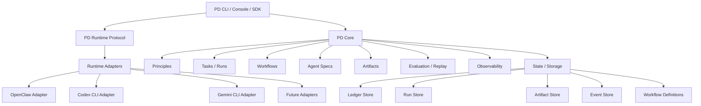

# PD Runtime-Agnostic Architecture v2

> Status: Draft v1  
> Date: 2026-04-21  
> Scope: PD Core / Runtime Protocol / Adapter / CLI / Diagnostician v2

## 1. Purpose

This document proposes the first full runtime-agnostic architecture for PD.

The central design move is:

- PD stops being designed around OpenClaw
- OpenClaw becomes one compatible runtime adapter
- PD CLI becomes the main control plane
- PD Core owns principles, workflows, tasks, agents, runs, artifacts, evaluation, and observability

This is not a greenfield rewrite proposal. It is a consolidation proposal based on abstractions that already exist in the codebase.

## 2. Current Architectural Facts

The current repository already contains several reusable foundations:

### 2.1 Universal SDK Core Already Exists

The package [@principles/core](/D:/Code/principles/packages/principles-core) is not a placeholder. It already exposes framework-agnostic interfaces and schemas:

- `PainSignalAdapter`
- `StorageAdapter`
- `PrincipleInjector`
- `TelemetryEvent`
- shared principle and ledger types

Relevant files:

- [packages/principles-core/package.json](/D:/Code/principles/packages/principles-core/package.json)
- [packages/principles-core/src/index.ts](/D:/Code/principles/packages/principles-core/src/index.ts)
- [packages/principles-core/src/pain-signal-adapter.ts](/D:/Code/principles/packages/principles-core/src/pain-signal-adapter.ts)
- [packages/principles-core/src/storage-adapter.ts](/D:/Code/principles/packages/principles-core/src/storage-adapter.ts)
- [packages/principles-core/src/principle-injector.ts](/D:/Code/principles/packages/principles-core/src/principle-injector.ts)
- [packages/principles-core/src/telemetry-event.ts](/D:/Code/principles/packages/principles-core/src/telemetry-event.ts)

This package is the natural seed of PD Core.

### 2.2 Declarative Workflow and Task Assets Already Exist

The current system already contains the beginnings of declarative truth sources:

- `workflows.yaml` is loaded through [workflow-funnel-loader.ts](/D:/Code/principles/packages/openclaw-plugin/src/core/workflow-funnel-loader.ts)
- `/pd-evolution-status` already reads YAML-driven funnel definitions through [evolution-status.ts](/D:/Code/principles/packages/openclaw-plugin/src/commands/evolution-status.ts)
- `pd_tasks.json` is already modeled through [pd-task-types.ts](/D:/Code/principles/packages/openclaw-plugin/src/core/pd-task-types.ts) and [pd-task-store.ts](/D:/Code/principles/packages/openclaw-plugin/src/core/pd-task-store.ts)
- `PDTaskService` already reconciles task declarations through [pd-task-service.ts](/D:/Code/principles/packages/openclaw-plugin/src/core/pd-task-service.ts)

This means PD already has the right instinct: declaration separate from runtime materialization.

### 2.3 Runtime Adapter Thinking Already Exists in Nocturnal

The nocturnal Trinity pipeline contains a real runtime abstraction:

- `TrinityRuntimeAdapter`
- `OpenClawTrinityRuntimeAdapter`
- explicit `invokeDreamer`, `invokePhilosopher`, `invokeScribe`

Relevant file:

- [packages/openclaw-plugin/src/core/nocturnal-trinity.ts](/D:/Code/principles/packages/openclaw-plugin/src/core/nocturnal-trinity.ts)

This is important because it proves the codebase has already moved beyond pure prompt-based orchestration in at least one area.

### 2.4 The Main Structural Failure Still Exists

Despite the abstractions above, key execution chains still depend on prompt compliance instead of explicit runtime contracts.

The clearest example is `diagnostician`:

- the worker writes tasks
- heartbeat or cron prompt injection exposes those tasks
- the main LLM is told in text to follow a skill/protocol
- the LLM is expected to write JSON files and completion markers
- the rest of the system infers completion from those side effects

This is the wrong boundary. It mixes:

- reasoning
- dispatch
- persistence
- state transition
- retry semantics

inside one unreliable prompt-driven execution path.

## 3. Why v2 Is Necessary

The current architecture creates recurring pain for the same reason:

- PD domain logic is entangled with host runtime lifecycle
- host-specific assumptions leak into PD execution logic
- critical state transitions depend on implicit conventions
- observability is partial because execution is partial

As long as PD remains primarily an OpenClaw plugin with internal business logic embedded inside hooks, commands, and session conventions, every host runtime change will continue to destabilize PD itself.

The redesign goal is not just portability. It is control:

- clearer execution boundaries
- fewer hidden assumptions
- stronger observability
- easier multi-runtime support
- easier debugging
- easier future evolution

## 4. Design Goals

PD v2 should satisfy the following:

1. PD Core must not depend on OpenClaw-specific lifecycle semantics.
2. PD agents must be first-class modeled entities, not scattered prompt conventions.
3. LLMs must be used for cognition, not for transaction control.
4. Workflows must be declared explicitly.
5. Runs, tasks, artifacts, and events must be represented explicitly.
6. CLI must become the main control surface.
7. OpenClaw, Codex CLI, Gemini CLI, and future runtimes must plug into the same runtime protocol.

## 5. Core Design Principles

### 5.1 PD Core Before Runtime

PD must define its own:

- principles
- rules
- tasks
- workflows
- agent roles
- artifacts
- evaluation contracts
- observability contracts

Runtime adapters are execution shells around these concepts, not their source.

### 5.2 CLI Is Transport, Not Architecture

Using CLI runtimes is a good direction. However, raw CLI calls must not become the architecture.

The architecture must be:

- PD Core
- PD Runtime Protocol
- Runtime Adapters
- PD CLI

not:

- shell command glue
- stdout parsing
- tool-specific branching everywhere

### 5.3 LLMs Produce Reasoning, Not System State

LLMs should generate:

- diagnosis results
- ranked candidates
- rule drafts
- implementation drafts
- structured evaluations

System code should own:

- task leasing
- retries
- state transitions
- atomic persistence
- artifact registration
- idempotency
- completion bookkeeping

### 5.4 Declaration and Runtime Fact Must Be Separated

PD needs explicit distinction between:

- declaration state
- runtime state
- read models

Examples:

- `workflows.yaml` declares funnel/workflow intent
- run store records actual execution state
- summary service builds operator-facing read models

### 5.5 OpenClaw Must Be Demoted to Adapter Status

OpenClaw remains supported.

But OpenClaw cannot remain the conceptual center of the system.

## 6. Four-Layer Architecture



### 6.1 PD Core

Owns domain objects and domain logic.

### 6.2 PD Runtime Protocol

Owns the contract between PD logic and external execution runtimes.

### 6.3 Runtime Adapters

Translate the runtime protocol into host-specific execution behavior.

### 6.4 PD CLI / Console / SDK

Expose stable user, automation, and operator control surfaces.

### 6.5 PD Worker

PD Worker is the long-running background execution process owned by PD.

It is distinct from both:

- PD Core, which defines domain logic and contracts
- PD CLI, which is the command-line entrypoint into those services

Its responsibilities include:

- leasing tasks
- assembling context
- invoking runtime adapters
- validating outputs
- committing artifacts and task state
- emitting telemetry

This distinction prevents the CLI from being overloaded conceptually as both a transport and a scheduler process.

## 7. PD Core Domain Model

PD v2 should formalize the following first-class entities.

### 7.1 Principle

Suggested fields:

- `principleId`
- `title`
- `text`
- `priority`
- `status`
- `source`
- `derivedFromPainSignals`
- `implementationRoutes`
- `coverage`
- `lastObservedAt`
- `promotionState`

### 7.2 Rule

Suggested fields:

- `ruleId`
- `principleId`
- `status`
- `manifest`
- `artifactRef`
- `coverage`
- `confidence`
- `enforcementMode`

### 7.3 AgentSpec

This is the main missing formal object today.

It turns roles like `diagnostician`, `explorer`, `dreamer`, `philosopher`, `scribe`, and `artificer` into first-class PD-native agents.

Suggested fields:

- `agentId`
- `role`
- `purpose`
- `inputSchema`
- `outputSchema`
- `artifactContract`
- `capabilitiesRequired`
- `allowedToolsProfile`
- `timeoutPolicy`
- `retryPolicy`
- `executionMode`
- `preferredRuntimeKinds`
- `promptTemplateRef`
- `validatorRef`

### 7.4 WorkflowSpec

Suggested fields:

- `workflowId`
- `label`
- `kind`
- `triggerPolicy`
- `entryConditions`
- `stages`
- `completionConditions`
- `failurePolicy`
- `expectedArtifacts`
- `expectedEvents`
- `healthRules`

### 7.5 TaskSpec

Suggested fields:

- `taskId`
- `name`
- `schedule`
- `enabled`
- `targetWorkflowId`
- `targetAgentId`
- `executionPolicy`
- `deliveryPolicy`
- `runtimePreferences`
- `meta`

This can evolve directly from the current `PDTaskSpec`.

### 7.6 Run

Represents one concrete execution instance.

Suggested fields:

- `runId`
- `parentRunId`
- `taskId`
- `workflowId`
- `agentId`
- `runtimeKind`
- `runtimeRef`
- `status`
- `leaseOwner`
- `startedAt`
- `endedAt`
- `attempt`
- `inputRef`
- `outputRef`
- `artifactRefs`
- `error`

### 7.7 Artifact

Represents structured deliverables.

Suggested artifact types:

- `diagnosis_report`
- `principle_candidate`
- `rule_candidate`
- `implementation_candidate`
- `replay_eval_result`
- `training_dataset`
- `checkpoint_eval`

### 7.8 Event

Events are immutable facts emitted during execution.

They support observability, debugging, and read-model reconstruction.

## 8. PD Runtime Protocol

The runtime protocol is the core decoupling layer.

It defines how PD asks an external runtime to execute an agent or workflow stage.

### 8.1 Runtime Adapter Contract

```ts
interface PDRuntimeAdapter {
  kind(): RuntimeKind;

  getCapabilities(): Promise<RuntimeCapabilities>;

  startRun(input: StartRunInput): Promise<RunHandle>;

  pollRun(runId: string): Promise<RunStatus>;

  cancelRun(runId: string): Promise<void>;

  fetchOutput(runId: string): Promise<StructuredRunOutput | null>;

  fetchArtifacts(runId: string): Promise<RuntimeArtifactRef[]>;

  appendContext?(runId: string, items: ContextItem[]): Promise<void>;

  healthCheck(): Promise<RuntimeHealth>;
}
```

### 8.2 StartRunInput

Suggested fields:

- `agentSpec`
- `taskRef`
- `workflowRef`
- `inputPayload`
- `contextItems`
- `executionPolicy`
- `outputSchema`
- `artifactContract`
- `timeoutMs`
- `idempotencyKey`

### 8.3 RuntimeCapabilities

Suggested capability flags:

- supportsStructuredJsonOutput
- supportsToolUse
- supportsWorkingDirectory
- supportsModelSelection
- supportsLongRunningSessions
- supportsCancellation
- supportsArtifactWriteBack
- supportsConcurrentRuns
- supportsStreaming

The point is to stop guessing what the host can do.

### 8.4 Error Semantics

Each adapter should translate host-specific failures into stable PD categories:

- `runtime_unavailable`
- `capability_missing`
- `input_invalid`
- `execution_failed`
- `timeout`
- `cancelled`
- `output_invalid`
- `artifact_commit_failed`

## 9. Runtime Adapters

### 9.1 OpenClaw Adapter

Responsibilities:

- wrap plugin commands, embedded agent execution, and session lifecycle
- map OpenClaw execution into `RunHandle` and `RunStatus`
- hide OpenClaw session/workspace semantics behind the runtime protocol

The OpenClaw adapter must not own PD business rules.

### 9.2 Codex CLI Adapter

Responsibilities:

- launch Codex CLI with controlled working directory and input
- enforce structured output format
- capture stdout/stderr and map it to PD run states
- implement timeout, cancellation, and basic artifact handoff

### 9.3 Gemini CLI Adapter

Same architectural role as Codex CLI adapter.

### 9.4 Adapter Constraints

All adapters are allowed to translate runtime details.

No adapter is allowed to redefine:

- PD workflows
- principle logic
- agent role semantics
- task states

### 9.5 RuntimeSelector

PD should introduce a `RuntimeSelector` component.

Its job is to deterministically choose a runtime backend for a given agent execution request.

The selector should consider:

- `AgentSpec.preferredRuntimeKinds`
- runtime capability probe results
- runtime health state
- workspace policy
- fallback policy
- optional cost or model policy

This prevents execution backend choice from being implicit or ad hoc.

## 10. PD CLI as Main Control Plane

The current repository already has plugin commands such as:

- `/pd-evolution-status`
- `/pd-reflect`
- implementation-related commands

In v2, these should no longer be the primary UX surface.

They become compatibility entrypoints, while a real `pd` CLI becomes primary.

### 10.1 Responsibilities of PD CLI

- inspect PD state
- trigger tasks and workflows
- query agent health
- inspect runs and artifacts
- perform admin operations
- choose runtime backend explicitly when needed

### 10.2 Suggested Command Families

#### Control Plane

- `pd status`
- `pd health`
- `pd doctor`
- `pd version`

#### Tasks and Runs

- `pd task list`
- `pd task show <id>`
- `pd task run <id>`
- `pd task pause <id>`
- `pd run list`
- `pd run show <runId>`
- `pd run cancel <runId>`

#### Workflows

- `pd workflow list`
- `pd workflow show <id>`
- `pd workflow trigger <id>`

#### Agents

- `pd agent list`
- `pd agent show <id>`
- `pd agent probe <id>`

#### Principles / Rules / Implementations

- `pd principle list`
- `pd principle show <id>`
- `pd rule list`
- `pd impl list`
- `pd promote ...`
- `pd disable ...`

#### Diagnosis / Replay / Nocturnal

- `pd diagnose run`
- `pd replay run`
- `pd nocturnal run`
- `pd nocturnal status`

#### History / Trajectory

- `pd history query`
- `pd trajectory locate`
- `pd context build`

### 10.3 CLI Output Rules

PD CLI should support:

- `--json`
- `--workspace`
- `--runtime`
- `--agent`
- `--verbose`

This makes it usable by:

- humans
- scripts
- other agents
- CI / cron

## 11. Workflow Definitions

### 11.1 Current Situation

`workflows.yaml` currently acts primarily as funnel display configuration.

That is useful, but too narrow.

### 11.2 v2 Goal

Upgrade workflow definitions so they describe both:

- what should run
- what should be observable

without turning YAML into business logic code.

### 11.3 Suggested WorkflowSpec Shape

```yaml
version: "1"
workflows:
  - workflowId: wf.diagnostician
    label: Diagnostician
    trigger:
      kind: queued_task
    stages:
      - stageId: task_leased
        agentId: diagnostician
        expectedArtifact: diagnosis_report
        expectedEvent: diagnostician_report
      - stageId: principle_candidate_created
        expectedArtifact: principle_candidate
    health:
      freshnessSlaMinutes: 30
      stalledIf:
        - pendingTasks > 0
        - reportsWrittenToday == 0
```

### 11.4 Design Boundary

YAML declares contract and expectations.

TypeScript code implements orchestration.

This preserves explicitness without pushing core logic into configuration.

## 11A. History and Trajectory Retrieval as a First-Class PD Tool

PD should add a dedicated foundational CLI capability for retrieving user-agent historical trajectory data.

This is not a convenience feature. It is a core prerequisite for:

- diagnostician quality
- replay quality
- nocturnal reflection quality
- principle extraction quality
- root cause analysis quality

### 11A.1 Problem Statement

PD needs to perform deep reflection on prior interactions.

In practice, accurately locating the relevant conversation trace is often the hardest part of the diagnosis task.

Even when a pain signal records a `sessionId`, that identifier alone is not enough to guarantee correct trajectory retrieval because:

- session identifiers may be partial, stale, or ambiguous
- relevant evidence may span multiple files or indexes
- useful context may be distributed across database rows, event logs, trajectory files, and workspace state
- the true evidence window may require iterative confirmation rather than one direct lookup

Therefore, historical trajectory retrieval must not be modeled as:

- one SQL query
- one fixed file path read
- one fragile host-specific API call

It should be modeled as a PD-native retrieval workflow.

### 11A.2 Architectural Position

PD should own historical trajectory lookup through stable CLI and tool interfaces.

Agents should not be forced to directly improvise against raw storage such as:

- SQLite tables
- host session registries
- ad hoc file naming conventions
- transient runtime APIs

Instead, PD should expose a controlled retrieval surface that encapsulates the lookup complexity.

### 11A.3 Foundational CLI Commands

The first version should include at least these commands:

- `pd history query`
- `pd trajectory locate`
- `pd context build`

#### `pd trajectory locate`

Purpose:

- locate the most likely relevant trajectory root for a pain signal, task, run, or session reference

Possible inputs:

- `--pain-id`
- `--task-id`
- `--run-id`
- `--session-id`
- `--time-range`
- `--workspace`

Expected behavior:

- search across multiple evidence sources
- rank likely matches
- expose confidence and reason codes
- return machine-readable structured output

#### `pd history query`

Purpose:

- extract a bounded historical interaction slice once a candidate trajectory or session has been identified

Possible capabilities:

- filter by role
- filter by time range
- filter by trigger
- include neighboring tool calls
- include relevant event summaries
- return plain text or JSON

#### `pd context build`

Purpose:

- assemble a reflection-ready `ContextPayload` for diagnostician, replay, or nocturnal workflows

The assembled payload may include:

- conversation excerpts
- task metadata
- relevant tool failures
- gate events
- nearby file operations
- recent principle/rule context
- confidence notes about retrieval ambiguity

### 11A.4 Retrieval Is a Workflow, Not a Query

This is the key design rule.

Trajectory retrieval should be treated as a controlled PD workflow with multiple steps:

1. identify candidate references
2. expand candidate evidence windows
3. confirm or reject relevance
4. assemble a bounded context payload

This may involve:

- SQL access
- directory scanning
- artifact correlation
- event-log inspection
- trajectory index lookup
- file existence confirmation

The agent may still use tools during this process, but it should do so through PD-owned interfaces and helper commands rather than by improvising directly against fragile raw storage.

### 11A.5 Why This Must Be Owned by PD

If historical lookup remains host-specific or ad hoc, then reflection quality will remain unstable.

That instability propagates upward:

- wrong trajectory chosen
- wrong root cause inferred
- wrong principle extracted
- wrong rule synthesized
- wrong internalization path selected

This is a high-leverage foundation because better trajectory retrieval improves every downstream reflective workflow.

### 11A.6 Relationship to Agent Capability

This design also reduces dependency on frontier-scale models.

If PD standardizes retrieval, then the runtime agent no longer needs to be excellent at:

- discovering where evidence lives
- remembering storage conventions
- adapting to host-specific APIs
- guessing how to reconstruct the right context

Instead, the agent can focus on:

- interpreting evidence
- comparing hypotheses
- producing structured reasoning

That is a deliberate architectural move:

**PD should turn retrieval and state lookup into standardized tools so that agents can spend more capability budget on reasoning instead of system archaeology.**

### 11A.7 Design Constraint

The historical trajectory toolchain must be:

- runtime-agnostic
- workspace-safe
- schema-validated
- bounded by explicit query and output contracts
- resistant to raw storage drift

In short:

**history retrieval is a foundational PD system capability, not an implementation detail of OpenClaw, SQL, or a single session ID.**

## 12. Specialized PD Agents

Today these roles exist, but not as unified first-class objects:

- diagnostician
- explorer
- dreamer
- philosopher
- scribe
- artificer
- replay-judge
- rule-author

They currently appear as a mix of:

- skills
- prompt templates
- workflow stages
- session conventions
- adapter methods

This must be unified.

### 12.1 Agent Registry

PD should introduce an agent registry:

```ts
interface AgentRegistryEntry {
  agentId: string;
  spec: AgentSpec;
  promptTemplateRef?: string;
  validatorRef?: string;
  artifactWriterRef?: string;
}
```

### 12.2 Minimum Contract Per Agent

Every PD agent must explicitly define:

- input schema
- output schema
- artifact type
- capability requirements
- retry policy
- timeout policy

## 13. Diagnostician v2

Diagnostician is the best first target for the new architecture because it is currently the clearest structural pain source.

### 13.1 Problem Summary

Current diagnostician flow:

- task is written to queue
- prompt hook injects task text during heartbeat or cron
- LLM is told to follow a skill/protocol
- LLM is expected to write JSON and marker files
- downstream code infers completion from side effects

This is not a reliable task system.

### 13.2 Target Shape

Diagnostician v2 should have four explicit components:

1. `DiagnosticianTaskQueue`
2. `DiagnosticianRunner`
3. `DiagnosticianLLMEngine`
4. `DiagnosticianCommitter`

### 13.3 Task Queue

Suggested task state machine:

- `pending`
- `leased`
- `succeeded`
- `retry_wait`
- `failed`

Tasks should no longer rely on marker files as their primary state source.

### 13.4 Runner

Responsibilities:

- claim task lease
- assemble minimal input
- choose runtime adapter
- invoke diagnostician agent
- validate output
- send result to committer

### 13.5 LLM Engine

Responsibilities:

- consume explicit diagnosis input
- return structured JSON diagnosis result

Non-responsibilities:

- do not write files
- do not transition task state
- do not decide retry bookkeeping
- do not emit completion markers

### 13.6 Committer

Responsibilities:

- persist diagnosis artifact
- emit events
- update task status
- create downstream principle candidates if appropriate
- ensure idempotent completion

### 13.7 Compatibility

Legacy files like:

- `.diagnostician_report_<id>.json`
- `.evolution_complete_<id>`

may still be emitted temporarily, but only as committer outputs.

They must no longer drive the primary state machine.

## 14. Nocturnal / Trinity as a v2 Pattern

The existing Trinity chain is important because it already models:

- explicit stage roles
- structured JSON I/O
- adapter-based runtime execution
- closed-fail validation
- stage telemetry

This should not remain isolated inside nocturnal logic.

The Trinity pattern should inform the general PD workflow execution model.

In other words:

- Trinity is not just a nocturnal implementation detail
- it is an early proof that PD can execute specialized agents through explicit runtime contracts

## 15. State and Storage Model

PD v2 should separate storage into three layers.

### 15.1 Declaration State

Examples:

- agent definitions
- workflow definitions
- task declarations
- principle metadata

### 15.2 Runtime State

Examples:

- run store
- queue store
- lease metadata
- event logs
- artifact index

### 15.3 Read Models

Examples:

- runtime summary
- funnel summary
- operator health summary
- CLI status views

### 15.4 Storage Rule

Artifacts are results, not primary execution truth.

This is a key shift from current diagnostician behavior.

## 16. Observability v2

The current funnel and summary work is good but incomplete.

PD should be able to answer:

- what is running
- what is stuck
- which workflow is degraded
- which runtime failed
- which agent is unhealthy
- whether the issue is input, execution, validation, or commit

### 16.1 Workflow Health Model

Each workflow should expose:

- `freshness`
- `expected cadence`
- `last run`
- `last success`
- `degraded reason`
- `blocked reason`
- `stalled rule`

### 16.2 Key Alerts

Examples:

- backlog rising while completions remain zero
- expected events missing
- runtime capability mismatch
- repeated output schema failures
- heartbeats present but diagnostician reports absent

## 17. OpenClaw Position in v2

### 17.1 What Remains

- OpenClaw remains a supported runtime adapter
- existing plugin commands remain as compatibility entrypoints
- current plugin integration is preserved during migration

### 17.2 What Changes

OpenClaw no longer defines:

- PD core semantics
- primary task lifecycle
- agent identity model
- main control plane

### 17.3 Strategic Outcome

OpenClaw becomes a backend, not the architecture.

## 18. Migration Plan

The migration should be staged, not all-at-once.

### Milestone 1: Formalize Core

- promote `@principles/core` into explicit PD Core
- introduce `AgentSpec`
- introduce unified `WorkflowSpec`
- introduce generalized runtime adapter contract

### Milestone 2: Diagnostician v2

- replace heartbeat prompt-driven execution with explicit runner
- keep artifact outputs compatible where needed
- move retries and state transitions into deterministic code

### Milestone 3: PD CLI

- establish a real `pd` CLI as the main control plane
- wrap current state, task, run, workflow, and agent inspection

### Milestone 4: OpenClaw Demotion

- keep `openclaw-plugin` as adapter shell
- stop adding new core business logic directly into plugin lifecycle hooks

### Milestone 5: Multi-Runtime Support

- add Codex CLI adapter
- add Gemini CLI adapter
- validate a shared run contract across runtimes

### Milestone 6: Unified Workflow Execution

- apply the same runtime protocol to diagnostician, nocturnal, replay, and rule generation chains

## 18A. Migration Safety and Rollback

Because this refactor touches core execution paths, rollback planning is part of the architecture, not an operational afterthought.

### 18A.1 Dual-Track Requirement

Early cutover phases should support dual-track execution:

- legacy execution path remains behind a feature flag
- new execution path runs on selected or mirrored workloads
- telemetry compares both paths before full cutover

### 18A.2 Rollback Requirement

Each milestone should define:

- rollback trigger criteria
- rollback procedure
- compatibility outputs preserved during rollback

Typical rollback triggers include:

- success rate drops below threshold
- invalid output rate spikes
- backlog growth exceeds threshold
- runtime capability mismatch frequency spikes

### 18A.3 Measurable Milestone Gates

Milestones should be considered complete only when measurable gates are met.

Examples:

- diagnostician v2 success rate reaches target threshold
- CLI coverage includes target operational flows
- multiple runtime adapters pass integration validation

## 18B. Observability Priority

Observability must begin in Milestone 1.

This refactor introduces new layers:

- task lease logic
- run records
- context assembly
- runtime selection
- validation
- commit transactions

Without early telemetry in these layers, cutover failures will be difficult to diagnose.

## 19. Direct Reuse from Current Code

### 19.1 Keep and Elevate

- [packages/principles-core](/D:/Code/principles/packages/principles-core)
- [packages/openclaw-plugin/src/core/workflow-funnel-loader.ts](/D:/Code/principles/packages/openclaw-plugin/src/core/workflow-funnel-loader.ts)
- [packages/openclaw-plugin/src/core/pd-task-types.ts](/D:/Code/principles/packages/openclaw-plugin/src/core/pd-task-types.ts)
- [packages/openclaw-plugin/src/core/pd-task-store.ts](/D:/Code/principles/packages/openclaw-plugin/src/core/pd-task-store.ts)
- [packages/openclaw-plugin/src/core/nocturnal-trinity.ts](/D:/Code/principles/packages/openclaw-plugin/src/core/nocturnal-trinity.ts)
- [packages/openclaw-plugin/src/service/runtime-summary-service.ts](/D:/Code/principles/packages/openclaw-plugin/src/service/runtime-summary-service.ts)

### 19.2 Refactor Aggressively

- heartbeat-driven diagnostician execution
- prompt-instruction-as-dispatch patterns
- file-side-effect-as-state-machine patterns
- plugin-command-as-primary-control-plane patterns

## 20. Final Architectural Position

PD v2 should be treated as:

- a principle-driven agent orchestration kernel
- with explicit workflows
- explicit agents
- explicit runs
- explicit artifacts
- explicit runtime adapters

OpenClaw, Codex CLI, Gemini CLI, and other hosts are important, but secondary.

The key move is not merely switching transport.

The key move is rebuilding the system boundary so that:

- host runtime changes do not redefine PD semantics
- prompt compliance is no longer mistaken for execution mechanism
- observability reflects explicit state, not inferred side effects

## 21. Recommended Follow-Up Documents

This draft should be followed by four deeper specs:

1. `PD Runtime Protocol SPEC v1`
2. `AgentSpec Schema v1`
3. `Diagnostician v2 Detailed Design`
4. `OpenClaw Adapter Migration Checklist`

These documents should convert the current strategic draft into implementation-ready contracts.

## 22. Design Refinements from Runtime Pain Review

This section captures refinements derived from recent production pain and architectural review.

These are not optional polish items. They are structural constraints intended to reduce system noise, remove non-deterministic failure points, and prevent bad runtime assumptions from cascading across the PD loop.

### 22.1 Context Pre-assembly Service

PD should introduce a shared `ContextAssembler` service.

Its job is to gather deterministic context before any LLM reasoning begins.

For diagnostician-like flows, this service should assemble a static `ContextPayload` that may include:

- recent conversation history
- relevant task metadata
- relevant file diffs
- relevant environment facts
- recent pain or gate evidence
- precomputed references to artifacts or trajectories

The LLM should receive this payload directly.

It should not be expected to reconstruct the payload by executing SOP steps such as:

- querying sessions history
- discovering relevant files dynamically
- guessing which evidence sources to inspect

#### Why this is required

When retrieval is pushed into the LLM prompt protocol, the system becomes vulnerable to:

- tool availability drift
- latency spikes
- output format drift
- prompt expansion
- higher branch complexity

The architectural rule is:

**context gathering is system work, not reasoning work**

### 22.2 Lease-Based Task Processing

All important PD background execution should move to explicit lease-based task processing.

This replaces the current pattern where completion is inferred primarily from marker files or loosely correlated side effects.

#### Required properties

Every queued execution task should support:

- explicit status
- lease owner
- lease expiry
- retry count
- terminal reason
- crash recovery

Minimum status model:

- `pending`
- `leased`
- `succeeded`
- `retry_wait`
- `failed`

#### Storage recommendation

The architecture does not require SQLite in principle.

However, given current repository patterns and the need for atomic updates, SQLite is the recommended first implementation target for run/task state.

The key architectural requirement is not the specific backend.

The key requirement is:

**task execution state must have atomic transitions and lease semantics**

### 22.3 Agent Identity Reification

Agent roles must be upgraded from informal prompt identities into explicit `AgentSpec` entities.

This is necessary because different PD tasks have materially different execution needs.

Examples:

- `diagnostician` needs strong reasoning and strict structured output
- `heartbeat-checker` needs speed and low cost
- `explorer` needs broader retrieval tolerance
- `artificer` needs stronger code generation behavior
- `replay-judge` needs strict schema conformance and scoring discipline

Each `AgentSpec` should be able to specify:

- preferred model profile
- temperature or deterministic generation policy
- input schema
- output schema
- timeout policy
- retry policy
- capability requirements
- artifact contract

The architectural rule is:

**PD agents are first-class system entities, not prompt aliases**

### 22.4 Command-as-Gateway

The plugin layer should be reduced to event capture and forwarding wherever possible.

In practice this means:

- OpenClaw hooks detect signals
- the OpenClaw adapter translates them
- PD worker or PD CLI processes the heavy logic asynchronously

The plugin should not remain the main execution surface for long-running or fragile workflows.

#### Example target pattern

When a pain signal is observed:

1. adapter captures the signal
2. adapter forwards it into PD runtime entrypoints
3. PD task/run system schedules downstream processing
4. diagnostician or follow-on workflow executes outside the hook's fragile lifecycle

This design reduces host instability risk:

- fewer long hook executions
- lower editor latency risk
- less coupling to host request scope
- easier debugging outside the host process

Important clarification:

CLI is the preferred carrier for this gateway boundary, but CLI is still not the architecture itself.

The real boundary is:

- host hook layer
- runtime adapter
- PD runtime protocol
- PD worker / control plane

### 22.5 Unified Committer

PD should introduce a shared `ResultCommitter` layer for all structured outputs produced by LLM-driven tasks.

This committer should be responsible for:

- output schema validation
- empty-result rejection
- artifact persistence
- artifact registration
- event emission
- task status advancement
- idempotent completion

#### Example failure cases it must intercept

- malformed JSON
- empty JSON
- missing required fields
- inconsistent artifact and status writes
- partial success that would poison downstream steps

The architectural rule is:

**unvalidated model output must never directly enter the next stage of the system**

### 22.6 Runtime Capability Probe

Each runtime adapter should expose a capability probe before PD schedules work onto it.

This is an additional requirement beyond the earlier runtime protocol sketch because recent failures show that hidden capability assumptions are one of the main root causes of instability.

Each runtime should be able to answer questions such as:

- can it use tools
- can it emit structured JSON reliably
- can it write artifacts
- can it run in a specified working directory
- can it run long enough for the target workflow
- can it be cancelled
- can it choose models explicitly

This should be surfaced via `RuntimeCapabilities` and consumed by workflow routing and agent scheduling.

The architectural rule is:

**PD must probe runtime capability instead of assuming runtime behavior**

### 22.7 Priority of These Refinements

Among the refinements in this section, the first implementation priorities should be:

1. `ContextAssembler`
2. lease-based task processing
3. `ResultCommitter`
4. `AgentSpec`
5. command-as-gateway migration
6. runtime capability probe

This priority order is intentional.

It moves the system from:

- implicit prompt-side execution
- weak state inference
- dirty output propagation

toward:

- deterministic context assembly
- explicit execution state
- validated output flow

### 22.8 Summary

These refinements sharpen the architectural stance of v2:

- code gathers context
- LLM performs reasoning
- runtime adapters isolate host complexity
- committers guard state integrity
- lease systems guard execution integrity
- capability probes guard routing decisions

In short:

**PD should stop teaching the model how to operate the system, and instead let the system reliably feed the model the exact reasoning task it needs to solve.**
