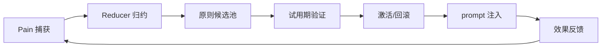

# Principles Disciple 进化闭环重构方案（第一性原理 + 奥卡姆剃刀）

> 目标：把“Pain + Reflection = Progress”收敛为最小自动闭环，并满足唯一成功标准：
> **PRINCIPLES.md 持续增长 + 同类错误复发率持续下降 + 用户干预次数下降。**

---

## 一、第一性原理：进化闭环的最小必要条件

只保留四个不可删要素：

1. **Pain Signal**：必须能捕获失败/挫败信号。
2. **Rule Formation**：必须把痛点转成可复用规则。
3. **Behavior Injection**：必须把规则注入下一轮决策。
4. **Outcome Feedback**：必须能验证“是否真的更好”。

凡是不直接服务这四点的复杂流程，均视为可裁剪复杂度。

---

## 二、化繁为简：单环架构（One-Loop）



核心思想：
- **单一事实流**：`memory/evolution.jsonl`（append-only）。
- **单一写入口**：`evolution-reducer.ts`，其他 hook 只投递事件。
- **单一成功判据**：原则增长 + 复发下降 + 干预下降。

---

## 三、高风险项修正（按评审意见补齐）

### 3.1 自动入库 PRINCIPLES.md 风险

问题：低质量原则污染、回滚困难。
解决：三道防线 + 生命周期。

#### 三道防线
1. **质量阈值门禁（Quality Gate）**
   - 候选必须包含：`trigger`、`action`、`validation`、`source`。
   - 长度和可执行性检查（禁止空泛表述，如“更小心”）。
2. **去重与冲突检测（Dedup + Conflict）**
   - 相同 trigger/action 相似度超过阈值则合并。
   - 与 active 原则冲突时进入人工审核队列。
3. **人工审核开关（Human Review Switch）**
   - 高风险路径（risk_paths）默认 require review。
   - 仅低风险且验证通过的原则自动激活。

#### 原则生命周期（强制）
`candidate -> probation -> active -> deprecated`

- `candidate`：新提炼，尚未注入。
- `probation`：仅在匹配场景精准注入。
- `active`：达到验证阈值，全面生效。
- `deprecated`：冲突或效果差，降级归档。

试用期规则：
- 仅注入同触发源场景。
- 注入标签：`<principle status="probation">`。
- 连续 N 次成功后转 active。
- 任意一次高冲突可直接回滚至 deprecated。

**默认阈值**：
```ts
const PROBATION_SUCCESS_THRESHOLD = 3;  // 连续 3 次成功转 active
const PROBATION_CONFLICT_THRESHOLD = 1; // 1 次冲突即可回滚
const PROBATION_MAX_AGE_DAYS = 30;      // 试用期最长 30 天，超时自动 deprecated
```

---

### 3.2 并发写入冲突风险

问题：多个 hook 同时写文件导致损坏。
解决：**文件锁 + 单写者模型**。

- reducer 写入 `evolution.jsonl` 前获取锁（`memory/.locks/evolution.lock`）。
- 使用“写临时文件 + 原子 rename”策略更新派生文件（ISSUE/DECISIONS/PRINCIPLES）。
- hook 仅 emit event，不直接写核心文件。

---

### 3.3 子智能体失败循环风险（新增熔断）

问题链：subagent fail -> pain_flag -> 新诊断 -> 再 fail。
解决：失败升级策略（Circuit Breaker）。

```ts
if (subagentOutcome === 'error') {
  const failCount = getConsecutiveFailures(taskId);
  if (failCount >= 3) {
    return {
      action: 'escalate',
      reason: 'Max retries exceeded',
      autoDiagnose: false,
      requireHuman: true,
    };
  }
}
```

补充策略：
- 指数退避（1m/5m/15m）避免紧循环。
- 同一 taskId 超阈值后写入 `DECISIONS.md` 并暂停自动诊断。

---

## 四、结构化定义（补齐 schema）

## 4.1 Principle Schema（建议）

```ts
interface Principle {
  id: string; // P_001, P_002...
  source: {
    painId: string;
    painType: 'tool_failure' | 'subagent_error' | 'user_frustration';
    timestamp: string;
  };
  trigger: string;
  action: string;
  guardrails?: string[];
  validation: {
    successCount: number;
    conflictCount: number;
  };
  status: 'candidate' | 'probation' | 'active' | 'deprecated';
}
```

## 4.2 Evolution Event Schema（建议）

`memory/evolution.jsonl` 每行一个事件：

```ts
type EvolutionEventType = 
  | 'pain_detected'
  | 'candidate_created'
  | 'principle_promoted'
  | 'principle_deprecated'
  | 'circuit_breaker_opened';

interface EvolutionEvent {
  ts: string;           // ISO timestamp
  type: EvolutionEventType;
  data: Record<string, unknown>;
}

// 各事件 data 字段定义：
interface PainDetectedData {
  painId: string;
  painType: 'tool_failure' | 'subagent_error' | 'user_frustration';
  source: string;       // 触发来源
  reason: string;
  score: number;
  sessionId?: string;
}

interface CandidateCreatedData {
  painId: string;
  principleId: string;  // P_001, P_002...
  trigger: string;
  action: string;
  guardrails?: string[];
  status: 'candidate';
}

interface PrinciplePromotedData {
  principleId: string;
  from: 'candidate' | 'probation';
  to: 'probation' | 'active';
  reason: string;       // 'auto_threshold' | 'manual'
  successCount?: number;
}

interface PrincipleDeprecatedData {
  principleId: string;
  reason: string;
  conflictWith?: string;  // 冲突的活跃原则 ID
  triggeredBy: 'auto' | 'manual';
}

interface CircuitBreakerOpenedData {
  taskId: string;
  painId: string;
  failCount: number;
  reason: string;
  requireHuman: boolean;
  nextRetryAt?: string;  // 指数退避后的下次重试时间
}
```

## 4.3 Evolution Reducer 接口

```ts
// evolution-reducer.ts 导出接口
interface EvolutionReducer {
  // 事件投递（hook 调用）
  emit(event: EvolutionEvent): void;           // 异步投递（不阻塞，写入 buffer）
  emitSync(event: EvolutionEvent): void;       // 同步写入（阻塞，立即 flush）
  
  // 查询接口
  getCandidatePrinciples(): Principle[];       // 获取候选原则
  getProbationPrinciples(): Principle[];       // 获取试用期原则
  getActivePrinciples(): Principle[];          // 获取激活原则
  getPrincipleById(id: string): Principle | null;
  
  // 状态转换
  promote(principleId: string, reason?: string): void;   // 手动晋升
  deprecate(principleId: string, reason: string): void;  // 手动回滚
  
  // 统计
  getStats(): {
    candidateCount: number;
    probationCount: number;
    activeCount: number;
    deprecatedCount: number;
    lastPromotedAt: string | null;
  };
}
```

---

## 五、数据迁移与归档策略（新增）

## 5.1 存量迁移（one-off）

迁移步骤 0（上线前必须做）：
1. 把现有 `ISSUE_LOG.md`、`DECISIONS.md` 转换为 `evolution.jsonl` 事件。
2. 解析现有 `PRINCIPLES.md`，提取 `id/source/trigger/action` 字段。
3. 无法结构化的历史内容标记为 `legacy_import`，不参与自动激活。

## 5.2 归档保留策略

- 热数据保留：最近 90 天（在线查询）。
- 月度归档：`memory/archive/evolution-YYYY-MM.jsonl.gz`。
- 每月归档任务完成后，生成索引摘要（计数、激活率、回滚率）。

---

## 六、实施清单（重排 + 依赖）

### Phase 1：基础架构（1-2 天）
1. 定义 `Principle schema` + `evolution.jsonl schema`。
2. 补齐 `paths.ts` / `path-resolver.ts` 缺失键。
3. 新增 `evolution-reducer.ts` 骨架（先只做事件日志）。
4. 编写 one-off 迁移脚本（存量数据 -> 新格式）。

### Phase 2：核心闭环（2-3 天）
5. `hooks/pain.ts` -> 投递 pain event 给 reducer（写工具失败 + 手动 /pain）。
6. `hooks/subagent.ts` -> 投递 pain event 给 reducer（子智能体失败/超时）。

> **Pain 触发完整路径**：
> | 触发点 | 代码位置 | 说明 |
> |---|---|---|
> | 写工具失败 | `hooks/pain.ts` | WRITE_TOOLS 失败时触发 |
> | 手动 `/pain` | `hooks/pain.ts` | 用户主动干预 |
> | 子智能体失败/超时 | `hooks/subagent.ts` | outcome === 'error' \|\| 'timeout' |
7. reducer 实现 `pain -> candidate -> probation` 转换。
8. 增加失败升级策略（熔断 + 退避 + 人工介入）。

### Phase 3：验证与反馈（1-2 天）
9. 新增 `/pd-evolution-status` 命令（显示：候选数、试用期数、激活数、最近晋升时间）。
10. 新增 `/pd-principle-rollback <principleId> [reason]` 命令（用户手动回滚）。
11. prompt 注入"最近新增原则摘要 + probation 标记"。
12. 编写 3 组测试（自动入库、失败熔断、注入生效）。
13. 文档更新 + 运维手册（迁移/归档/回滚）。


## 七、验收指标（唯一判断标准落地化）

## 7.1 北极星指标

1. `PRINCIPLES.md` 净增长率（按周）。
2. 同类错误复发率（按 painType + trigger 聚类）持续下降。
3. 用户手动干预次数（/evolve-task,/reflection）持续下降。

## 7.2 安全指标

4. 自动激活原则回滚率低于阈值（例如 < 10%）。
5. 熔断触发后无无限循环重试。
6. 并发写入冲突率为 0（锁监控）。

---

## 八、最终建议（优先级）

| 建议 | 优先级 |
|---|---|
| 补充失败升级/熔断机制 | P0 |
| 定义原则生命周期（candidate->probation->active） | P0 |
| 定义原则结构化 schema | P0 |
| 补充数据迁移方案 | P1 |
| 定义 evolution.jsonl 归档策略 | P1 |

---

## 九、一句话总结

这次重构不是增加流程，而是建立一个硬约束：

**任何 Pain 都必须在无人干预下进入可控生命周期，并最终转化为可验证、可回滚、可注入的原则。**

---

## 十、技术可行性评估（基于现有代码基础设施）

## 10.1 完全可行项（可直接复用）

| 方案要求 | 现有代码支持 | 评估 |
|---|---|---|
| 文件锁机制 | `utils/file-lock.ts` 已提供 `acquireLock/releaseLock/withLock`（含 stale lock 处理） | ✅ 可直接使用 |
| JSONL 写入模式 | `core/event-log.ts` 已有 buffer/flush/jsonl append 模式 | ✅ 可复用模式 |
| 路径解析器 | `core/paths.ts` + `core/path-resolver.ts` 已支持路径键扩展 | ✅ 只需加键 |
| Hook 统一上下文 | `WorkspaceContext.fromHookContext()` 已统一 workspace/state 访问 | ✅ 可直接集成 |
| 后台服务模式 | `EvolutionWorkerService` 已示范 service 生命周期与轮询模式 | ✅ 可复用结构 |

## 10.2 需要新增/修改项（工作量可控）

| 方案要求 | 现状 | 预估工作量 |
|---|---|---|
| 新增路径键 `EVOLUTION_STREAM` | 尚未定义 | `paths.ts` + `path-resolver.ts` 小改（约 4-10 行） |
| 新增 `evolution-reducer.ts` | 不存在 | 新建核心文件（约 200-300 行） |
| 修改 `subagent_ended` 钩子 | 当前主要处理 queue 状态 | 增加 reducer 调用与失败升级（约 20-40 行） |
| 修改 `pain.ts` 钩子 | 当前写 pain_flag | 增加 reducer 投递（约 15-30 行） |
| 新增原则相关事件类型 | 现有 event type 未覆盖 principle 生命周期 | `event-types.ts` 扩展（约 30-60 行） |

## 10.3 技术障碍与解法

| 问题 | 影响 | 解决方案 |
|---|---|---|
| 异步 Hook 与锁模型匹配 | `subagent_ended` 为 async，若只用同步锁会增加风险 | 采用 `withAsyncLock`（或扩展 async lock 包装）统一 reducer 写路径 |
| 子智能体输出获取 | `subagent_ended` 事件本身不直接携带 transcript | 在 hook 中主动调用 `api.runtime.subagent.getSessionMessages({ sessionKey })`，只截取最后 N 条 |
| PRINCIPLES.md 历史自由格式 | 自动迁移结构化有歧义 | 迁移时标注 `legacy_import`，不自动激活，仅人工二次确认 |

## 10.4 Phase 可行性结论

- **Phase 1（基础架构）**：✅ 完全可行（主要是 schema、路径、reducer 骨架与迁移脚本）。
- **Phase 2（核心闭环）**：⚠️ 可行但需注意 async transcript 获取与锁时序。
- **Phase 3（验证反馈）**：✅ 完全可行（命令、prompt 注入、测试都已有模式可复用）。

## 10.5 风险与缓解矩阵

| 风险 | 概率 | 缓解措施 |
|---|---|---|
| 异步锁竞争导致死锁/长等待 | 中 | 使用 `withAsyncLock` + 超时 + 指标告警 |
| 子智能体 transcript 过大 | 低 | 限制消息条数与字符上限（仅取 tail） |
| PRINCIPLES 历史格式不一致 | 高 | 迁移为 `legacy_import`，不参与自动激活 |
| 并发写入 evolution.jsonl 冲突 | 中 | 单写者 reducer + 锁 + 原子写 |

## 10.6 量化结论

| 维度 | 评估 |
|---|---|
| 整体可行性 | 高 |
| 代码复用度 | 约 70%（event-log/file-lock/service/hook-context 可复用） |
| 预计新增代码量 | 约 500-700 行 |
| 是否需要改 OpenClaw 核心 | 不需要（先在 Principles 插件内完成） |
| 最大风险点 | `subagent_ended` 中异步 transcript 获取与锁编排 |

> 建议：按 Phase 顺序推进。先把 reducer 变成单写者中枢，再逐步把 hooks 从“直接写文件”迁移为“投递事件”。
