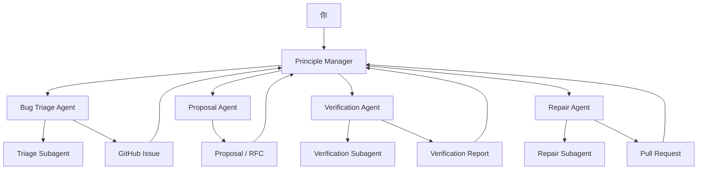

# OpenClaw 多智能体团队架构图

> Updated: 2026-03-18
> Audience: 非技术产品设计者 / Principles Disciple 维护者

## 一句话结论

如果你的目标是让仓库慢慢“自己跑起来”，最合适的结构不是让一个总 Agent 同时兼任管理者、开发者、测试员和运维，而是：

- 用 `平级智能体` 承担长期角色
- 用 `子智能体` 承担临时分包任务

也就是：

`长期组织 = 平级智能体`

`临时执行 = 子智能体`

## 为什么要这样分

你现在遇到的核心问题，不是“模型不够聪明”，而是“角色没有分层”。

单个 Agent 一旦同时承担：

- 管理
- 规划
- 诊断
- 开发
- 验证
- 部署

它就会很容易滑向一个默认模式：

“看到问题，立刻自己下场改代码。”

这和你想要的“原则信徒管理者”正好相反。

## 基于 OpenClaw 源码的真实结论

下面这些结论来自对 `D:\Code\openclaw` 源码的直接阅读。

### 1. OpenClaw 确实区分两类智能体

第一类是平级智能体。

它们更像配置层面定义出来的独立 Agent，有自己的：

- agentId
- workspace
- agentDir
- session
- 配置与身份文件

对应源码入口：

- [agent-list.ts](D:\Code\openclaw\src\gateway\agent-list.ts)
- [agents.ts](D:\Code\openclaw\src\gateway\server-methods\agents.ts)
- [agent.ts](D:\Code\openclaw\src\gateway\server-methods\agent.ts)
- [run.ts](D:\Code\openclaw\src\cron\isolated-agent\run.ts)

第二类是子智能体。

它们是从当前会话派生出来的临时执行单元，属于“当前任务树”的一部分。

对应源码入口：

- [subagent-spawn.ts](D:\Code\openclaw\src\agents\subagent-spawn.ts)
- [subagent-control.ts](D:\Code\openclaw\src\agents\subagent-control.ts)
- [subagent-registry.ts](D:\Code\openclaw\src\agents\subagent-registry.ts)
- [sessions-spawn-tool.ts](D:\Code\openclaw\src\agents\tools\sessions-spawn-tool.ts)

### 2. 子智能体天然是“任务分包”机制，不是“公司组织”机制

从源码看，子智能体有几个很鲜明的特征：

- 由父会话通过 `sessions_spawn` 或 subagent runtime 派生
- 默认继承父级 workspace
- 通过 run/session 模式运行
- 完成后通过 announce/completion 机制回传
- 控制范围默认围绕“children”

对应证据：

- [sessions-spawn-tool.ts](D:\Code\openclaw\src\agents\tools\sessions-spawn-tool.ts)
- [subagent-spawn.ts](D:\Code\openclaw\src\agents\subagent-spawn.ts)
- [subagent-control.ts](D:\Code\openclaw\src\agents\subagent-control.ts)
- [subagent-registry.ts](D:\Code\openclaw\src\agents\subagent-registry.ts)

这说明子智能体更适合：

- 临时分析一个 bug
- 运行一段验证
- 执行一次受限实现
- 处理一次明确的子任务

它不太适合承担长期身份，比如“研发经理”“质量负责人”“提案负责人”。

### 3. 平级智能体更适合承担长期角色

平级智能体对应的是独立 Agent 实体。

从 `agent-list`、`agents`、`isolated-agent` 这几条链路看，它们更像：

- 有持久身份
- 有自己的工作区和文件
- 可以长期运行
- 可以被 cron 或外部入口独立触发

这正适合你要的“团队成员”。

### 4. 插件拿到 subagent runtime 是有前提的

OpenClaw 插件 runtime 里的 `subagent` 能力不是任何时刻都能用。

源码明确写了：

- 只有在 gateway request 期间，插件 runtime 的 subagent 方法才可用
- 否则会抛错

对应源码：

- [index.ts](D:\Code\openclaw\src\plugins\runtime\index.ts)
- [types.ts](D:\Code\openclaw\src\plugins\runtime\types.ts)

这意味着：

- 你不能把“团队协作”完全建立在插件里随时随地拉子 Agent 的假设上
- 需要把角色设计和运行上下文一起考虑

## 这两类智能体的差异

| 维度 | 平级智能体 | 子智能体 |
| --- | --- | --- |
| 定位 | 长期角色 / 团队成员 | 临时执行单元 |
| 生命周期 | 长期存在 | 围绕当前任务短期存在 |
| 身份 | 独立 agentId | 依附父会话 |
| 工作区 | 可有独立 workspace | 默认继承父级 workspace |
| 通信 | 更像独立会话、独立入口 | 通过父子 announce / completion 回传 |
| 适合做什么 | 管理、规划、长期观察、责任归属 | 分析、实现、验证、一次性调查 |
| 主要风险 | 组织成本更高 | 很容易被滥用成“主 Agent 的第二双手” |

## 对 Principles Disciple 最重要的启发

### 不要让“原则信徒管理者”拥有直接开发冲动

如果你想让一个 Agent 真正像管理者，它就不应该默认拥有：

- 直接改代码
- 直接部署
- 直接自证自己是对的

更合理的是：

- 它负责定方向
- 它负责拆任务
- 它负责决定谁去做
- 它负责审阅结果

真正下场的应该是别的角色。

### 你遇到的“听到指令就立刻做”冲动，靠提示词很难根治

这不是你个人设计得不好，而是当前大模型的共同倾向：

- 强烈的 instruction following
- 强烈的 task completion bias
- 对“先停下来、先治理、先验证”的耐心较差

所以解决办法不应该只靠多塞原则，而应该靠：

- 角色隔离
- 工具隔离
- 工作流隔离
- 权限隔离

简单说：

**不要只改变它怎么想，还要改变它能做什么。**

## 推荐的团队结构

### 1. Principle Manager

这是你要的“原则信徒管理者”。

职责：

- 观察仓库运行状态
- 判断是否构成 bug / issue / proposal
- 决定是否派单
- 指挥其他 Agent
- 汇总结论

约束：

- 默认不直接改代码
- 默认不直接部署
- 默认不直接关闭问题
- 遇到重大问题先验证、后行动

### 2. Bug Triage Agent

职责：

- 收集失败
- 去重
- 判断严重度
- 形成 issue 草稿

输出：

- bug 归类
- 重现线索
- 是否疑似上游 OpenClaw 兼容问题

### 3. Proposal Agent

职责：

- 把“感觉不合理”沉淀成提案
- 分析产品性缺口
- 输出 spec / RFC / workflow 改进

### 4. Repair Agent

职责：

- 接收明确修复任务
- 在受限范围内改代码
- 补测试
- 形成 PR 草稿

### 5. Verification Agent

职责：

- 复现问题
- 验证 PR
- 运行测试
- 判断是否真的解决而不是表面修复

## 最适合你的组合方式

### 组织层：用平级智能体

建议把以下角色做成平级智能体：

- Principle Manager
- Bug Triage Agent
- Proposal Agent
- Verification Agent

原因是这些角色都需要：

- 长期身份
- 长期记忆
- 稳定职责
- 清晰边界

### 执行层：用子智能体

Repair / Analysis 这类具体执行任务，可以由以上角色再派生子智能体去做。

比如：

- Triage Agent 派一个子智能体复现 bug
- Verification Agent 派一个子智能体跑特定验证
- Repair Agent 派一个子智能体尝试小范围修复

这样就形成了：

`平级智能体 = 部门`

`子智能体 = 部门里的临时工单执行者`

## 一个实际可运行的组织图

## 最少需要哪些文件

如果你要把这支“团队”真正搭起来，我建议第一批只做最少但关键的文件。

### 1. 团队总章程

建议新增一份总文档，例如：

- `docs/teams/principles-agent-company-zh.md`

内容包括：

- 团队使命
- 角色定义
- 权限边界
- 工单流转规则
- 什么时候必须升级给人类

### 2. 角色文件

建议每个长期角色一份 Markdown：

- `docs/teams/roles/principle-manager.md`
- `docs/teams/roles/bug-triage-agent.md`
- `docs/teams/roles/proposal-agent.md`
- `docs/teams/roles/repair-agent.md`
- `docs/teams/roles/verification-agent.md`

### 3. 工作流文件

建议至少有这几条：

- `docs/teams/workflows/issue-workflow.md`
- `docs/teams/workflows/proposal-workflow.md`
- `docs/teams/workflows/pr-workflow.md`
- `docs/teams/workflows/release-gate.md`

### 4. 配套 skills

你仓库里已经有很多 skill 雏形。后面最值得补的是偏组织协同的 skill，而不是再堆抽象思维模型。

优先建议：

- `manager-dispatch`
- `issue-triage`
- `proposal-drafting`
- `repair-execution`
- `verification-gate`

## 第一阶段怎么落地最现实

我建议不要一开始就追求“自动修 bug 并自动上线”。

第一阶段先做到：

1. Principle Manager 不直接写代码
2. Bug Triage Agent 自动整理 bug 草稿
3. Proposal Agent 自动形成提案
4. Repair Agent 只处理低风险修复
5. Verification Agent 拥有最终放行建议权

这时你就已经不是“一个 Agent”，而是一支团队了。

## 最关键的产品原则

如果你要把这套东西做成产品，最重要的不是“让所有 Agent 都更聪明”，而是：

**让每个 Agent 只对一类责任负责。**

这是减少冲动、减少错位、减少自说自话的最有效方式。

## 下一步建议

我建议后续按这个顺序推进：

1. 先写团队总章程和 5 个角色文件
2. 再写 issue / proposal / PR / release 四条工作流
3. 最后再把这些规则逐步固化为 skills、hooks 和自动化

## 关键源码参考

- [index.ts](D:\Code\openclaw\src\plugins\runtime\index.ts)
- [types.ts](D:\Code\openclaw\src\plugins\runtime\types.ts)
- [sessions-spawn-tool.ts](D:\Code\openclaw\src\agents\tools\sessions-spawn-tool.ts)
- [subagent-spawn.ts](D:\Code\openclaw\src\agents\subagent-spawn.ts)
- [subagent-control.ts](D:\Code\openclaw\src\agents\subagent-control.ts)
- [subagent-registry.ts](D:\Code\openclaw\src\agents\subagent-registry.ts)
- [agent-list.ts](D:\Code\openclaw\src\gateway\agent-list.ts)
- [agents.ts](D:\Code\openclaw\src\gateway\server-methods\agents.ts)
- [agent.ts](D:\Code\openclaw\src\gateway\server-methods\agent.ts)
- [run.ts](D:\Code\openclaw\src\cron\isolated-agent\run.ts)
