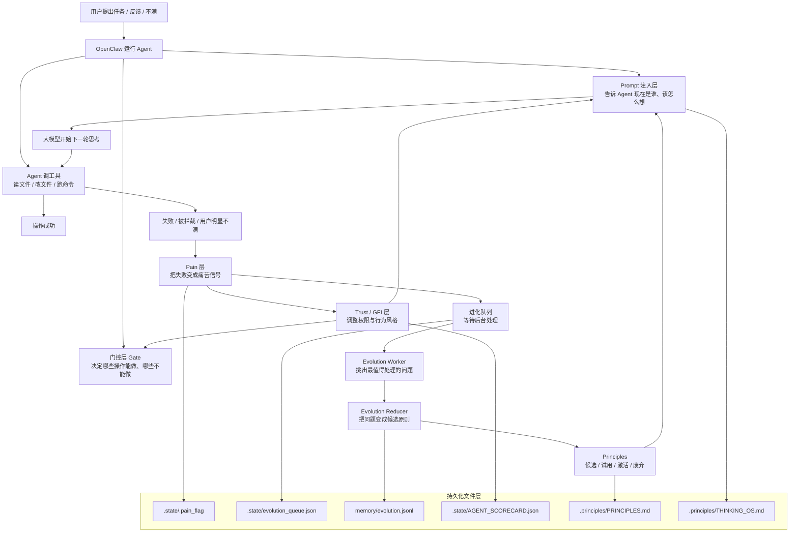

# Principles Disciple 全景架构图与产品化导览

> 创建日期：2026-03-18  
> 面向对象：非开发背景、  
> 目标：帮助从“理念”走到“可用产品”，看清这个项目的全貌、边界和下一步

---

## 这份文档适合怎么读

如果你现在最大的困难是“知道它很有意思，但看不清它到底是概念、系统，还是产品”，那这份文档就是为这个问题写的。

建议按这个顺序读：

1. 先看“一句话理解”
2. 再看“全景架构图”
3. 再看“哲学如何落地到工程”
4. 最后看“用户价值对照图”和“产品化建议”

---

## 一句话理解

**Principles Disciple 不是在训练一个更强的大模型，而是在大模型外面加一层“会记痛、会踩刹车、会长原则”的外置心智系统。**

它不直接修改模型参数，而是通过：

- 收集失败和挫败
- 把失败转成反思任务
- 把反思任务沉淀成原则
- 在下一轮推理前把这些原则重新注入模型上下文

来逐步影响模型的决策、思考和行为。

换句话说，它更像是：

**一种外置化强化学习框架，或者说“文字梯度驱动的策略塑形系统”。**

---

## 全景架构图

---

## 用非技术语言解释它在做什么

你可以把这个系统想成有 5 层。

### 1. 身份层

它回答：“这个 Agent 是谁，应该怎么想？”

这里的内容包括：

- 核心原则
- Thinking OS
- 当前焦点
- 当前信任状态

核心位置：

- `packages/openclaw-plugin/src/hooks/prompt.ts`
- `packages/openclaw-plugin/templates/workspace/.principles/THINKING_OS.md`
- `packages/openclaw-plugin/templates/workspace/.principles/PRINCIPLES.md`

### 2. 感知层

它回答：“刚刚发生了什么坏事？”

系统会捕捉：

- 工具调用失败
- 高风险操作失败
- 被门控拦截
- 用户明显不满
- 语言输出中的痛苦/摩擦信号

核心位置：

- `packages/openclaw-plugin/src/hooks/pain.ts`
- `packages/openclaw-plugin/src/hooks/llm.ts`

### 3. 治理层

它回答：“现在允许做什么，不允许做什么？”

这是整个项目最“硬”的部分。它不靠模型自己自觉，而是用系统规则直接约束：

- 当前信任阶段是什么
- 是否进入高摩擦状态
- 当前是否在风险路径上
- 有没有 `PLAN.md`
- 一次编辑是否过大

核心位置：

- `packages/openclaw-plugin/src/hooks/gate.ts`
- `packages/openclaw-plugin/src/core/trust-engine.ts`

### 4. 进化层

它回答：“怎么把一次失败，变成长期教训？”

流程是：

- pain 进入队列
- worker 挑出最高优先级问题
- reducer 把问题转成原则对象
- 原则进入候选、试用、激活、废弃状态

核心位置：

- `packages/openclaw-plugin/src/service/evolution-worker.ts`
- `packages/openclaw-plugin/src/core/evolution-reducer.ts`

### 5. 注入层

它回答：“这些经验如何重新影响下一次思考？”

这一步通过 prompt 完成。也就是说：

- 模型还是同一个模型
- 但下一轮开始前，系统会给它补充新的身份、约束和原则

核心位置：

- `packages/openclaw-plugin/src/hooks/prompt.ts`

---

## 它的核心闭环到底是什么

这是全项目最重要的一条主线：

1. Agent 调工具失败，或者被 Gate 拦住
2. 系统把这次失败记为 `pain`
3. `pain` 被写入状态文件，并进入进化队列
4. 后台 worker 把它升级成“待处理诊断任务”
5. reducer 把它进一步沉淀成原则对象
6. 下一轮 prompt 再把这些原则注入模型
7. 模型下一次做类似事情时，行为被改变

翻译成一句话：

**失败 -> 记录 -> 反思任务 -> 原则化 -> 再注入 -> 改变下一次行为**

这就是这个项目在工程层面上的“进化”。

---

## 它和强化学习的关系

如果用你更熟悉的机器学习视角来理解，这个项目确实很像一种“外置化的强化学习”。

传统强化学习的直觉是：

`reward / penalty -> gradient -> weight update`

这个项目更像：

`pain signal -> reflection -> textual policy update -> behavior shift`

也就是：

- 不更新模型参数
- 更新的是模型下一轮所处的“上下文”
- 不直接做反向传播
- 而是做“文字化的策略塑形”

所以它不是严格意义上的 RL，但它借用了 RL 的核心思想：

- 错误不是噪音，而是学习信号
- 未来策略应该受过去反馈影响
- 系统应该能记住负反馈并调整行为

这是这套框架最有价值、也最现实的一点。

---

## 哲学如何落地到工程

下面这张表，专门回答“哪些理念真的落地了，哪些还主要停留在叙事上”。

| 哲学理念 | 工程化落点 | 当前落地程度 | 说明 |
| --- | --- | --- | --- |
| Pain 是成长信号 | `hooks/pain.ts`、`service/evolution-worker.ts` | 高 | 失败会被捕捉、打分、入队，不是口号 |
| 原则反过来约束未来决策 | `core/evolution-reducer.ts`、`hooks/prompt.ts` | 中高 | 已形成原则对象并注入 prompt，但原则质量仍偏模板化 |
| Agent 应有长期身份 | `THINKING_OS.md`、`PRINCIPLES.md`、`prompt.ts` | 高 | 身份层和思维模型注入很明确 |
| 安全优先于自主性 | `hooks/gate.ts`、`core/trust-engine.ts` | 很高 | 这是目前最扎实、最能落地的一层 |
| 失败要变成可复用智慧 | `evolution-reducer.ts` | 中 | 已经有机制，但“智慧”的质量还不够强 |
| Agent 会越来越像真正的长期伙伴 | 多模块协同 | 中低 | 有趋势，但还不能严格证明长期收益 |
| 成长积分取代惩罚式信任系统 | `core/evolution-engine.ts`、`gate.ts` | 低到中 | 叙事在往这边走，但实际运行时仍主要是 Trust/Gate 主导 |

---

## 用户价值对照图

这张图专门回答：从产品视角看，这些复杂机制到底给用户带来什么价值。

| 用户真实痛点 | 项目设计理念 | 对应工程模块 | 对用户的实际价值 | 当前成熟度 |
| --- | --- | --- | --- | --- |
| Agent 会反复犯同类错误 | 把失败变成原则 | `pain.ts` + `evolution-worker.ts` + `evolution-reducer.ts` | 有机会降低重复犯错 | 中 |
| Agent 会乱改高风险文件 | 安全优先，逐步放权 | `gate.ts` + `trust-engine.ts` | 明显减少误伤代码库 | 高 |
| Agent 每次都像失忆 | 让经验跨任务沉淀 | `prompt.ts` + 状态文件体系 | 对话结束后仍能延续习惯和约束 | 中高 |
| 用户不想每次手把手盯着 AI | 让系统自己感知风险并自我约束 | Gate + Trust + GFI | 降低用户监管成本 | 中高 |
| AI 看起来“聪明”，但不稳定 | 用原则和思维模型统一风格 | `THINKING_OS.md` + `prompt.ts` | 行为更一致、更像一个长期协作者 | 中 |
| AI 有时会陷入错误循环 | 让摩擦分数影响行为模式 | `pain.ts` + `prompt.ts` | 高摩擦时更保守、更谦逊 | 中 |
| 团队想把理念做成可卖产品 | 把思维模型、治理、经验沉淀整合成框架 | 整体系统 | 有产品叙事和雏形，但还需收敛 | 中 |

---

## 目前最扎实的部分是什么

### 最扎实：治理层

如果只看“工程上最硬、最可靠”的部分，那是：

- `packages/openclaw-plugin/src/hooks/gate.ts`
- `packages/openclaw-plugin/src/core/trust-engine.ts`

原因很简单：

- 这部分不靠模型“自觉听话”
- 它是直接拦工具、限权限、限路径、限编辑规模
- 属于系统级约束，不只是心理暗示

换句话说：

**这个项目最先做成产品价值的，很可能不是“进化”，而是“治理”。**

### 第二扎实：pain -> queue -> directive 闭环

这部分也已经有较清晰实现：

- 失败会被记录
- 会写入状态文件
- 会变成后台任务
- 会重新影响后续 prompt

核心代码：

- `packages/openclaw-plugin/src/hooks/pain.ts`
- `packages/openclaw-plugin/src/service/evolution-worker.ts`
- `packages/openclaw-plugin/src/hooks/prompt.ts`

### 相对没那么扎实：原则质量与长期收益

当前最大的问题不是“有没有原则机制”，而是：

- 原则是否足够高质量
- 原则是否真的可迁移
- 原则是否真的在长期行为上带来可验证收益

这部分目前证据还不够强。

---

## 我们已经验证到的工程事实

截至 2026-03-18，本地检查得到的结论如下：

### 构建

- 在 `packages/openclaw-plugin` 下运行 `npm run build`
- TypeScript 编译通过

### 测试

- 在 `packages/openclaw-plugin` 下运行 `npm test`
- 结果：
  - `62` 个测试文件中 `60` 个通过，`2` 个失败
  - `528` 个测试中 `522` 个通过，`4` 个失败，`2` 个跳过

### 当前失败主要集中在

- 路径标准化和跨平台断言
- Windows 路径分隔符预期不一致

相关测试：

- `packages/openclaw-plugin/tests/core/evolution-paths.test.ts`
- `packages/openclaw-plugin/tests/core/path-resolver.test.ts`

这说明什么？

说明它不是一个“只有理念、不能运行”的项目。  
但也说明它离“成熟、稳定、跨平台无痛”的产品还有距离。

---

## 当前最关键的发现

### 发现 1：它不是空壳，而是已有真实闭环

这很重要。因为很多类似项目只有概念和文档，但这个项目已经把下面这条链做出来了：

- Pain 捕捉
- Trust/GFI 调整
- Queue 入队
- Worker 轮询
- Directive 注入
- Principle 状态机

### 发现 2：它本质上是“治理优先”，不是“进化优先”

虽然项目叙事强调进化、反思、灵魂，但目前最稳定、最有效的部分其实是治理：

- 风险控制
- 权限分级
- 高风险写入拦截
- 大改动限制

这意味着产品第一卖点可能不是：

“AI 会长出灵魂”

而更可能是：

“AI 不再轻易把你的项目搞坏”

### 发现 3：它最像“外置化强化学习”，而不是传统训练

它真正创新的地方，不是训练模型，而是把学习逻辑搬到了运行时和工作区层面。

这让它具备了两个优点：

- 成本低，不需要重新训练模型
- 可解释，很多学习痕迹都在文件和状态里可见

同时也带来两个限制：

- 最终仍依赖 prompt 是否被模型遵守
- 学到的“原则”不等于模型真的内化成参数知识

### 发现 4：理念与实现之间已有轻微漂移

具体表现为：

- README 提到的 `docs/ARCHITECTURE.md` 实际不存在
- README 中 worker 的轮询描述与代码默认值不一致
- 多个中文文档和源码存在编码损坏
- “Evolution Points 已取代 Trust Engine”的叙事尚未在代码里完全成立

这类问题不会马上毁掉系统，但会慢慢削弱：

- 可维护性
- 可解释性
- 对外产品可信度

---

## 如果目标是把它做成“可用产品”，最应该先做什么

### 建议 1：先把产品定位从“灵魂”收敛到“可治理”

最容易被用户真正感知、也最容易验证的价值是：

- 少犯重复错误
- 高风险场景更克制
- 项目更不容易被误伤
- AI 更像长期协作者

这比“让硅基生命长出灵魂”更容易变成可卖价值。

### 建议 2：给“进化”建立可观测指标

如果未来要让产品可信，必须回答：

- 同类错误是否下降？
- 高风险误操作是否减少？
- 用户纠正次数是否降低？
- active principles 的命中率和收益是多少？

如果没有这些指标，“进化”就容易永远停留在叙事层。

### 建议 3：优先提高原则质量，而不是继续堆概念

当前最值得优化的不是再加更多术语，而是让原则本身更有用：

- 更具体
- 更可执行
- 更可迁移
- 更贴近真实工作流

### 建议 4：把复杂机制藏起来，把用户体验做简单

普通用户不应该被迫理解：

- `PLAN.md`
- `AGENT_SCORECARD.json`
- `evolution_queue.json`
- `CURRENT_FOCUS.md`

这些都应该尽量变成产品后台机制，前台只呈现：

- 当前风险状态
- 最近学到什么
- 现在为什么被拦住
- 怎么继续推进

### 建议 5：把“产品最小闭环”先钉住

如果现在要把它往产品推进，我建议优先押注这个最小闭环：

1. Agent 高风险操作可控
2. 失败可被记录
3. 同类失败可被再提醒
4. 用户能看到“最近学到了什么”

只要这四点做顺，产品就已经有清晰价值。

---

## 作为非开发读者，推荐你重点看的源码

如果后面你要逐步深入，但不想一上来陷进全部代码，建议按这个顺序看：

1. `packages/openclaw-plugin/src/index.ts`
   作用：插件总入口，能看到系统都接了哪些 hook 和服务

2. `packages/openclaw-plugin/src/hooks/prompt.ts`
   作用：理解“系统如何重新影响模型思考”

3. `packages/openclaw-plugin/src/hooks/gate.ts`
   作用：理解“系统如何保护项目、约束 Agent”

4. `packages/openclaw-plugin/src/hooks/pain.ts`
   作用：理解“失败如何被转成学习信号”

5. `packages/openclaw-plugin/src/service/evolution-worker.ts`
   作用：理解“pain 如何被升级成进化任务”

6. `packages/openclaw-plugin/src/core/evolution-reducer.ts`
   作用：理解“原则状态机”的真正实现

7. `packages/openclaw-plugin/src/core/trust-engine.ts`
   作用：理解“权限、放权、降权”这条治理主线

---

## 一句话结论

**Principles Disciple 已经不是一个空洞理念，它已经有了“痛苦 -> 反思 -> 原则 -> 再行动”的工程闭环。**

但它目前更像：

**一个具备真实机制的实验型 Agent 治理与进化框架**

而不是：

**一个已经被充分证明、能稳定产出高质量自我进化结果的成熟产品。**

如果继续推进，最值得优先产品化的不是“灵魂感”，而是：

**治理能力 + 失败沉淀 + 原则提醒 + 可观测收益。**

---

## 后续可继续补充的两个方向

如果要把这份文档继续扩展，最值得追加的两部分是：

1. 一张“运行时时序图”
   目的：把一次用户请求从输入到原则生成的全过程画出来

2. 一张“理念 vs 实现缺口表”
   目的：明确哪些设计已经成熟，哪些还停留在半成品阶段

