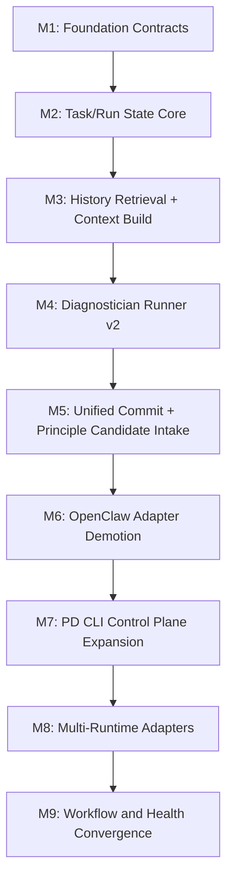

# PD Runtime v2 Milestone Roadmap

> Status: Draft v1  
> Date: 2026-04-21  
> Scope: Milestone decomposition for GSD-driven implementation

## 1. Purpose

This document decomposes the PD Runtime v2 refactor into milestone-sized execution units suitable for GSD planning and delivery.

The decomposition is designed to:

- reduce architectural drift
- keep each milestone verifiable
- separate foundational infrastructure from feature migration
- allow staged review and course correction after each milestone

## 2. Planning Principles

Each milestone must satisfy four rules:

1. one milestone should have one dominant architectural outcome
2. each milestone must produce code, tests, and document updates together
3. each milestone must define explicit exit criteria
4. each milestone must preserve rollback safety unless explicitly declared otherwise

## 3. Milestone Overview

## 4. Milestone Definitions

## M1. Foundation Contracts

### Goal

Freeze the core contracts so implementation work does not invent competing interfaces.

### Primary Deliverables

- finalized `AgentSpec Schema v1`
- finalized `PDErrorCategory` definition
- finalized runtime selector contract
- finalized `ContextPayload` and diagnoser output schema refs
- document-level decision on Core / CLI / Worker boundaries

### Code Scope

Minimal code is acceptable here if needed, but the main purpose is contract stabilization.

Potential implementation artifacts:

- shared TypeScript schema files
- schema validation helpers
- central error enum module

### Exit Criteria

- one canonical source for `AgentSpec`
- one canonical source for PD error categories
- no conflicting schema copies remain across runtime v2 docs

### Risks

- over-design without executable validation

### Verification

- schema compile tests
- cross-package type compatibility tests

## M2. Task/Run State Core

### Goal

Introduce explicit PD-owned task and run truth with lease semantics.

### Primary Deliverables

- task store abstraction
- run store abstraction
- lease lifecycle
- retry metadata
- expired lease recovery

### Code Scope

- `Task Store and Lease Model v1`
- initial storage adapter implementation
- migration path from existing diagnostician task state

### Exit Criteria

- diagnostician-like tasks can be leased and recovered without marker-file truth
- run records exist independently of legacy heartbeat flow

### Risks

- partial migration that still secretly depends on legacy files

### Verification

- concurrent lease tests
- crash recovery tests
- idempotent state transition tests

## M3. History Retrieval + Context Build

### Goal

Deliver the PD-owned retrieval pipeline:

- `pd trajectory locate`
- `pd history query`
- `pd context build`

### Primary Deliverables

- trajectory locator
- bounded history query
- context assembler
- degradation policy
- workspace isolation guarantees

### Exit Criteria

- diagnostician-ready context can be built from PD-owned retrieval logic
- basic historical retrieval no longer depends on manual raw SQL or host-specific improvised access

### Risks

- retrieval complexity explosion
- unbounded context growth

### Verification

- fixture-based retrieval tests
- ambiguity tests
- degradation-path tests

## M4. Diagnostician Runner v2

### Goal

Replace heartbeat-prompt-driven diagnostician execution with explicit runner-driven execution.

### Primary Deliverables

- `DiagnosticianRunner`
- runtime invocation path
- validator integration
- dual-track cutover flag

### Exit Criteria

- diagnostician can complete through explicit run + validation flow
- heartbeat is no longer the primary execution path

### Risks

- hidden dependence on old prompt path
- incomplete runtime invocation path

### Verification

- e2e diagnosis path test
- invalid-output rejection test
- dual-track comparison telemetry

## M5. Unified Commit + Principle Candidate Intake

### Goal

Make diagnosis output commit atomic and define downstream principle-candidate consumption.

### Primary Deliverables

- transaction-safe commit flow
- artifact registry foundation
- principle candidate artifact format
- principle candidate consumer

### Exit Criteria

- diagnoser success no longer depends on raw file write side effects
- downstream principle intake path is explicit

### Risks

- commit state inconsistency
- candidate artifacts emitted without consumer

### Verification

- transaction rollback tests
- artifact registration tests
- principle candidate intake tests

## M6. OpenClaw Adapter Demotion

### Goal

Reduce OpenClaw plugin responsibilities to signal capture, compatibility wrappers, and runtime adapter duties.

### Primary Deliverables

- plugin path review
- event-forwarding-only migration for selected paths
- removal or deprecation of direct host-owned core logic on critical paths

### Exit Criteria

- diagnostician primary path no longer depends on OpenClaw heartbeat prompt execution
- plugin hook logic no longer owns PD state semantics for migrated chains

### Risks

- regression in production signal capture
- hidden plugin-only logic left behind

### Verification

- adapter integration tests
- production dry-run verification
- no-regression checks on pain capture

## M7. PD CLI Control Plane Expansion

### Goal

Establish PD CLI as the main operational surface for runtime v2.

### Primary Deliverables

- task commands
- run commands
- runtime probe command
- diagnose commands
- history/context commands hardened

### Exit Criteria

- routine operator workflows can be completed through PD CLI
- plugin commands become compatibility wrappers where appropriate

### Risks

- CLI surface becomes inconsistent
- operators still forced back into plugin-specific paths

### Verification

- command contract tests
- JSON mode tests
- usability review on common workflows

## M8. Multi-Runtime Adapters

### Goal

Support at least one non-OpenClaw runtime backend in addition to OpenClaw.

### Primary Deliverables

- one CLI-based runtime adapter
- capability probe implementation
- runtime selector implementation

Recommended first non-OpenClaw backend:

- `codex-cli` or equivalent

### Exit Criteria

- diagnostician can execute through at least two runtime backends
- runtime selection is explicit and test-covered

### Risks

- backend-specific behavior leaks into PD Core

### Verification

- adapter conformance tests
- runtime selection tests
- fallback tests

## M9. Workflow and Health Convergence

### Goal

Unify workflow health, telemetry, funnel visibility, and operational diagnostics around the new runtime architecture.

### Primary Deliverables

- workflow health rules
- richer degraded/stalled reporting
- execution traces across lease -> context -> run -> commit
- updated `/pd-evolution-status` or CLI status surfaces

### Exit Criteria

- migrated workflows are observable as explicit PD-controlled execution chains
- operators can distinguish retrieval failure, runtime failure, validation failure, and commit failure

### Risks

- observability still reflects legacy execution assumptions

### Verification

- telemetry tests
- status rendering tests
- degraded scenario tests

## 5. Recommended GSD Execution Order

Recommended immediate order:

1. M1
2. M2
3. M3
4. M4
5. M5

Only after these should the team treat M6-M9 as active implementation priorities.

Reason:

- M1-M5 establish the core execution truth
- M6-M9 are migration, expansion, and convergence layers

## 6. Milestone Review Gates

Every milestone must end with a review gate containing:

- what changed
- what assumptions were proven or disproven
- what production risks remain
- whether the next milestone still makes sense unchanged

This gate must be reviewed before the next milestone begins.

## 7. What Must Not Happen

The following are considered execution drift:

- introducing new host-specific core logic before M6
- letting runtime adapters redefine PD task semantics
- adding new prompt-driven hidden side effects to compensate for missing infrastructure
- skipping telemetry because “it works locally”
- merging a milestone without explicit exit-criteria evidence

## 8. Summary

This roadmap intentionally front-loads:

- contract clarity
- task truth
- retrieval correctness
- diagnostician execution correctness
- commit integrity

That is because these are the non-negotiable foundations of the refactor.
