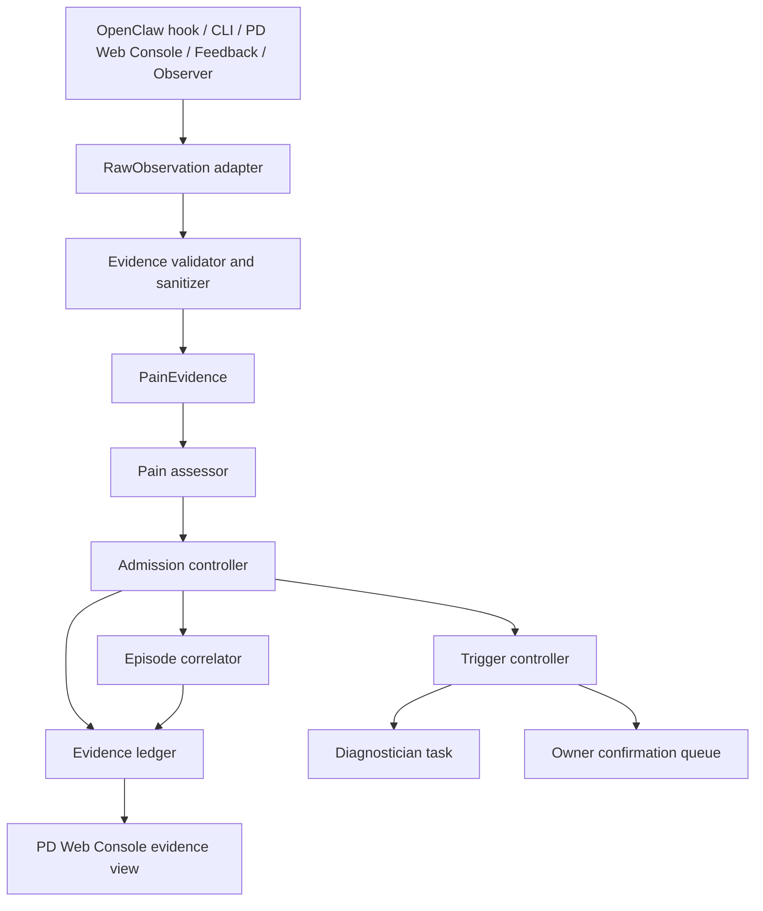
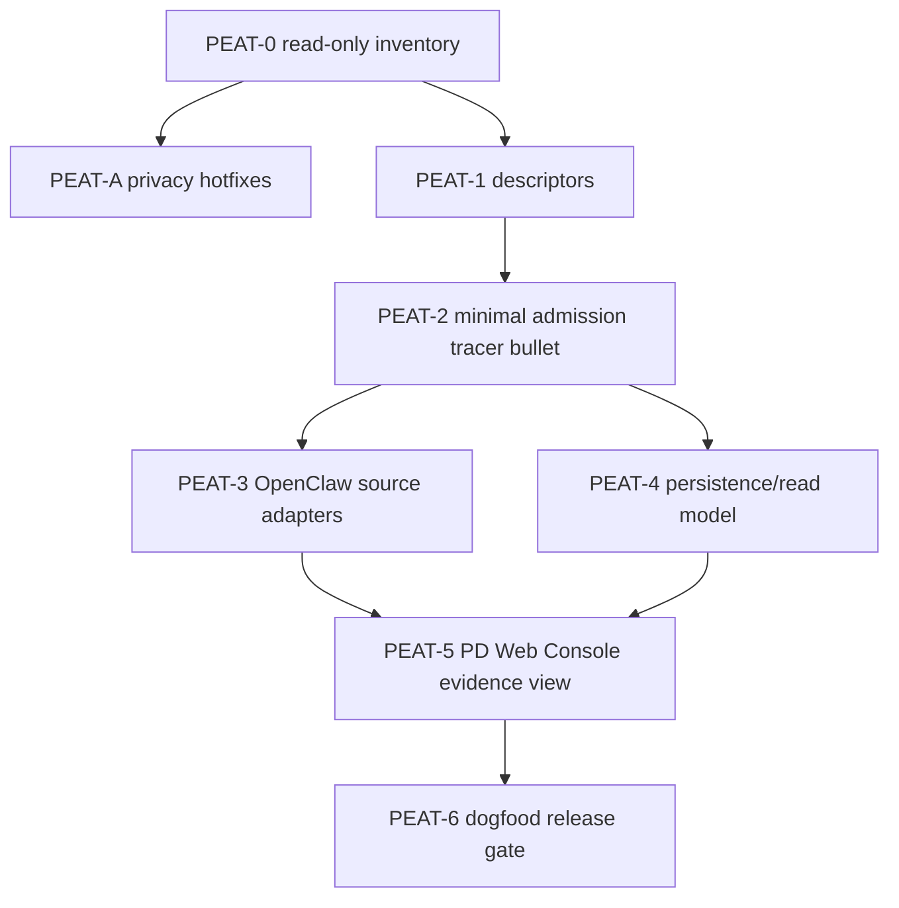

# Pain Evidence Admission Track

> Status: Draft for owner review.
>
> This document is the design and implementation control plane for the next pain-signal iteration. OpenClaw may collect evidence and implement approved slices, but this feature line must not be merged into `main` or installed into the owner's production OpenClaw environment until its release gate is explicitly satisfied.

## Goal

Make PD's pain-signal pipeline useful in real dogfood work without turning PD into a generic monitoring, memory, tool-repair, or autonomous value-decision system.

The target behavior is:

1. PD can collect bounded, privacy-preserving evidence from real agent work.
2. PD can distinguish raw friction from owner-relevant pain.
3. PD can admit only qualified pain into the principle-internalization pipeline.
4. PD can aggregate weak/repeated evidence into episodes without creating noisy diagnostic tasks.
5. The owner can inspect why a signal was accepted, deferred, rejected, or grouped.

## Product Boundary

PD owns:

- Behavior evidence that explains agent failure, owner intervention, repeated correction, risky action, or workflow breakdown.
- Owner-reviewed, reversible behavior internalization.
- Explicit provenance from evidence to candidate principle to approval to activation.

PD does not own:

- General task execution.
- General memory.
- Generic tool retry or provider failover.
- Autonomous value judgments without owner review.
- GAP / OKR / mission scoring during MVP-First.
- Broad attribution, probation, training, or model-evaluation systems.

## Why This Track Exists

The MVP implementation proved the main chain can work:

```text
manual pain / hook evidence
  -> candidate principle
  -> owner review
  -> activation
  -> prompt / RuleHost / defer_archive behavior surface
```

The weak point is signal quality. In real use, manual pain recording works, but automatic capture is too noisy or too weak:

- Tool failures are often infrastructure noise, not behavior pain.
- Empathy-style language detection is valuable but unsafe as an automatic diagnosis trigger.
- RuleHost blocks are evidence, but not necessarily new pain.
- Missing behavior, such as "agent did not pause to clarify", is hard to observe from single events.
- Historical smoke/demo data has polluted production workspaces before.

The next iteration should therefore introduce an admission layer before diagnosis. The layer decides whether evidence becomes a diagnostic task, stays as evidence, joins an episode, or needs owner confirmation.

## PEAT-0 Findings Integrated

OpenClaw's read-only inventory produced three important facts that shape this plan:

1. No automatic source created clearly useful pain signals in the last 30 days.
2. Tool failures, dispatch errors, provider/rate-limit failures, and RuleHost blocks are mostly evidence or health signals, not direct principle pain.
3. Current payload capture has privacy risks around user text previews, tool params, and evolution stream writes.

This means the next work must not start with a large architecture rewrite. It must first reduce noise and protect privacy, then introduce the smallest production-path admission slice.

## Delivery Model

This plan has three tracks. They must not be blended.

### Track A: Main-Safe Privacy And Hygiene Hotfixes

These are small fixes that may go to `main` because they do not change diagnosis trigger policy.

Allowed scope:

- Redact or bound `triggerTextPreview`.
- Redact or bound trajectory `paramsJson`.
- Stop or sanitize raw `PainDetectedData` writes to deprecated evolution streams.
- Add structured unavailable reasons for skipped observer/config paths.

Not allowed in Track A:

- Changing when diagnostic tasks are created.
- Changing source admission policy.
- Adding new source kinds.
- Adding episode aggregation.

### Track B: Minimal Admission Tracer Bullet

This is the first feature branch slice. It proves the admission model on the real production path without implementing the full architecture.

Required behavior:

- Owner explicit manual pain still creates a diagnostic task.
- Tool failure defaults to evidence-only.
- Provider/rate-limit failure defaults to health/evidence-only.
- RuleHost block defaults to evidence-only unless it is a high-confidence unsafe action.
- The result includes `admissionDecision`, `admissionReason`, and `nextAction`.

This track may merge only after owner review and live validation. It is not an emergency hotfix because it changes diagnosis trigger behavior.

### Track C: Full Pain Evidence Architecture

This is the longer PEAT line:

- Source descriptors.
- Episode aggregation.
- OpenClaw hook decomposition.
- Evidence persistence.
- PD Web Console evidence views.
- Owner-confirmation UX for empathy-inferred pain.

Track C should be informed by Track B data and should not start by building all proposed modules at once.

## Relation To ADR-0015

ADR-0015 proposes:

```text
RawObservation -> PainEvidence -> PainSignal -> PainEpisode
```

This track adopts that model with one MVP restriction: GAP-aligned objectives and task-mission scoring remain out of scope until post-MVP restart conditions are met.

ADR-0010 / GAP concepts must not be implemented in this track. If a design or issue starts introducing objectives, missions, OKR fit, BALM, PRRR, or training channels, stop and get owner approval.

## Safety Policy

### Branch And Install Policy

This feature line is experimental and must be isolated.

- Implement on a dedicated feature branch, not directly on `main`.
- Do not install the feature branch into the owner's production OpenClaw environment by default.
- Use a disposable or explicitly designated dogfood workspace for feature validation.
- Only install into the production OpenClaw environment after the release gate in this document passes.
- Do not write synthetic/demo/smoke data into `D:\.openclaw\workspace`.

### Emergency Hotfix Policy

Small independent bugs discovered during dogfood may be fixed on `main` only if all are true:

- The bug affects the currently installed PD environment or a merged MVP feature.
- The fix is small, isolated, and reversible.
- The fix does not depend on the pain evidence admission feature branch.
- The bug is reproducible and has a concrete verification command or live check.

Eligible examples:

- Plugin fails to load.
- Console crashes on a normal page.
- Runtime V2 chain corrupts data.
- Feedback draft API cannot write local drafts.
- A security/privacy boundary leaks secrets or raw prompt/chat/trajectory.

Not eligible as emergency hotfixes:

- New pain source kinds.
- Admission policy tuning.
- UI polish.
- Observer prompt improvements.
- Episode aggregation.
- Any behavior that changes diagnosis trigger policy.

## Core Terms

### RawObservation

An untrusted event from a source adapter. It may come from OpenClaw hooks, CLI commands, manual owner actions, feedback drafts, RuleHost, empathy observer, correction observer, or future connectors.

Raw observations are never sent directly to the Diagnostician.

### PainEvidence

A validated, sanitized, bounded record derived from a raw observation.

Evidence must include:

- `evidenceId`
- `sourceKind`
- `observedAt`
- `workspaceRef`
- bounded summary
- privacy classification
- source-specific normalized fields
- unavailable/degraded reasons if enrichment failed

Evidence must not include:

- raw prompt
- raw chat
- raw trajectory
- full local paths
- file contents
- env vars
- tokens or API keys
- unbounded stack traces

### PainSignal

An admitted pain item that is eligible to trigger diagnosis or owner review.

Signals are created only after admission policy approves the evidence or episode.

### PainEpisode

A bounded aggregation of related evidence and signals. Episodes are for patterns that require recurrence before diagnosis, such as repeated owner correction or repeated ignored instructions.

### AdmissionDecision

The output of the admission controller:

- `reject`
- `store_evidence_only`
- `store_signal`
- `aggregate_into_episode`
- `owner_confirmation_required`

Every decision must include `reason`, `nextAction`, and bounded evidence references.

### TriggerDecision

The output of the trigger controller:

- `no_diagnosis`
- `create_diagnostic_task`
- `update_episode`
- `request_owner_confirmation`

The trigger controller is the only component allowed to create diagnostic tasks.

## Source Classification

| Source | Default admission | Diagnosis trigger | Notes |
| --- | --- | --- | --- |
| Owner explicit manual record | `store_signal` | yes | Highest-confidence MVP path. |
| Owner explicit console feedback | `store_signal` or `owner_confirmation_required` | yes after owner intent is clear | Feedback text is owner-authored but still privacy-bounded. |
| Agent records pain at owner's request | `store_signal` | yes | Must preserve that owner asked for the record. |
| Code review finding | `store_signal` | yes | If tied to behavior/quality failure, useful for dogfood. |
| Repeated owner intervention | `aggregate_into_episode` | yes only after recurrence threshold | Good candidate for non-manual discovery. |
| Ignored explicit instruction | `aggregate_into_episode` or `store_signal` | depends on explicitness | Single events are risky; repeated pattern is stronger. |
| Scope drift | `aggregate_into_episode` | only after recurrence | Avoid noisy one-off diagnosis. |
| Unsafe action attempt | `store_signal` | yes for high confidence | RuleHost/security blocks can be direct when risk is clear. |
| RuleHost block / near miss | `store_evidence_only` or `aggregate_into_episode` | no by default | Blocks are evidence unless owner pain is clear. |
| Tool failure | `store_evidence_only` or `aggregate_into_episode` | no by default | Most tool failures are infra noise. |
| Provider/rate-limit failure | `store_evidence_only` | no by default | Should inform health/config UX, not principle generation. |
| Subagent dispatch failure | `store_evidence_only` or `aggregate_into_episode` | no by default | Not a principle unless repeated behavior failure emerges. |
| Empathy inferred frustration | `owner_confirmation_required` or `aggregate_into_episode` | no direct trigger | Useful, but never silently creates principles. |
| Correction observer output | `store_evidence_only` | no direct trigger | It tunes source quality; it is not user pain by itself. |

## Episode Defaults

These defaults are conservative starting points. PEAT-0 data should be used to refine them before Phase 2 implementation.

| Source | Episode key | Threshold | Window | Maturity action |
| --- | --- | --- | --- | --- |
| `tool_failure` | `workspaceRef + toolName + normalizedTarget + errorHash` | 3 | 1 hour | evidence-only episode; owner can inspect |
| `dispatch_error` | `workspaceRef + toolName + errorHash` | 3 | 1 hour | health/config evidence-only |
| `provider_rate_limit` | `workspaceRef + provider + model + errorClass` | 2 | 1 hour | health/config evidence-only |
| `ignored_instruction` | `workspaceRef + instructionHash + behaviorKind` | 2 | 24 hours | owner confirmation before diagnosis |
| `repeated_intervention` | `workspaceRef + interventionKind + agentId` | 3 | 7 days | diagnostic task allowed |
| `scope_drift` | `workspaceRef + taskKind + driftKind` | 3 | 7 days | owner confirmation before diagnosis |
| `near_miss_blocked` | `workspaceRef + ruleId + toolName + normalizedTarget` | 3 | 24 hours | evidence-only unless owner marks false positive |

Do not implement these as hidden hardcoded magic. The values must live in a source descriptor or admission policy object and be visible in tests.

## Architecture Target

Keep the stable external facade where practical, but split the internals:



### Proposed Modules

The exact file names may change after code exploration, but responsibilities should remain stable.

| Module | Responsibility |
| --- | --- |
| `pain-evidence-types` | Type definitions for RawObservation, PainEvidence, PainSignal, PainEpisode, AdmissionDecision, TriggerDecision. |
| `pain-source-descriptors` | Registry of supported source kinds and their default admission policy. |
| `observation-normalizer` | Converts existing hook/manual payloads into RawObservation. |
| `evidence-validator` | Unknown-first runtime validation, redaction, bounding, and privacy classification. |
| `pain-assessor` | Computes severity, owner relevance, repeatability, and confidence from evidence. |
| `admission-controller` | Decides reject/evidence-only/signal/episode/confirmation. |
| `episode-correlator` | Groups repeated evidence by bounded correlation keys. |
| `trigger-controller` | Decides if and when to create diagnostic tasks. |
| `pain-evidence-read-model` | PD Web Console / CLI-safe summary of evidence, signals, episodes, and trigger decisions. |

### `handleAfterToolCall` Decomposition Target

The current `handleAfterToolCall` path has several concerns mixed together. The PEAT refactor must not treat it as a single "capture" function.

Target decomposition:

| Component | Responsibility |
| --- | --- |
| Friction tracker | GFI updates, session state changes, success relief. |
| Evidence collector | Tool result classification, risk-path summary, RawObservation construction. |
| Hygiene tracker | Memory/plan persistence tracking only. |
| Probation feedback recorder | Principle probation success/failure attribution. |
| Event recorder | Event-log and trajectory writes with bounded payloads. |
| Pain admission emitter | Calls the PainToPrincipleService/admission facade. |

Acceptance for this decomposition is not "the file is shorter." Acceptance is that diagnosis policy no longer lives in hook-level branches and each component can be tested independently with bounded inputs.

### PainDiagnosticGate Disposition

`PainDiagnosticGate` is legacy admission logic. It must not remain a parallel truth source after PEAT migration.

Migration path:

1. Track B may wrap `evaluatePainDiagnosticGate` as a compatibility sub-policy while adding explicit admission decisions.
2. Once production-path tests cover manual pain, tool failure, RuleHost block, provider/rate-limit failure, and empathy-inferred evidence, direct calls to `evaluatePainDiagnosticGate` should be removed from hooks.
3. Its cooldown behavior should be represented as episode/admission policy, not an independent hidden map.
4. After no production code calls it, retire or archive it with a regression test proving no direct hook dependency remains.

### Core / Plugin Boundary

Pure policy and validation should live in core-style modules and use unknown-first validation.

OpenClaw-specific I/O remains in the plugin boundary:

- Hook context parsing.
- OpenClaw session references.
- Gateway/provider diagnostics.
- Live event-log writing.

Persistence must use the existing Runtime V2 storage conventions and must be reviewed against architecture-regression tests. Do not add ad hoc side databases or write scripts that pollute `D:\.openclaw\workspace`.

## Implementation Phases

### Phase 0: OpenClaw Read-Only Inventory

Purpose: collect enough real data to design source adapters without coding.

OpenClaw should inspect:

- Current pain signal tables and event logs.
- Current feedback drafts.
- Recent RuleHost events.
- Recent tool failures.
- Recent provider/rate-limit failures.
- Empathy/correction observer state and logs.
- Current console-visible pain/principle data.

Output must be a markdown report only. It must not mutate state.

Required classification:

- Which events are behavior pain?
- Which are infrastructure/config health?
- Which are evidence-only?
- Which should require owner confirmation?
- Which are historical/test pollution?
- Recommended episode aggregation keys, thresholds, and windows based on observed source distribution.
- Which privacy leaks are small enough for Track A hotfixes.

### Phase 1: Core Contracts And Descriptor Registry

Build source descriptors and policy types first, but keep them small. No production trigger behavior changes.

Acceptance criteria:

- Every source kind has an explicit default admission policy.
- Unknown inputs are validated without `as` bypasses.
- Tool failure and provider failure default to evidence-only.
- Owner manual reports default to signal.
- Empathy-inferred frustration cannot directly create a diagnostic task.
- Episode defaults from this document are encoded in testable descriptor data, not scattered constants.

### Phase 2: Minimal Admission Tracer Bullet

Implement admission and trigger policy together with the real `PainToPrincipleService.recordPain()` path. This intentionally combines the old Phase 2 and Phase 3 to avoid pure-policy tests drifting away from production input shape.

Acceptance criteria:

- Admission returns structured `reason` and `nextAction`.
- Diagnosis can only be created through trigger controller.
- Manual `/pd-pain`, OpenClaw pain command, and CLI pain record still create diagnostic tasks.
- Tool failure and provider/rate-limit failure are evidence-only by default.
- Existing bridge tests are updated to assert admission decisions, not just diagnostic side effects.
- Rejected evidence is observable and bounded.
- No GAP/objective/mission scoring appears in code.

### Phase 3: OpenClaw Source Adapters And Hook Decomposition

Split OpenClaw hook capture from admission/trigger and start decomposing `handleAfterToolCall`.

Acceptance criteria:

- `after_tool_call` creates bounded RawObservation or PainEvidence inputs but does not decide diagnosis.
- RuleHost blocks become evidence with source kind and bounded action summary.
- Provider/rate-limit failures become health/config evidence, not principle pain.
- Empathy observer output requires confirmation or recurrence before diagnosis.
- No raw prompt/chat/trajectory is stored in evidence.
- Friction tracking, evidence collection, hygiene tracking, probation feedback, event recording, and admission emission are separated enough to test independently.

### Phase 4: Persistence And PD Web Console Observability

Expose the pipeline to the owner.

Acceptance criteria:

- The PD Web Console can show Evidence, Signals, Episodes, and Diagnosis Created as separate states.
- Owner can understand why a piece of evidence did not become a principle.
- Evidence records include source, reason, next action, and privacy notes.
- Historical/test data can be filtered or quarantined from production views.
- CLI JSON output exists for the same read model if UI work is deferred.

### Phase 5: Dogfood Release Gate

Before merging to `main` or installing into production OpenClaw:

- Run unit tests for all policy modules.
- Run production-path tests for manual pain, tool failure, RuleHost block, and empathy inferred evidence.
- Run console/read-model tests.
- Run `npm run verify:merge`.
- Install into a disposable OpenClaw workspace and run a live dogfood task.
- Confirm no synthetic/test data is written to `D:\.openclaw\workspace`.
- Confirm no new automatic diagnosis is created from provider/rate-limit/tool failure alone.
- Confirm owner manual pain still creates a valid diagnostic task.
- Confirm admission pipeline overhead on `after_tool_call` is within the agreed latency budget. Initial budget: p95 under 50 ms for local policy work, excluding optional async observer/LLM work.
- Confirm diagnostic task creation rate changed in the expected direction: infra/tool failure diagnoses should decrease; owner-explicit diagnoses should remain unchanged.

## Test Strategy

Minimum test classes:

- Source descriptor registry tests.
- Unknown-first validator tests.
- Redaction/bounding/privacy tests.
- Admission policy tests.
- Episode correlation tests.
- Trigger controller tests.
- Existing manual pain production-path tests.
- Existing OpenClaw hook production-path tests.
- Console read-model tests.

Required negative tests:

- Raw prompt/chat/trajectory is rejected or redacted.
- Full absolute paths are not surfaced.
- Token-like strings are redacted.
- Tool failure does not directly create diagnosis by default.
- Provider rate-limit does not create principle candidate.
- Empathy-inferred frustration cannot directly create diagnostic task.
- Malformed evidence fails loud with reason and next action.

## Linear Work Breakdown

Create these only after owner accepts this design.



### PEAT-0: Read-only pain source inventory

Owner: OpenClaw.

No code. Produce inventory report and classification table.

Status: complete as of the first OpenClaw report attached to this plan.

### PEAT-A: Privacy and payload hygiene hotfixes

Owner: OpenClaw.

Can target `main` if each fix is isolated and does not change diagnosis trigger policy.

Scope:

- Sanitize/bound `triggerTextPreview`.
- Redact long/sensitive tool params before trajectory persistence.
- Stop or sanitize raw evolution stream pain payloads.

This may run before PEAT-1.

### PEAT-1: Pain evidence contracts and source descriptors

Owner: OpenClaw.

Implement core contracts and tests. No production wiring.

### PEAT-2: Admission and trigger controllers

Owner: OpenClaw.

Implement the minimal admission tracer bullet and production-path integration.

### PEAT-3: OpenClaw source adapters and hook decomposition

Owner: OpenClaw.

Move hook-specific source mapping into adapters and split the major `handleAfterToolCall` concerns.

### PEAT-4: Evidence persistence and read model

Owner: OpenClaw.

Persist evidence/admission/episode state and expose a safe CLI/console read model.

### PEAT-5: PD Web Console evidence view

Owner: OpenClaw.

Implement owner-facing evidence states in `packages/pd-console`.

### PEAT-6: Dogfood release gate

Owner: OpenClaw plus owner live validation.

Run disposable workspace smoke, then owner decides whether the feature line can merge/install.

## OpenClaw Phase 0 Instruction

Use this exact instruction for the first read-only inventory task:

```text
Task: PEAT-0 — Read-only pain source inventory for PD pain evidence admission redesign

Repository: D:\Code\principles

Do not modify files. Do not write to D:\.openclaw\workspace except temporary files under a clearly named scratch directory, and delete them before finishing. Do not create PR.

Read:
- PRODUCT_IDENTITY.md
- docs/adr/0014-mvp-first-strategy-and-product-pivot.md
- docs/adr/0015-pain-signal-model-unification.md
- docs/adr/0010-goal-aligned-pain-signal.md
- docs/plans/2026-06-pain-evidence-admission-track.md
- docs/ERROR_PATTERN_INDEX.md
- relevant ERR handbook entries for runtime validation, silent fallback, stale state, privacy/preview, and lineage

Inspect current implementation:
- packages/principles-core/src/runtime-v2/types/pain-signal.ts
- packages/principles-core/src/runtime-v2/pain-to-principle-service.ts
- packages/principles-core/src/runtime-v2/pain-signal-bridge.ts
- packages/principles-core/src/runtime-v2/pain-signal-observability.ts
- packages/openclaw-plugin/src/hooks/pain.ts
- packages/openclaw-plugin/src/commands/pain.ts
- packages/principles-core/src/runtime-v2/observer/empathy-observer.ts
- packages/principles-core/src/runtime-v2/observer/correction-observer.ts

Inspect local runtime data read-only:
- D:\.openclaw\workspace\.pd\
- D:\.openclaw\workspace\.state\
- D:\.openclaw\workspace\.principles\
- recent OpenClaw session/event logs if present

Produce a markdown report with:
1. Current automatic and manual pain sources.
2. Which sources created real useful signals.
3. Which sources created noise.
4. Which sources are infrastructure/config health, not principle pain.
5. Which sources should be evidence-only by default.
6. Which sources should require owner confirmation.
7. Which sources are safe to trigger diagnosis directly.
8. Privacy risks observed in current payloads.
9. Suggested source descriptor table for PEAT-1.
10. Any small independent PD bug suitable for emergency hotfix, clearly separated from the feature redesign.

Do not implement fixes unless explicitly asked after the report.
```

## Open Questions

These must be resolved before Phase 2 production-path admission wiring:

1. Should evidence persistence be a new table or an extension of existing pain signal state?
2. What is the retention/quarantine policy for evidence-only records?
3. Should the PD Web Console rename the owner-facing page from "Pain" to "Evidence" or keep both terms?
4. What recurrence threshold should turn weak evidence into an episode?
5. What owner UX should confirm empathy-inferred frustration?
6. Which workspace is the official disposable dogfood workspace for feature validation?

## Explicit Non-Goals

Do not implement in this track:

- GAPSignalGenerator.
- Objective/mission/OKR scoring.
- Attribution pipeline.
- PRRR or source calibration automation beyond recording admission reasons.
- BALM, LRAS, Trainer, model_training, or skill channels.
- New activation channels.
- Hardcoded "confirm-first" or `PLAN.md` gate.
- Automatic upload of logs, prompts, chats, or trajectories.
