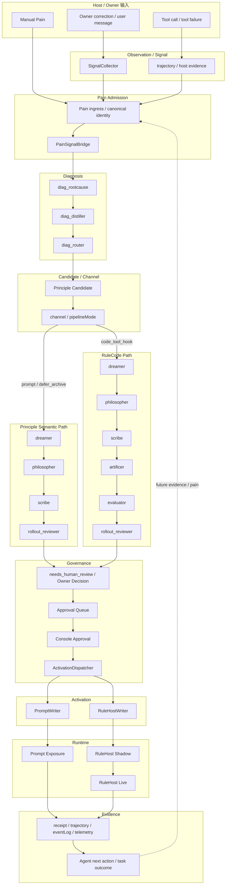

# PD Core Value Pipeline Contract & Governance SPEC v0.2

> **Status**: Owner-aligned draft  
> **Date**: 2026-09-15  
> **Primary current purpose**: 为 **PRI-803 — RuleCode Runtime Closure** 提供真实、可执行、低误导的核心管道作战地图  
> **Secondary long-term purpose**: 在本轮真实闭环冲刺完成后，将已被真实 Journey 验证过的事实沉淀为长期 Contract 与最小机械护栏  
> **Evidence seed**: PR #1707 + PR #1710 + PR #1717  
> **Important**: 本文不是 runtime Source of Truth，不替代代码、Schema、Store、Writer、Host Adapter 或状态机。  
> **Core principle**: **Connection Before Creation / 先看清，再动手**

---

# 0. v0.2 为什么存在

v0.1 的核心判断仍成立：

> PD 的核心价值管道已经足够复杂，任何一个局部字段、Schema、lineage、DAG、状态转换、Writer、Prompt/Validator 或 installed runtime 修改，都可能让  
> `Pain → 学习 → Owner 治理 → 激活 → Agent 行为改变`  
> 整条链静默断裂。

但最新 Phase 0 审计（#1717）进一步证明：

1. `CHANNEL_EDGES` 只是 **channel → edge set 的局部 SSOT**，不是整条有效运行拓扑的完整 SSOT；
2. Prompt / Provider Schema / Canonical Schema / Normalizer / Semantic Validator 是 **五层契约**，不能再用一个“Output Schema”概括；
3. lineage 风险不只是“字段丢失”，还包括 **artifact revision identity 被覆盖 / 回收**；
4. “One fact → one writer”在 current main 上只部分成立；
5. OpenClaw 与 Codex 不是同一能力面；
6. source code 正确不代表 packaged / pinned / installed runtime 正确；
7. 现有测试数量很多，但部分测试甚至不在 Vitest include 口径中，**“有测试文件”不等于“测试正在运行”**；
8. 本轮审计最主要的用途不是启动一条新的“治理建设主线”，而是让本地 AI 在 **PRI-803 管道冲刺**中不再盲改。

因此 v0.2 做两件事：

```text
第一层：Current Sprint Map
帮助 PRI-803 看清真实管道、风险接缝与宿主边界

第二层：Post-Sprint Durable Contract
冲刺后再把已被真实行为验证过的事实固化为长期治理能力
```

---

# 1. 当前优先级：先冲刺，后治理

## 1.1 当前主任务

当前最高优先级：

```text
PRI-803
EP002-R3 RuleCode Runtime Closure
```

目标不是“把管道架构变漂亮”。

目标是证明：

> **经真实治理批准并激活的 RuleCode，能够在真实宿主中阻止/纠正一次不合规行为，Agent 随后改变下一次行为并完成任务，同时 positive path 不被误伤，rollback 可恢复。**

真实 Closure Chain：

```text
真实 Pain
→ Diagnosis / Principle
→ channel = code_tool_hook
→ Artificer L2
→ generated RuleCode
→ Evaluator + deterministic/adversarial replay
→ Rollout Governance
→ AI 做 Owner 判断
→ Console 完成批准
→ RuleHost activation
→ actual host hook
→ block / correct
→ Agent adapts next action
→ task completes
→ positive control
→ rollback
```

---

## 1.2 #1707 / #1710 / #1717 的定位

这三轮审计当前首先是：

```text
PRI-803 的作战地图
+
风险清单
+
定位索引
```

不是：

```text
新的当前治理主线
```

使用方式：

```text
遇到真实路径
→ 先查地图
→ 确认 producer / consumer / schema / lineage / writer / host capability
→ 再动代码
```

不要：

```text
看到审计发现很多架构债
→ 暂停冲刺
→ 先做一轮大治理
```

---

## 1.3 审计发现的处理原则

所有发现分四类：

```text
A. Sprint Blocker
真实命中且阻断 PRI-803 安全性 / 可达性 / 证据有效性
→ 最小修复后继续冲刺

B. Sprint Risk
已知存在，但当前 Journey 未命中
→ 记录，不阻塞

C. Post-Sprint Contract Gap
冲刺后适合进入 guard / contract
→ 延后

D. Backlog Debt
当前不影响核心闭环
→ 不处理
```

---

# 2. PD 核心价值管道定义

不是“所有 Runtime V2 模块”。

核心价值管道只包含能回答下面问题的链路：

> **一次真实 Pain 如何变成经过 Owner 治理的行为改变，并且我们如何证明这个改变真的发生了？**

总链：

```text
Observe
  ↓
Pain Admission
  ↓
Diagnosis
  ↓
Principle Formation
  ↓
Channel Decision
  ↓
Internalization
  ↓
Evaluation / Rollout
  ↓
Owner Governance
  ↓
Activation
  ↓
Runtime Exposure / Enforcement
  ↓
Agent Adaptation
  ↓
Outcome Evidence
  ↓
Next Learning
```

闭环终点不是：

```text
artifact created
```

也不是：

```text
activation row exists
```

而是：

```text
Agent 下一次行为发生了可验证改变
```

---

# 3. Current Effective Topology：不要把 declared DAG 当成全部事实

## 3.1 三层拓扑模型

最新审计确认：

```text
Effective Runtime Topology
=
Declared DAG
+
Transition Authority
+
Bypass / Ingress Paths
```

因此以后不要说：

> `CHANNEL_EDGES` 就是完整 DAG SSOT。

更准确地说：

```text
CHANNEL_EDGES / resolveChannelEdges
=
channel → edge set 的局部 SSOT
```

完整有效拓扑还取决于：

- producer 如何 seed task；
- recovery / reopen 如何继续；
- transition arbitration；
- channel-specific special-case；
- adversarial-loop；
- rulehost-pipeline-runner；
- synthetic-baseline 等旁路入口。

---

## 3.2 Declared DAG Authority

当前核心代码 authority 仍包括：

```text
INTERNAL_AGENT_NAMES
DIAGNOSTICIAN_EDGES
CHANNEL_EDGES
ALLOWED_EDGES
resolveChannelEdges
```

它们负责：

```text
合法 stage 名
+
声明式 edge set
+
channel-aware successor constraints
```

但不是唯一有效拓扑来源。

---

## 3.3 Transition Authority

最新审计确认：

```text
decideInternalizationTransition
```

是 failure/verdict → transition 的关键 authority。

因此：

```text
DAG edge 合法
≠
transition 语义一定正确
```

尤其要警惕：

```text
dry-run / proposeNextTask
```

与：

```text
production transition funnel
```

走不同逻辑。

### Current invariant

```text
INV-T1
任何“下一步任务”判断，
最终必须与 production transition authority 同源或做机械对拍。
```

---

## 3.4 Current channel topology

### Principle semantic / Prompt path

当前目标语义：

```text
Pain
→ Diagnosis
→ Candidate
→ channel = prompt / defer_archive
→ Dreamer
→ Philosopher
→ Scribe
→ RolloutReviewer
→ Governance
→ Principle activation
→ runtime prompt exposure
→ behavior evidence
```

不应无意义进入：

```text
Artificer / Evaluator RuleCode 子链
```

---

### RuleCode / code_tool_hook path

```text
Pain
→ Diagnosis
→ Candidate
→ channel = code_tool_hook
→ Dreamer
→ Philosopher
→ Scribe
→ Artificer
→ Evaluator
→ RolloutReviewer
→ Governance
→ Approval
→ RuleHost activation
→ host hook
→ Agent adaptation
```

---

### Legacy metadata rule

新任务必须显式写：

```text
pipelineMode
```

历史 task 缺该字段时：

```text
必须保留历史兼容解释
```

不得升级后中途重解释在途任务。

---

# 4. 核心作战地图



### 重要

这张图是：

```text
Owner / AI comprehension map
```

不是：

```text
runtime SSOT
```

实际执行仍需回到代码 authority。

---

# 5. Stage Contract 不再只看一个 Schema：五层契约

## 5.1 为什么升级

Phase 0 审计确认，真实失败往往来自：

```text
Prompt 教的
≠
Tool / Provider Schema 允许的
≠
Canonical Schema 接受的
≠
Normalizer 产出的
≠
Semantic Validator 要求的
```

所以“Output Schema Authority”一个字段不够。

---

## 5.2 每个核心 Stage 必须回答

```text
Stage
Business Responsibility
Trigger / Producer

Layer 1 — Prompt Contract
Layer 2 — Tool / Provider Schema
Layer 3 — Canonical Output Schema
Layer 4 — Normalizer / Adapter
Layer 5 — Semantic Validator

Stable Identity / Lineage
Persistence
Consumer
Transition Authority
Failure Semantics
Owner-visible Evidence
Runtime Authority
```

---

# 6. 核心 I/O / Contract Matrix

> 以下为作战级结构。实施时以 current main 回源。

| Stage | Input | Prompt / Tool / Canonical / Validator Authority | Persistence | Consumer |
|---|---|---|---|---|
| SignalCollector | user message + runtime profile + cue store | Signal prompt + provider schema + `signal-classification-output-v1` + classification validator | `user_turns`, `signal_confirmations`, `pain_events` | Pain admission |
| Pain Admission | occurrence + session + host + evidence | canonical pain admission contract | `pain_events`, dead-letter | PainSignalBridge |
| PainSignalBridge | admitted Pain | diagnostician seed contract | task metadata / diagnostic context | SplitDiagnostician |
| diag_rootcause | diagnosis target + evidence | rootcause prompt + `diag-rootcause-output-v1` + semantic validator | stage run/artifact | diag_distiller |
| diag_distiller | rootcause artifact + context | distiller prompt + `diag-distiller-output-v1` | stage run/artifact | diag_router |
| diag_router | rootcause + distiller + Pain | router prompt + `diagnostician-output-v1` | candidate / artifact / task lineage | Candidate intake |
| Dreamer | candidate + diagnosis | dreamer prompt + `dreamer-output-v1` | `pi_artifacts` | Philosopher |
| Philosopher | Dreamer artifact | philosopher prompt + `philosopher-output-v1` | `pi_artifacts` | Scribe |
| Scribe | Philosopher + Dreamer lineage | scribe prompt + `scribe-output-v1` | `pi_artifacts` | RolloutReviewer / Artificer |
| Artificer | Scribe + RuleContextV2 + BEP | artificer prompt/tool + `artificer-rule-output-v2` + RuleCode validator | `pi_artifacts` + telemetry | Evaluator |
| Evaluator | Rule artifact + replay evidence | evaluator prompt/schema + `evaluator-output-v1` + evaluator semantics | `pi_artifacts` / evidence | RolloutReviewer |
| RolloutReviewer | exact Principle or Rule artifact | rollout prompt/schema + `rollout-reviewer-output-v1` + mode-aware validator | artifact/task metadata | Governance |
| Owner Decision | NHR + exact evidence | Owner resolution contract | task metadata / decision evidence | reopen / approval |
| Approval | exact activation candidate | approval contract | `approvals` | Console |
| Console | approval + evidence | governance API / Console UI contract | approval decision | dispatcher |
| ActivationDispatcher | artifact + channel + approval | activation decision contract | `activations` | writer |
| PromptWriter | validated Principle | prompt activation contract | activation/ledger | host prompt |
| RuleHostWriter | validated RuleCode + evidence | activation/control contract | activation/control store | RuleHost |
| Runtime | active Principle/Rule + host event | host adapter + RuleHost runtime contract | receipts / eventLog / trajectory | Agent |
| Outcome | runtime event + next action | behavior evidence contract | trajectory / outcome evidence | future learning |

---

# 7. Output Schema Registry：局部 SSOT，不代表完整五层一致

Agent output canonical registry authority：

```text
packages/principles-core/src/runtime-v2/adapter/output-schema-registry.ts
```

当前至少包括：

```text
diagnostician-output-v1
diag-rootcause-output-v1
diag-distiller-output-v1
dreamer-output-v1
philosopher-output-v1
scribe-output-v1
artificer-rule-output-v2
evaluator-output-v1
rollout-reviewer-output-v1
correction-observer-output-v1
signal-classification-output-v1
```

### 新结论

`OUTPUT_SCHEMA_REGISTRY` 是：

```text
Canonical output schema registry
```

但它不是：

```text
Prompt / Provider / Normalizer / Validator 全部一致性的证明
```

---

# 8. Lineage：从“ID 不丢”升级成“Identity + Revision 不漂移”

## 8.1 必须回答的全链问题

```text
哪一个真实 Pain？
↓
哪一个 diagnosis？
↓
哪一个 candidate / ledger principle？
↓
哪一个 internalization task？
↓
哪一个 Dreamer / Philosopher / Scribe artifact？
↓
哪一个 RuleCode revision？
↓
哪一次 Evaluator / Rollout decision？
↓
Owner 实际看到哪一个 revision？
↓
批准的是哪一个 revision？
↓
激活的是哪一个 revision？
↓
哪一次 runtime receipt？
↓
Agent 下一步行为是什么？
```

---

## 8.2 Current known identity risk

Phase 0 审计确认：

```text
pi_artifacts
UNIQUE(source_task_id, artifact_kind)
```

具有覆盖语义。

这意味着：

```text
task + artifact_kind
```

同时承担：

```text
identity
+
latest projection
```

可能导致：

```text
旧 artifact instance id 被覆盖 / 回收
```

而 approval / activation 目前未必绑定 immutable content revision/hash。

---

## 8.3 Lineage invariants

### INV-L1 Canonical Pain Identity

同一 occurrence retry：

```text
不能制造第二个 canonical Pain
```

不同 occurrence：

```text
不能因为语义相似而被错误合并
```

---

### INV-L2 Stable Correlation

从 candidate 进入 internalization 后：

```text
stable correlation / source lineage
```

不得静默更换。

---

### INV-L3 No Silent Drop

关键 lineage 字段缺失时：

```text
不得 silently undefined
```

必须：

```text
fail loud
或
explicit degraded evidence
```

---

### INV-L4 Exact Artifact Identity

以后不能只写：

```text
reviewed = approved = activated artifact id
```

而必须是：

```text
reviewed revision/hash
=
approved revision/hash
=
activated revision/hash
```

---

### INV-L5 Revision Must Be Immutable or Explicitly Rebound

若发生：

```text
edit
revision
retry
reopen
```

必须建立新的明确 revision identity。

旧 approval 不能模糊继承。

---

### INV-L6 Runtime Receipt Backlink

runtime receipt 必须能回溯：

```text
receipt
→ activation
→ exact rule/principle revision
→ source lineage
```

否则不能声称行为闭环完成。

---

# 9. Attempt / Revision 语义也是 lineage 的一部分

Phase 0 暴露：

```text
tasks.attempt_count
runs.attempt_number
```

同时表达某种 attempt/revision 语义，但生命周期并不完全一致。

风险：

```text
runner A 认为 retry budget 已消耗
runner B 认为还是上一轮
recovery 又做第三种判断
```

因此后续 Contract 必须明确：

```text
retry
revision
resume
reopen
```

各自消费哪个 canonical attempt authority。

当前 PRI-803 不要主动重构。

只有真实 Journey 命中 attempt drift 才处理。

---

# 10. Writer Authority：区分 TARGET 与 CURRENT

## 10.1 不再写成“已经唯一”

v0.1 过于理想化。

v0.2 改成：

| Fact | Intended Authority | Current Production Writer | Other Write-capable Surface | Known Risk |
|---|---|---|---|---|
| Canonical Pain | Pain admission authority | existing admission path | manual/synthetic ingress | identity drift risk |
| Task lifecycle | orchestrator / state transition | multiple task writers | raw SQL / special runners | writer spread |
| Owner resolution | Owner resolution service | governance path | recovery/special path | audit consistency |
| Approval | approval store | enqueue + Console action | CLI/API surfaces | semantics need parity |
| Activation | ActivationDispatcher | dispatcher path | direct store methods | second writer risk |
| shadow→live | governed promotion | canonical promotion path | `promoteActivation` write-capable API | currently latent second writer |
| disable | governed deactivate/control | API/Console path | weak authorization path | Owner evidence asymmetry |
| rollback | rollback authority | canonical rollback | repair/legacy paths | verify |
| Runtime enforcement | RuleHost / host hook | host runtime | legacy/shared differences | host parity |

---

## 10.2 One Fact → One Writer

长期目标：

```text
One fact
→ one canonical writer
→ other callers只能调用 authority
```

但 current main 上：

```text
并非全部成立
```

所以 PRI-803 本地 AI 不应仅凭某个 store method“能写”就把它当合法 production path。

---

# 11. Governance：Owner Decision 与 Approval 继续分开

必须区分：

```text
Owner Decision
```

和：

```text
Activation Approval
```

不是一个动作。

### Owner Decision

用于：

```text
needs_human_review
revision
reopen
裁决
```

### Activation Approval

用于：

```text
允许某个 exact artifact revision 进入 activation
```

Owner 已锁定：

> AI 可以代 Owner 做判断，但**批准动作必须通过 Console 完成**。

禁止：

```text
DB 直改
fake approval
第二 approval writer
```

---

# 12. Host Capability Matrix：不要再把 RuleHost 画成统一能力

## 12.1 Current reality

OpenClaw 与 Codex 当前不是同一个能力面。

因此任何：

```text
RuleHost supports X
```

都必须补：

```text
on which host?
```

---

## 12.2 Capability Matrix

| Capability | OpenClaw | Codex | Notes |
|---|---|---|---|
| signal ingestion | SUPPORTED | PARTIAL | host-specific ingress differences |
| Pain admission | SUPPORTED | PARTIAL | depends on observation path |
| prompt principle exposure | SUPPORTED | PARTIAL | capability path differs |
| RuleHost evaluation | SUPPORTED | PARTIAL | Codex feature surface narrower |
| shadow mode | SUPPORTED | UNSUPPORTED/PARTIAL | current audit |
| `rulehost_evaluated` evidence | SUPPORTED | UNSUPPORTED | blocks promotion evidence |
| promotion readiness | SUPPORTED | structurally limited | no valid shadow evidence |
| live RuleHost | SUPPORTED | PARTIAL | installed runtime must be checked |
| gate block receipt | SUPPORTED | PARTIAL | host evidence asymmetry |
| emergency pause / activation control | source supports | installed pin may not | NEW-E1 |
| rollback | SUPPORTED | verify installed path | do not assume source=installed |

---

## 12.3 PRI-803 当前宿主选择原则

本轮目标是：

```text
证明 J2 RuleCode behavior closure
```

不是：

```text
证明所有 host parity
```

所以 PRI-803 优先使用：

```text
当前 evidence / hook / rollback 最完整的真实宿主
```

即优先：

```text
OpenClaw
```

不要为了追求跨宿主完整，把 Codex 当前结构缺口强行拖进本轮。

---

# 13. Known Red Zones：冲刺看见就停一下，但不提前治理

## RZ-1 — R-19 Pre-activation RuleCode Sandbox

当前审计确认：

```text
pre-activation evaluation/replay
仍存在 node:vm + host-realm input/helpers crossing 风险
```

而真正 live RuleHost 已经采用：

```text
child process
+
JSON primitive boundary
+
VM realm 内重建 input/helpers
```

### Sprint policy

```text
如果 PRI-803 真实命中这条不安全路径
并影响安全性 / 证据有效性
→ 提升处理，最小修复

如果当前 Journey 不依赖该风险面
→ 不阻塞冲刺
```

禁止：

```text
因为知道 R-19 存在
→ 先做完整 sandbox 重构
```

---

## RZ-2 — NEW-E1 Installed Codex Runtime Pin Drift

当前 pin：

```text
codexAdapter = 0.1.0
hostRuntime  = 0.1.0
core         = 1.252.0
```

审计已验证：

旧 pinned runtime 缺：

```text
global_rulecode_pauses
activation_control_states
等 Owner emergency-control capability
```

### Sprint policy

如果 PRI-803 使用 OpenClaw：

```text
不阻塞
```

如果切 Codex 做 closure：

```text
必须先确认 installed runtime capability
```

---

## RZ-3 — Transition Dry-run Drift

如果本地 AI 使用：

```text
dry-run
proposeNextTask
```

作为“真实下一步”证据：

```text
不够
```

必须回到 production transition funnel。

---

## RZ-4 — Artifact Revision Overwrite

如果本轮发生：

```text
revision / retry / reopen
```

必须确认：

```text
Owner 实际批准的 exact revision
=
最终激活 revision
```

不能只看逻辑 artifact id。

---

# 14. SignalCollector 当前事实更新

v0.1 已过时。

当前：

```text
signal_collector
enabled = true
```

语义：

```text
Stage1 keyword detection
不依赖该 flag

LLM deep judgment
默认 ON

如果 classifier/profile 未配置
→ degrade 到 keyword-only
→ 必须显性 WARN / needs_setup
```

同时：

```text
codex_conversation_ingestion
```

是另一条独立 flag。

不能把两者混为：

```text
“SignalCollector on/off”
```

---

# 15. Persistence Boundary

## 15.1 trajectory.db

回答：

> Agent / Host 实际发生了什么？

职责：

```text
observability
historical evidence
```

典型：

- sessions
- assistant turns
- user turns
- tool calls
- pain events
- runtime evidence

不得变成：

```text
第二治理状态机
```

---

## 15.2 state.db

回答：

> PD 治理管道现在是什么状态？

职责：

```text
orchestration
governance
activation
```

典型：

- tasks
- runs
- pi_artifacts
- approvals
- activations
- control states
- owner resolutions
- dead letters
- reconciliation metadata

---

## 15.3 eventLog / telemetry

回答：

> 为什么这次运行这样结束？

职责：

```text
diagnostic evidence
```

不能代替：

```text
task / approval / activation authority
```

---

# 16. Deployment Projection Contract：source 正确不等于用户机器正确

v0.1 只写：

```text
Source
→ Package
→ N-1→N
```

现在必须升级成：

```text
Source Contract
↓
Published Runtime Version
↓
Pin / Bundle Contract
↓
Installed Runtime
↓
Upgrade Projection
↓
Actual Host Capability
```

任何一层漂移：

```text
用户机器上的 PD
≠
仓库里的 PD
```

---

## 16.1 必须保护的边界

```text
Source tests green
```

不代表：

```text
published package contains capability
```

更不代表：

```text
runtime-version pin points to capability
```

更不代表：

```text
existing installed runtime upgraded successfully
```

---

## 16.2 PRI-671 的真实定位

N-1→N real upgrade smoke 不是外围发布工作。

它保护的是：

```text
Source Contract
→ Installed Runtime Contract
```

是否保持同一个产品。

---

# 17. 测试治理：Test File Exists ≠ Test Runs

Phase 0 审计发现：

```text
部分 test files / assertions
不在 Vitest include 口径
```

因此新增不变量：

### INV-TEST1 Executed-Test Invariant

任何被宣称用于保护核心管道的 regression：

```text
必须进入真实 test discovery / merge gate
```

不能只存在于仓库。

---

### INV-TEST2 Merge Gate Truth

```text
CI green
```

不能自动等价为：

```text
all relevant tests green
```

必须知道：

```text
verify:merge
Vitest include
package-specific suite
installed smoke
```

各自保护什么。

---

# 18. PRI-803 当前开发协议

本地 AI 开工前，只需要做下面这套，而不是重新做审计。

```text
1. 读 #1717 SYNTHESIS
2. 读 LINEAGE_CHAIN
3. 读 WRITER_AUTHORITY_MATRIX
4. 读 HOST_CAPABILITY_MATRIX
5. 读 PROTECTION_GAP_MATRIX
6. 回 current main 确认实际触及 seam
7. 沿 PRI-803 Closure Chain 执行
```

---

## 18.1 每次修改前回答九问

```text
1. 我正在改哪个 Stage？
2. 上游 producer 是谁？
3. 输入 contract 是什么？
4. 五层 contract 哪一层会变？
5. 下游 consumer 是谁？
6. lineage / revision identity 是什么？
7. 谁持久化？
8. canonical writer 是谁？
9. 这会影响 PRI-803 哪一步？
```

如果答不上来：

```text
先看清
再动手
```

---

## 18.2 小修 vs 停止

### 可以 inline 修

```text
小型 wiring
字段名断链
schema adapter 小错
state transition 局部错误
test 未接入
```

前提：

```text
不改变核心产品语义
```

---

### 必须 STOP / Owner decision

```text
需要新 orchestrator
需要第二 state source
需要改变 Owner approval
需要改变 RuleHost 根本安全边界
需要改变行为闭环定义
需要大规模 persistence migration
```

---

# 19. PRI-804 与本 SPEC 的关系

PRI-804 解决：

```text
text_principle_only
→ approval queue
→ Console
→ existing dispatcher
→ active Principle
```

它属于：

```text
Principle Journey
```

不是 PRI-803 RuleCode Journey 的前置。

当前不要把：

```text
PRI-803 + PRI-804
```

揉成一个大冲刺。

---

# 20. Post-Sprint：什么时候才进入长期治理

只有满足：

```text
PRI-803 已经产生真实行为闭环证据
```

之后，才进入：

```text
Durable Contract
+
Minimal Guards
+
Golden Journeys
+
PR Impact Gate
```

原因：

> 先让真实 Journey 告诉我们哪些契约真的值钱，再机械化。

---

# 21. Durable Contract：冲刺后的稳定文档

计划文件：

```text
docs/architecture/PD_CORE_VALUE_PIPELINE_CONTRACT.md
```

长期只保留：

1. Owner 5 分钟可读地图；
2. Principle Journey；
3. RuleCode Journey；
4. Effective Topology 三层模型；
5. 五层 Contract；
6. lineage + exact revision identity；
7. writer authority current/target；
8. persistence boundary；
9. host capability matrix；
10. deployment projection；
11. invariants；
12. change classification；
13. verified Golden Journeys。

不放：

- 完整 Prompt；
- 完整 TypeScript Schema；
- 2000 行审计；
- commit-specific 行号作为长期事实；
- 临时 finding；
- 已关闭 issue 正文。

---

# 22. Minimal Mechanical Guards v0.2 候选

这不是当前立即实施任务。

冲刺后再选。

优先候选根据 #1717 调整为：

## G1 Prompt Example Over Real Contract

```text
Prompt example
→ provider/tool shape
→ canonical schema
→ semantic validator
→ PASS
```

---

## G2 Cross-stage Lineage Field Parity

机械保护：

```text
producer field
=
consumer expected field
```

尤其：

```text
Dreamer
→ Philosopher
→ Scribe
→ Artificer
```

---

## G3 Effective Transition Parity

```text
dry-run next
=
production transition decision
```

至少对关键 fixture 对拍。

---

## G4 Test Discovery Guard

核心 contract regression：

```text
必须进入 Vitest include / merge gate
```

---

## G5 Exact Artifact Revision

测试：

```text
reviewed hash/revision
=
approved hash/revision
=
activated hash/revision
```

---

## G6 Writer Guard

关键事实：

```text
approval
activation
canonical pain
promotion
disable
```

不得出现未经 authority 的新 writer。

---

## G7 RuleCode Sandbox Boundary Regression

至少保护：

```text
constructor-chain
string concatenation
template concatenation
host-realm object crossing
```

但不要把 AST blacklist 当安全边界。

---

## G8 Runtime Pin Capability Guard

确保：

```text
runtime-version pin
```

不能回退到：

```text
缺 Owner emergency-control capability
```

的版本。

---

# 23. Golden Journeys v0.2

仍只保留四条，不扩张。

## J1 Principle Journey

```text
Pain
→ Diagnosis
→ Principle
→ Console Approval
→ Prompt Activation
→ Runtime Exposure
→ Receipt
```

---

## J2 RuleCode Journey

```text
Pain
→ Diagnosis
→ Principle
→ RuleCode
→ Evaluation
→ Console Approval
→ RuleHost
→ block/correct
→ Agent adapts
→ task completes
```

当前：

```text
PRI-803
```

就是建立 J2 的真实基线。

---

## J3 Revision / Recovery

```text
bad artifact
→ NHR
→ Owner revise
→ reopen
→ corrected exact revision
→ approval
→ activation
```

---

## J4 Rollback

```text
active
→ deactivate / rollback
→ runtime effect disappears
```

---

# 24. PR Pipeline Impact Gate：仍然延后

长期建议保留：

```markdown
## Core Pipeline Impact

- [ ] No
- [ ] Yes — Class A
- [ ] Yes — Class B

Affected seam:
- [ ] Topology
- [ ] Transition
- [ ] Five-layer Contract
- [ ] Lineage / Revision
- [ ] State / Writer
- [ ] Host Capability
- [ ] Deployment Projection
- [ ] Runtime Behavior Evidence
```

但当前：

```text
不要为了做这个 Gate
延误 PRI-803
```

---

# 25. Change Classification v0.2

## Class A — Pipeline Contract Change

任一命中：

- effective topology；
- transition authority；
- Prompt/Provider/Canonical/Normalizer/Validator contract；
- lineage / revision identity；
- writer authority；
- persistence ownership；
- Owner governance；
- activation；
- runtime allow/block；
- host capability；
- deployment projection；
- legal task lifecycle。

要求：

```text
冲刺期：
targeted reality check + relevant journey evidence

冲刺后：
Contract update + regression guard
```

---

## Class B — Stage Internal

例如：

- prompt wording；
- model profile；
- bounded retry；
- telemetry；
- internal refactor。

前提：

```text
不改变 Class A contract
```

---

## Class C — Pure Refactor / Docs

要求：

```text
证明 no contract delta
```

---

# 26. 文档新鲜度：采用 Immutable Baseline + Final-main Delta Sync

以后不要只写：

```text
Last verified against main: SHA
```

更可靠的流程：

```text
1. Lock Worker Baseline
2. Parallel audit / implementation
3. Synthesis
4. Red Team / review
5. Final-main Delta Sync
6. Owner decision
```

文档头建议记录：

```text
WORKER_BASELINE_SHA
FINAL_MAIN_SHA
Delta reviewed
Affected seams
Changed conclusions
```

不要伪装所有 Worker 都在 latest main 上重新运行。

---

# 27. Current Known Risks：只作地图，不自动升级为当前任务

| Risk | Current disposition |
|---|---|
| R-19 pre-activation sandbox trust boundary | Backlog；PRI-803 命中才提升 |
| NEW-E1 Codex installed runtime pin drift | Backlog；使用 Codex closure 才提升 |
| activation second writer / weak disable auth | Backlog |
| CorrectionObserver residual blind spots | Backlog |
| Codex shadow evidence gap | Backlog |
| attempt dual semantics | Backlog |
| pi_artifacts revision overwrite semantics | Backlog |
| prompt-schema-validator drift | 当真实 stage 命中时 targeted fix |
| tests outside discovery | 当其被依赖为关键证据时修 |

---

# 28. Done Definition — Current Sprint Mode

本 SPEC 当前成功的标准不是：

```text
治理系统建好了
```

而是：

```text
本地 AI 能依靠这张地图完成 PRI-803，
且没有因为看不清 producer/consumer/schema/lineage/writer/host
而盲目破坏主链。
```

PRI-803 Done：

- [ ] same lineage Pain → Rule → Activation 可追；
- [ ] real Artificer output；
- [ ] evaluator/adversarial gate 未弱化；
- [ ] Console 真实批准；
- [ ] exact reviewed/approved/activated revision 一致；
- [ ] real host hook block/correct；
- [ ] Agent 下一步行为发生改变；
- [ ] task 最终完成；
- [ ] positive control pass；
- [ ] rollback 后 effect 消失；
- [ ] outcome 明确为 IMPROVED / NO_IMPROVEMENT / REGRESSION / INCONCLUSIVE / NOT_REACHED。

---

# 29. Done Definition — Long-term Mode

冲刺完成后，长期治理才算 Done 当：

- [ ] current effective topology 可读；
- [ ] five-layer contract 有稳定 authority；
- [ ] exact artifact revision identity 明确；
- [ ] writer authority current/target 明确；
- [ ] host capability matrix 不再误导；
- [ ] deployment projection 被纳入核心链；
- [ ] G1–G8 只实施高价值最小集；
- [ ] J1–J4 有明确测试归属；
- [ ] test discovery 本身有 guard；
- [ ] 无新增第二状态源；
- [ ] 无新增第二 schema registry；
- [ ] 无新增平行 orchestrator；
- [ ] 无新增第二 approval / activation writer。

---

# 30. 最终原则

PD 不能依赖：

```text
Owner 记住实现细节
或
某个聪明 AI 记住全部代码
```

长期应该依赖：

```text
真实代码 authority
+
一张稳定作战地图
+
五层 I/O Contract
+
lineage / revision identity
+
writer authority
+
host capability truth
+
deployment projection truth
+
少量机械 invariants
+
真实 Golden Journey
```

但顺序必须正确：

```text
先把真实管道跑通
↓
从真实闭环中确认什么最重要
↓
再把这些东西固化成治理能力
```

而不是：

```text
为了保护还没跑通的系统
先建设一套更复杂的治理系统
```

当前最重要的一句话仍然是：

> **先看清，再动手。然后把 PRI-803 真正跑通。**
